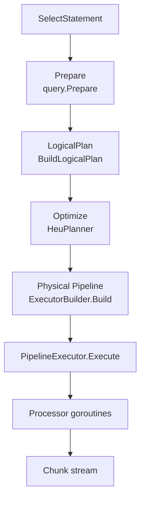
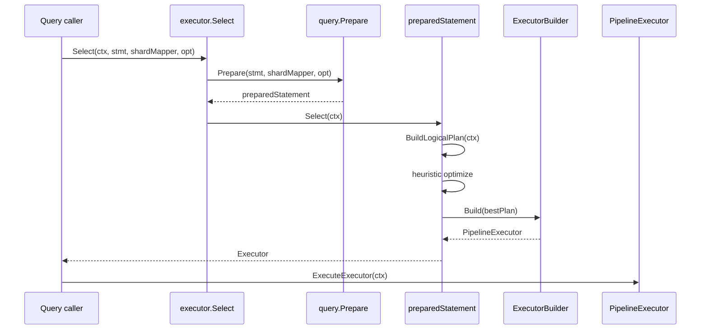
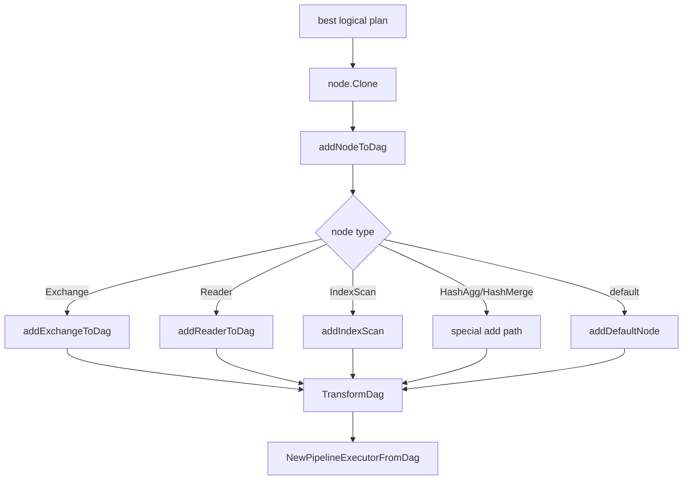
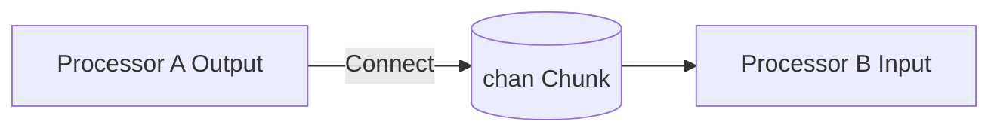
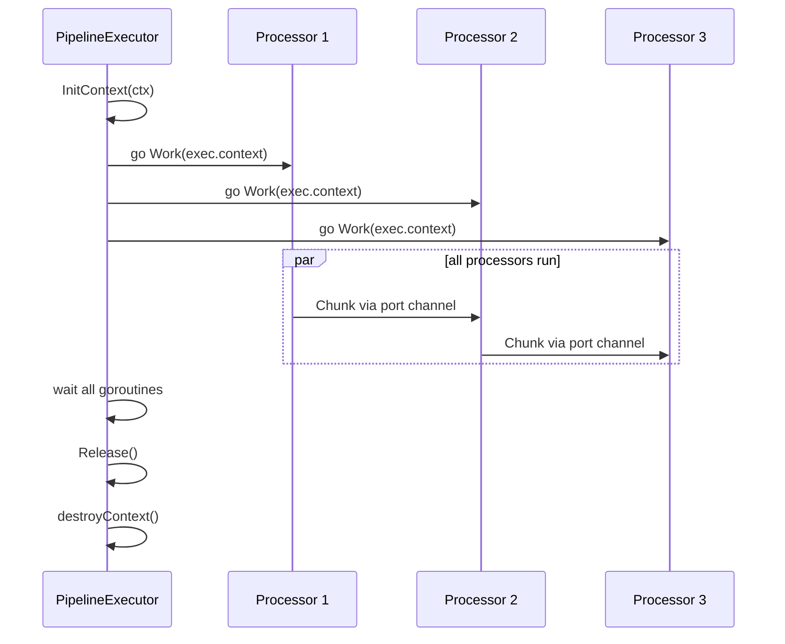
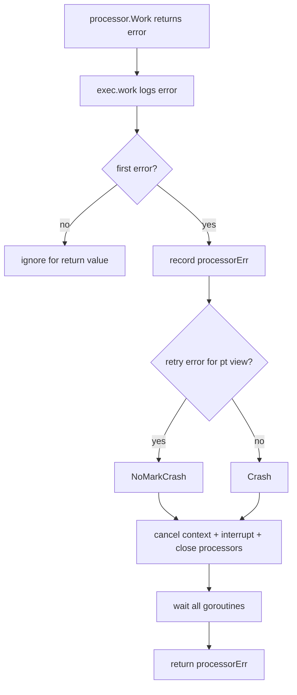
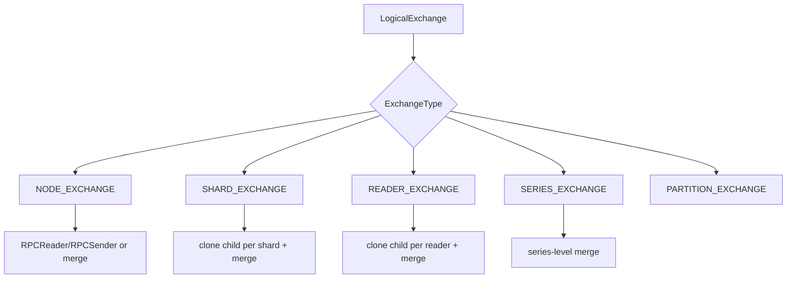
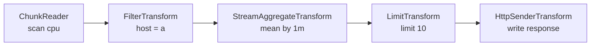

# openGemini 查询执行引擎设计说明

本文档从 `engine/executor/pipeline_executor.go` 出发，说明 openGemini 查询执行引擎如何把 SQL/Prom 查询变成一组并发运行的 pipeline processor，并通过 `Chunk` 在 processor 之间流动。

## 1. 总览

查询执行链路可以分成四层：



核心思想：

- 逻辑计划描述“要做什么”，例如 reader、filter、aggregate、merge、limit、sender。
- 物理 pipeline 描述“怎么运行”，每个逻辑节点被转换为一个 `Processor`。
- processor 之间通过 `ChunkPort` 连接，`ChunkPort` 底层是 Go channel。
- `PipelineExecutor` 为每个 processor 启动一个 goroutine，所有 processor 同时运行，依赖 channel 自然形成背压。

## 2. 关键抽象

| 抽象 | 作用 |
| --- | --- |
| `LogicalPlan` | 逻辑查询节点，继承 `hybridqp.QueryNode`，包含 schema、children、Explain 等信息。 |
| `ExecutorBuilder` | 将逻辑计划递归转换为 transform DAG 和 `PipelineExecutor`。 |
| `Processor` | 运行时执行单元，负责从输入 port 读 `Chunk`，处理后写到输出 port。 |
| `ChunkPort` | processor 输入/输出端口，连接后共享同一个 `chan Chunk`。 |
| `Chunk` | 查询执行引擎中的列式数据批，包含时间、列、tag、interval index、graph 等。 |
| `TransformDag` | `ExecutorBuilder` 使用的运行时 DAG，保存 `TransformVertex` 与边。 |
| `PipelineExecutor` | 调度器，负责并发启动 processor、错误传播、取消、中断和资源释放。 |

## 3. 从查询到 pipeline

### 3.1 查询入口

`engine/executor/select.go` 中的 `Select` 是查询执行的上层入口：



`preparedStatement.Select` 并不直接执行查询，它只返回一个 `hybridqp.Executor`。真正运行发生在调用方执行 `ExecuteExecutor(ctx)` 时。

### 3.2 逻辑计划构建

`BuildLogicalPlan` 做的事情：

1. 根据语句、字段、source、option 构造 `QuerySchema`。
2. 优先尝试使用模板计划。
3. 否则调用 `buildExtendedPlan`。
4. 构建 reader、filter、aggregate、group/order、project、http sender 等逻辑节点。
5. 如果查询可下推，插入 node exchange。
6. 运行启发式优化器 `BuildHeuristicPlanner`。
7. 输出 best logical plan。

简化后的形态：

```text
LogicalHttpSender
  LogicalProject
    LogicalLimit
      LogicalAggregate
        LogicalExchange
          LogicalReader / LogicalIndexScan
```

不同查询会插入不同节点，例如 join、binop、subquery、fill、sliding window、hash agg、hash merge 等。

### 3.3 逻辑计划到 processor DAG

`ExecutorBuilder.Build(node)` 是逻辑计划转运行时 pipeline 的入口：



每个逻辑节点会通过注册表找到对应的 transform creator：

```go
RegistryTransformCreator(&LogicalFilter{}, &FilterTransformCreator{})
RegistryTransformCreator(&LogicalLimit{}, &LimitTransformCreator{})
RegistryTransformCreator(&LogicalMerge{}, &MergeTransformCreator{})
```

reader 类节点也可能通过 `ReaderCreatorFactory` 创建，例如列存 reader 或按 fragment 读取的 reader。

## 4. Processor 与 ChunkPort

### 4.1 port 连接

`ChunkPort` 是 pipeline 的连线机制：



`Connect(from, to)` 会检查两端 `RowDataType` 是否一致，然后创建容量为 1 的 channel，并让输出和输入共享这个 channel。

```go
p.State = make(chan Chunk, PORT_CHAN_SIZE) // PORT_CHAN_SIZE = 1
to.(*ChunkPort).State = p.State
```

容量 1 的 channel 让上下游自然背压：下游处理慢时，上游发送 chunk 会阻塞。

### 4.2 processor 生命周期

每个 processor 都实现：

```go
type Processor interface {
    Work(ctx context.Context) error
    Close()
    Abort()
    Release() error
    GetInputs() Ports
    GetOutputs() Ports
    IsSink() bool
    Interrupt()
}
```

常见模式：

```mermaid
flowchart TD
    A[Work(ctx)] --> B[从 input port 读 Chunk]
    B --> C[转换/过滤/聚合]
    C --> D[写 output port]
    D --> B
    B -->|input closed| E[Close output]
    B -->|ctx canceled| F[return]
```

示例：

- `ChunkReader`：source processor，从存储 cursor 读取 record，转为 chunk 后输出。
- `FilterTransform`：读取 chunk，按条件过滤行后输出。
- `LimitTransform`：按 limit/offset 裁剪数据，满足条件后可主动 abort 上游 sink。
- `RPCReaderTransform`：远端 reader，接收远端 chunk response。
- `RPCSenderTransform`：远端 sender，将 chunk 编码写回 spdy responder。

## 5. PipelineExecutor

### 5.1 初始化

`NewPipelineExecutorFromDag(dag, root)` 会调用 `init()`：

1. 遍历 `TransformDag`。
2. 对每条 backward edge 调用 `Connect(from.output[0], to.input[i])`。
3. 收集所有 vertex 的 `transform` 到 `exec.processors`。

注意：`ExecutorBuilder` 构造的 `TransformDag` 只保存节点和边，端口 channel 在 `PipelineExecutor.init` 才真正连接。

### 5.2 并发运行

`PipelineExecutor.Execute(ctx)` 的运行模型：



每个 processor 的 `Work` 都在独立 goroutine 中执行。`PipelineExecutor` 不做显式拓扑调度，数据依赖由 channel 阻塞关系自然表达。

### 5.3 错误处理



panic 也会被 `exec.work` recover，并触发 `Crash()`。

`Crash()` 的动作：

1. 标记 `crashed = true`。
2. cancel executor context。
3. `processors.Interrupt()`。
4. `processors.Close()`。

`NoMarkCrash()` 多一步 `InterruptWithoutMark()`，用于部分可重试错误，避免远端中断被标记成普通 crash。

### 5.4 Abort 与 sink

`Abort()` 和 `Crash()` 不一样：

- `Abort()` 表示查询已经拿到足够结果，需要提前停止上游。
- `Crash()` 表示错误或 panic，需要关闭全 pipeline。

`Abort()` 会从 root 沿 backward edge 深度优先遍历 DAG，对 `IsSink() == true` 的 transform 调用 `Abort()`。

这里的 sink 命名比较容易误解：在这套代码里，`ChunkReader`、`RPCReaderTransform` 这类“数据源”也会返回 `IsSink() == true`，因为它们是需要被主动 abort 的数据读取端。

典型用途是 `LimitTransform` 满足 limit 后中止上游 reader 或 RPC reader，避免继续扫描。

## 6. Exchange 与分布式查询

Exchange 节点描述数据跨 reader、shard、partition、node 的汇聚或发送。



`ExecutorBuilder` 根据 exchange type 和 role 生成不同 pipeline：

- producer role：本节点执行 child plan，再用 `RPCSenderTransform` 把 chunk 发出去。
- consumer role：创建一个或多个 `RPCReaderTransform`，再接 merge transform。
- shard/reader exchange：按 shard 或 reader clone child plan，并在上层插入 merge。
- one-shard / one-reader 优化：只有一个输入时直接消除 exchange，减少无意义 merge。
- binary-tree merge：配置开启时，把多路 merge 构造成二叉树，降低单点 fan-in。

## 7. Chunk 数据模型

`Chunk` 是执行引擎内部的数据批。它不是单纯二维表，还包含时序查询需要的索引信息：

| 组成 | 作用 |
| --- | --- |
| `RowDataType` | 当前 chunk 的列 schema。 |
| `name` | measurement 名称。 |
| `time` | 时间列。 |
| `columns` | 字段列。 |
| `tags` / `tagIndex` | series tag 及每个 tag 对应的起始行。 |
| `intervalIndex` | group by time 的窗口边界。 |
| `dims` | 维度列。 |
| `record.Record` | 可直接承载底层 record。 |
| `graph` | 图查询相关结果。 |

`ChunkBuilder` 根据 `RowDataType` 创建带正确列类型的 chunk。多数 transform 会复用 `CircularChunkPool` 降低分配成本。

## 8. 一个简化例子

查询：

```sql
select mean(value) from cpu where host = 'a' group by time(1m) limit 10
```

可能形成的逻辑与物理链路：



运行时：

1. `ChunkReader` 从 storage cursor 读取 record 并转换成 chunk。
2. `FilterTransform` 过滤不满足条件的行。
3. `StreamAggregateTransform` 按 interval/tag 聚合。
4. `LimitTransform` 裁剪结果，满足 limit 后可能 abort 上游。
5. `HttpSenderTransform` 将 chunk 写回客户端。

## 9. 设计不变量

- processor 输出关闭后，下游必须能退出。
- processor 必须监听 `ctx.Done()`，否则 crash/cancel 可能无法及时收敛。
- port 两端的 `RowDataType` 必须一致。
- `PipelineExecutor` 同一时间只能执行一次；重复执行会触发 `PipelineExecuting`。
- processor 的 `Release()` 必须可重复、安全，执行结束一定会被调用。
- exchange clone child plan 时必须正确传递 trait，否则 reader 会读错 shard、reader 或远端。
- source 类 processor 出错时必须返回 error，由 executor 统一中断全图。

## 10. 阅读建议

建议阅读顺序：

1. `select.go`：从 SQL statement 到 logical plan，再到 executor。
2. `logic_plan.go`：逻辑节点和 `LogicalPlanBuilder`。
3. `pipeline_executor.go`：`ExecutorBuilder` 与 `PipelineExecutor`。
4. `processor.go`：`Processor`、`ChunkPort`、`Connect`。
5. `chunk.go`：`Chunk` 数据结构。
6. `dag.go`：辅助 DAG、creator 注册表。
7. 选一个简单 transform，例如 `filter_transform.go` 或 `limit_transform.go`，看 `Work(ctx)` 的标准写法。
