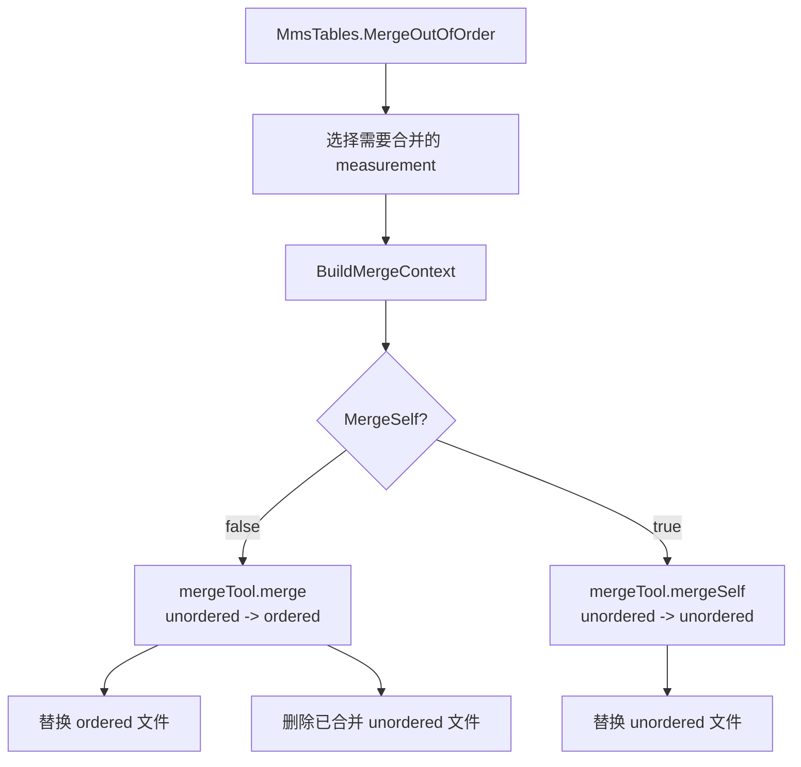
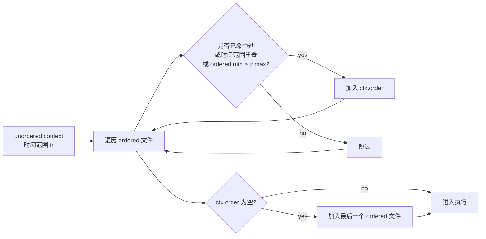
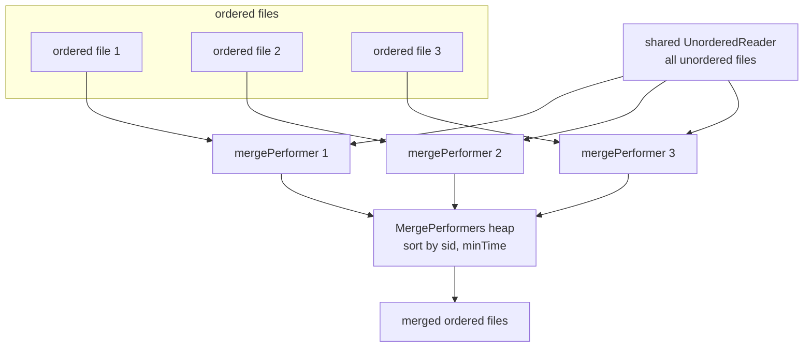
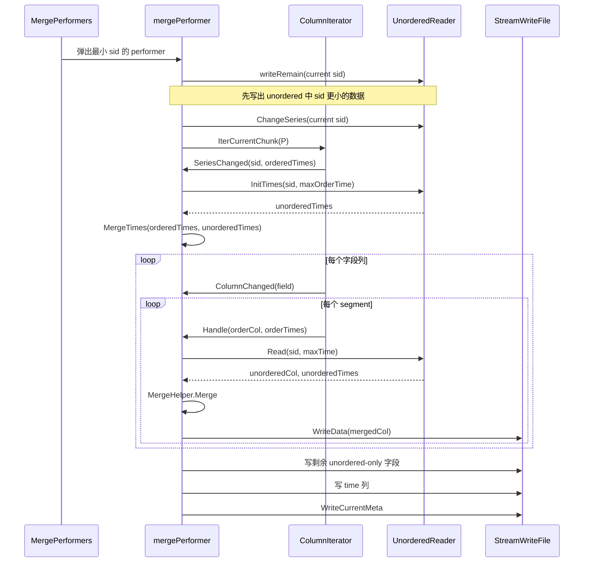
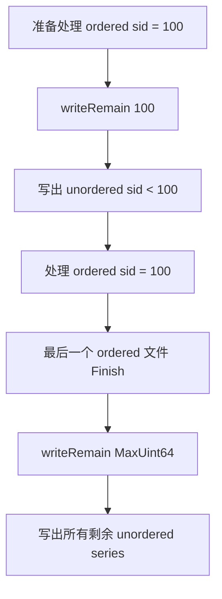
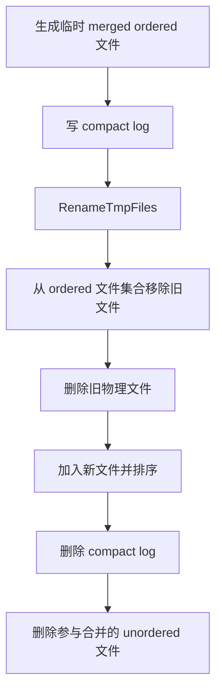
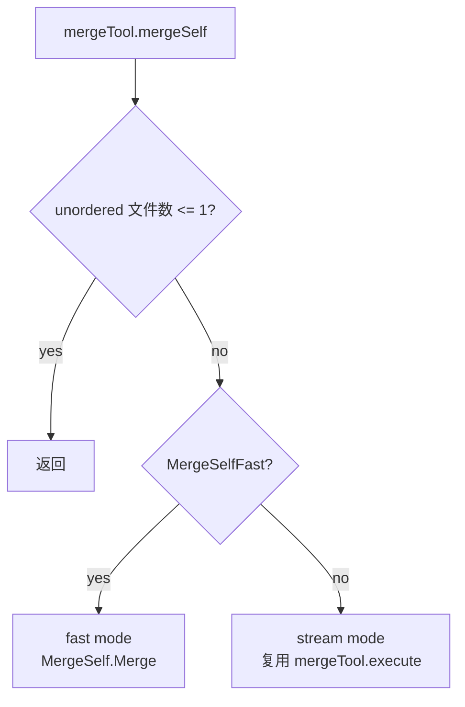
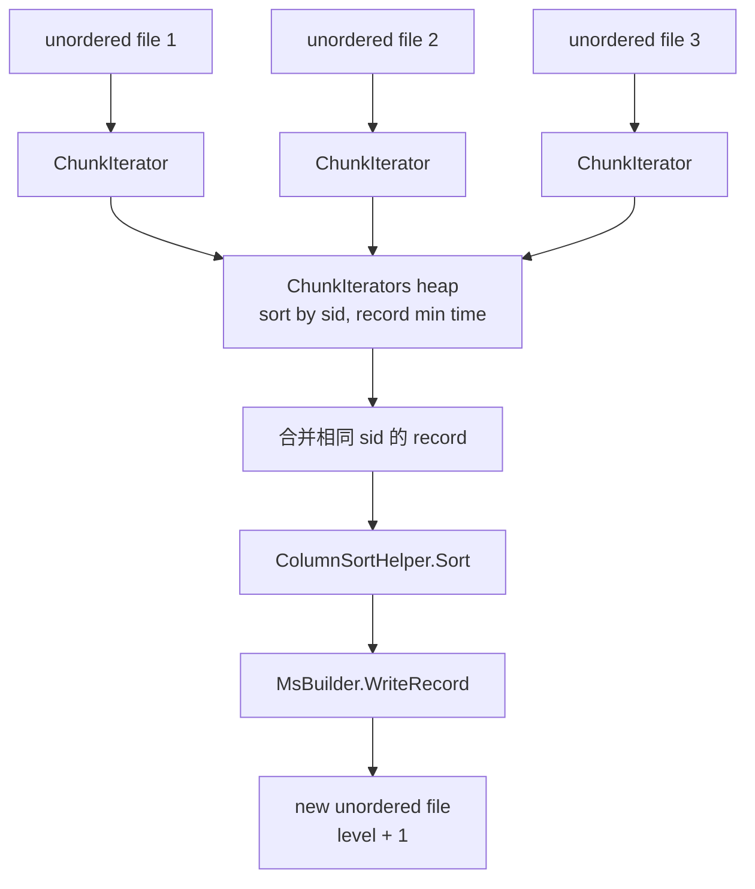
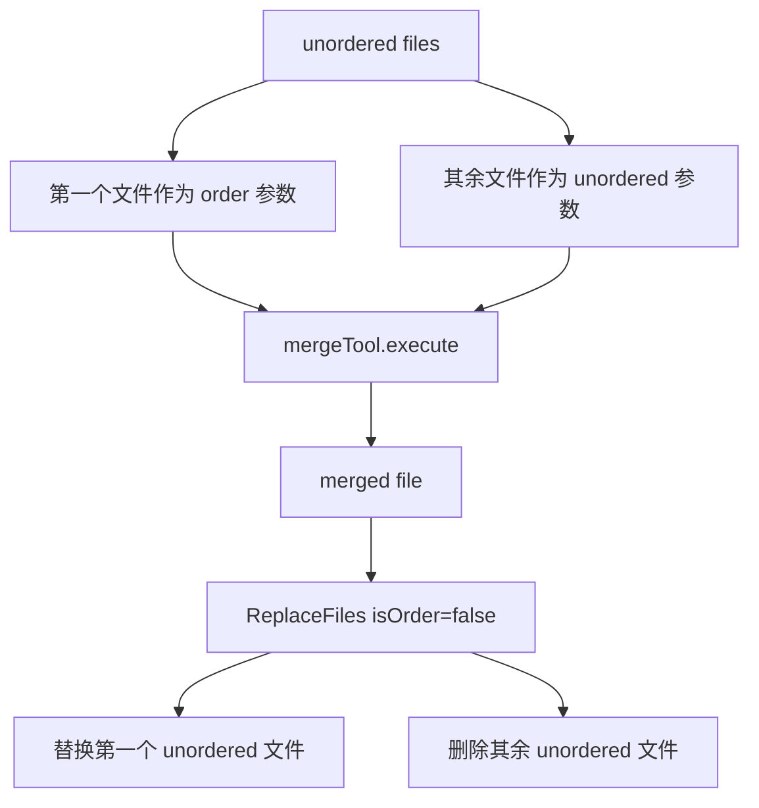
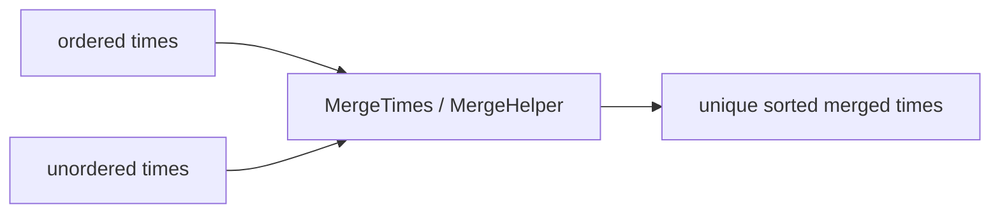

# openGemini 乱序合并设计说明

本文档面向第一次阅读 openGemini 乱序合并代码的人，重点解释“为什么这样合并”和“数据如何流动”。更细的函数级 spec 见 `merge_out_of_order_spec.md`。

## 1. 背景

openGemini 的 TSSP 文件分为两类：

- ordered：正常写入路径产生的有序文件。
- unordered：乱序写入产生的文件，位于 `out-of-order` 目录。

查询可以同时读 ordered 和 unordered，但 unordered 文件积累后会增加读放大。因此后台会周期性执行两类任务：

- 乱序合并到有序：把 unordered 数据修正进 ordered 文件，并删除已消费的 unordered 文件。
- 乱序自合并：先把多个 unordered 文件合成更少、更高 level 的 unordered 文件，降低后续查询和最终合并成本。

## 2. 总体结构



关键对象：

| 对象 | 职责 |
| --- | --- |
| `MergeContext` | 描述本次参与合并的 ordered / unordered 文件、时间范围、目标 level。 |
| `mergeTool` | 合并任务编排者，负责取文件、调用执行器、替换文件集合。 |
| `mergePerformer` | 单个 ordered 文件的逐列合并执行器。 |
| `UnorderedReader` | 多个 unordered 文件的共享读取器，按 series / column / time 消费数据。 |
| `MergeSelf` | fast 自合并执行器，按 record 做多路归并。 |

## 3. 乱序合并到有序

### 3.1 直观目标

给定一批 unordered 文件，找到受影响的 ordered 文件，然后重写这些 ordered 文件：

```text
before:

ordered:    [ O1 ] [ O2 ] [ O3 ]
unordered:       [ U1 ][ U2 ]

after:

ordered:    [ O1 ] [ O2' ] [ O3' ]
unordered:  删除 U1、U2
```

如果 unordered 数据的 series 或时间落在 ordered 文件之外，也不能丢失。openGemini 会从第一个命中的 ordered 文件开始，连续重写后续 ordered 文件，并在最后一个文件结束时写出所有剩余 unordered 数据。

### 3.2 文件选择



这一步由 `MmsTables.matchOrderFiles` 完成。

### 3.3 执行模型

每个被选中的 ordered 文件会生成一个 `mergePerformer`。所有 performer 放入最小堆，按 `(sid, minTime)` 排序。



这个设计的核心是：`UnorderedReader` 只有一个，并且是有状态的。它随着堆中最小 sid 单调向前消费 unordered 数据，避免重复扫描 unordered 文件。

### 3.4 一个 series 的处理流程



### 3.5 列合并规则

对同一个 series 的同一个字段，ordered 和 unordered 的时间线会被合并成一条有序时间线。

```text
ordered:
time:  10   20   30   40
value: A    B    C    D

unordered:
time:       20   25        50
value:      B'   X         Y

merged:
time:  10   20   25   30   40   50
value: A    B'   X    C    D    Y
```

同时间点覆盖规则：

- unordered 值非 nil：覆盖 ordered。
- unordered 值为 nil：保留 ordered。

对应代码在 `lib/record/meger.go` 的 `MergeHelper`。

### 3.6 schema 并集

ordered 和 unordered 的字段可能不一致。输出 schema 是两边字段的并集。

```text
ordered schema:   cpu, mem, time
unordered schema: cpu, disk, time

merged schema:    cpu, disk, mem, time
```

缺失字段用 nil 补齐：

```text
time:  10   20   30
cpu:   1    2    3
mem:   7    nil  9
disk:  nil  80   nil
```

`mergePerformer.ColumnChanged` 负责在遍历 ordered 字段时穿插写出 unordered-only 字段；`finishSeries` 会补写最后剩余的 unordered-only 字段。

### 3.7 只存在于 unordered 的 series

有些 unordered series 可能完全没有对应 ordered series。它们通过 `writeRemain` 写出。



这保证了三类 series 都不会丢：

- ordered-only：直接复制原始 chunk。
- ordered + unordered：逐列合并。
- unordered-only：`writeRemain` 写出。

### 3.8 文件替换



文件替换由 `ReplaceFiles` 完成。compact log 用于异常恢复。

## 4. 乱序自合并

### 4.1 直观目标

乱序文件太多时，不一定马上合并进 ordered。可以先把它们合成更少的 unordered 文件：

```text
before:

unordered level 0: [ U1 ][ U2 ][ U3 ][ U4 ][ U5 ][ U6 ][ U7 ][ U8 ]

after:

unordered level 1: [ U1' ]
```

这样能减少查询时需要打开和归并的 unordered 文件数量，也能降低后续真正合并到 ordered 时的输入规模。

### 4.2 模式选择



`MergeSelfFast()` 的判断：

```go
ctx.ToLevel() == config.TSSPToParquetLevel() ||
int(ctx.ToLevel()) <= config.GetStoreConfig().Merge.StreamMergeModeLevel
```

### 4.3 fast mode

fast mode 是 record 级多路归并。它一次读取多个 unordered 文件的 chunk record，将相同 series 的 record 合并、排序，然后写成一个新的 unordered 文件。



fast mode 的特点：

- 输入：多个 unordered 文件。
- 输出：一个新的 unordered 文件。
- 粒度：record。
- 优点：归并彻底，文件数快速下降。
- 注意：会触发 merge-self event，用于 parquet 或索引相关流程。

### 4.4 stream mode

stream mode 复用 unordered -> ordered 的逐列合并框架，但文件集合仍然是 unordered。



这里的 “order 参数” 只是代码复用上的角色，不表示文件变成 ordered。最终替换时 `isOrder=false`，新文件仍属于 `out-of-order` 文件集合。

stream mode 的特点：

- 输入：多个 unordered 文件。
- 输出：一个或多个 merged unordered 文件，通常以第一个文件为骨架。
- 粒度：column / segment。
- 优点：复用成熟的逐列合并逻辑，内存占用更可控。

## 5. 两条路径对比

| 维度 | 乱序合并到有序 | fast 自合并 | stream 自合并 |
| --- | --- | --- | --- |
| 输入主文件 | ordered 文件 | unordered 文件 | 第一个 unordered 文件 |
| 输入补充文件 | unordered 文件 | unordered 文件 | 其余 unordered 文件 |
| 输出文件集合 | ordered | unordered | unordered |
| 合并粒度 | column / segment | record | column / segment |
| 是否删除 unordered | 是，删除参与合并的 unordered | 是，替换旧 unordered | 是，保留 merged 后删除其余 |
| 主要执行器 | `mergePerformer` | `MergeSelf` | `mergePerformer` |

## 6. 设计不变量

### 6.1 时间线有序

输出 time 列必须升序，重复时间点只保留一行。



### 6.2 schema 不丢字段

输出 schema 必须是参与合并数据的字段并集，字段缺失的位置用 nil 表示。

### 6.3 series 不丢数据

所有 ordered-only、unordered-only、两边共有的 series 都必须出现在结果中。

### 6.4 unordered reader 单调消费

`UnorderedReader` 不能回退。`MergePerformers` 必须按 sid 和时间顺序驱动它，否则已经消费的 time / column offset 无法重新读取。

### 6.5 文件替换可恢复

正式替换前写 compact log，新文件先以临时名写入。异常退出时，恢复流程可根据 log 修复文件集合。

## 7. 阅读代码建议

建议按以下顺序阅读：

1. `merge_out_of_order.go`：后台入口和 context 执行。
2. `merge_util.go`：context 如何构造，`MergeTimes` 如何合并时间线。
3. `merge_tool.go`：两条合并路径如何编排。
4. `merge_performer.go`：unordered -> ordered 的核心状态机。
5. `unordered_reader.go`：共享 unordered reader 如何按需消费。
6. `lib/record/meger.go`：同时间点覆盖规则。
7. `merge_self.go` 和 `chunk_iterators.go`：fast 自合并。

## 8. 常见问题

### 为什么不是直接把 unordered append 到 ordered 后排序？

TSSP 是列式、分段、带 chunk meta 的不可变文件。直接 append 会破坏 series 内 time 有序性和 meta 结构。当前实现按 series、column、segment 重写受影响文件，能保证查询所依赖的时间顺序和列布局。

### 为什么需要多个 mergePerformer？

一次 unordered 合并可能影响多个 ordered 文件。每个 ordered 文件需要生成对应的新文件，因此每个文件一个 performer。堆调度保证多个 performer 共享一个 `UnorderedReader` 时仍然按全局 sid 顺序推进。

### 为什么有 unordered 自合并？

如果 unordered 文件太多，查询和最终合并都会变慢。自合并先降低 unordered 文件数量，并提升 merge level，是一种后台整理策略。

### fast mode 和 stream mode 怎么选？

代码由 `MergeSelfFast()` 根据目标 level 和配置决定。理解上可以认为：

- fast mode 更像“把多个 unordered record 归并成一个新文件”。
- stream mode 更像“复用 ordered 合并算法，把其它 unordered 文件合进第一个 unordered 文件”。
