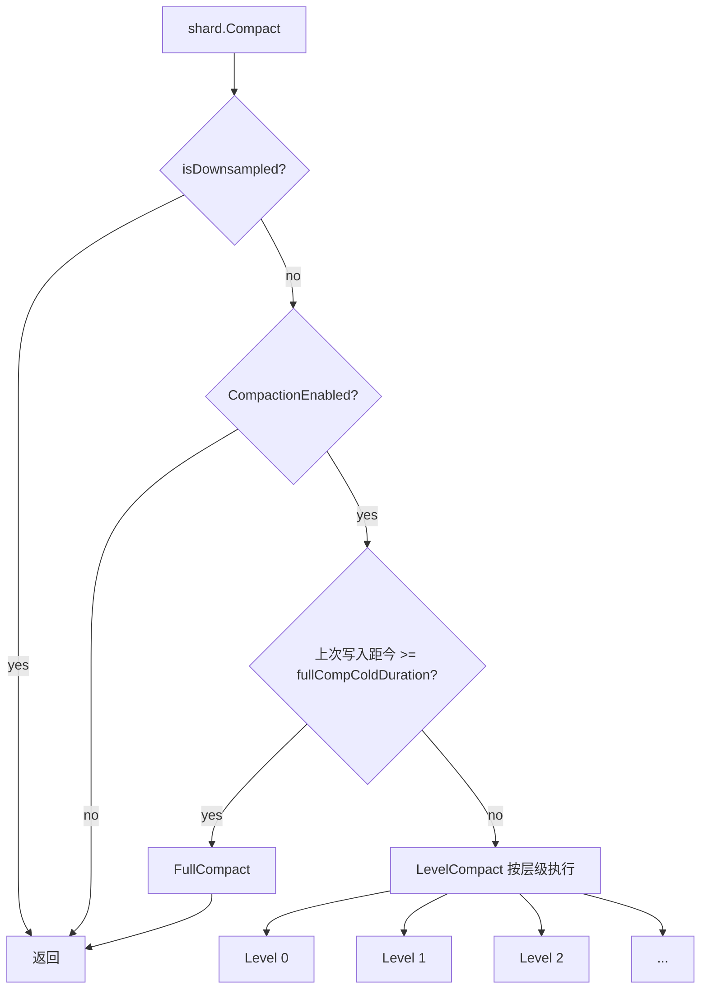
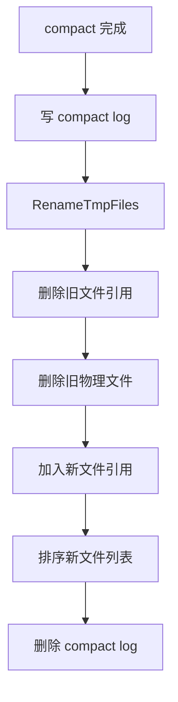

# openGemini TSSP Compaction 设计说明

本文档面向希望理解 openGemini TSSP (Time Series Sortable Partition) compaction 执行原理和策略的开发者。更多细粒度的函数级 spec 见 `tssp_compact_spec.md`。

## 1. 背景

TSSP 是 openGemini 的核心存储格式，将时序数据分片存储在不可变的 TSSP 文件中。随着数据不断写入，TSSP 文件会积累到一定数量，需要通过 compaction 来：

- 合并多个小文件，减少文件数量，降低查询时的文件打开开销
- 清理已标记删除的数据
- 按层级整理数据，提升查询性能
- 支持数据分层（tier）管理

## 2. 总体结构



关键对象：

| 对象 | 职责 |
| --- | --- |
| `MmsTables` | 管理一个 shard 下所有 measurement 的 TSSP 文件集合 |
| `CompactGroup` | 描述一次 compaction 任务：包含哪些文件、目标层级等 |
| `CompactTask` | 具体的 compaction 任务执行单元 |
| `MsBuilder` | 构建新的 TSSP 文件，按 chunk/segment 组织数据 |
| `ChunkIterator` / `StreamIterator` | 读取源文件数据的迭代器 |

## 3. Compaction 类型

### 3.1 Level Compact（分层压缩）

按层级顺序执行压缩，文件从低层级向高层级合并：

```text
Level 0 文件: [L0_1][L0_2][L0_3][L0_4][L0_5][L0_6][L0_7][L0_8]
                      ↓ level 0 compact
Level 1 文件:                                    [L1_1]
```

层级压缩规则 `LevelCompactRule`：

```go
LevelCompactRule = []uint16{0, 1, 0, 2, 0, 3, 0, 1, 2, 3, 0, 4, 0, 5, 0, 1, 2, 6}
```

这定义了压缩的执行顺序，每层最小组文件数：

```go
LeveLMinGroupFiles = [CompactLevels]int{8, 4, 4, 4, 4, 4, 2}
// Level:                 {0,  1,  2,  3,  4,  5,  6}
```

### 3.2 Full Compact（全面压缩）

当 shard 长时间没有新写入时触发（默认 `fullCompColdDuration`），目的是将所有文件压缩成更少的、更大的高层级文件：

```text
before:
  Level 0: [L0_1][L0_2]...
  Level 1: [L1_1][L1_2]...
  Level 2: [L2_1]...

after:
  所有数据 → [L6_1][L6_2]  (最高层)
```

Full compact 是资源密集型操作，通过 `maxFullCompactor` 限制并发数。

### 3.3 Merge Out of Order（乱序合并）

将 `OutOfOrder` 目录中的乱序数据合并到 `Order` 文件中，详见 `merge_out_of_order_design.md`。

## 4. 核心流程

### 4.1 入口：shard.Compact()

```go
func (s *shard) Compact() error {
    if s.isDownsampled() {
        return nil  // 下采样数据不压缩
    }

    // 根据引擎类型选择压缩规则
    switch s.engineType {
    case config.COLUMNSTORE:
        rule = immutable.LevelCompactRuleForCs
    case config.TSSTORE:
        rule = immutable.LevelCompactRule
    }

    // 检查 compaction 是否启用
    if !s.immTables.CompactionEnabled() {
        return nil
    }

    nowTime := fasttime.UnixTimestamp()
    lastWrite := s.LastWriteTime()
    d := nowTime - lastWrite

    // 冷数据触发 FullCompact
    if d >= fullCompColdDuration {
        return s.immTables.FullCompact(id)
    }

    // 否则按层级执行 LevelCompact
    for _, level := range rule {
        if err := s.immTables.LevelCompact(level, id); err != nil {
            // 记录错误但继续其他层级
        }
    }
    return nil
}
```

### 4.2 LevelPlan：生成压缩计划

```mermaid
flowchart TD
    A[LevelPlan] --> B[遍历所有 Order measurement]
    B --> C{文件数 >= LeveLMinGroupFiles[level]?}
    C -- no --> D[跳过]
    C -- yes --> E[按 sequence 分组]
    E --> F{组内文件数 >= minGroupFileN?}
    F -- yes --> G[生成 CompactGroup]
    F -- no --> H[等待更多文件]
    G --> I[加入压缩计划列表]
```

关键逻辑在 `mms_tables.go` 的 `mmsPlan` 函数：

```go
func (m *MmsTables) mmsPlan(name string, files *TSSPFiles, level uint16, minGroupFileN int, plans []*CompactGroup) []*CompactGroup {
    seqMap := seqMapPool.Get().(*dictpool.Dict)
    defer seqMapPool.Put(seqMap)

    for idx < files.Len() {
        f := files.files[idx]
        lv, seq := f.LevelAndSequence()

        if lv != level {
            // 层级变化，生成当前计划
            plans = m.genCompactPlan(seqMap, minGroupFileN, name, level, files, plans)
            seqMap.Reset()
            continue
        }

        // 按 sequence 分组
        seqByte := record.Uint64ToBytesUnsafe(seq)
        if !seqMap.HasBytes(seqByte) {
            plans = m.genCompactPlan(seqMap, minGroupFileN, name, level, files, plans)
            seqMap.SetBytes(seqByte, f)
            idx++
        } else {
            // 同一 sequence 有多个文件（不同 extent）
            i = idx + 1
            for i < files.Len() && levelSequenceEqual(level, seq, files.files[i]) {
                i++
            }
            idx = i
            seqMap.Reset()
        }
    }
    return plans
}
```

### 4.3 任务执行：CompactTask

```go
func (t *CompactTask) Execute() {
    group := t.plan
    m := t.table

    // 单文件直接 rename 到目标层级
    if group.Len() == 1 {
        err := m.RenameFileToLevel(group)
        return
    }

    // 获取文件迭代器
    fi, err := m.ImmTable.NewFileIterators(m, group)
    if err != nil {
        return
    }

    // 执行压缩
    err = m.ImmTable.compactToLevel(m, fi, t.full, NonStreamingCompaction(fi))
}
```

### 4.4 压缩执行：compactToLevel

有两种压缩模式，由 `NonStreamingCompaction` 决定：

```go
func NonStreamingCompaction(fi FilesInfo) bool {
    if config.GetStoreConfig().Compact.CorrectTimeDisorder {
        return true  // 纠正时间乱序
    }

    flag := GetMergeFlag4TsStore()
    if flag == util.NonStreamingCompact {
        return true
    } else if flag == util.StreamingCompact {
        return false
    }

    // 根据内存占用判断
    n := fi.avgChunkRows * fi.maxColumns * 8 * len(fi.compIts)
    if n >= streamCompactMemThreshold {
        return false
    }
    if fi.maxChunkRows > GetMaxRowsPerSegment4TsStore() * streamCompactSegmentThreshold {
        return false
    }
    return true
}
```

**非流式压缩** (`compact` 函数)：
- 读取所有源文件数据到内存
- 使用堆归并排序
- 一次性写入新文件

**流式压缩** (`StreamIterators.compact`)：
- 按 segment 流式处理
- 内存占用更可控
- 支持更大的数据量

### 4.5 文件替换



compact log 用于异常恢复，确保崩溃后能恢复到一致状态。

## 5. 并发控制

### 5.1 全局并发限制

```go
maxFullCompactor = cpu.GetCpuNum() / 2  // Full compact 最大并发
maxCompactor = cpu.GetCpuNum()           // Level compact 最大并发
compLimiter = limiter.NewFixed(maxCompactor)
```

### 5.2 Measurement 级别并发控制

```go
func (m *MmsTables) acquire(files []string) bool {
    m.inCompLock.Lock()
    defer m.inCompLock.Unlock()

    for _, name := range files {
        if _, ok := m.inCompact[name]; ok {
            return false  // 已被其他 compaction 占用
        }
    }

    for _, name := range files {
        m.inCompact[name] = struct{}{}
    }
    return true
}
```

同一 measurement 的多个文件必须作为整体被调度，避免并发修改同一文件集合。

## 6. 配置参数

| 参数 | 默认值 | 说明 |
| --- | --- | --- |
| `CompactLevels` | 7 | 层级数量（0-6） |
| `maxFullCompactor` | cpu/2 | Full compact 最大并发 |
| `maxCompactor` | cpu | Level compact 最大并发 |
| `fullCompColdDuration` | - | 触发 Full compact 的写入间隔 |
| `LeveLMinGroupFiles` | {8,4,4,4,4,4,2} | 每层最小组文件数 |

## 7. 设计不变量

### 7.1 时间有序

输出文件的 time 列必须严格升序。

### 7.2 数据不丢失

 compaction 前后总数据量不变（删除标记的数据除外）。

### 7.3 文件原子替换

通过 compact log + tmp 文件名保证替换的原子性。

### 7.4 单 measurement 串行

同一 measurement 的 compaction 不能并发，但不同 measurement 可并行。

## 8. 阅读代码建议

建议按以下顺序阅读：

1. `shard.go:Compact()` - 入口，了解整体流程
2. `compact.go:LevelCompact()` / `FullCompact()` - 计划生成
3. `mms_tables.go:LevelPlan()` / `mmsPlan()` - 计划构建细节
4. `task.go:CompactTask.Execute()` - 任务执行
5. `ts_mms_tables.go:compactToLevel()` - 实际压缩逻辑
6. `compact.go:compact()` - 非流式压缩实现
7. `stream_compact.go` - 流式压缩实现
8. `compaction_file_info.go` - 日志与恢复

## 9. 常见问题

### 为什么需要分层？

分层设计让 compaction 可以增量进行。低层级文件多、小，压缩开销小；高层级文件少、大，压缩收益高。LevelCompactRule 确保系统在不同阶段都有合适的 compaction 任务在运行。

### Full compact 和 Level compact 有什么区别？

- **Level compact**：只压缩特定层级的文件，开销较小
- **Full compact**：尝试将所有文件压缩到最高层级，开销大但效果最好

Full compact 只在 shard 冷（长时间无写入）时触发，避免影响写入性能。

### 如何避免 compaction 影响查询？

1. 通过 `compLimiter` 限制并发 compaction 数量
2. 文件引用计数确保正在读取的文件不会被删除
3. 同一 measurement 的 compaction 串行执行
