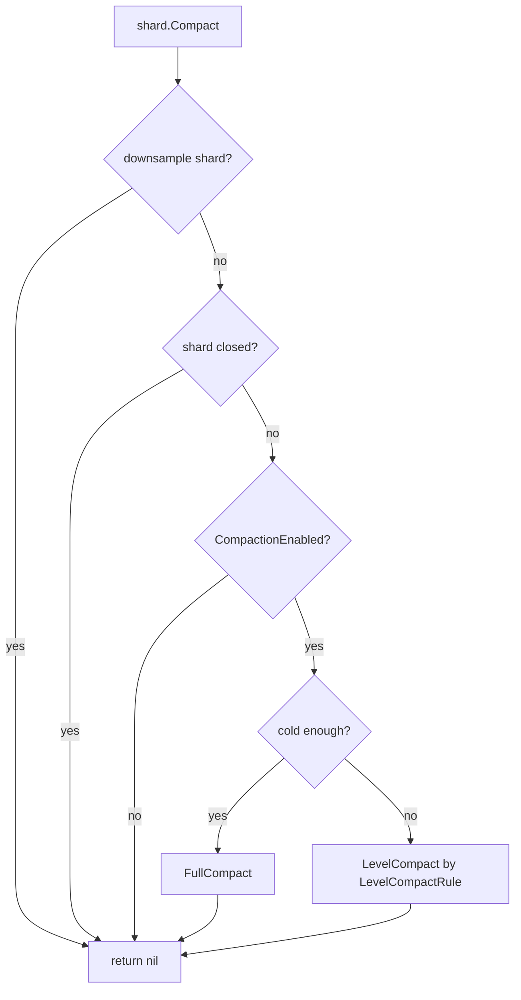
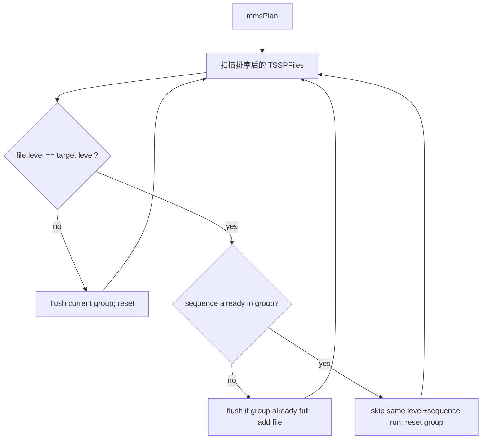
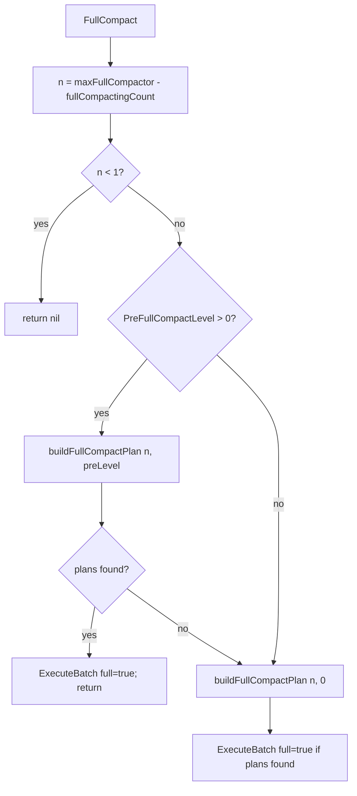
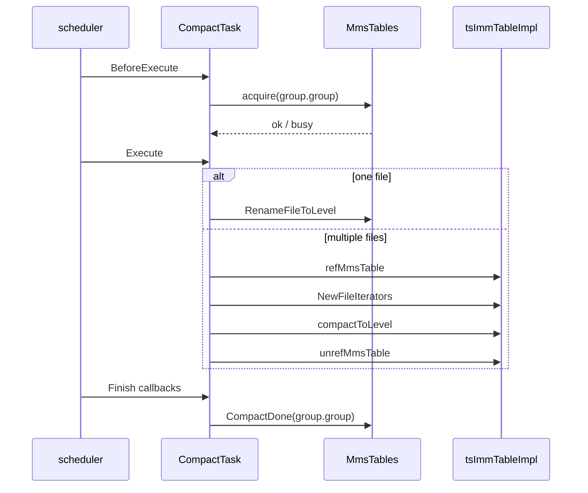
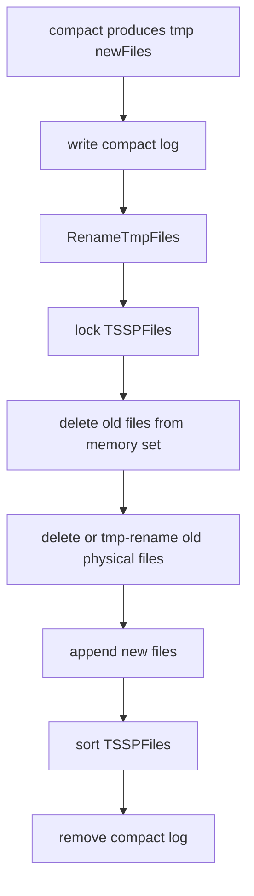

# openGemini TSSTORE TSSP Compaction 设计说明

本文档只讨论 TSSTORE 的 TSSP compaction。Parquet 转换、乱序合并到有序文件只在必要处作为边界条件提及，不展开其内部逻辑。函数级细节见 `tssp_compact_spec.md`。

## 1. 背景

TSSTORE 将时序数据写入不可变 TSSP 文件。随着写入推进，同一 shard、同一 measurement 下会积累多个 ordered TSSP 文件。Compaction 的目标是：

- 合并多个 ordered 小文件，减少查询时的文件数量和归并成本。
- 将低 level 文件逐步提升到更高 level，降低后续 compaction 频率。
- 跳过已删除的 series 数据。
- 在配置允许时纠正 record 内部时间乱序。
- 通过 compact log 和临时文件 rename 保证替换过程可恢复。

本文中的 compaction 只处理 `MmsTables.Order` 文件集合；`MmsTables.OutOfOrder` 由乱序合并流程处理。

## 2. 总体流程



TSSTORE 使用的 level 遍历顺序：

```go
LevelCompactRule = []uint16{0, 1, 0, 2, 0, 3, 0, 1, 2, 3, 0, 4, 0, 5, 0, 1, 2, 6}
LeveLMinGroupFiles = [CompactLevels]int{8, 4, 4, 4, 4, 4, 2}
```

## 3. 关键对象

| 对象 | 职责 |
| --- | --- |
| `MmsTables` | 管理 shard 下各 measurement 的 ordered / unordered TSSP 文件集合，并提供 compaction 调度入口。 |
| `tsImmTableImpl` | TSSTORE 文件集合实现，负责生成 level plan、创建 file iterator、执行 TSSTORE compact。 |
| `CompactGroup` | 一次 compaction 任务的文件路径列表、measurement 名、目标 level、shard id 等。 |
| `CompactTask` | scheduler 中实际执行的任务，负责 acquire、引用保护、调用 compact、finish 清理。 |
| `FilesInfo` | 已解析的 compaction 输入，包括旧文件、迭代器、估算大小、chunk 行数/列数统计。 |
| `ChunkIterators` | 非流式 compact 的 chunk/record 级多路归并器。 |
| `StreamIterators` | 流式 compact 的 segment 级处理器。 |
| `MsBuilder` | 写出新的 TSSP 文件，可按文件大小拆出多个新文件。 |

## 4. Level Compact

Level compact 每次只选择某个 level 的 ordered 文件，并将一组文件合并到 `level + 1`。

```text
before:
  level 0: [seq=1][seq=2][seq=3][seq=4][seq=5][seq=6][seq=7][seq=8]

after level 0 compact:
  level 1: [seq=1, level=1, extent=0...]
```

实际新文件名以输入组第一个文件的 sequence 为基础，目标 level 为 `group.toLevel`。如果输出文件因大小拆分，会递增 extent。

### 4.1 plan 生成

`tsImmTableImpl.LevelPlan` 遍历 `m.Order` 中所有 measurement：

```mermaid
flowchart TD
    A[LevelPlan(level)] --> B{CompactionEnabled?}
    B -- no --> Z[return nil]
    B -- yes --> C[遍历 m.Order]
    C --> D[getMmsPlan]
    D --> E{文件数 >= LeveLMinGroupFiles[level]?}
    E -- no --> C
    E -- yes --> F[mmsPlan]
    F --> G[CompactGroup list]
```

`mmsPlan` 的核心规则：

- 只收集当前目标 level 的文件。
- 每个候选组中只保留唯一 sequence 的文件。
- 如果遇到同一 `(level, sequence)` 的多个文件，说明存在同 sequence 的 split extent，本轮会跳过这一段并重置当前组，避免把这些 extent 混入普通 level compact 组。
- 组内唯一 sequence 数达到 `LeveLMinGroupFiles[level]` 后生成 `CompactGroup`。
- `genCompactGroup` 会检查文件是否已 busy 或正在 parquet process；busy 时不生成计划。



## 5. Full Compact

Full compact 在 shard 足够冷时触发：

```go
nowTime - shard.LastWriteTime() >= fullCompColdDuration
```

它不是简单地强制合并到最高 level 6。当前 TSSTORE 实现由 `buildFullCompactPlan(n, toLevel)` 决定目标 level：

- 普通 full compact：`toLevel == 0`，`CompactGroupBuilder.add` 根据输入文件 level 持续 `UpdateLevel(lv + 1)`，最终目标 level 是本组输入文件最大 level 加 1。
- pre-level full compact：`config.PreFullCompactLevel() > 0` 时，先用 low-level mode，把低于指定 preLevel 的文件合并到该 preLevel。



Full compact 通过 `fullCompactingCount` 和 `maxFullCompactor` 控制并发。计数在 `CompactTask.Execute` 中仅对 `full == true` 的多文件 compact 增减。

## 6. CompactTask 执行



`BeforeExecute` 按文件路径调用 `MmsTables.acquire`。如果任一文件已经在 `inCompact` 中，本任务跳过。任务结束回调会调用 `CompactDone` 释放这些路径。

单文件任务不重写数据，只通过 `RenameFileToLevel` 修改文件名中的 level，并更新内存中的文件 level。

## 7. compactToLevel

`tsImmTableImpl.compactToLevel` 是 TSSTORE 的实际压缩入口：

1. 创建 `CompactStatItem`。
2. 根据 `NonStreamingCompaction(fi)` 选择非流式或流式 compact。
3. 非流式：创建 `ChunkIterators`，调用 `MmsTables.compact`。
4. 流式：创建 `StreamIterators`，调用 `StreamIterators.compact`，并触发 replace-file event。
5. 调用 `MmsTables.ReplaceFiles(group.name, oldFiles, newFiles, true)` 替换 ordered 文件集合。
6. 流式 compact 成功后，将新文件加入 `HotFileManager`。

## 8. 非流式与流式 compact

选择逻辑：

```go
func NonStreamingCompaction(fi FilesInfo) bool {
    if config.GetStoreConfig().Compact.CorrectTimeDisorder {
        return true
    }
    switch GetMergeFlag4TsStore() {
    case util.NonStreamingCompact:
        return true
    case util.StreamingCompact:
        return false
    }
    if fi.avgChunkRows * fi.maxColumns * 8 * len(fi.compIts) >= 128MB {
        return false
    }
    if fi.maxChunkRows > maxRowsPerSegment * 500 {
        return false
    }
    return true
}
```

### 8.1 非流式 compact

`MmsTables.compact` 以 `ChunkIterators` 为输入，按 series id 归并 chunk record：

- `ChunkIterators.Next()` 每次返回一个 series id 和合并后的 `record.Record`。
- 如果启用 `CorrectTimeDisorder`，对 record 调用 `record.SortRecordIfNeeded`。
- 如果 `indexMergeSet` 标记该 TSID 已删除，则跳过该 record。
- 调用 `MsBuilder.WriteRecord` 写入新文件；输出过大时 builder 可以拆出多个 extent 文件。

它不是一次性把所有源文件加载进内存，而是按 chunk/record 粒度归并；相对 stream compact，它的处理粒度更粗，内存估算超过阈值时会切到 stream compact。

### 8.2 流式 compact

`StreamIterators.compact` 按 segment/column 流式处理，适合大 chunk 或高内存压力场景。它会在替换文件前触发 stream compact events，并在失败时清理临时文件。

## 9. 文件替换与恢复



`MmsTables.ReplaceFiles` 负责替换：

- 新文件先以临时文件形式写出。
- 替换前写 compact log。
- `RenameTmpFiles` 将新文件改为正式名。
- 删除旧文件时，如果旧文件仍在使用，会先 rename 为 tmp 后放入 GC。
- 新文件加入 ordered 文件集合后重新排序。
- 删除 compact log。

`CompactTask.Execute` 的 defer 会在 `CompactRecovery` 配置打开时调用 `CompactRecovery(m.path, group)`，用于任务异常后的恢复检查；panic recover 不在 `CompactTask.Execute` 中完成。

## 10. 并发控制

### 10.1 全局并发

- `maxCompactor` 控制普通 compaction scheduler limiter，默认 CPU 数，配置后被限制在 `[2, 32]`。
- `maxFullCompactor` 控制 full compact 计数，默认 CPU/2，配置后被限制在 `[1, 32]`，且不会大于等于 `maxCompactor`。
- `compLimiter` 是 scheduler 的全局并发 limiter。

### 10.2 measurement / 文件路径级并发

- scheduler 任务组以 measurement 名作为 key。
- `MmsTables.acquire(group.group)` 以文件路径为粒度写入 `inCompact`。
- `genCompactGroup` 阶段也会调用 `busy(group.group)` 避免生成已占用文件的计划。

因此同一 measurement 的任务会被 scheduler 分组串行化，同一批文件路径也会被 `inCompact` 防止重入。

## 11. 设计不变量

- TSSTORE compaction 只替换 ordered 文件集合。
- 参与 compact 的旧文件必须在替换前保持引用保护。
- 输出文件中的 record 时间必须有序；未启用乱序纠正时会检查时间顺序，启用时会排序。
- 已删除 TSID 不应写入新 compact 文件。
- 新旧文件替换必须经过 compact log 和 tmp rename。
- output 为空时不会替换旧文件；`ReplaceFiles` 对空 newFiles 直接返回。
- 同一文件路径不能同时参与多个 compaction/merge。

## 12. 阅读代码建议

1. `engine/shard.go:Compact`：shard 级入口。
2. `engine/immutable/compact.go:LevelCompact` / `FullCompact` / `compact`。
3. `engine/immutable/ts_mms_tables.go:LevelPlan` / `compactToLevel`。
4. `engine/immutable/mms_tables.go:mmsPlan` / `genCompactGroup` / `ReplaceFiles`。
5. `engine/immutable/task.go:CompactTask.Execute`。
6. `engine/immutable/stream_compact.go:NonStreamingCompaction` / `StreamIterators.compact`。
7. `engine/immutable/compaction_file_info.go`：compact log 和恢复。
