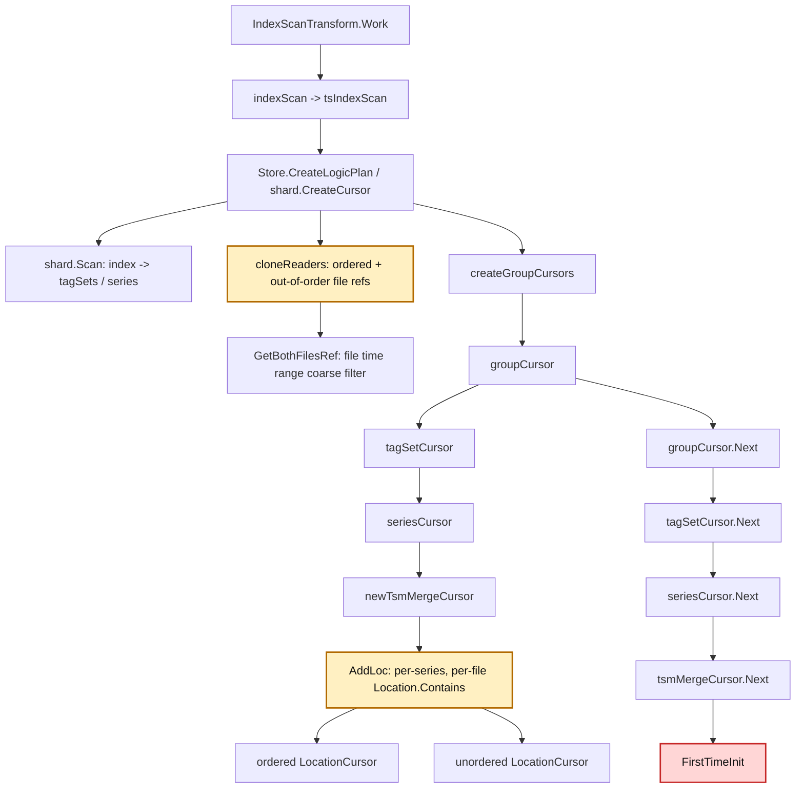
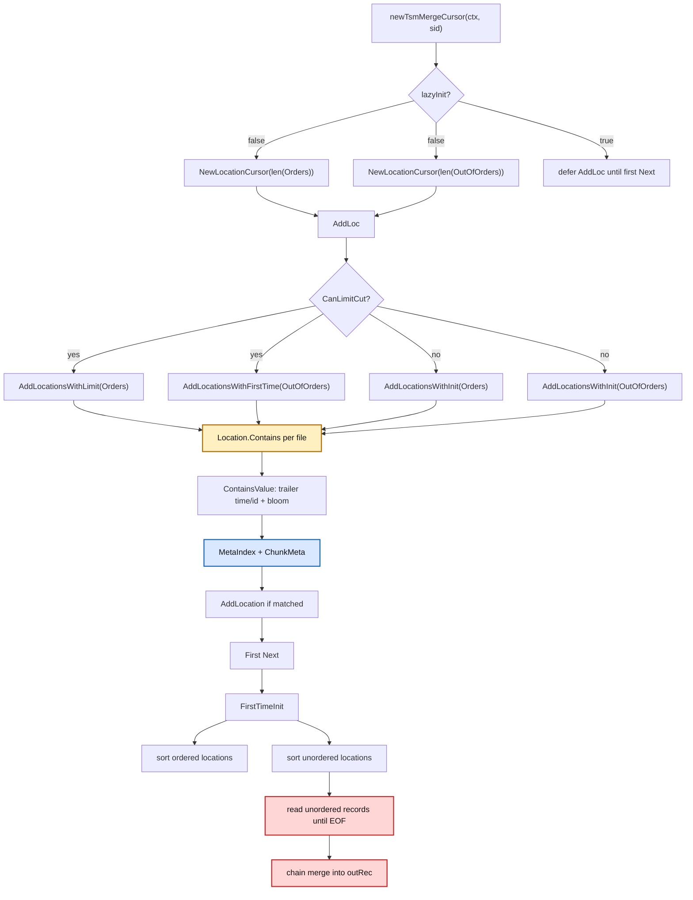
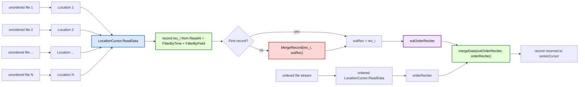
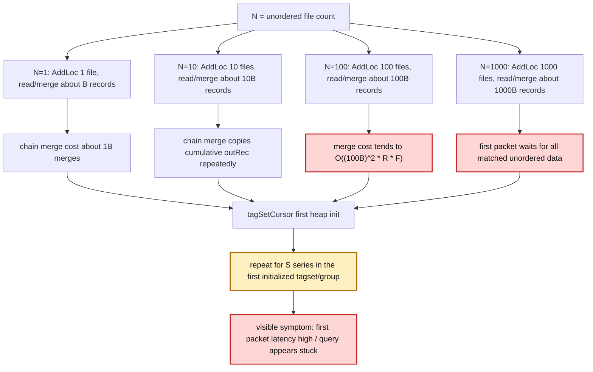
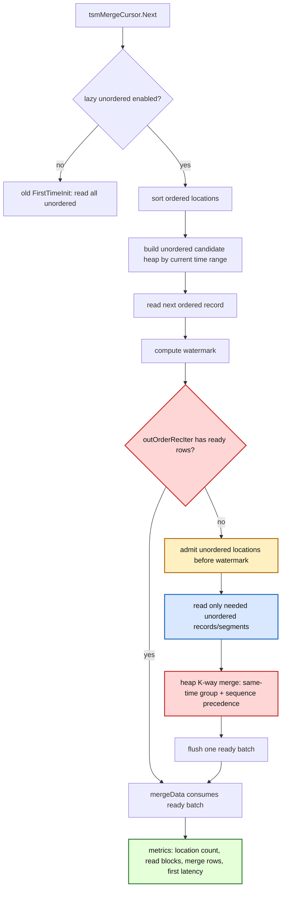

# tsmMergeCursor FirstTimeInit 乱序文件查询瓶颈分析与优化方案

## 1. 问题背景

本文分析 openGemini TSStore 查询路径中 `tsmMergeCursor.FirstTimeInit` 在乱序 TSM/TSSP 文件数量较多时的性能风险。重点关注 `outRec *record.Record` 的构造、读取、合并、过滤、排序和去重行为，以及 ordered / unordered 数据合并如何影响查询首包延迟。

结论先行：

- `FirstTimeInit` 在普通非聚合路径中会把所有命中的乱序 location 读空，并把每次读到的 `record.Record` 链式合并成一个完整 `outRec`，之后才允许 `Next()` 返回第一批数据。源码依据：`engine/tsm_merge_cursor.go:497-562`。
- unordered 文件越多，`AddLoc` 对每个 series 逐文件做 `ContainsValue -> MetaIndex -> ChunkMeta` 的成本越高。源码依据：`engine/tsm_merge_cursor.go:288-315`、`engine/immutable/location.go:177-202`、`engine/immutable/tssp_file.go:760-775`。
- 当前乱序数据不是 heap 式惰性 K 路归并，而是“读一个 record，和累计 outRec 合并一次”的链式归并。若某个 series 命中的乱序 location 数为 `K`（`K <= N`），累计结果会被重复拷贝，最坏拷贝复杂度接近 `O((K * B)^2 * R * F)`。源码依据：`engine/tsm_merge_cursor.go:529-551`、`lib/record/record.go:803-825`、`lib/record/record.go:610-759`。
- `tagSetCursor` 首次初始化 heap 时会对每个 series cursor 调 `Next()`，进而触发每个 series 的 `tsmMergeCursor.FirstTimeInit`。所以首包延迟可能再乘以参与初始化的 series 数。源码依据：`engine/tagset_cursor.go:291-318`。
- `engine/immutable/unordered_reader.go` 的 `UnorderedReader` 是 merge/compaction 路径使用的 reader，当前 `tsmMergeCursor` 查询路径没有调用它。查询路径的乱序读取由 `LocationCursor`、`Location`、`TSSPFile.ReadAt` 完成。源码依据：`rg NewUnorderedReader` 只显示 `merge_tool.go`、`merge_performer.go` 和测试调用。

## 2. 相关代码路径

### 2.1 查询请求到 `tsmMergeCursor.FirstTimeInit`

核心调用链如下：

1. `IndexScanTransform.Work` 调用 `indexScan()`，TSStore 查询进入 `tsIndexScan()`。源码：`engine/executor/index_scan_transform.go:442-471`。
2. `tsIndexScan()` 调用 `Store.CreateLogicPlan(...)`，最终进入 shard 侧创建 cursor 的逻辑，并从 `LogicalDummyShard` 取 `TSIndexInfo` 和 `KeyCursor`。源码：`engine/executor/index_scan_transform.go:264-355`。
3. `shard.CreateCursor`：
   - 先通过 `Scan` 从索引得到 tagset/series。源码：`engine/iterators.go:108-128`、`engine/iterators.go:157`。
   - 调 `cloneReaders` 克隆 immutable/mutable reader。源码：`engine/iterators.go:199`。
   - 调 `createGroupCursors` 创建 `groupCursor -> tagSetCursor -> seriesCursor -> tsmMergeCursor`。源码：`engine/iterators.go:226`、`engine/iterators.go:551-627`。
4. `cloneReaders -> createImmutableReader -> GetBothFilesRef`：
   - 获取 ordered 与 out-of-order 文件列表。
   - `GetBothFilesRef` 只做 measurement 和文件级 time range 粗过滤；未做 series/field/schema 过滤。源码：`engine/iterators.go:246-300`、`engine/immutable/mms_tables.go:474-516`。
5. `newTagSetCursor -> itrsInit -> newSeriesCursor -> newTsmMergeCursor`：
   - 每个 series cursor 内部持有一个 `tsmMergeCursor`。源码：`engine/iterators.go:775-823`、`engine/iterators.go:933-989`、`engine/iterators.go:1142-1181`。
6. 首次拉取数据：
   - `groupCursor.Next -> tagSetCursor.Next -> seriesCursor.Next -> tsmMergeCursor.Next`。
   - `tsmMergeCursor.Next` 首次执行 `FirstTimeInit()`。源码：`engine/group_cursor.go:62-72`、`engine/tagset_cursor.go:231-246`、`engine/series_cursor.go:237-287`、`engine/tsm_merge_cursor.go:373-420`。

### 2.2 `tsmMergeCursor` 结构体与关键字段

`tsmMergeCursor` 定义在 `engine/tsm_merge_cursor.go:45-66`，和乱序查询直接相关的字段如下：

- `locations *immutable.LocationCursor`：ordered TSM/TSSP 文件命中的 location。
- `outOfOrderLocations *immutable.LocationCursor`：out-of-order TSM/TSSP 文件命中的 location。
- `orderRecIter recordIter`：ordered 数据读取后的迭代器。
- `outOrderRecIter recordIter`：乱序数据读完、合并后的迭代器。
- `recordPool *record.CircularRecordPool`：`Next()` 中 ordered record 使用的池；`FirstTimeInit` 里每次 unordered 读取的 `dst` 没用这个池。
- `locationInit bool`：控制 `FirstTimeInit` 只执行一次。
- `limitFirstTime int64`：limit cut 场景估算第一时间点。
- `lazyInit bool/init bool`：部分 limit/group by 场景延迟初始化 series cursor。

### 2.3 ordered / unordered 文件与 location 初始化

`newTsmMergeCursor` 在非 lazy 场景构造两个 `LocationCursor`，容量分别等于 ordered 和 out-of-order 文件数，然后调用 `AddLoc()`。源码：`engine/tsm_merge_cursor.go:68-95`。

`AddLoc()` 有两条路径：

- `CanLimitCut()` 为 true：
  - ordered 走 `AddLocationsWithLimit`，可能只加入足够满足 limit/offset 的 ordered location。源码：`engine/tsm_merge_cursor.go:291-303`、`engine/tsm_merge_cursor.go:147-203`。
  - unordered 走 `AddLocationsWithFirstTime`，仍然遍历所有 out-of-order 文件并计算 first time。源码：`engine/tsm_merge_cursor.go:297`、`engine/tsm_merge_cursor.go:205-230`。
- 普通路径：
  - ordered 和 unordered 都走 `AddLocationsWithInit`，逐文件调用 `AddLocations`。源码：`engine/tsm_merge_cursor.go:303-311`。

`AddLocations` 的循环是 per-file：

```go
for _, r := range files {
    loc := immutable.NewLocation(r, ctx.decs)
    contains, err := loc.Contains(sid, ctx.tr, metaCtx)
    if contains { l.AddLocation(loc) }
}
```

源码：`engine/tsm_merge_cursor.go:116-131`。

`Location.Contains` 又做：

- `TSSPFile.ContainsValue(sid, tr)`：文件级 series/time 粗过滤，内部用 trailer id/time 和 bloom。源码：`engine/immutable/location.go:177-185`、`engine/immutable/tssp_reader.go:704-714`、`engine/immutable/tssp_file.go:760-775`。
- `readChunkMeta(sid, tr, ctx)`：读 meta index 和 chunk meta，并检查 chunk meta time range。源码：`engine/immutable/location.go:102-143`。
- 根据 `segPos/fragRgs` 判断是否还有 segment 可读。源码：`engine/immutable/location.go:197-200`。

这意味着当 out-of-order 文件数为 `N` 时，每个 series 至少要对 `N` 个候选文件做一次 `Location.Contains` 判断；命中或 bloom false positive 时还要读/解压/反序列化 chunk meta。

lazy init 场景只是把 `AddLoc` 从 `newTsmMergeCursor` 延迟到首次 `tsmMergeCursor.Next`。源码：`engine/tsm_merge_cursor.go:378-385`。它不会跳过 `FirstTimeInit` 的 unordered 全量预读；`FirstTimeInit` 仍会在同一次首次 `Next` 中由 `locationInit` 分支触发。源码：`engine/tsm_merge_cursor.go:390-396`。

### 2.4 `FirstTimeInit` 内部初始化了哪些 cursor

`FirstTimeInit` 本身没有再创建新的 `Cursor` 接口对象，它处理的是已经在 `AddLoc` 阶段填好的两个 `LocationCursor`：

- ordered：`c.locations`
- unordered：`c.outOfOrderLocations`

执行步骤：

1. ordered locations 排序。若是降序查询，再 reverse。源码：`engine/tsm_merge_cursor.go:497-503`。
2. 如果存在聚合 `ops`，调用 `FirstTimeOutOfOrderInit()`，然后直接返回。源码：`engine/tsm_merge_cursor.go:505-511`。
3. 非聚合路径：
   - unordered locations 为空则直接返回。源码：`engine/tsm_merge_cursor.go:513-515`。
   - unordered locations 按 `LocationCursor.Less` 排序。对于 unordered 文件，排序依据是 file sequence，而不是 time。源码：`engine/tsm_merge_cursor.go:517-519`、`engine/immutable/location_cursor.go:65-74`。
   - 循环读 unordered 数据直到 `ReadData` 返回 nil。源码：`engine/tsm_merge_cursor.go:529-552`。
   - 将累计 `outRec` 初始化到 `outOrderRecIter`。源码：`engine/tsm_merge_cursor.go:560`。

聚合路径 `FirstTimeOutOfOrderInit()`：

- unordered locations 排序。源码：`engine/tsm_merge_cursor.go:461-468`。
- 创建一个 `dst := record.NewRecordBuilder(c.ctx.schema)`。源码：`engine/tsm_merge_cursor.go:480`。
- 调用 `ReadOutOfOrderMeta` 一次，但 `ReadOutOfOrderMeta` 内部会遍历所有 unordered locations，并对每个 location 调 `loc.readMeta`，再 `AggregateData`。源码：`engine/tsm_merge_cursor.go:481`、`engine/immutable/location_cursor.go:152-180`。
- `outRec = rec`，再 `outOrderRecIter.init(outRec)`。源码：`engine/tsm_merge_cursor.go:477-493`。

### 2.5 每个 cursor 对应哪些文件或数据源

- `groupCursor`：一个 reader 并行分片内的 tagset cursor 集合。源码：`engine/group_cursor.go:31-49`。
- `tagSetCursor`：一个 tagset 内多个 series cursor 的 heap 归并器。源码：`engine/tagset_cursor.go:113-139`。
- `seriesCursor`：
  - `memRecIter` 对应 mutable memtable record。源码：`engine/series_cursor.go:67-69`、`engine/iterators.go:1099-1118`。
  - `tsmCursor` 对应 immutable TSM/TSSP 数据，即 `tsmMergeCursor`。源码：`engine/series_cursor.go:62`。
- `tsmMergeCursor`：
  - `locations` 对应 ordered immutable files。源码：`engine/tsm_merge_cursor.go:51`。
  - `outOfOrderLocations` 对应 out-of-order immutable files。源码：`engine/tsm_merge_cursor.go:52`。
- `LocationCursor`：
  - `lcs []*Location`，每个 `Location` 持有一个 `TSSPFile` 和该 series 的 `ChunkMeta`。源码：`engine/immutable/location_cursor.go:22-27`、`engine/immutable/location.go:29-36`。

### 2.6 `outRec` 的读取、构造、复用与释放位置

非聚合 `FirstTimeInit`：

```go
isFirst := true
var outRec *record.Record
for {
    dst := record.NewRecordBuilder(c.ctx.schema)
    rec, err := c.readData(false, dst)
    if rec == nil { break }
    if isFirst {
        outRec = rec
    } else {
        var mergeRecord record.Record
        mergeRecord.MergeRecord(rec, outRec)
        outRec = &mergeRecord
    }
    isFirst = false
}
c.outOrderRecIter.init(outRec)
```

源码：`engine/tsm_merge_cursor.go:527-560`。

生命周期判断：

- 每次循环都 `record.NewRecordBuilder(c.ctx.schema)`，未使用 `c.recordPool`。源码：`engine/tsm_merge_cursor.go:530`。
- 第一条 unordered record 直接作为 `outRec`。源码：`engine/tsm_merge_cursor.go:539-541`。
- 后续每条 unordered record 都新建局部 `mergeRecord` 并把 `rec` 与累计 `outRec` 合并，再令 `outRec = &mergeRecord`。源码：`engine/tsm_merge_cursor.go:542-550`。
- `outRec` 最终被 `outOrderRecIter` 持有，直到后续 `mergeData` 消耗完或 cursor reset/close。源码：`engine/tsm_merge_cursor.go:560`、`engine/iterators_helper.go:179-197`。
- 没有显式释放 `outRec`；`tsmMergeCursor.reset` 只 reset 迭代器并归还 `recordPool`。源码：`engine/tsm_merge_cursor.go:422-445`。
- `FirstTimeInit` 的 `outRec` 不是从 `recordPool` 申请的；ordered record 在 `Next()` 中才使用 `recordPool.Get()`。源码：`engine/tsm_merge_cursor.go:387-404`。

需要注意的确定风险：

- 如果 `outOfOrderLocations.Len() > 0`，但所有乱序数据被过滤成 nil，则 `outRec` 会保持 nil。当前 span 计数处直接调用 `outRec.RowNums()`，在 span 非 nil 时可能 panic。源码：`engine/tsm_merge_cursor.go:554-557`。`Location.readData` 在 segment 不重叠时会返回 nil，`FilterByField` 在保留行为空时也会返回 nil；因此这是源码可达路径，建议先作为独立低风险修复项补 nil guard。源码：`engine/immutable/location.go:261-315`、`engine/immutable/reader.go:969-970`。
- 聚合路径也有同类 nil pointer 风险：`FirstTimeOutOfOrderInit` 中 `ReadOutOfOrderMeta` 可能返回 nil，而 span 计数处同样直接调用 `outRec.RowNums()`。源码：`engine/tsm_merge_cursor.go:481-488`、`engine/immutable/location_cursor.go:152-181`。第一阶段 nil guard 必须同时覆盖普通路径和聚合路径。

### 2.7 record 读取、过滤、排序、去重逻辑

读取：

- `tsmMergeCursor.readData(false, dst)` 设置 `ReadContext` 和 `FilterOptions`，再调用 `outOfOrderLocations.ReadData`。源码：`engine/tsm_merge_cursor.go:336-344`。
- `LocationCursor.ReadData` 从当前位置开始逐 location 调 `loc.readData`，直到读到非 nil record 或读完。源码：`engine/immutable/location_cursor.go:183-228`。
- `Location.readData` 在 segment 级判断 query time range 和 row filter，命中后调用 `TSSPFile.ReadAt`。源码：`engine/immutable/location.go:261-315`。
- `TSSPFile.ReadAt -> tsspFileReader.ReadData -> readSegmentRecord` 读取并解码查询 schema 中的列和 time 列。源码：`engine/immutable/tssp_reader.go:586-630`、`engine/immutable/tssp_file.go:291-307`、`engine/immutable/tssp_file.go:369-435`。

过滤：

- 文件列表阶段：`GetBothFilesRef` 只按 file trailer time range 过滤。源码：`engine/immutable/mms_tables.go:474-516`。
- series/location 阶段：`ContainsValue` 用 trailer id/time 和 bloom；`MetaIndex` 进一步用 meta index time。源码：`engine/immutable/tssp_file.go:760-775`、`engine/immutable/tssp_file.go:695-718`。
- segment 阶段：`Location.readData` 用 chunk segment min/max time 跳过不重叠 segment。源码：`engine/immutable/location.go:276-280`。
- record 阶段：先 `FilterByTime`/`FilterByTimeDescend`，再 `FilterByField` 做字段、tag、row filter。源码：`engine/immutable/location.go:297-310`、`engine/immutable/reader.go:754-789`、`engine/immutable/reader.go:895-974`。

排序与去重：

- ordered locations 按 chunk meta min time 排序，descending 时 reverse。源码：`engine/tsm_merge_cursor.go:497-503`、`engine/immutable/location_cursor.go:65-84`。
- unordered locations 按 file sequence 排序。源码：`engine/immutable/location_cursor.go:71-73`。
- unordered records 通过 `Record.MergeRecord` 或 `MergeRecordDescend` 合并成按时间有序的 `outRec`。源码：`engine/tsm_merge_cursor.go:542-550`、`lib/record/record.go:803-825`。
- `MergeRecord` 在同 timestamp 时调用 `mergeRecRow(newRec, oldRec, ...)`，即新 record 覆盖旧 record 的对应列，承担乱序覆盖/去重语义。源码：`lib/record/record.go:610-625`。
- `mergeData(newRecIter, baseRecIter, ...)` 将乱序累计 record 作为 `newRecIter`，ordered record 作为 `baseRecIter`，同时间点由乱序数据优先。源码：`engine/tsm_merge_cursor.go:398-419`、`engine/iterators_helper.go:480-519`。

## 3. 当前执行流程

### 3.1 普通非聚合查询流程

1. `newTsmMergeCursor` 初始化两个 `LocationCursor`。
2. `AddLoc` 遍历 ordered 和 unordered 文件，为当前 series 找到命中的 `Location`。
3. 第一次 `tsmMergeCursor.Next`：
   - 创建 `recordPool`。
   - 调 `FirstTimeInit`。
   - `FirstTimeInit` 把所有 unordered locations 读完并合并成 `outRec`。
4. `Next` 继续读取一个 ordered record。
5. `mergeData(outOrderRecIter, orderRecIter, maxRowCnt, ascending)` 将 unordered 累计数据与当前 ordered record 合并，返回给 `seriesCursor`。
6. `seriesCursor` 再和 memtable record 合并，随后 `KickNilRow`、裁剪 schema 后返回。

### 3.2 聚合查询流程

当 `len(c.ops) > 0` 时，`FirstTimeInit` 不走普通数据读全路径，而是调用 `FirstTimeOutOfOrderInit`：

- `ReadOutOfOrderMeta` 遍历所有 unordered location。
- 每个 location 调 `loc.readMeta`，底层走 `readSegmentMetaRecord`，尽量使用 pre-agg meta；如果时间范围不完整或需要 aux 数据，仍可能读 time/data block。源码：`engine/immutable/location_cursor.go:152-180`、`engine/immutable/tssp_file.go:310-362`、`engine/immutable/reader.go:1236-1411`、`engine/immutable/first_last_reader.go:86-160`。
- 多个 unordered meta record 用 `AggregateData` 聚合。源码：`engine/immutable/reader.go:1442-1470`。

聚合路径的瓶颈不同于普通路径：不是把所有点合并成一个大 `outRec`，而是每个 unordered location 的 pre-agg/meta 读取与 `AggregateData` 累积成本；在 first/last/min/max 且时间范围不完全覆盖 chunk 时，仍可能退化到读 time/data block。

### 3.3 ordered 与 unordered 合并流程

- `FirstTimeInit` 只预读 unordered，不预读 ordered。
- `Next` 后续每次最多读一个 ordered record，并与 `outOrderRecIter` 剩余数据合并。
- unordered `outRec` 可能很大，`mergeData` 会分批切出不超过 `maxRowCnt` 的结果。
- 如果 unordered 已全部消耗，后续直接返回 ordered record 或 ordered 切片。

## 4. Mermaid 图示

### 4.1 查询到 `tsmMergeCursor.FirstTimeInit` 的调用链



标注：

- `GetBothFilesRef`：文件数为 `ordered + unordered`。
- `AddLoc`：对每个 series 遍历 unordered 文件，放大因子约为 `S * N`。
- `FirstTimeInit`：首包前读完所有命中 unordered 数据，是当前最主要的首包延迟节点。

### 4.2 ordered / unordered cursor 初始化流程图



### 4.3 多个乱序文件参与读取和合并的数据流图



### 4.4 乱序文件数量放大图



## 5. 性能瓶颈分析

### 5.1 CPU 瓶颈

1. per-series、per-file location 判断。
   - `AddLocations` 对文件列表循环。源码：`engine/tsm_merge_cursor.go:116-131`。
   - 每个文件执行 `ContainsValue`、`MetaIndex`、`ChunkMeta`。源码：`engine/immutable/location.go:177-202`。
   - 当 series 数为 `S`、乱序文件数为 `N` 时，CPU 和元数据解析成本至少随 `S * N` 增长。

2. 乱序 record 链式合并。
   - `FirstTimeInit` 每读到一个 unordered record，就和累计 `outRec` 合并。源码：`engine/tsm_merge_cursor.go:529-551`。
   - `MergeRecord` 内部按时间双指针合并，同 timestamp 时合并行。源码：`lib/record/record.go:610-625`、`lib/record/record.go:803-825`。
   - 累计 `outRec` 越大，后续每次 merge 需要扫描/拷贝的数据越多。

3. 字段过滤按行执行。
   - `FilterByField` 对 record 每一行构造/求值条件。源码：`engine/immutable/reader.go:945-973`。
   - 如果字段过滤不能在 file/block 级提前裁剪，就会在解码后逐行过滤，CPU 随 `B * R * F_filter` 增长。

4. `tagSetCursor` 首次 heap 初始化会触发所有 child cursor 的第一次 `Next()`。
   - `NextWithoutPreAgg` 初始化时遍历 `t.keyCursors` 并调用 `Next()`。源码：`engine/tagset_cursor.go:291-318`。
   - 这会触发多个 series 的 `FirstTimeInit`，导致 CPU 首包集中爆发。

### 5.2 I/O 瓶颈

1. metadata I/O。
   - `ContainsValue` 需要 `lazyInit` 后 bloom 判断。源码：`engine/immutable/tssp_file.go:760-775`。
   - `ChunkMeta` 会读 meta block、解压、反序列化。源码：`engine/immutable/tssp_file.go:720-746`、`engine/immutable/tssp_file.go:466-500`。
   - 对大量 unordered 文件，每个 series 都可能触发大量 meta block 读取。

2. data block I/O。
   - `Location.readData` 命中 segment 后调用 `TSSPFile.ReadAt`。源码：`engine/immutable/location.go:282-284`。
   - `readSegmentRecord` 根据 a 大小选择读整个 chunk 或逐列读 segment block。源码：`engine/immutable/tssp_file.go:369-435`。
   - 查询 schema 中每个字段列和 time 列都可能产生 I/O。

3. 时间范围过滤前后均存在。
   - segment 级 time range 可跳过部分 block。源码：`engine/immutable/location.go:276-280`。
   - 但 record 级 `FilterByTime` 在读完并解码后再切片。源码：`engine/immutable/location.go:297-304`、`engine/immutable/reader.go:754-789`。
   - 若 chunk/segment time range 与查询窗口粗略重叠但实际有效行很少，仍会读取和解码整个相关 segment。

### 5.3 内存 / GC 瓶颈

1. `FirstTimeInit` 每轮新建 record builder。
   - `dst := record.NewRecordBuilder(c.ctx.schema)` 位于循环内部。源码：`engine/tsm_merge_cursor.go:530`。
   - 这些 unordered `dst` 不来自 `recordPool`。

2. 每次合并创建新的 `record.Record`。
   - `var mergeRecord record.Record` 后 `outRec = &mergeRecord`，地址逃逸到堆上。源码：`engine/tsm_merge_cursor.go:542-550`。
   - `MergeRecord` 内部会 `make([]ColVal, len(schema))` 或 append 大段列数据。源码：`lib/record/record.go:721-730`。

3. 最终 `outRec` 会保存全部乱序数据直到被 `outOrderRecIter` 消耗完。
   - `c.outOrderRecIter.init(outRec)`。源码：`engine/tsm_merge_cursor.go:560`。
   - 如果 unordered 数据量远超 `maxRowCnt`，首包前内存已经承载了完整 unordered record，而返回仍按 chunk 分批。

4. `FilterByField` 可能构造过滤后的新 record。
   - `genRecByRowNumbers` 在没有 `filterRec` 时新建 `record.NewRecordBuilder`。源码：`engine/immutable/reader.go:833-859`。
   - `LocationCursor` 支持 `filterRecPool`，但 `tsmMergeCursor` 当前没有为 `outOfOrderLocations` 设置该 pool。源码：`engine/immutable/location_cursor.go:29-31`、`engine/immutable/location_cursor.go:199-226`。

### 5.4 算法复杂度瓶颈

当前 unordered 合并不是标准 heap K 路惰性归并：

- `LocationCursor.ReadData` 每次只返回下一个 location/segment 的 record。源码：`engine/immutable/location_cursor.go:183-228`。
- `FirstTimeInit` 在外层把它读空。源码：`engine/tsm_merge_cursor.go:529-552`。
- 每个新 record 与累计 `outRec` 归并，导致累计结果重复扫描/拷贝。

在 `M = N * B` 个 unordered record、每个 record 约 `R` 行时，链式合并复杂度约为：

```text
merge cost ~= F * R * (1 + 2 + ... + M)
           ~= O(F * R * M^2)
           ~= O(F * R * (N * B)^2)
```

如果记录时间完全不重叠，`MergeRecord` 可走非重叠路径，但仍会把累计 `outRec` 拷贝到新 record；因此仍有累计拷贝放大。

### 5.5 查询首包延迟瓶颈

首包延迟集中在两个阶段：

1. cursor 创建阶段：
   - `newTsmMergeCursor` 非 lazy 时同步执行 `AddLoc`。源码：`engine/tsm_merge_cursor.go:80-87`。
   - `AddLoc` 对 out-of-order 文件做 per-series、per-file metadata 检查。源码：`engine/tsm_merge_cursor.go:288-315`。

2. 第一次 `Next()` 阶段：
   - `tsmMergeCursor.Next` 首次进入 `FirstTimeInit`。源码：`engine/tsm_merge_cursor.go:390-396`。
   - `FirstTimeInit` 读完整个 unordered cursor 并合并成 `outRec` 后才返回。源码：`engine/tsm_merge_cursor.go:529-562`。
   - `tagSetCursor` 首次 heap 初始化会对多个 series 调 `Next()`，使多个 `FirstTimeInit` 串/并发集中发生。源码：`engine/tagset_cursor.go:291-318`。

这解释了“满查询”或“查询长时间卡住”的表象：即使最终只返回一个较小 chunk，首包前也可能已经完成大量 unordered 文件 metadata I/O、data I/O、过滤和累计 merge。

### 5.6 针对用户问题逐项回答

- 是否每个乱序文件都单独打开 cursor / 单独读取 record？
  - 当前不是每个文件创建一个 `comm.Cursor`，而是每个命中文件创建一个 `Location` 并放入 `LocationCursor`。源码：`engine/tsm_merge_cursor.go:116-131`、`engine/immutable/location_cursor.go:22-27`。
  - 每个命中 location 会被 `LocationCursor.ReadData` 顺序推进并读取 record。源码：`engine/immutable/location_cursor.go:202-228`。
  - 是否每次查询都打开文件句柄需要进一步验证。源码能确认 `Read` 会走 `lazyInit`，但文件 reader 在加载文件时也可能已打开；不能简单断言“每个 cursor 都 open 文件”。源码：`engine/immutable/tssp_file.go:150-240`、`engine/immutable/tssp_file.go:586-604`。

- 是否存在 N 路归并、重复扫描、重复解码、重复排序或重复过滤？
  - 没有 heap N 路归并；存在链式累计 merge。源码：`engine/tsm_merge_cursor.go:529-551`。
  - unordered locations 每个 `FirstTimeInit` 都排序一次。源码：`engine/tsm_merge_cursor.go:517-519`。
  - 同一 block 在普通非聚合路径内通常不会重复解码；但累计 merge 会重复拷贝已有 outRec。聚合路径中多个 ops 可能导致多个聚合逻辑分别读取/处理列或 time，具体是否重复读同一 block取决于 call 类型和 range 覆盖情况，需要进一步按 query profile 验证。源码：`engine/immutable/tssp_file.go:324-354`、`engine/immutable/reader.go:1156-1411`。
  - 字段过滤在读后逐行执行，属于重复按 record 执行的过滤成本。源码：`engine/immutable/reader.go:945-973`。

- `outRec` 是否导致大量小 record、频繁分配、频繁 merge 或 GC？
  - 是。循环内 `NewRecordBuilder`、局部 `mergeRecord` 逃逸、`MergeRecord` 内部分配/append 都会增加 GC 压力。源码：`engine/tsm_merge_cursor.go:529-551`、`lib/record/record.go:721-730`。

- 是否为了获取首条数据提前读取过多数据？
  - 是。非聚合路径必须读完整个 unordered cursor 并构造完整 `outRec`，才开始 ordered 读取和最终返回。源码：`engine/tsm_merge_cursor.go:529-562`。

- 时间范围过滤下是否仍扫描大量无效乱序文件？
  - 有文件级、metaIndex 级、segment 级时间过滤。源码：`engine/immutable/mms_tables.go:474-516`、`engine/immutable/tssp_file.go:713-715`、`engine/immutable/location.go:276-280`。
  - 但过滤粒度不足时仍会扫描大量“粗略重叠但最终无有效行”的文件/segment；尤其是每个 series 都会对 candidate unordered files 做 `Contains`。这是源码可证明的放大路径。

- schema / field / series 过滤是否不充分导致放大读取？
  - series 过滤在 `ContainsValue` 阶段存在，但 per-series 扫描所有 candidate files。源码：`engine/immutable/location.go:177-185`。
  - schema/field 过滤主要发生在列读取阶段，`readSegmentRecord` 只读取 query schema 中存在于 chunk meta 的列；如果完全没有字段命中则返回 nil。源码：`engine/immutable/tssp_file.go:381-389`、`engine/immutable/tssp_file.go:427-428`。
  - 文件/location 阶段没有按 field/schema 提前剔除，这是可优化点。

- `FirstTimeInit` 是否一次性初始化过重导致首包延迟高？
  - 是。`FirstTimeInit` 读完 unordered 并合并后才返回，且 tagSet 首次初始化会触发多个 series 的该逻辑。源码：`engine/tsm_merge_cursor.go:529-562`、`engine/tagset_cursor.go:291-318`。

## 6. 复杂度分析

设：

- `N`：out-of-order 文件数量。
- `K`：对某个 series 命中的 out-of-order location 数，`K <= N`。
- `B`：每个文件相关 record/block/segment 数。
- `R`：每个 record 平均点数。
- `F`：查询字段数量，包括投影字段和字段过滤所需字段，不含或含 time 视实现而定。
- `S`：查询 series 数。

### 6.1 cursor 初始化复杂度

文件列表获取：

```text
GetBothFilesRef: O(N_order + N_unorder)
```

每个 series 的 `AddLoc`：

```text
ordered:   O(N_order * ContainsCost)
unordered: O(N * ContainsCost)
```

`ContainsCost` 包括：

- trailer id/time 判断：`O(1)`。
- bloom 判断：约 `O(1)`，但可能触发 `lazyInit`。
- meta index 查找：`O(log metaIndexItems)`。
- chunk meta 读取/解压/反序列化：命中时存在 I/O 和 CPU 成本。

所以对 `S` 个 series：

```text
AddLoc total ~= O(S * N * ContainsCost)
```

### 6.2 首次读取复杂度

非聚合路径：

```text
sort unordered locations: O(K log K)
read unordered records:   O(K * B * (IO + decode(F, R) + filter(R)))
chain merge:              O(F * R * (K * B)^2) worst-case
```

聚合路径：

```text
sort unordered locations: O(K log K)
read meta/partial data:   O(K * AggMetaCost)
AggregateData:            O(K * #ops)
```

若 first/last/min/max 无法完全走 pre-agg，可能退化到读 time/data block，成本接近普通读取的一部分。源码：`engine/immutable/reader.go:1236-1411`、`engine/immutable/first_last_reader.go:86-160`。

### 6.3 record merge 复杂度

令 `M = K * B`，每个 unordered record 行数约为 `R`。`MergeRecord` 本身的双指针比较是线性的；平方级主要来自每次 merge 都把“累计 outRec + 当前 rec”重新写入新的 `mergeRecord`，也就是累计拷贝放大：

```text
第 1 次: O(F * R)
第 2 次: O(F * 2R)
...
第 M 次: O(F * M R)

总计: O(F * R * M^2)
```

如果有大量相同 timestamp，`mergeRecRow` 会对列做逐行合并，仍是按参与行和列数增长。pool 复用只能降低分配和 GC，不能消除这类累计拷贝复杂度。

### 6.4 内存占用复杂度

最终 unordered `outRec`：

```text
O(F * U)
```

其中 `U` 是合并去重后的 unordered 行数，最坏 `U ~= K * B * R`。

链式 merge 峰值：

```text
old outRec + current rec + mergeRecord ~= O(F * U_so_far) + O(F * R) + O(F * (U_so_far + R))
```

因此峰值可能接近最终结果的 2 倍以上，且伴随大量短生命周期 record/ColVal 对象。

### 6.5 查询首包延迟复杂度

`tagSetCursor` 首次 heap 初始化会对当前 tagset/group 中的多个 `seriesCursor` 调 `Next()`。设首批初始化 series 数为 `S0`：

```text
first_packet_latency ~= O(S0 * (N * ContainsCost + K log K + K * B * readCost + F * R * (K * B)^2))
```

如果 query 并行度把 series 分散到多个 `groupCursor`，单个 group 内的 `S0` 下降，但全局 I/O 和 CPU 压力仍存在。

主要影响因素：

- `N`：out-of-order 候选文件越多，`AddLoc` 的 per-series metadata 判断越重。
- `K`：命中当前 series 的乱序 location 越多，排序、读取和 merge 越重。
- `B/R`：每个文件命中 segment/record 越多，每次 read/filter/merge 越重。
- `F`：查询字段、过滤字段越多，decode、filter、merge 列拷贝越重。
- `S`：tagset 首次初始化 series 越多，首包延迟越高。

## 7. 优化方案设计

### 7.1 延迟初始化 unordered data 读取

修改位置：

- `engine/tsm_merge_cursor.go`
- `engine/immutable/location_cursor.go`

核心思路：

- 保留 ordered 正常读取。
- `FirstTimeInit` 不再把 unordered locations 全部读空。
- 在每次 `Next()` 已知当前 ordered 输出 watermark 后，只读取可能影响该 watermark 的 unordered data。
- ascending 下 watermark 可取当前 ordered record 的最大时间；descending 下取当前 ordered record 的最小时间。
- unordered candidate heap 的排序 key 必须是当前可读 segment/chunk 的 min/max time，不是文件 sequence；sequence 只用于同 timestamp 的新旧优先级。
- 如果没有 ordered 数据，则不能计算 ordered watermark，必须切到 unordered-only fallback：按 unordered time heap 直接输出，直到 unordered EOF。
- `CanLimitCut()` 场景需要保留 `limitFirstTime` 的语义：lazy 只改变 unordered 读取时机，不能让 limit/offset 的首点判断跳过可能更早或更晚的 unordered 数据。
- lazy path 采用双层所有权：`outOrderRecIter` 持有已经交给 `mergeData`、可能被部分消费的 ready batch；`unorderedMerger` 只持有尚未交给 `outOrderRecIter` 的 future/admitted rows。只要 `outOrderRecIter.hasRemainData()` 为 true，就禁止重新 `init` 覆盖它。
- 现有 `mergeData` 已经通过 `MergeRecordByMaxTimeOfOldRec` 使用 ordered record 的边界作为隐式 watermark，只消费能与当前 ordered batch 合并的 unordered 行。新方案要复用这个边界语义，而不是绕开它。

伪代码：

```go
func (c *tsmMergeCursor) FirstTimeInit() error {
    c.sortOrderedLocations()
    c.initUnorderedPlanner() // only sort metadata / prepare heap, no full data read
    return nil
}

func (c *tsmMergeCursor) Next() (*record.Record, error) {
    if !c.locationInit {
        if err := c.FirstTimeInit(); err != nil { return nil, err }
        c.locationInit = true
    }

    if !c.orderRecIter.hasRemainData() {
        orderRec := c.recordPool.Get()
        rec, err := c.readData(true, orderRec)
        if err != nil { return nil, err }
        c.orderRecIter.init(rec)
    }

    if c.orderRecIter.record == nil {
        return c.nextUnorderedOnly()
    }

    watermark := c.currentWatermark(c.orderRecIter.record)
    if err := c.ensureUnorderedReadyUntil(watermark); err != nil {
        return nil, err
    }
    return mergeData(&c.outOrderRecIter, &c.orderRecIter, c.ctx.maxRowCnt, c.ctx.decs.Ascending), nil
}
```

优点：

- 显著降低首包前必须读取的 unordered 数据量。
- 对 ordered-first 且大部分 unordered 位于查询后段的场景收益明显。

风险：

- 必须严格保证 watermark 之前所有可能影响结果的 unordered 数据都已读取，否则会破坏时间序和覆盖语义。
- descending、limit、first/last、Prom selector 需要单独测试。
- 对 unordered 完全覆盖查询窗口且 `K` 较小的场景，lazy heap 管理可能比旧路径慢，需要阈值和 fallback。
- 不能在 `outOrderRecIter` 未消费完时把新的 unordered batch `init` 进去，否则 `mergeData` 因 `maxRowCnt` 留下的未消费行会丢失。

正确性影响：

- 若以 metadata min/max time 作为准入条件，并在输出 `<= watermark` 前完成所有相关 unordered 读取，可以保持正确性。
- 必须维护强不变式：返回任何 `t <= watermark`（descending 为 `t >= watermark`）的数据前，所有可能产生这些时间点的 unordered location 已经被读取并进入 merge 结构。
- 必须维护 ready batch 所有权：`outOrderRecIter` 非空时，`ensureUnorderedReadyUntil` 只能返回，不能从 `unorderedMerger` flush 新 batch 覆盖旧 batch。

乱序语义影响：

- 同 timestamp 必须继续保证 unordered 覆盖 ordered，且后写/高 sequence unordered 覆盖低 sequence unordered。
- 列级合并必须对齐 `mergeRecRow(newRec, oldRec, ...)`：同 timestamp 下，新来源的非 nil 列覆盖旧来源；若新来源该列为 nil，应保留旧来源的非 nil 值，不能简单整行覆盖。

预期收益：

- 首包从“读完整个 unordered 查询范围”降低到“读首个 ordered watermark 前相关 unordered 子集”。

验证：

- old/new 双跑对比 record。
- 随机生成 ordered/unordered 重叠、重复 timestamp、升降序、limit 场景。
- benchmark `N=1/10/100/1000`，记录 first row latency。

### 7.2 按时间范围、series、field、schema 预过滤无关乱序文件

修改位置：

- `engine/immutable/mms_tables.go`
- `engine/tsm_merge_cursor.go`
- `engine/immutable/location.go`

核心思路：

- 现有 `GetBothFilesRef` 已按 file time range 粗过滤。
- `AddLoc` 已按 series bloom 和 chunk meta 过滤。
- 可以进一步在 chunk meta 读出后判断 query schema 是否与该 chunk 的 columns 有交集，若无交集则不加入 location。

伪代码：

```go
func (l *Location) ContainsWithSchema(sid uint64, tr TimeRange, schema record.Schemas, ctx *ChunkMetaContext) (bool, error) {
    ok, err := l.Contains(sid, tr, ctx)
    if !ok || err != nil { return ok, err }

    if !l.meta.HasAnyQueryField(schema) && !schemaOnlyTimeAgg(schema) {
        return false, nil
    }
    return true, nil
}
```

优点：

- 避免“series 存在但查询字段不存在”的无效读取。
- 对宽表、字段稀疏、schema 演进场景收益明显。

风险：

- `count(time)`、aux field、primary key、Prom value 条件需要特殊处理。
- `ChunkMetaContext` 当前用 query schema 反序列化 chunk meta，必须确认缺失列与真实不存在列的区分语义。需要进一步验证。

正确性影响：

- 只要 schema 判断覆盖 time-only aggregation、aux fields 和过滤字段，就不改变结果。

乱序语义影响：

- 无影响，只减少不相关文件/segment。

预期收益：

- 降低 `K` 和后续 read/filter/merge 成本。

验证：

- 构造字段不存在、只过滤字段存在、投影字段不存在、count(time) 等用例。

### 7.3 使用文件级 / block 级 min-max time index 快速跳过无关数据

修改位置：

- 已有路径：`mms_tables.go`、`tssp_file.go`、`location.go`
- 可增强位置：`LocationCursor` 或 `Location` 增加按 watermark 的 segment 跳过接口。

核心思路：

- 当前已有 file trailer、metaIndex、chunk meta、segment timeRange。
- lazy unordered 方案需要在 `Location` 层支持“只读到 watermark”为止。

伪代码：

```go
func (l *Location) hasNextBefore(w int64, ascending bool) bool {
    for l.hasNext() {
        minT, maxT := l.getCurSegMinMax()
        if ascending && minT > w { return false }
        if !ascending && maxT < w { return false }
        if l.ctx.tr.Overlaps(minT, maxT) { return true }
        l.nextSegment(false)
    }
    return false
}
```

优点：

- 配合 lazy merge 限制首包读取边界。
- 复用现有 segment timeRange，不需要立即改文件格式。

风险：

- 依赖 segment timeRange 有序性；ordered 文件通常按时间有序，unordered 文件需要确认同一 chunk 内 segment timeRange 是否满足可用的推进语义。需要进一步验证。

正确性影响：

- 只跳过 watermark 之外的数据，不改变查询结果。

乱序语义影响：

- 无影响。

预期收益：

- 首包只读取必要 segment。

验证：

- 构造 segment timeRange 交错的 unordered 文件；验证不会漏读。

### 7.4 使用 heap 做惰性 K 路归并

修改位置：

- `engine/tsm_merge_cursor.go`
- 可新增 `engine/unordered_lazy_merge.go`
- 可新增 record-level helper

核心思路：

- 不再把所有 unordered record 链式合成一个巨大 `outRec`。
- 每个 active unordered location 至多持有一个当前 record/head item。
- 用 heap 按 time 排序，按 batch 输出。
- 同 timestamp 按数据新旧优先级去重：memtable > unordered higher sequence > unordered lower sequence > ordered。
- heap 不能只弹出一个 top item 后立即输出。同 timestamp 需要一次性弹出同时间点的所有 item，按 precedence 从新到旧做列级合并，再输出一行，否则会破坏 `mergeRecRow(newRec, oldRec, ...)` 的 nil 保留语义。

伪代码：

```go
type mergeItem struct {
    rec *record.Record
    pos int
    source sourceKind
    seq uint64
}

func less(a, b mergeItem, ascending bool) bool {
    ta, tb := a.time(), b.time()
    if ta != tb { return ta < tb == ascending }
    return a.precedence() > b.precedence()
}

func (m *lazyMerger) NextBatch(maxRows int) *record.Record {
    out := m.pool.Get()
    for out.RowNums() < maxRows && m.heap.Len() > 0 {
        group := m.popSameTimeGroup()
        m.appendMergedSameTime(out, group)
        for _, item := range group {
            item.pos++
            if item.pos < item.rec.RowNums() {
                heap.Push(&m.heap, item)
            } else {
                m.refill(item.source)
            }
        }
    }
    return out
}
```

优点：

- 将链式 merge 的最坏 `O(M^2)` 降到接近 `O(totalRows * log K)`。
- 避免首包前构造完整 unordered `outRec`。

风险：

- 实现复杂度较高。
- 必须重建现有 `MergeRecord` 的同 timestamp 合并语义，包括多字段 nil 处理。
- unordered location 的读取准入必须按 time heap 推进；文件 sequence 只参与同 timestamp precedence，不能作为 watermark 前候选选择顺序。
- 同 timestamp group 必须合并后一次输出，不能依赖 heap 连续 pop 的副作用做去重。

正确性影响：

- 若 precedence 和 dedup 逻辑与 `MergeRecord` 保持一致，则结果等价。

乱序语义影响：

- 需要显式定义 sequence 越大越新；这与现有 unordered locations 按 sequence 排序后后合并者覆盖前者的行为一致。源码：`engine/immutable/location_cursor.go:71-73`、`engine/tsm_merge_cursor.go:542-550`。

预期收益：

- 大量乱序小文件场景 CPU 和内存显著下降。

验证：

- 对比 `MergeRecord` 旧实现输出。
- 专门测试相同 timestamp、多字段 nil、新旧覆盖顺序。

### 7.5 减少 `outRec` 重复构造和内存分配

修改位置：

- `engine/tsm_merge_cursor.go`
- `engine/immutable/location_cursor.go`
- `lib/record/record_pool.go`

核心思路：

- `FirstTimeInit` 内部 `dst` 改为从 pool 获取并复用。
- 给 `outOfOrderLocations` 设置 `filterRecPool`，让 `FilterByField` 的 filter record 可复用。
- 增加 merge scratch record，避免每次局部 `mergeRecord` 都重新分配。
- 一旦对 `outOfOrderLocations` 调用 `AddFilterRecPool`，`tsmMergeCursor.reset` 或 close path 不能只把 `outOfOrderLocations = nil`，必须先调用 `outOfOrderLocations.Close()` 或显式释放 pool；否则 `LocationCursor.Close()` 中的 `filterRecPool.Put()` 不会执行。源码：`engine/immutable/location_cursor.go:86-93`。

伪代码：

```go
if c.unorderPool == nil {
    c.unorderPool = record.NewCircularRecordPool(c.ctx.tmsMergePool, unorderRecordNum, c.ctx.schema, false)
}
c.outOfOrderLocations.AddFilterRecPool(c.unorderPool)

dst := c.unorderPool.Get()
rec, err := c.readData(false, dst)
mergeDst := c.unorderPool.Get()
mergeDst.MergeRecord(rec, outRec)
outRec = mergeDst

func (c *tsmMergeCursor) reset() {
    if c.outOfOrderLocations != nil {
        c.outOfOrderLocations.Close()
    }
    // then keep the existing reset behavior
}
```

优点：

- 改动相对小。
- 降低 GC 和 allocator 压力。

风险：

- 当前 `recordIter` 持有 record 指针，pool 复用必须保证不会提前归还正在使用的 record。
- 循环内 old `outRec` 何时可归还需要明确，否则可能 use-after-reuse。
- pool 接入后必须补齐 `LocationCursor.Close()` 调用路径，否则复用池释放不完整。

正确性影响：

- 正确管理生命周期则无影响。

乱序语义影响：

- 无影响。

预期收益：

- 降低内存抖动，但不能根治 `O(M^2)` 链式 merge。

验证：

- `go test -race`。
- benchmark allocs/op、B/op、GC pause。

### 7.6 record 对象复用 / batch 复用 / memory pool

修改位置：

- `lib/record/record_pool.go`
- `engine/tsm_merge_cursor.go`

核心思路：

- 为 unordered merge 增加独立 ring pool，避免和 ordered pool 的 3 个 record 混用。
- 增加 `Record.ReuseWithSchema(schema)` 或使用现有 `Reuse` 能力统一清空列 buffer。
- 对 large record 设最大复用阈值，避免把巨型 buffer 长期留在 pool。

伪代码：

```go
func putIfReusable(pool *record.CircularRecordPool, rec *record.Record) {
    if rec.RowNums() <= maxReusableRows && rec.MemSize() <= maxReusableBytes {
        rec.Reuse()
        pool.PutRecord(rec)
    }
}
```

优点：

- 减少频繁分配。
- 可单独灰度。

风险：

- record pool 生命周期复杂；需要避免跨 cursor 共享导致数据污染。

正确性影响：

- 无语义影响。

乱序语义影响：

- 无影响。

预期收益：

- GC 降低，首包延迟尾部改善。

验证：

- alloc profile、heap profile。

### 7.7 降低首包延迟，先返回 ordered 数据或最小必要数据

修改位置：

- `engine/tsm_merge_cursor.go`

核心思路：

- 不能盲目先返回 ordered 数据，因为 unordered 可能有更早时间点或同 timestamp 覆盖 ordered。
- 可以在证明安全时返回 ordered：
  - ascending：所有 candidate unordered 的 min time 都大于当前 ordered chunk max time。
  - descending：所有 candidate unordered 的 max time 都小于当前 ordered chunk min time。
- 否则只读取会影响当前 watermark 的 unordered 数据。

伪代码：

```go
if c.unorderedPlanner.NoCandidateBefore(orderRec.MaxTime()) {
    return orderRec, nil
}
c.ensureUnorderedReadyUntil(orderRec.MaxTime())
return mergeData(&c.outOrderRecIter, &c.orderRecIter, ...)
```

优点：

- 对 unordered 文件很多但时间不重叠的场景收益非常大。

风险：

- metadata 判断必须可靠；file-level min/max 过粗会导致多读，但不能漏读。

正确性影响：

- 只在安全边界内提前返回，结果不变。

乱序语义影响：

- 无影响。

预期收益：

- 首包延迟从全量 unordered 降到 ordered chunk 读取成本。

验证：

- 无重叠、部分重叠、完全重叠三类压测。

### 7.8 乱序文件过多时分层 merge 或预合并

修改位置：

- compaction/merge 调度：`engine/immutable/merge_out_of_order.go`
- 配置与统计：store config、statistics

核心思路：

- 当 measurement/shard 的 out-of-order 文件数超过阈值时，触发后台预合并或分层 compact。
- 优先合并同 measurement、相近 time range、相同 level/小文件的 unordered 文件。

伪代码：

```go
if len(outOfOrderFiles) > conf.Query.UnorderedCompactionTrigger {
    scheduler.Enqueue(MergeOutOfOrderTask{
        Measurement: mst,
        TimeRange: hotRange(outOfOrderFiles),
        Priority: QueryImpactHigh,
    })
}
```

优点：

- 从源头降低 `N`。
- 对所有查询受益。

风险：

- 写放大和 compaction 资源竞争。
- 如果查询高峰触发 compaction，可能反向抢 I/O。

正确性影响：

- compaction 已是存储侧语义，正确实现不影响查询结果。

乱序语义影响：

- 合并后仍需保持后写覆盖前写。

预期收益：

- 降低长期 `N`，减少查询侧复杂度。

验证：

- compaction 后查询结果对比。
- 观察写放大、I/O、compaction backlog。

### 7.9 查询侧保护：阈值、trace 日志、降级策略

修改位置：

- `engine/tsm_merge_cursor.go`
- `engine/group_cursor.go`
- statistics/trace 模块

核心思路：

- 增加 unordered 文件数、命中 location 数、读取 segment 数、merge 次数、unordered 首包耗时等指标。
- 超过阈值时记录 slow query trace。
- 可选配置：超过硬阈值时返回明确错误或启用保守降级，例如降低并发、强制 lazy unordered、提示 compaction。

伪代码：

```go
if c.outOfOrderLocations.Len() > conf.Query.WarnUnorderedLocations {
    c.span.Count("unordered_location_count", int64(c.outOfOrderLocations.Len()))
    log.Warn("too many unordered locations", zap.Uint64("sid", c.sid), zap.Int("n", c.outOfOrderLocations.Len()))
}
```

优点：

- 低风险，便于定位和灰度。
- 可以快速确认生产瓶颈是否来自 unordered。

风险：

- 日志过多需要采样。
- 硬降级会影响可用性，默认不应开启。

正确性影响：

- 仅观测无影响；硬降级会改变错误行为，需要显式配置。

乱序语义影响：

- 无影响。

预期收益：

- 直接提升可观测性，降低排障成本。

验证：

- trace 中能看到 `unordered_location_count/read_segments/merge_records/first_init_duration`。

## 8. 推荐方案

推荐采用“特性开关保护下的 lazy unordered window merge + 元数据预过滤 + record 复用 + 指标保护”的组合方案。

推荐原因：

- 只优化 unordered 查询路径，不改变 ordered 正常路径。
- 不盲目先返回 ordered，而是通过 watermark 保证乱序语义正确。
- 可用配置开关灰度；异常时回退到现有 `FirstTimeInit` 全量读取逻辑。
- 分阶段落地，先观测和小改，再替换核心 merge。

### 8.1 推荐方案架构图



### 8.2 修改点列表

1. `engine/tsm_merge_cursor.go`
   - 增加 feature flag 判断。
   - 将 `FirstTimeInit` 拆成 ordered 初始化和 unordered planner 初始化。
   - 新增 `ensureUnorderedReadyUntil(watermark)`，并采用 `outOrderRecIter` ready buffer 所有权模型。
   - 保留旧逻辑作为 fallback。
   - 修复普通路径和 `FirstTimeOutOfOrderInit` 聚合路径中 `outRec == nil` 时 span 计数 nil pointer 风险。
   - 在 reset/close path 中释放 `outOfOrderLocations` 的 `filterRecPool`。

2. `engine/immutable/location_cursor.go`
   - 增加按 watermark 读取的接口，或暴露 location 当前 segment min/max 判断。
   - 支持 `filterRecPool` 在 tsm path 中启用。

3. `engine/immutable/location.go`
   - 增加 `hasNextBefore/AfterWatermark` 之类的轻量判断。
   - 可选增加 schema field 预过滤。

4. `lib/record`
   - 增加可复用 merge scratch，或新增 K-way merge helper。
   - 明确同 timestamp 的 source precedence 和列级 nil 合并规则。
   - heap merge 必须提供 same-time group pop，不能把同一 timestamp 拆散输出。

5. config/statistics/tracing
   - 新增 `Query.LazyUnorderedMergeEnabled`。
   - 新增 unordered 相关 counters。

### 8.3 正确性约束

ascending 查询：

- 任何返回的时间点 `t <= watermark` 前，必须处理所有可能包含 `t` 的 unordered candidate。
- 如果 unordered file/chunk/segment min time `> watermark`，可以延后。
- 同 timestamp 冲突时，优先级应为：memtable > unordered higher sequence > unordered lower sequence > ordered。
- unordered candidate heap 的 key 是当前 segment/chunk 的 min time；file sequence 只用于同 timestamp 覆盖优先级。
- 若 ordered record 为 nil，必须走 unordered-only 输出路径，不能用 nil ordered record 计算 watermark。
- limit cut 场景中，`limitFirstTime` 仍要参与首点选择；lazy unordered 不能绕过 `AddLocationsWithFirstTime` 对 unordered first time 的保护。
- `outOrderRecIter` 是已经交给 `mergeData` 的 ready buffer，`unorderedMerger` 是尚未交付的 future buffer。`outOrderRecIter.hasRemainData()` 时不得重新 `init`，否则会丢失被 `maxRowCnt` 截断后尚未返回的行。
- `mergeData` 与 `MergeRecordByMaxTimeOfOldRec` 的隐式 watermark 语义必须保留：ordered batch 的最大/最小时间决定本次最多消费哪些 unordered 行。实现时直接复用 `rec.MaxTime(isAscending)` 或现有 `GetMaxTime` helper，避免新 helper 与源码语义漂移。
- 同 timestamp group 要一次性弹出并按 precedence 合并成一行后输出，列级 nil 规则必须等价于 `mergeRecRow(newRec, oldRec, ...)`。
- same-time 合并若依赖列索引，必须保证所有输入 record 都按 `c.ctx.schema` 构建且字段顺序一致；否则必须像 `mergeRecRow` 一样按字段名归并，不能直接按列下标合并。
- `PopReadyBatchUntil` 必须支持 record 内部按 watermark 行级切分：`<= watermark` 的行进入 ready batch，`> watermark` 的行留在 `unorderedMerger` future buffer。
- 若启用 `AddFilterRecPool`，cursor reset/close 必须调用 `LocationCursor.Close()` 或等价释放逻辑，确保 `filterRecPool.Put()` 执行。
- ordered chunk 本身很大时，`rec.MaxTime(isAscending)` 可能一次性准入较多 unordered 数据；这不影响正确性，但要作为 lazy fallback 阈值和压测维度。

descending 查询：

- 使用反向 watermark。
- 任何返回的时间点 `t >= watermark` 前，必须处理所有可能包含 `t` 的 unordered candidate。
- unordered candidate heap 的 key 是当前 segment/chunk 的 max time。

聚合查询：

- 第一阶段建议不改 `len(c.ops) > 0` 的 `FirstTimeOutOfOrderInit`，只加指标和 nil guard。
- 待普通路径稳定后，再考虑聚合路径的 lazy meta aggregation。

## 9. 伪代码

### 9.1 tsmMergeCursor 新字段

```go
type tsmMergeCursor struct {
    // existing fields...
    unorderedLazy bool
    unorderedPlan *unorderedPlan
    unorderedPool *record.CircularRecordPool
    unorderedMerger *lazyRecordMerger
}
```

### 9.2 FirstTimeInit 拆分

```go
func (c *tsmMergeCursor) FirstTimeInit() error {
    c.sortOrderedLocations()

    if len(c.ops) > 0 {
        // phase 1 keeps old aggregate path
        return c.FirstTimeOutOfOrderInit()
    }

    if !config.GetStoreConfig().Query.LazyUnorderedMergeEnabled {
        return c.firstTimeInitOld()
    }

    c.unorderedLazy = true
    c.unorderedPool = record.NewCircularRecordPool(c.ctx.tmsMergePool, unorderedRecordNum, c.ctx.schema, false)
    c.outOfOrderLocations.AddFilterRecPool(c.unorderedPool)
    c.unorderedPlan = newUnorderedPlan(c.outOfOrderLocations, c.ctx.decs.Ascending)
    c.unorderedMerger = newLazyRecordMerger(c.ctx.schema, c.ctx.decs.Ascending, c.ctx.maxRowCnt)
    return nil
}
```

### 9.3 按 watermark 准备 unordered ready batch

```go
func (c *tsmMergeCursor) ensureUnorderedReadyUntil(watermark int64) error {
    if c.unorderedPlan == nil {
        return nil
    }

    // Ownership invariant:
    // outOrderRecIter owns the ready batch already handed to mergeData.
    // unorderedMerger owns only future/admitted rows not yet handed to outOrderRecIter.
    // Do not overwrite a partially consumed ready batch.
    if c.outOrderRecIter.hasRemainData() {
        return nil
    }

    filterOpts := immutable.NewFilterOpts(c.filter, &c.ctx.filterOption, c.tags, c.rowFilters)
    c.ctx.decs.Set(c.ctx.decs.Ascending, c.ctx.tr, c.onlyFirstOrLast, c.ops)
    c.ctx.decs.SetClosedSignal(c.ctx.closedSignal)

    // unorderedPlan is a time heap:
    // ascending uses current segment/chunk minTime, descending uses maxTime.
    // File sequence is not the heap key; it is only a tie-breaker for overwrite precedence.
    for c.unorderedPlan.HasCandidateBefore(watermark) {
        loc := c.unorderedPlan.Pop()
        for loc.HasNextBefore(watermark) {
            dst := c.unorderedPool.Get()
            rec, _, err := loc.ReadDataBefore(filterOpts, dst, watermark)
            if err != nil {
                return err
            }
            if rec != nil {
                c.unorderedMerger.Push(rec, loc.Sequence(), sourceUnordered)
            }
        }
        if loc.HasNext() {
            c.unorderedPlan.Push(loc)
        }
    }

    // Strong invariant: all unordered rows that may affect <= watermark
    // (or >= watermark in descending order) must be admitted before this returns.
    // Flush at most one ready batch. Remaining admitted rows stay in unorderedMerger.
    // If a buffered record crosses the watermark, split it by row:
    // rows inside the watermark go to rec; rows outside stay in unorderedMerger.
    rec := c.unorderedMerger.PopReadyBatchUntil(watermark, c.ctx.maxRowCnt)
    if rec != nil {
        c.outOrderRecIter.init(rec)
    }
    return nil
}
```

ordered 为空时需要单独路径：

```go
func (c *tsmMergeCursor) nextUnorderedOnly() (*record.Record, error) {
    if c.unorderedPlan == nil {
        return nil, nil
    }

    if c.outOrderRecIter.hasRemainData() {
        return mergeData(&c.outOrderRecIter, &c.orderRecIter, c.ctx.maxRowCnt, c.ctx.decs.Ascending), nil
    }

    for c.unorderedMerger.BufferedRows() < c.ctx.maxRowCnt && c.unorderedPlan.HasCandidate() {
        loc := c.unorderedPlan.PopByTime()
        rec, err := c.readNextUnorderedRecord(loc)
        if err != nil {
            return nil, err
        }
        if rec != nil {
            c.unorderedMerger.Push(rec, loc.Sequence(), sourceUnordered)
        }
        if loc.HasNext() {
            c.unorderedPlan.Push(loc)
        }
    }
    rec := c.unorderedMerger.PopNextBatch(c.ctx.maxRowCnt)
    if rec == nil {
        return nil, nil
    }
    c.outOrderRecIter.init(rec)
    return mergeData(&c.outOrderRecIter, &c.orderRecIter, c.ctx.maxRowCnt, c.ctx.decs.Ascending), nil
}
```

### 9.4 Next 主逻辑

```go
func (c *tsmMergeCursor) Next() (*record.Record, error) {
    if c.ctx.IsAborted() {
        return nil, nil
    }
    if c.recordPool == nil {
        c.recordPool = record.NewCircularRecordPool(c.ctx.tmsMergePool, tsmMergeCursorRecordNum, c.ctx.schema, false)
    }
    if !c.locationInit {
        if err := c.FirstTimeInit(); err != nil { return nil, err }
        c.locationInit = true
    }

    if c.unorderedLazy && c.outOrderRecIter.hasRemainData() {
        return mergeData(&c.outOrderRecIter, &c.orderRecIter, c.ctx.maxRowCnt, c.ctx.decs.Ascending), nil
    }

    if c.orderRecIter.hasRemainData() {
        if c.unorderedLazy {
            // Preserve mergeData's implicit watermark semantics for the
            // remaining ordered batch before returning more ordered rows.
            watermark := c.orderRecIter.record.MaxTime(c.ctx.decs.Ascending)
            if err := c.ensureUnorderedReadyUntil(watermark); err != nil {
                return nil, err
            }
        }
        return mergeData(&c.outOrderRecIter, &c.orderRecIter, c.ctx.maxRowCnt, c.ctx.decs.Ascending), nil
    }

    orderRec := c.recordPool.Get()
    newRec, err := c.readData(true, orderRec)
    if err != nil {
        return nil, err
    }
    c.orderRecIter.init(newRec)

    // Aggregate path keeps the existing Next logic unchanged.
    // Source: engine/tsm_merge_cursor.go:410-417.
    if len(c.ops) > 0 && c.outOrderRecIter.record != nil {
        if c.orderRecIter.record != nil {
            immutable.AggregateData(c.outOrderRecIter.record, c.orderRecIter.record, c.ops)
        }
        immutable.ResetAggregateData(c.outOrderRecIter.record, c.ops)
        c.orderRecIter.init(c.outOrderRecIter.record)
        c.outOrderRecIter.reset()
    }

    if c.unorderedLazy {
        if newRec == nil {
            return c.nextUnorderedOnly()
        }
        watermark := newRec.MaxTime(c.ctx.decs.Ascending)
        if err := c.ensureUnorderedReadyUntil(watermark); err != nil {
            return nil, err
        }
    }

    return mergeData(&c.outOrderRecIter, &c.orderRecIter, c.ctx.maxRowCnt, c.ctx.decs.Ascending), nil
}
```

### 9.5 nil guard 与指标

```go
func (c *tsmMergeCursor) countUnorderedRows(outRec *record.Record, tm time.Time) {
    if c.span == nil {
        return
    }
    if outRec != nil {
        c.span.Count(unorderRowCount, int64(outRec.RowNums()))
    } else {
        c.span.Count(unorderRowCount, 0)
    }
    c.span.Count(unorderDuration, int64(time.Since(tm)))
}

func (c *tsmMergeCursor) FirstTimeInit() error {
    tm := time.Now()
    var outRec *record.Record
    // existing normal unordered read/merge logic...
    c.countUnorderedRows(outRec, tm)
    if outRec != nil {
        c.outOrderRecIter.init(outRec)
    }
    return nil
}

func (c *tsmMergeCursor) FirstTimeOutOfOrderInit() error {
    tm := time.Now()
    var outRec *record.Record
    // existing ReadOutOfOrderMeta/AggregateData logic...
    c.countUnorderedRows(outRec, tm)
    if outRec != nil {
        c.outOrderRecIter.init(outRec)
    }
    return nil
}
```

### 9.6 同 timestamp 列级合并规则

```go
func (m *lazyMerger) popSameTimeGroup() []mergeItem {
    first := heap.Pop(&m.heap).(mergeItem)
    ts := first.time()
    group := []mergeItem{first}
    for m.heap.Len() > 0 && m.heap.Peek().time() == ts {
        group = append(group, heap.Pop(&m.heap).(mergeItem))
    }
    sort.SliceStable(group, func(i, j int) bool {
        return group[i].precedence() > group[j].precedence()
    })
    return group
}

func appendMergedSameTime(dst *record.Record, group []mergeItem) {
    // Fold from newest to oldest. Newer non-nil column wins;
    // newer nil keeps the first older non-nil column.
    merged := group[0]
    for i := 1; i < len(group); i++ {
        merged = mergeOneSameTime(merged, group[i])
    }
    appendMergedRow(dst, merged)
}

func mergeSameTime(dst, newer, older *record.Record, newerRow, olderRow int) {
    for col := range dst.Schema[:dst.Schema.Len()-1] {
        if !newer.Column(col).IsNil(newerRow) {
            dst.AppendColFrom(newer, col, newerRow)
            continue
        }
        if !older.Column(col).IsNil(olderRow) {
            dst.AppendColFrom(older, col, olderRow)
            continue
        }
        dst.AppendNil(col)
    }
    dst.AppendTime(newer.Time(newerRow))
}
```

这段伪代码表达的是语义约束，不是现有 API：heap merge 实现必须与 `lib/record/record.go` 中 `mergeRecRow(newRec, oldRec, ...)` 的列级 nil 处理保持等价。如果 lazy merger 的输入不能证明全部按 `c.ctx.schema` 构建且字段顺序一致，则同 timestamp 合并必须按字段名归并，而不能按列下标直接读取。

## 10. 测试与验证方案

### 10.1 单元测试

1. `FirstTimeInit` nil guard：
   - 构造 out-of-order location 命中，但字段过滤后所有 record 为 nil。
   - span 非 nil 时不 panic。
   - 聚合路径 `FirstTimeOutOfOrderInit` 中 `ReadOutOfOrderMeta` 返回 nil 时，span 非 nil 也不 panic。

2. unordered 覆盖 ordered：
   - ordered 与 unordered 相同 timestamp，unordered 非 nil 字段应覆盖 ordered。
   - 多个 unordered 文件相同 timestamp，高 sequence 应覆盖低 sequence。
   - 多个来源相同 timestamp 必须合并成单行输出，不能产生重复时间行。
   - 新来源该字段为 nil、旧来源非 nil 时，旧来源字段应保留。
   - 输入 record 字段顺序不同或字段集不完全一致时，必须按字段名归并或显式证明该路径不会发生。

3. 升序/降序：
   - ascending 和 descending 输出顺序与旧逻辑一致。

4. limit/offset：
   - `CanLimitCut()` 场景和普通场景输出一致。
   - ordered first time 晚于 unordered first time、早于 unordered first time 两类场景都要覆盖。
   - 验证 `limitFirstTime` 在 lazy path 与旧 path 一致。

5. schema/field 预过滤：
   - 查询字段不存在时不返回错误。
   - `count(time)`、aux field、filter field 场景正确。

6. Prom selector：
   - instant/range vector selector 输出一致。

7. ordered 为空：
   - 只有 unordered 文件、无 ordered 文件时，lazy path 能返回完整有序结果。
   - 升序和降序都覆盖。

8. ready buffer 所有权：
   - 设置 `maxRowCnt` 很小，让 `mergeData` 部分消费 `outOrderRecIter`。
   - 下一次 `Next()` 不能因为新的 watermark 读取而覆盖未消费 unordered 行。
   - ordered batch 仍有剩余、unordered ready batch 已空时，必须继续从 `unorderedMerger` flush 当前 watermark 内的已准入行。
   - 单个 unordered record 跨越 watermark 时，watermark 内行进入 ready batch，watermark 外行保留到后续 batch。

9. pool 生命周期：
   - 启用 `AddFilterRecPool` 后调用 cursor reset/close，验证 `LocationCursor.Close()` 或等价释放逻辑执行。

### 10.2 随机一致性测试

生成随机：

- ordered records
- unordered records
- 重叠时间
- 重复 timestamp
- nil 值
- 多字段 schema
- field/tag/row filters

对比：

```text
old FirstTimeInit output == lazy unordered output
```

### 10.3 性能压测

压测矩阵：

| 维度               | 取值                       |
| ------------------ | -------------------------- |
| unordered 文件数 N | 1, 10, 100, 1000           |
| 每文件 block 数 B  | 1, 10, 100                 |
| 每 record 点数 R   | 100, 1000, 10000           |
| 字段数 F           | 1, 5, 20                   |
| series 数 S        | 1, 100, 10000              |
| 时间重叠           | 无重叠、部分重叠、完全重叠 |

指标：

- first packet latency
- total query latency
- unordered location count
- unordered read block count
- unordered decoded rows
- unordered filtered rows
- merge count
- merged rows
- allocs/op
- B/op
- GC pause
- read meta count/size
- read data count/size

### 10.4 观测指标

建议新增：

- `unordered_file_candidates`
- `unordered_locations_matched`
- `unordered_locations_skipped_by_schema`
- `unordered_segments_read`
- `unordered_segments_skipped_by_time`
- `unordered_records_read`
- `unordered_records_merged`
- `unordered_merge_rows`
- `unordered_first_init_duration_ns`
- `unordered_lazy_read_duration_ns`
- `unordered_out_rec_rows`

已有可复用指标：

- `unorderRowCount`
- `unorderDuration`
- `tsmIterCount`
- `tsmIterDuration`

源码位置：`engine/group_cursor.go:212-235`、`engine/tsm_merge_cursor.go:523-557`。

### 10.5 Profiling

使用：

- CPU profile：确认 `MergeRecord`、`FilterByField`、decode 是否下降。
- heap profile：确认 `record.NewRecordBuilder`、`[]ColVal` 分配是否下降。
- block profile / I/O 统计：确认 meta/data read 是否下降。

## 11. 风险与回滚

### 11.1 主要风险

1. watermark 漏读风险。
   - 若 metadata 判断过于激进，可能提前返回 ordered 数据，后续再发现更早 unordered 数据，破坏排序与正确性。
   - 缓解：只用保守条件跳过。file/chunk/segment min-max 只能用于“证明不相关”，不能用于“假设不相关”。
   - 强约束：unordered candidate 选择必须按当前 segment/chunk 的时间边界推进，不能按 file sequence 推进。

2. 同 timestamp 覆盖语义风险。
   - 旧逻辑由 `MergeRecord(newRec, oldRec)` 自然保证后读 unordered 覆盖先读数据。
   - 新 heap merge 必须显式实现 precedence 和列级 nil 合并规则。

3. ordered 为空风险。
   - 旧逻辑会先构造 unordered `outRec`，即使没有 ordered 数据也能返回 unordered。
   - lazy path 若只围绕 ordered watermark 设计，会在 `newRec == nil` 时漏读 unordered。
   - 缓解：实现 `nextUnorderedOnly()` fallback，并作为必测场景。

4. limit cut 协同风险。
   - `AddLoc` 在 `CanLimitCut()` 下会计算 `limitFirstTime`，用于首点/limit cut 判断。
   - lazy unordered 不能改变该判断的语义；否则 limit/offset 可能漏读更早或更晚的 unordered 数据。
   - 缓解：第一阶段不改变 `AddLocationsWithFirstTime`，只改变 unordered data 的读取时机，并用 old/new 一致性测试覆盖。

5. memory pool 生命周期风险。
   - record 被 `recordIter` 持有期间不能归还 pool。
   - 若对 `outOfOrderLocations` 接入 `filterRecPool`，reset/close 漏掉 `LocationCursor.Close()` 会导致 pool release 不完整。
   - 缓解：增加 ownership 注释、reset/close 单测和 race 测试。

6. 聚合路径风险。
   - first/last/min/max 可能依赖 pre-agg meta 与 aux 数据读取。
   - 第一阶段建议不改聚合路径，只加指标和 nil guard。

7. 性能反向风险。
   - 对 unordered 完全覆盖查询窗口的场景，lazy planner/heap 会增加额外管理成本。
   - ordered chunk 很大时，按 `rec.MaxTime(isAscending)` 作为 watermark 仍可能一次准入大量 unordered 数据，首包收益会下降。
   - 缓解：阈值判断，`K` 小、ordered chunk 过大或 unordered time range 完全覆盖当前查询窗口时继续旧路径；完全重叠时允许 fallback 到旧批量 merge。阈值需由压测确定，不能硬编码拍脑袋值。

8. ready buffer 覆盖风险。
   - `mergeData` 可能因为 `maxRowCnt` 只部分消费 `outOrderRecIter`。如果 lazy path 下一轮直接 `outOrderRecIter.init(newRec)`，会丢失旧 batch 未消费的行。
   - 缓解：`ensureUnorderedReadyUntil` 先检查 `outOrderRecIter.hasRemainData()`；只在 ready batch 为空时从 `unorderedMerger` flush 新 batch。

### 11.2 回滚策略

- 增加配置开关，默认关闭或按灰度开启：

```yaml
query:
  lazy-unordered-merge-enabled: false
```

- 保留旧 `FirstTimeInit` 实现为 `firstTimeInitOld()`。
- 运行时遇到 lazy path 错误或检测到不支持 query shape，自动 fallback 旧路径。
- 初始灰度建议只开启 nil guard、指标和 pool 复用；lazy/heap merge 默认关闭，按 measurement/shard 或查询 hint 白名单启用。
- 指标异常时关闭开关即可回滚，无需回滚文件格式。
- 不改变 TSSP 文件格式的第一阶段优化可以做到二进制回滚。

## 12. 结论

当前 `tsmMergeCursor.FirstTimeInit` 的核心问题是：非聚合查询首次读取时会把所有命中的 out-of-order locations 读空，并通过链式 `MergeRecord` 构造一个完整 `outRec`。当乱序候选文件数量 `N`、当前 series 命中 location 数 `K`、每文件 block 数 `B`、series 数 `S` 增大时，会同时放大 metadata I/O、data I/O、逐行过滤、累计拷贝式 merge、内存分配和 GC，最终表现为首包延迟高、查询看似卡住。

从源码看，已有多层 time/series 过滤，但过滤不足以避免“首包前全量 unordered 读取与合并”。建议分阶段落地：

1. 第一阶段：修复普通路径和聚合路径的 `outRec == nil` nil guard，补 unordered 指标与 trace，接入安全的 record/filter pool 复用并补齐 reset/close 释放。
2. 第二阶段：增加 schema/field 级预过滤，先减少无效 unordered location 和 segment 读取。
3. 第三阶段：验证 unordered segment timeRange 可安全作为 watermark 推进依据后，实现 lazy unordered window merge。该阶段必须满足 ready buffer 所有权、time heap、ordered 为空 fallback、`limitFirstTime` 协同、same-time group 列级 nil 合并和性能 fallback。
4. 长期阶段：对乱序文件数量过多的 shard/measurement 做后台分层 merge 或预合并，从源头降低 `N/K`。

lazy 方案必须通过 feature flag 灰度；在未满足上述不变式前，不建议替换现有 `FirstTimeInit` 全量 unordered 读取逻辑。

本地 Claude review 后采纳的修订点：

- 将复杂度统一为候选文件 `N` 与命中 location `K` 两层变量，避免把单 series 成本全部写成 `N`。
- 把 `outRec == nil` 从“潜在风险”提升为源码可达的独立低风险修复项。
- 明确 lazy unordered candidate heap 必须按当前 segment/chunk time range 推进，sequence 只作为同 timestamp 覆盖优先级。
- 补充 ordered 为空 fallback、`limitFirstTime` 协同、列级 nil 覆盖规则和性能反向 fallback。
- 第二轮 Claude review 后补充 ready buffer 所有权模型，避免 `outOrderRecIter` 未消费行被重新 `init` 覆盖。
- 第二轮 Claude review 后补充聚合路径 nil guard、same-time group 一次性合并、`filterRecPool` reset/close 释放和分阶段实施顺序。
- 第三轮 Claude review 结论为 6 个阻塞项均已闭环，基本同意到可实施程度；同时采纳其非阻塞建议，补回聚合 `Next` 分支说明、复用 `rec.MaxTime(isAscending)`、schema 对齐前提、`PopReadyBatchUntil` 行级切分和 `filterRecPool.Put()` 命名。

需要进一步验证的点：

- `Location` 的 segment timeRange 在 unordered 文件中是否足以支持按 watermark 安全推进。
- 文件 reader 在查询路径中何时会重新打开文件句柄，不能仅凭当前源码片段断言“每个乱序 cursor 都打开文件”。
- 聚合路径的 first/last/min/max 在部分时间范围下的 block 读取比例，需要结合 profile 确认。
