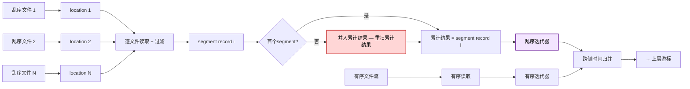
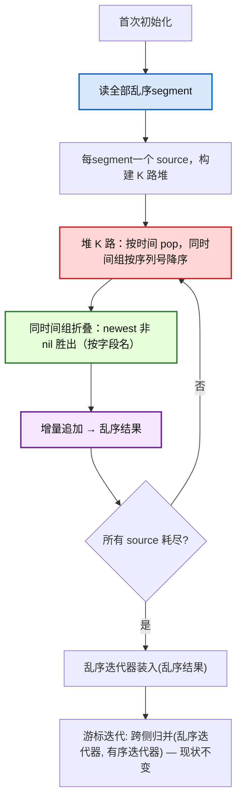
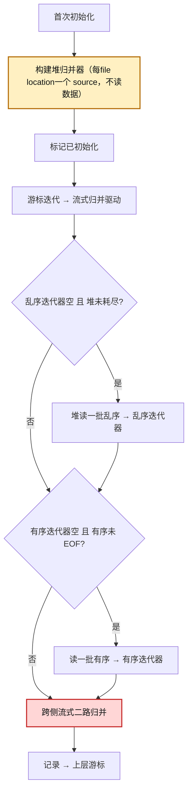

# tsmMergeCursor 乱序合并优化：方案设计

> 本文档从**纯方案设计**角度描述 openGemini 乱序合并查询的优化，**聚焦 Step 1**（堆式 K 路归并替换链式
> 累计合并），Step 2（流式归并 + 跨侧 driver）作为未来演进计划，单列于末章（§11）分析。不含任何具体实现
> 细节（函数名、文件名、结构体字段、实现状态等），仅作为设计与评审依据。

---

## 目录

1. [背景与问题](#1-背景与问题)
2. [数据布局与不变式](#2-数据布局与不变式)
3. [方案总览（聚焦 Step 1）](#3-方案总览聚焦-step-1)
4. [Step 1：堆式 K 路归并（全加载）](#4-step-1堆式-k-路归并全加载)
5. [辅助设计](#5-辅助设计)
6. [流程图](#6-流程图)
7. [正确性验证策略](#7-正确性验证策略)
8. [查询路径覆盖矩阵](#8-查询路径覆盖矩阵)
9. [风险与缓解](#9-风险与缓解)
10. [端到端压测方案](#10-端到端压测方案)
11. [Step 2 演进分析：流式归并 + 跨侧 driver（含其他相关演进）](#11-step-2-演进分析流式归并--跨侧-driver含其他相关演进)

---

## 1. 背景与问题

openGemini 是云原生分布式时序数据库，采用 LSM 存储引擎。写入数据按时间戳分为**有序（ordered）**与
**乱序（out-of-order）**两类，分别落盘为不同的只读数据文件。本文按**同一 series** 粒度讨论查询合并：
查询时需要将该 series 命中的有序与乱序数据合并后按时间有序返回。

### 1.1 现状路径与瓶颈

非聚合查询的乱序合并发生在游标首次初始化阶段：把所有命中的乱序数据**一次性读空**，通过**链式累计合并**
逐步折叠成完整的乱序结果记录，再与有序数据做时间归并输出。问题：

1. **CPU 浪费**：链式合并“读一个segment，就与累计结果合并一次”，每次重扫/重拷**累计**结果，复杂度 `O(N²·R)`
   （N 个乱序文件、每文件 R 行）。
2. **GC 压力**：`O(N²R)` 不只是 CPU——它本质是一个**分配模式**（见 §4.4），每次合并新分配一个与累计
   结果等大的中间记录、旧记录沦为垃圾，GC 抖动严重。
3. **峰值内存**：累计结果持有全部乱序行直到被上层消费完。

问题信号通常首先体现在查询 trace 的乱序处理耗时异常偏高。上层游标组首次初始化会触发多个 series 的
首次初始化，使该开销集中爆发。

### 1.2 链式合并的 `O(N²R)` 来源

每次把第 k 个乱序segment并入累计结果时，需扫描累计结果（约 `k·R` 行）与新segment（R 行）。k=1..N 求和，总工作量
`O(N²·R·F)`（F = 字段数）。累计结果自始至终持有全部乱序行。



### 1.3 核心收益场景

线上典型放大场景：字段值很大（KB 级 string）+ 乱序文件多 + 乱序文件间segment时间范围高重叠但 timestamp 不大量
重复 + 全局多segment、单文件 1–2 segment。此场景下链式合并频繁进入相交分支，反复重拷贝累计结果中的 KB 级 string，
耗时与分配/GC 被显著放大。

---

## 2. 数据布局与不变式

### 2.1 flush 切分语义

写路径在 flush 前按时间排序，flush 时按已落盘高水位 `flushTime`（该 series 已落盘数据的全局最大时间）切分：
`time > flushTime → ordered`，`time <= flushTime → unordered`。`flushTime` 由 ordered 与 unordered 写入
**共同抬升**。

- **单次 flush 内**：ordered 与 unordered 在 `flushTime` 处严格不相交（局部性质）。
- **跨多次 flush**：局部不相交**不蕴含**“所有 unordered 早于所有 ordered”。

### 2.2 跨 flush 的范围重叠

典型近期乱序：先落盘 ordered `[130, 150]`（高水位抬到 150），迟到点 `140` 到达，`140 <= 150` → 进入
unordered。ordered 范围 `[130, 150]` **包含 140**，两侧时间范围重叠。这是**正常的近期乱序**（迟到点落在
已写窗口内），并非异常。同一 timestamp 也可能跨侧出现（早期 flush 进 ordered、晚期 flush 进 unordered）。

> **对 Step 1 的影响**：Step 1 **不改动跨侧归并**（仍用现状的“完整乱序结果 + 有序”跨侧时间归并），因此对
> ordered/unordered 是否重叠**完全免疫**——重叠由现状跨侧归并处理，与今天一致。§2.2 的重叠分析是 Step 2
> 跨侧流式归并的前提（见 §11），Step 1 不涉及。

### 2.3 文件级前提

| 关系 | 性质 | 处理 |
|---|---|---|
| ordered 文件之间 | 按序列号全局有序，无重叠无重复 | 单调流，作为单个有序源 |
| unordered 文件之间 | 无全局顺序，可能交错/重叠/重复 | K 路归并去重（Step 1 的堆） |
| unordered ↔ ordered | 可能交错/重叠 | 现状跨侧时间归并（Step 1 不变） |

### 2.4 同 timestamp 覆盖语义

- **unordered 内部**：同 timestamp 跨多个 unordered 文件时，**文件序列号越大 = 写入越晚 = 越新**，newest
  非 nil 胜出。现状链式合并：乱序 location按序列号升序排序，故最后处理的segment = 最高序列号 = 作为“新记录”并入 =
  胜出。堆式以序列号降序做同时间组 tie-break，语义等价。
- **跨侧**：同 timestamp 的 unordered 副本必然比 ordered 副本写入更晚（若 ordered 更晚，则当时高水位
  已 `≥ t`，`t` 不可能进 ordered，矛盾），故 unordered 胜出。与现状跨侧归并（unordered 作为新记录、ordered
  作为旧记录）一致。跨侧覆盖在 Step 1 中由现状跨侧归并处理，不变。

#### 2.4.1 compaction / 序列号语义

后台乱序合并重写文件产生新序列号，需保证“序列号越大 = 越新”不被破坏：合并文件落盘前已按 newest-wins
折叠同 timestamp 行，故高序列号正确代表“取代之”；乱序→有序提升同理。需用 compaction 后真实文件差分验证
（§7）；若序列号倒挂，则同 timestamp 覆盖须改按行级写入版本号，或回退现状。

---

## 3. 方案总览（聚焦 Step 1）

本方案聚焦 **Step 1**：用堆式 K 路归并替换乱序内部的链式累计合并，仍全量加载、下游跨侧归并不变，并支持
limit-cut。Step 2（流式 + 跨侧 driver，降峰值内存）作为未来演进，见 §11。

| 维度 | 现状 | Step 1（本方案） |
|---|---|---|
| 乱序内部合并 | 链式 `O(N²R)` | 堆 `O(M·logK)` ✅ |
| 分配/GC | `O(N²R)` | `O(M)` ✅ |
| 峰值 live 内存 | ~2M | ~M–2M（持平） |
| 跨侧归并 | 现状跨侧时间归并 | **不变**（低风险） |
| 改动面 | — | 乱序内部合并循环 |
| 正确性新增风险 | — | 仅堆折叠语义（可差分） |

**依据**：现状 `O(N²R)` 同时是 CPU 浪费和 GC 压力的根（同一分配模式，§4.4）。Step 1 以最低风险（只改一个
合并循环、跨侧不动）先吃掉 CPU 与 GC 两块大头。

**预期校准**：Step 1 **不降峰值内存**。若生产瓶颈是 GC 抖动/总耗时，Step 1 足够；若瓶颈是峰值内存 OOM，
才需 Step 2（§11）。

---

## 4. Step 1：堆式 K 路归并（全加载）

### 4.1 改什么 / 不改什么

**改**：游标首次初始化里乱序内部的合并算法——把“逐segment读 + 链式并入累计结果”换成“读全部乱序segment + 堆 K 路归并
成同一个乱序结果记录”。

**不改**：
- 仍全量加载乱序、仍构造完整乱序结果记录。
- 游标迭代里的“乱序结果 + 有序”跨侧时间归并**完全不动**——照旧用现状逻辑。

改动面 = 一个合并循环。下游零改动。

### 4.2 算法

1. 读全部命中的乱序 location的全部segment（每segment一个记录），收集为堆的 source 集合。
2. K 路堆：以各 source 当前行时间为键（升序取最小、降序取最大）；同时间按文件序列号降序（最新者先出）。
3. 同时间组折叠：弹出所有当前行时间相同的 source，按 newest→oldest 折叠，每列取最新非 nil 值，**按字段名
   对齐**，只输出一行。
4. 折叠结果增量追加到乱序结果记录，直到所有 source 耗尽。
5. 乱序结果记录喂入乱序迭代器，下游跨侧归并照旧。

**关键粒度选择**：每个**segment**（而非每个file location）作为一个堆 source，全部segment同时活跃。这使得同 timestamp
跨segment（无论同文件不同文件）的行天然分到同一组折叠，**无需跨segment追平**（Step 2 用file location粒度 source 才需要
追平，§11.4）。

### 4.3 CPU 分析

**核心视角：单个 field value 被拷贝的次数。**

链式与堆式的根本区别在于：一个 field value 在合并过程中被**重复拷贝**多少次。

**链式 `O(N²·R·F)`——每个 field value 平均拷贝 N/2 次：**

链式合并每一轮都新分配一个"合并结果"记录，将旧累计结果与新 segment 逐行合并拷贝进去。考虑某个 field value V
（在第 k 个 segment 中）：

- 第 k 次 merge：V 从 segment k 拷贝进累计结果（第 1 次拷贝）。
- 第 k+1 次 merge：累计结果重建，V 从旧累计结果拷贝到新累计结果（第 2 次拷贝）。
- ……第 N 次 merge：V 再次被拷贝。

故 V 被拷贝 **(N − k + 1) 次**。第 1 个 segment 的 V 拷贝 N 次，第 N 个的拷贝 1 次，平均 **N/2 次**。

总 field value 数 = N·R·F，平均拷贝 N/2 次 → 总拷贝量 = `O(N²·R·F)`。

**堆式 `O(M·(log K + F))`——每个 field value 拷贝 1 次：**

V 从源 segment 被 pop 出后，直接 append 到最终乱序结果记录，**不再被重拷**。总 field value 数 = M·F = N·R·F，
每个拷贝 1 次 → field value 拷贝量 = `O(N·R·F)`。此外每行 pop/push 的堆管理开销为 `O(log K)`，总计
`O(M·(log K + F))` = `O(N·R·(log N + F))`。

**加速比：**

```
T_chain       N²·R·F       N
─────── = ───────── = ───────
T_heap    N·R·(logN+F)   logN + F
```

- **F >> log N**（字段多）：加速比 ≈ N（纯重拷消除，堆的 log K 开销被淹没）。
- **F << log N**（字段少）：加速比 ≈ N·F/log N（堆的 log K 开销占比更大，加速比被压缩）。
- N=100、F=5 时加速比 ≈ 100/(7+5) ≈ 8×；N=1000、F=5 时 ≈ 1000/(10+5) ≈ 67×。实测因堆的逐行常数开销
  （cache 局部性差）更小，但发散趋势一致。

**大 string 场景的额外维度 S：**

当 field value 很大（如 5KB string），每次拷贝的代价是 S 字节的内存拷贝。链式拷贝 N/2 次 → 每个 S 字节值被
反复拷贝 `N/2 × S`；堆式拷贝 1 次 → `S`。更完整的公式：

- 链式：`O(N²·R·(F + S))` — 每行做 F 次列操作 + S 字节拷贝，重复 N²·R 次。
- 堆式：`O(M·(log K + F + S))` — 每行做 log K 堆操作 + F 次列操作 + S 字节拷贝，只 M 次。

F 是列迭代开销（字段数），S 是数据拷贝开销（字段字节数），两者是独立的放大轴。本文用 F 做列数维度的复杂度
分析；S 的影响由压测矩阵的 string-size 维度（1–9KB）单独验证。

**链式两分支与 crossover：**

链式的 `MergeRecord` 按时间范围分两个分支，常数不同：

| 分支 | 触发 | 实现 | 常数 |
|---|---|---|---|
| **不相交** | 新 segment 与累计结果时间不相交 | 整 segment 批量拷贝 | 低 |
| **相交** | 时间相交 | 逐行双指针 + 列级 nil 合并 | 高（~2–3× 不相交） |

两者都是 `O(N²·R·F)`（累计重拷）。堆式无重拷，但常数更高（堆指针跳转 + 逐行列合并，cache 局部性差）。
相交度影响堆式的**常数**（同时间组越大 churn 越多）但不改大 O。因此 crossover（堆反超链式的 N*）随数据
重叠度变化：不重叠时 ~N=100（链式走低常数不相交分支，堆需较大 N 才反超）；全重叠时 >N=100（链式走高常数
相交分支，堆更早反超）。

### 4.4 GC 理论分析（关键）

现状 `O(N²R)` 不只是 CPU，本质是**分配模式**。链式合并的每一轮（除首segment）都新分配一个“合并结果”记录，其
各列数据与累计结果等大（约 `k·R` 行），同时上一轮的累计结果（约 `(k-1)·R` 行）整体沦为垃圾。N 轮下来：

- 总分配量 ≈ R + 2R + … + N·R = `O(N²·R)` 字节
- 总回收量 ≈ 同量

读取缓冲虽可池化，但不断增长的累计结果（合并的接收方，因 schema 追加约束无法池化）是垃圾主力。**GC 压力
与 CPU 同阶，都是 `O(N²R)`**——这是乱序处理耗时偏高同时 GC 抖动的根因。

堆式归并：
- 乱序结果记录**只分配一次**，由堆 pop 出的行增量追加，最终 `O(M)`。
- 各输入segment每segment只读一次（`O(M)`），可边消费边释放。

**总分配 `O(N²R)` → `O(M)`**，与 CPU 同因子下降。这是结构性必然，非小修小补。

### 4.5 输出预分配

堆式逐行追加构造乱序结果记录时，各列的底层数组从 0 增长到 `M·S`（S = 每行字段字节数）。运行时对**大数组**
的追加增长系数收敛到约 1.25×（非 2×），故累计分配量 ≈ **~6× 最终大小**，使堆式的实际分配远高于理论
`1·M·S`。

缓解：合并前按输入总量**一次性预留**乱序结果各列容量（按各 source 列数据总长度、按总行数 M 预留偏移/位图），
之后逐行追加不再触发扩容 → 累计分配 ≈ `1·M·S`（即结果记录最终大小）。输出有去重时（同 timestamp 折叠）
预留容量会富余，但仍只 1 次分配、无扩容开销。此优化把堆式分配从 ~6·M·S 降到 ~1·M·S，进一步拉开与链式的
差距。

### 4.6 峰值 live 内存分析

- 现状峰值：最后一次链式合并期间，旧累计结果（~M）+ 新合并结果（~M）+ 当前segment同时存活 ≈ **2M**。
- Step 1 峰值：全部segment（M）+ 乱序结果（增长到 M）。若segment消费完即释放，任意时刻 `乱序结果 + 剩余segment ≈ M`
  （守恒），峰值 **~M**；若不释放，~2M。

结论：**Step 1 峰值内存不高于现状（~2M），可做到 ~M**。不退化，但也不降峰值——降峰值是 Step 2（§11）的目标。

### 4.7 正确性：与现状逐行等价

Step 1 选“每segment一个 source、全部活跃”的粒度，**自然复刻**现状链式合并的逐行语义：

- **segment内重复 timestamp**（一个segment里两行同 `t`）：堆分两次 pop 该 source → 输出多行。现状链式对segment内重复也
  保留多行。一致。
- **跨segment重复 timestamp**（两segment各有 `t`）：堆把两 source 同组折叠 → 一行。现状链式把后segment并入含前segment `t` 的
  累计结果 → 折叠为一行。一致。
- **同 timestamp 覆盖优先级**：堆按序列号降序 newest 胜出；现状按序列号升序处理、最后处理 = 最高序列号
  = 作为新记录胜出（§2.4）。一致。
- **跨侧**：跨侧归并照旧，零改动。

故只要堆折叠语义（序列号降序、按字段名）与链式合并一致，**Step 1 产出的乱序结果与现状逐行相同**，下游
跨侧归并输出逐行相同。以现状为 oracle 的差分测试即可守卫。

> **segment内重复 timestamp 的边界**：当“segment内重复”与“跨segment同 timestamp”同时存在时，链式合并按“每segment一条链记录”
> 折叠跨segment、保留segment内，其跨segment折叠落在哪个segment内重复行上由二分搜索定位决定，属实现 artifact。堆式的确定性同
> 时间组无法逐字节复现该 artifact。故当检测到**segment内重复 timestamp** 时，回退链式合并以保证逐字节一致；
> 无segment内重复时两者逐行一致（差分测试守卫）。

### 4.8 不变式

1. **每segment一个 source、全部活跃**：保证同 timestamp 跨segment行天然同组折叠，无需跨segment追平。
2. **堆键 = 当前行时间**；序列号只用于同 timestamp 覆盖优先级，不作归并顺序。
3. **同时间组完整收齐**：输出 `t` 前弹出所有当前行 == `t` 的 source。
4. **按字段名归并**：对 schema 演进/字段过滤/子 schema 鲁棒。读路径按查询 schema 解码并补齐缺失字段为
   nil，常见情况退化为按下标；运行时检测到无法按名归并则回退现状。
5. **终止**：所有 source 耗尽 → 乱序结果完成。无死循环。
6. **中断**：合并循环顶检查中断，丢弃半成品。

### 4.9 风险与边界

- **小 N 退化**：堆有 `logK` + 逐行追加常数开销，小 N 可能慢于链式。保留小 N 阈值路由到现状。
- **堆折叠语义对齐**：必须差分覆盖segment内重复、跨segment重复、跨文件同 timestamp、nil 列互补、字段缺失。
- **全加载内存下限**：极大乱序集合下峰值不降（仍 ~M–2M）。OOM 风险需 Step 2（§11）。

### 4.10 limit-cut 支持

limit-cut（按 limit 取最早 `limit+offset` 行）查询走非聚合路径，其 `limitFirstTime` 在首次初始化**之前**由
文件元数据算好（不依赖读数据），用于裁剪命中的location 集合。Step 1 的堆归并产出完整的、按时间有序的乱序结果
记录，limit-cut 在其上取最早行即可——堆只加速乱序结果构造，不改变 limit-cut 的取行语义与结果。故 **Step 1
支持 limit-cut**（取行结果与现状一致，乱序合并更快）。需补 limit-cut 差分测试（limit-cut + 多乱序文件 +
升降序）。

---

## 5. 辅助设计

### 5.1 内存复用

首次初始化循环里的读取缓冲从环形池复用。**关键约束**：合并结果的 schema 是输入 schema 的并集（向结果
追加），故池化的记录只能作合并的只读参数，不能作接收方；合并中间结果独立构造。游标复位先释放迭代器对池
记录的引用再归还池。

### 5.2 观测指标

trace 计数（幂等创建）：

- **乱序 location数**：放大因子 K。
- **链式合并次数**：现状路径的链式合并迭代次数。
- **优化路径命中 / 回退计数（分项）**：小 N 阈值、查询形状、segment内重复回退、差分失败分别计数。

### 5.3 游标复用生命周期

游标复用给新 series 时，必须重置“已初始化”标志与堆归并器引用，使新 series 重新跑首次初始化。否则：堆
归并器残留源排进新 series 输出 → 跨 series 数据错乱；或现状路径跳过首次初始化 → 新 series 乱序不读。

---

## 6. 流程图

### 6.1 Step 1：首次初始化合并循环替换



### 6.2 现状 vs Step 1


- 旧：逐segment读 + 链式累计拷贝 `O(N²R)`，乱序结果 = 全部乱序。
- 新：堆 K 路归并 `O(M·logK)`，每segment一个 source；乱序结果一次性增量构建。下游跨侧归并不变。

---

## 7. 正确性验证策略

以现状路径为 oracle，逐行比较 `(time, value, isNil)`。

### 7.1 差分测试

- **固定 edge case**：仅有序、仅乱序、乱序间同时间高序列号覆盖、nil 列由旧源填补、多有序文件。
- **大量随机用例**：多有序/乱序文件、含 nil、升序与降序各一套。
- **同 timestamp 完整性（准入门禁）**：
  - segment内重复 timestamp → 多行输出，与现状一致；
  - 跨segment重复 timestamp（同文件相邻segment边界两侧同 `t`）→ 同组折叠为一行，与现状一致（Step 1 每segment一 source，
    天然同组，无需追平）；
  - 跨文件同 timestamp → 折叠为一行。
- **schema 对齐**：字段缺失、不同字段集合、字段过滤后子 schema、schema 演进（旧文件缺新字段）→ 按字段名
  归并与现状一致。
- **compaction 后用例**：经乱序合并 / 乱序→有序提升后的真实文件，验证序列号仍代表 recency。不通过则回退。

### 7.2 覆盖场景清单

仅有序、仅乱序、乱序间同时间高序列号覆盖、nil 列互补、segment内重复 timestamp 多行、跨segment重复 timestamp 折叠、
跨文件同 timestamp、跨侧同 timestamp、字段按名归齐、跨侧时间交错/重叠、compaction 后序列号语义、乱序跨
多个有序文件、多segment逐segment读取、升序与降序。

---

## 8. 查询路径覆盖矩阵

| 路径 | 触发条件 | 乱序读取方式 | Step 1 覆盖? |
|---|---|---|---|
| TS 非聚合升序 | 默认 | 堆归并（全加载） | ✅ |
| 降序非聚合 | 降序 | 同上（方向参数不同） | ✅ |
| limit-cut 非聚合 | limit-cut | 堆归并（全加载）+ limit-cut 裁剪 | ✅（§4.10） |
| Prom 查询 | Prom | 现状 | ❌ |
| 聚合 | 有聚合算子 | pre-agg 元数据 | ❌ |
| fileCursor 聚合 | fileCursor + 可优化聚合 | 现状全量 drain | ❌（§11.9） |
| 列存 CS/hybrid | 列存 | 独立 reader | 不考虑 |
| 小 N | K < 阈值 | 现状 | 设计回退 |
| 近期乱序跨侧重叠 | 有序↔乱序交错 | 跨侧归并（不变） | ✅ |

---

## 9. 风险与缓解

### 9.1 堆折叠语义对齐

堆同时间组覆盖（序列号降序 newest 胜出、按字段名）必须与链式合并逐行等价。差分测试覆盖segment内/跨segment/跨文件
同 timestamp、nil 互补、字段缺失。不通过则回退现状。

### 9.2 schema 对齐

按字段名归并，对 schema 演进/字段过滤/子 schema 鲁棒；运行时检测无法按名归并则回退现状。

### 9.3 全加载内存下限

极大乱序集合下峰值不降（~M–2M）。OOM 风险需 Step 2（§11）。

### 9.4 单segment不相交盲区

单segment不相交乱序文件下堆持 K segment = M，峰值无收益（§4.6）。Step 1 持平现状；根本解决需时间簇增量准入（§11.9）。

### 9.5 游标复用

重置初始化标志与堆归并器引用，否则跨 series 数据错乱（§5.3）。

### 9.6 文件内时间单调前提

堆逐segment读，依赖file location内部按时间推进。memtable 落盘前按时间排序，segment时间范围按segment位置单调有序。需真实落盘
文件 + 多segment差分验证。

---

## 10. 端到端压测方案

### 10.1 环境

单机 standalone，固定硬件。关键配置控制 N（乱序文件数）并冻结 compaction（性能矩阵）；compaction 后正确性
用例另起一套，放开乱序合并/compaction 跑出合并/提升后的文件再测：

| 配置 | 取值 | 作用 |
|---|---|---|
| memtable 大小上限 | 小（1MB） | 每批次写入即 flush |
| write-cold-duration | 短（1s） | 加速 flush |
| max-unordered-file-number | 大（2000） | 抑制合并（性能矩阵） |
| max-concurrent-compactions | 0 | 关闭 compaction（性能矩阵） |
| max-rows-per-segment | 可调 | 控制 R |

### 10.2 数据模型与写入

- **有序区**：S series × T 点，升序写入 `[t0, t0+T)`。
- **乱序区**：N 批次，每批次 R 行/series，每批次 flush = 1 乱序文件。
- **乱序相对有序的时间关系**：
  - **近期乱序（范围重叠/交错）**：乱序时间落在有序窗口内（如有序=[130,150]、乱序=[140]）。
  - **回填式（disjoint）**：乱序时间早于所有有序。
  - **同 timestamp 跨侧**：同一 timestamp 同时存在于有序与乱序。
- **重复 timestamp 布局（准入门禁）**：构造同一 series 同 timestamp 多行（写路径不去重）：
  - **segment内重复**：同 timestamp 多行落入同一segment → 多行输出；
  - **跨segment重复**：调 `max-rows-per-segment` 使同 timestamp 多行被segment边界拆开 → 折叠为一行。
- **乱序文件间重叠度**：no-overlap / partial / full。full-overlap 拆：范围重叠但 timestamp 不重复（大 string
  核心场景）/ timestamp 大量重复（fallback 验证）。
- **大 field 场景**：KB 级 string（1KB/4KB/16KB），单文件 1–2 segment，全局多segment。
- 变量：N∈{1,10,32,64,100,200,500,1000}、R∈{20,100,1000}、S∈{1,100,10000}、F∈{1,5,20}。

### 10.3 查询负载

- 主查询：非聚合升序/降序全范围 `SELECT * ...`。
- 回归：聚合、limit-cut、Prom。

### 10.4 指标

总耗时 p50/p95/p99、峰值堆（pprof + RSS）、**分配量 B/op**、GC 次数与 pause、CPU profile、磁盘 I/O、trace
计数。重点观察乱序处理耗时、乱序 location数、命中/回退比例。开关 on/off 对照。

> Step 1 的核心观测是 **B/op 与 GC pause**（分配 `O(N²R)→O(M)` 的验证），而非峰值堆（持平）。

### 10.5 预期

| 场景 | Step 1 预期 |
|---|---|
| N=1000, 近期乱序范围重叠, 升序/降序 | 总耗时 ↓；B/op 大幅 ↓；GC ↓；峰值堆持平；结果一致 |
| N=1000, 回填式 disjoint | 同上 |
| 大 string + 多乱序 + 范围高重叠但数据不重复 + 单文件 1–2 segment | 乱序耗时 ↓；B/op/GC 明显 ↓；峰值堆持平 |
| segment内/跨segment重复 timestamp | 结果与开关 off 逐行一致 |
| 同 timestamp 跨侧 | 结果一致（乱序胜出） |
| compaction 后文件 | 结果逐行一致；序列号语义保持 |
| N=100 | 持平 |
| N<阈值 | 走现状不退化 |
| timestamp 大量重复 full-overlap | 常数可能劣化，小 N 阈值/差分守护 |
| 聚合/limit-cut/Prom | 开关 on 与 off 一致，走现状 |

### 10.6 小 N 阈值校准

阈值只按命中乱序 location数 K 决策，不能感知 field 大小、segment数、重叠度或方向。“最佳值”是生产 workload 加权后的
保守阈值：小 K 不退化，核心大 string 场景尽早走优化。

#### 11.6.1 方法

先强制现状/优化各跑完整矩阵，再离线推导阈值：

1. 现状 baseline：关闭优化。
2. 优化 baseline：开启优化，阈值置 0，强制所有非聚合 TS 查询走优化。
3. 每个 case 记录 K、首包延迟、总耗时、B/op、峰值内存、GC、优化路径是否命中。
4. 离线模拟候选阈值 T：`K < T` 用现状，`K >= T` 用优化。
5. 用生产 K 分布和慢查询权重加权，选收益最大且小 K 不退化的 T。

#### 11.6.2 K 与候选阈值

| 类型 | 取值 |
|---|---|
| K 矩阵 | 0, 1, 2, 4, 8, 16, 24, 32, 48, 64, 96, 128, 192, 256, 512, 1024 |
| 候选阈值 | 0, 16, 32, 48, 64, 96, 128, 192, 256, disabled |

`0` 表示总是优化；`disabled` 表示总是现状。默认值优先从 `32/64/96/128` 中选。

#### 11.6.3 场景矩阵

| 维度 | 取值 |
|---|---|
| field 类型 | int-only、small string、1KB string、4KB string、16KB string |
| field 数 | 1、5、20 |
| 每文件行数 R | 20、100、1000 |
| 单文件segment数 | 1、2、8 |
| 乱序范围关系 | no-overlap、partial-overlap、range full-overlap 但 timestamp 不重复、timestamp 大量重复 |
| 相对有序的时间关系 | 近期乱序范围重叠/交错、回填式 disjoint、相同 timestamp 跨侧 |
| 查询方向 | asc、desc |
| 查询范围 | 全范围、只命中部分乱序 |
| nil 情况 | 无 nil、稀疏 nil、同 timestamp 字段互补 |

核心场景单独加权，不被 int-only microbenchmark 稀释：

```text
大 string + K 大 + 范围高重叠但 timestamp 不大量重复 + 全局多segment + 单文件 1-2 segment
```

#### 11.6.4 指标与判定

每个 case 记录：首包延迟 p50/p95/p99、总耗时 p50/p95/p99、`B/op`、`allocs/op`、peak heap/RSS、GC 次数与
pause、乱序处理耗时、乱序 location数、命中/回退。

对每个 K 计算：

```text
first_packet_ratio = opt_first_packet_p95 / baseline_first_packet_p95
total_ratio        = opt_total_p95 / baseline_total_p95
alloc_ratio        = opt_alloc_bytes / baseline_alloc_bytes
peak_ratio         = opt_peak_heap / baseline_peak_heap
```

判定规则：

```text
opt_win:
  total_ratio <= 0.95 且 first_packet_ratio <= 1.00 且 peak_ratio <= 1.10
opt_not_regress:
  total_ratio <= 1.03 且 first_packet_ratio <= 1.05 且 peak_ratio <= 1.15
K_cross = 最小 K，使优化在该 K 及后续连续 2 个 K 点都满足 opt_not_regress
```

> Step 1 的判定侧重 `alloc_ratio`（核心收益）；`peak_ratio` 预期 ~1.0（持平），不作为 Step 1 的收益指标，
> 但作为不退化 guardrail。

#### 11.6.5 生产加权与推荐值

上线前采集 3–7 天生产分布：乱序 location数 P50/P75/P90/P95/P99、乱序处理耗时按 K 贡献占比、查询方向/field 类型/
返回行数/时间范围、慢查询中 K 与大 string 相关性、命中/回退占比。

离线评分：

```text
score(T) = Σ workload_weight(case) * latency_p95(case, T)
         + regression_penalty(T) + memory_penalty(T)
```

推荐阈值：对 guardrail 场景取满足 `opt_not_regress` 的最大 `K_cross`；若错过核心大 string 慢查询收益，用
`score(T)` 修正；向上取整到 `32/64/96/128` 之一。

---

## 11. Step 2 演进分析：流式归并 + 跨侧 driver（含其他相关演进）

> Step 2 是 Step 1 之后的**未来演进**，目标是降低峰值 live 内存（Step 1 不降峰值）。它建立在 Step 1 的堆
> 归并之上，新增流式产出与跨侧流式归并。本章给出其方案分析与陈述，供后续评估；不在当前实施范围。其他相关
> 未来演进（fileCursor、location 预过滤、后台合并、时间簇）一并归入本章末尾（§11.9）。

### 11.1 动机

Step 1 仍全量加载乱序，峰值 live 内存 ~M。若生产瓶颈是峰值内存 OOM，需要不全加载：把乱序堆按批次行上限
流式吐、与有序经跨侧流式归并，使 live 数据从“全部乱序（~M）”降到“K 个当前segment + 输出批次（~K·segment + batch）”。

### 11.2 算法

- 乱序内部仍用 Step 1 的堆，但 source 粒度改为**每个file location**（segment逐segment读，不全加载），按批次行上限分批
  产出。
- 跨侧：维护乱序迭代器（堆喂入）与有序迭代器（有序读取），每次游标迭代两侧按需补入一批，跨侧归并流式
  二路归并产出 ≤ 批次行上限行。
- 跨侧归并的三分支（整体在前/在后/重叠）正确处理交错、重叠、同 timestamp 跨侧（§2.4）。

### 11.3 跨侧 driver 状态机

driver 必须显式处理两侧 EOF、补读失败、过滤后空批、以及跨侧归并返回空但两侧未 EOF 的推进，避免死循环或
提前单侧输出：

```
状态：乱序耗尽(uExh)、有序 EOF(oExh)、两侧迭代器 有剩余/空

每次迭代:
  if 中断: return nil
  loop:
    if 乱序迭代器空 且 not uExh:
        rec = 堆产出下一批(批次行上限)        # 可能过滤/全 nil 返回 nil
        if rec != nil: 乱序迭代器装入(rec) else uExh = true
    if 有序迭代器空 且 not oExh:
        rec = 读一批有序
        if rec != nil: 有序迭代器装入(rec) else oExh = true
    if 乱序迭代器空 且 有序迭代器空: return nil
    out = 跨侧归并(乱序迭代器, 有序迭代器, 批次行上限, 方向)
    if out != nil 且 out 行数 > 0: return out
    # 兜底：out 空但某侧有剩余（仅批次行上限<=0 退化情形）→ 回 loop 推进，绝不直接单侧吐出
```

不变式：跨侧归并的非空性（任侧有剩余必产出非空）；无死循环（状态向 EOF 单调收敛）；**不提前单侧输出**
（硬约束，否则跨侧同 timestamp 丢失合并）；过滤后空批按“该segment无有效行”处理不当作整侧 EOF；补读失败向上
透传。

### 11.4 正确性不变式（Step 2 新增）

Step 2 用file location粒度 source（segment逐segment读），相比 Step 1 新增以下闭环：

1. **同一 source 跨segment同 timestamp 追平**：写路径不按 (series, timestamp) 去重，重复 timestamp 可能被segment
   边界拆开。现状链式按“每segment一条链记录”跨segment折叠、segment内保留；Step 2 堆须精确匹配——源segment尾输出 `t` 后若
   下一segment首行仍 `t`，必须把该源重新并入当前同时间组继续折叠（跨segment追平），而非另起一组输出第二行。未通过
   差分测试 → 回退现状。（Step 1 用每segment一 source，天然无此问题。）
2. **跨侧流式归并正确**：跨侧归并不在一侧未追上时提前吐另一侧行；同 timestamp 跨侧由两侧在场时按 §2.4
   合并。
3. **同 timestamp 完整合并**：跨segment追平（上）+ 跨侧收齐（状态机）+ 不被批次行上限拆开。
4. **字段按名归并**：同 Step 1。
5. **终止/中断**：两侧 EOF → 跨侧归并返回空 → 结束；中断丢半成品。

> **与现状的等价性（条件性）**：在 (a) 堆同时间组覆盖语义等价、(b) 跨侧覆盖按 §2.4（含 compaction 后序列号
> 语义）、(c) 跨segment追平正确、(d) 字段按名归并 四条件全满足时，Step 2 输出与现状逐行一致。任一不满足/未
> 通过差分测试则回退现状。

### 11.5 灰度 guardrail

已知退化场景（乱序文件间全重叠/大同时间组、单segment高 K、高重复 timestamp）下堆常数升高、crossover 推后、
内存收益消失。Step 2 上线即须内置：kill switch（运行时开关一键关）、小 N 阈值、观测型 guardrail（每个游标
记录 K、同时间组规模 g、g/K 超阈值回退）、分项回退计数。阈值通过对照压测按生产 workload 校准；校准前用
保守阈值（如 g/K > 0.5 即回退）灰度。

### 11.6 备选方案与取舍

| 备选 | 思路 | 取舍 |
|---|---|---|
| **watermark 延迟准入** | 用有序批次时间上界做 watermark，只准入 `≤ watermark` 的乱序 | **否决**：`flushTime` 是全局高水位，乱序并非整体早于有序（§2.2）；watermark 无法正确界定 |
| **两segment式拼接** | 先吐完乱序、再吐有序（或反向） | **否决**：依赖“乱序全部早于有序”的错误前提；近期乱序下错序 + 跨侧重复 |
| **disjoint 准入门 + 回退** | 用文件元数据证明 `乱序最大时间 < 有序最小时间` 才启用两segment式 | **否决**：把正常的近期乱序当异常回退，最常见场景失效；改为跨侧流式归并后无需此门 |
| **首包优先返回有序** | 先返回有序降首包 | **否决**：有序/乱序时间交错，未合并乱序前不能输出有序 |
| **有序并入堆（统一 K+1 路）** | 有序作为额外源并入堆 | 可行但需在堆内重实现跨侧同 timestamp 覆盖、失去跨侧归并的批量分支优化；不采用 |

### 11.7 Step 2 流程图与峰值内存



峰值 live 内存：`K 个当前segment + 输出批次`（≈ `K·segment大小 + batch`），相比 Step 1 的 ~M 显著下降（当 M >> K·segment时）。
单segment不相交文件下仍可能 ≈ M（§9.4 盲区，需时间簇准入 §11.9）。

### 11.8 Step 2 附加差分测试

- **跨侧交错/重叠**：有序=[130,150]、乱序=[140]；同 timestamp 跨侧；迟到点落在已写窗口内。
- **跨segment追平**：file location粒度 source 下，同 timestamp 跨segment必须追平折叠；不通过则回退现状。
- **driver 边界**：两侧 EOF、过滤后空批、补读失败、批次行上限强制分批、中断。

### 11.9 其他相关演进

以下演进与 Step 2 同属未来工作，一并归入本章陈述：

- **fileCursor 聚合路径**：fileCursor 的“消费一次”模型与堆式归并不同，需重构为 per-sid 流式乱序堆归并 +
  跨侧归并。先做非 pre-agg 子路径，pre-agg 后做。
- **location 预过滤**：location 命中后，若文件元数据的列与查询 schema 无交集或时间不交集，则不加入 location，从源头减少
  无效读取与 per-series×per-file 元数据放大。风险：count(time)/aux/Prom 语义需验证。
- **后台分层/预合并**：乱序文件过多的 shard/measurement 触发后台预合并/分层 compact，从源头降 N。
- **时间簇增量准入**：解决 §9.4 单segment盲区——按时间重叠关系把乱序segment分成不相交簇，逐簇处理，使堆活跃源数从
  K 降到当前簇 C。

  ```
  1. 取所有源中 minT 最小的segment A，初始化 clusterRange = A.时间范围 [t1, t2]
  2. 扫描所有源的下一个未读segment，若时间范围与 [t1, t2] 重叠：
     a. 读入该segment，加入堆
     b. clusterRange = union(clusterRange, segment.时间范围) → 扩展 [t1, t2]
     c. 回到步骤 2
  3. 无新segment重叠 → 簇稳定，堆 K 路归并输出 [t1, t2] 内行
  4. 簇内行输出完 → 回到步骤 1，从下一个未读segment开始新簇
  ```

  | 维度 | 当前（全segment活跃） | 时间簇增量准入 |
  |---|---|---|
  | 活跃源数 | K（全部） | C（当前簇，C << K 当簇小时） |
  | 单segment不相交文件峰值 | K×R = M（无收益） | C×R（大降） |
  | I/O 延迟 | 无 | 有（只读当前簇） |
  | 堆操作 | O(logK) | O(logC) |
  | 簇检测开销 | 无 | O(K²) flood-fill 或 O(K logK) 预排序 |
  | 文件全重叠时 | K 活跃 | 退化成一簇 = K + 额外开销 |

  适用判断：分散不同时间点的乱序（多小簇，收益大）vs 集中同一时段的批量回填（一大簇，无收益）。

- **其他**：配置接入（Step 1/2 开关接查询配置项）；合并器池化（源记录与输出批次进一步池化降分配）。

### 11.10 小结

Step 2 在 Step 1 堆归并基础上加流式产出 + 跨侧 driver，核心收益是**峰值 live 内存从 ~M 降到 ~K·segment**，代价是
引入跨侧状态机、跨segment追平、guardrail 三项复杂度与风险。其前提是 §2.2 的跨侧重叠分析（ordered/unordered
可能交错，必须跨侧流式归并而非拼接）。建议在 Step 1 上线、确认生产瓶颈确为峰值内存 OOM 后再推进 Step 2；
若瓶颈是 GC/总耗时，Step 1 已足够，无需承担 Step 2 的复杂度。其他相关演进（§11.9）可与 Step 2 并行或随后
推进。
