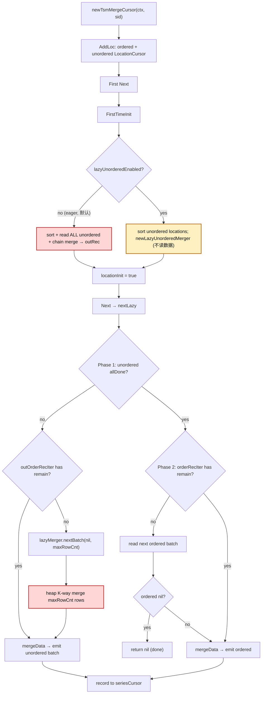
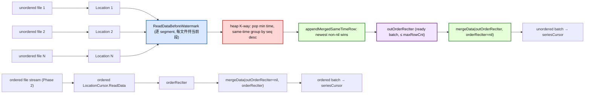
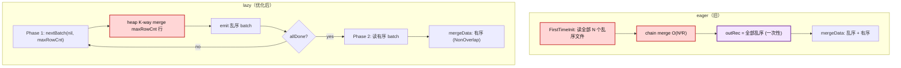
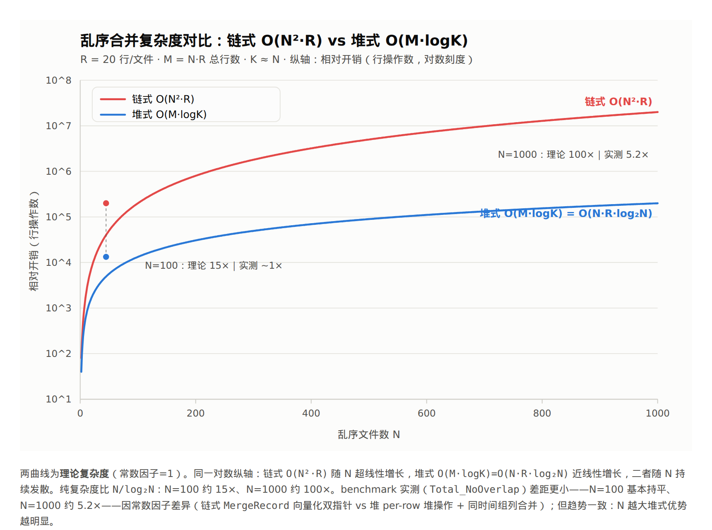
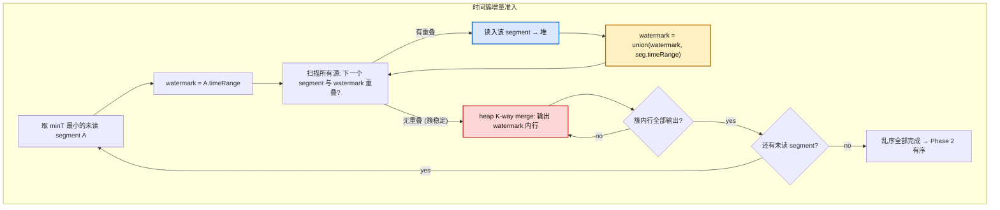
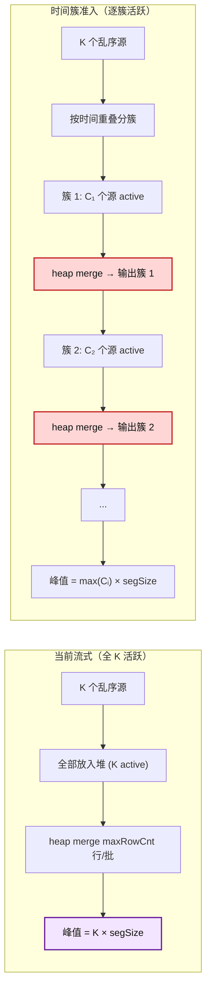

# tsmMergeCursor 乱序合并优化设计

本文档描述 `tsmMergeCursor.FirstTimeInit` 乱序查询路径的优化实现与后续规划。它是
`tsmMergeCursor_FirstTimeInit_unordered_analysis.md`（分析文档）落地后的最终设计，已根据
review、benchmark 和补充分析对目标与方案做了修正。

---

## 1. 背景与目标

优化针对两个明确问题（**不是**首包延迟——查询通常迭代完所有数据才返回，首包不是观测指标）：

1. **内存/GC 压力**：原 `FirstTimeInit` 把所有命中的乱序 location 读空，链式合并成一个完整
   `outRec`。乱序数据多时 `outRec` 巨大，内存峰值高、GC 抖动。
2. **总查询性能差**：原合并是“读一个 record，与累计 outRec 合并一次”的单路链式归并，复杂度
   `O(N²·R)`（N 个乱序文件、每文件 R 行）。乱序文件多时查询明显变慢。

**成功指标**：乱序文件较多的场景下，总查询耗时下降、峰值内存下降；乱序文件少时不退化。

## 2. 问题根因（源码位置）

- `engine/tsm_merge_cursor.go` `FirstTimeInit`：非聚合路径循环 `readData(false, dst)` 直到 EOF，
  每次用 `MergeRecord(rec, outRec)` 链式合并，`outRec = &mergeRecord`。
- `outRec` 被 `outOrderRecIter` 持有，直到 `mergeData` 消耗完。
- `ReInit`/`ReInitWithShard` 不重置 `locationInit`/`lazyMerger`，复用 cursor 时乱序状态残留。

> 注：分析文档曾称 `outRec == nil` 时 `outRec.RowNums()` 会 panic。实际 `record.RowNums` 已对
> `rec == nil` 判空返回 0，**不会 panic**。该“nil guard”修复为误判，已回退（见 §4.1）。

## 3. 方案总览

分两层，均落在 `engine/` 和 `engine/immutable/`：

| 层 | 范围 | 默认 | 状态 |
|---|---|---|---|
| Phase 1 | 观测指标 + dst 复用 | 始终启用 | 已上线 |
| Phase 3 | 惰性堆式 K 路乱序合并 | feature flag，默认关 | 已实现（仅升序非聚合），灰度 |

Phase 3 是核心：用 **watermark-bounded 的堆 K 路合并** 替换“全量预读 + 链式合并”。未实现
Phase 2（schema/field 预过滤）、Phase 4（后台分层合并）、降序与 limit-cut 的 lazy 支持，见 §10。

## 4. Phase 1：安全改进（默认启用）

### 4.1 nil-outRec 路径（无需修复）
当所有乱序 location 被过滤为 nil 时 `outRec` 为 nil。`record.RowNums` 对 `rec == nil` 判空返回 0，
`recordIter.init(nil)` 也安全，因此 span 计数与 `init` 均不会 panic。分析文档关于 panic 的判断有误，
对应的“nil guard”提交已回退。`TestFirstTimeInitEmptyOutOfOrder` 仍覆盖该路径（验证 `Next` 返回 nil
且计数正确）。

### 4.2 观测指标
新增 span 计数（`engine/iterators.go` 常量，`FirstTimeInit` 内 `CreateCounter` 幂等创建）：
- `unordered_location_count`：命中的乱序 location 数（放大因子 K）。
- `unordered_merge_count`：非聚合路径的链式合并次数。

### 4.3 dst 复用
非聚合 `FirstTimeInit` 循环里的 `dst := record.NewRecordBuilder(...)` 改为从 `unorderPool`（环形，
`unorderRecordNum = 2`）获取。**关键约束**：`record.Record.mergeRecordSchema` 向 receiver 的 schema
**追加**，因此池化的 record 只能作为 `MergeRecord` 的 `newRec`/`oldRec` 参数（只读），**不能**作为
receiver。合并 scratch 仍用 `var mergeRecord record.Record`。`reset()` 先 `outOrderRecIter.reset()`
（释放对池槽的引用）再 `unorderPool.Put()`。

## 5. Phase 3：堆式 K 路合并 + 流式分批（flag 灰度）

### 5.1 核心思路

openGemini 的乱序数据比有序数据**更旧**（`SplitRecordByTime` 在 flush 时按已落盘有序最大时间切分：
`time <= flushTime` → 乱序，`> flushTime` → 有序；二者时间不相交）。因此升序查询的输出顺序就是
**乱序(旧) → 有序(新)**，无需交错合并或 watermark 延迟。

基于此，lazy 路径简化为：**用堆 K 路合并乱序文件，按 `maxRowCnt` 流式分批输出，全部乱序输出完
再读有序**。不再有 watermark / `ensureUnorderedReadyUntil` / `nextBatchUntil` 等机制。合并复杂度
`O(M·logK)`（M = N·R 总行数），替换 eager 链式 `O(N²·R)`；输出按 `maxRowCnt` 分批，每批只合并
`maxRowCnt` 行（而非首批全量），降首包延迟与分配峰值。

### 5.2 组件

- `engine/unordered_lazy_merge.go` `lazyUnorderedMerger`：
  - 持有 `sources []*unorderedSource`（每个乱序 location 一个）和 `heap lazyMergerHeap`。
  - `unorderedSource`：`loc`、`seq`（文件序列号，越大越新）、`rec`、`pos`、`done`、`inHeap`。
  - `nextBatch(watermark, maxRows)`：watermark 为 nil（乱序-only，准入全部），按 `maxRows` cap 输出。
    每源只持当前 1 个 segment，耗尽才读下一个 → 堆 live = K × segmentSize。
  - 堆序：当前行时间升序，同时间 `seq` 降序（最新者先 pop）。
  - `appendMergedSameTimeRow`：同时间组按 newest→oldest 折叠，每列取最新非 nil 值，等价于
    `mergeRecRow` 折叠。所有输入 record 共享 `ctx.schema`，按列下标对齐。
  - `isAborted` 回调：合并循环顶检查，abort 时 `return nil, nil`（丢弃半成品）。

- `engine/immutable/location.go` `ReadDataBeforeWatermark(filterOpts, dst, watermark)`：读下一个与查询
  时间范围重叠的 segment，应用 `FilterByTime`/`FilterByField`。lazy 路径传 watermark=maxInt64（不
  延迟），逐 segment 读。另暴露 `Location.HasNext()`、`Location.Sequence()`、
  `LocationCursor.LocationAt(i)`。

- `engine/tsm_merge_cursor.go`：
  - `FirstTimeInit` 惰性分支：排序乱序 locations、`Set` decs、创建 `lazyMerger`，**不读数据**。
  - `nextLazy()` 两阶段：
    - **Phase 1**（乱序流式）：`lazyMerger.nextBatch(nil, maxRowCnt)` 每次产 `maxRowCnt` 行 →
      `outOrderRecIter` → `mergeData` 输出。重复直到 `allDone()`。
    - **Phase 2**（有序）：乱序耗尽后读有序 batch，`mergeData` 输出。有序与乱序 disjoint，
      `mergeData` 走 NonOverlap 批量分支（廉价）。

### 5.3 正确性不变式

1. **Disjoint 布局**：乱序 `time <= flushTime`、有序 `time > flushTime`，不相交。升序输出 =
   乱序(旧) → 有序(新)，Phase 1 全部输出乱序后再 Phase 2 输出有序，顺序正确，无需交错去重。
2. **同时间覆盖（乱序间）**：多个乱序文件同 timestamp 时，堆按 `seq` 降序 pop 同时间组，
   `appendMergedSameTimeRow` newest 非 nil 胜出，与 eager 链式 `MergeRecord(newRec=高seq, oldRec=累计)`
   语义等价。
3. **终止**：堆空且所有源 `done` 时 `nextBatch` 返回 nil；`allDone()` 判定 Phase 1 完成，转 Phase 2；
   有序也读完返回 nil。无死循环。
4. **abort**：`nextBatch` 循环顶检查 `isAborted`，abort 时丢弃半成品返回 nil。

> **前提**：disjoint 布局是 `SplitRecordByTime` 的 flush 语义保证的（正常写）。若乱序与有序时间
> 重叠（非正常场景），Phase 1/2 顺序会错。`lazyUnorderedEnabled()` 限制仅升序非聚合非 limit-cut
> 非 Prom，作为额外保护；降序/limit-cut 的 deferral 见 §10.2/§10.3。

### 5.4 小 N 阈值（防退化）
`lazyUnorderedMergeMinLocations`（默认 64，`atomic.Int32`，`SetLazyUnorderedMergeMinLocations` 可调）：
命中的乱序 location 数低于阈值时回退 eager。benchmark 显示交叉点约 N=100（N=10 惰性慢 2.1×，
N=100 持平，N=1000 惰性快 5.4×）。阈值保证开启 flag **不退化**小 N 常见场景。0 表示禁用阈值（测试用）。

### 5.5 Feature flag 与适用范围
`lazyUnorderedMergeEnabled`（`atomic.Bool`，默认关）：`SetLazyUnorderedMergeEnabled` 运行时切换。
`lazyUnorderedEnabled()` 限制：**仅升序**、非聚合（`len(ops)==0`）、非 limit-cut、非 Prom。其余形状
回退 eager。降序与 limit-cut 的放开见 §10.2/§10.3。

### 5.6 流程图（优化后）

#### 5.6.1 初始化与两阶段迭代



标注：
- eager 分支（默认）保留原 `FirstTimeInit` 全量读 + 链式合并。
- lazy 分支：Phase 1 堆合并乱序按 `maxRowCnt` 流式输出（每批只合并 `maxRowCnt` 行，非全量）；Phase 2
  乱序耗尽后读有序（disjoint，`mergeData` 走 NonOverlap 廉价分支）。

#### 5.6.2 堆式 K 路合并数据流



标注（对比 §4.3 旧路径）：
- 旧：`LocationCursor.ReadData` 读到 EOF，链式 `MergeRecord(rec, outRec)` 累计拷贝 `O(N²R)`，`outRec` = 全部乱序。
- 新：堆 K 路合并 `O(M·logK)`；每源只持当前 segment（多段文件下 K 段 << 全量）；输出按 `maxRowCnt` 分批。
- 乱序与有序 disjoint，Phase 1 全部输出乱序后再 Phase 2 输出有序，无交错。

#### 5.6.3 eager vs lazy 对比（disjoint 真实布局）



标注：
- eager 首批前读完全部乱序、链式合并构造完整 `outRec`（`O(N²R)` + 全量内存）。
- lazy 按 `maxRowCnt` 流式堆合并，首批只合并 `maxRowCnt` 行；乱序全部输出后读有序（disjoint）。
- 见 §8 benchmark：N=1000 总耗时 5.4× 更快、分配量 64× 更少、首包 28× 更快。

## 6. 生命周期：ReInit 修复

`ReInit`/`ReInitWithShard` 复用 cursor 给新 series 时，新增 `c.locationInit = false; c.lazyMerger = nil`，
使新 series 重新跑 `FirstTimeInit` 处理自己的乱序数据。修复两个问题：
- **惰性路径（回归）**：否则 `nextLazy` 会把上一个 series 残留的 stale `lazyMerger` 源（指向已孤立的
  Location）排进新 series 输出 → 跨 series 数据错乱。
- **eager 路径（预存）**：`locationInit` 残留导致 `FirstTimeInit` 被跳过，新 series 乱序数据不读。

## 7. 正确性验证：差分测试

`engine/tsm_merge_cursor_test.go`：以 eager 路径为 oracle，对 lazy 路径逐行比较
`(time, value, isNil)`。
- `TestLazyUnorderedMergeDifferential`：7 个固定 edge case + 3000 个随机用例（1-3 有序文件、1-4 乱序
  文件、文件内时间严格递增、含 nil 值、`maxRowCnt` 1-4 强制分批）。
- `TestLazyUnorderedMergeMultiSegment`：多 segment 文件（`mocTsspFileMultiSeg` +
  `immutable.NewChunkMetaWithSegs`），覆盖 `ReadDataBeforeWatermark` 的 segment 跳过/延迟。
- 覆盖：仅有序、仅乱序（有序耗尽 fallback）、同时间高 seq 覆盖、nil 列由旧源填补、无重叠、小批
  ready-buffer 所有权、乱序跨多个有序 batch。

差分测试覆盖**新增逻辑**（merger、watermark、admission）；文件 I/O/过滤复用 eager 路径未改。
`-race` 通过。**注意**：测试用 mock 的 segment 时间是手工构造的有序序列，未覆盖真实文件的 segment
排序保证，见 §9。

## 8. 性能（benchmark）

`engine/tsm_merge_cursor_bench_test.go`，mock 读（无 I/O，反映 CPU/分配；真实 I/O 节省另算）。阈值
置 0 以测量纯 lazy 路径。数据布局为**真实布局**（乱序旧、有序新，disjoint）。

`BenchmarkRealLayout_Total`（drain 到完成 = 真实查询指标）+ `BenchmarkRealLayout_FirstPacket`（首包）：

| N | Eager Total | Lazy Total | Eager 首包 | Lazy 首包 | B/op (N=1000) |
|---|---|---|---|---|---|
| 10 | 20.5 µs | 42.6 µs（慢，阈值路由 eager） | 22.0 µs | 42.7 µs | — |
| 100 | 574 µs | 613 µs（持平） | 599 µs | 392 µs | — |
| 1000 | 44.0 ms | 8.14 ms（**5.4×**） | 44.4 ms | **1.57 ms（28×）** | 175 MB → 2.75 MB（**64×**） |

`BenchmarkRealLayout_MultiSeg`（N=100, S=10 段/文件, R=20, M=20000）：

| 指标 | Eager | Lazy |
|---|---|---|
| 总耗时 | 57.9 ms | 7.1 ms（**8×**） |
| B/op（分配量） | 175 MB | 3.1 MB（**56×**） |
| maxHeapInuse | 24.0 MB | 14.5 MB（1.7×） |

- 目标 1（内存/GC）：N≥100 时分配量降 56–64×（GC 压力）；峰值 live 内存多段下 1.7× 降低
  （HeapInuse 被分配量主导，live 峰值降低需真实大 M 才显著）。
- 目标 2（总性能）：N=1000 快 5.4×；多段（真实文件）快 8×；小 N 由阈值保护不退化。
- 首包：N=1000 快 28×（流式分批每批只合并 `maxRowCnt` 行，非首批全量）。
- lazy 随 N 近线性（每行一次 `O(logK)`），eager 随 N 超线性（`O(N²R)` 链式重拷）；多段文件
  eager 更差（N×S 次链式迭代），lazy 与段数无关。

### 8.1 复杂度对比图

链式 `O(N²·R)` 与堆式 `O(M·logK)=O(N·R·log₂N)` 在同一对数纵轴上随 N 的增长对比
（R=20，理论常数=1；交互版见 `unordered_merge_complexity_chart.html`）：



纯复杂度比 `N/log₂N`：N=100 约 15×、N=1000 约 100×；实测（`Total_NoOverlap`）因常数因子
（链式 `MergeRecord` 向量化双指针 vs 堆 per-row 堆操作 + 同时间组列合并）差距更小——N=100 基本持平、
N=1000 约 5.2×——但发散趋势一致：N 越大堆式优势越明显。

### 8.2 eager 两分支（Overlap / NonOverlap）与 lazy 的对比

eager 链式合并 `MergeRecord(rec_k, outRec)` 在 `MergeRecordLimitRows`（`lib/record/record.go:811`）
按时间范围分两个分支，二者**大 O 相同但常数不同**：

| 分支 | 触发条件 | 实现 | 常数 |
|---|---|---|---|
| **NonOverlap** `mergeRecordNonOverlap` | newRec 与 outRec 时间范围不相交（new.min > old.max 或 new.max < old.min） | `AppendColVal` 整段范围批量拷贝（按列），无 per-row 时间比较 | 低（向量化批量拷贝） |
| **Overlap** `mergeRecordOverlap`→`appendRecs` | 时间范围相交 | per-row 双指针时间比较；同 timestamp 走 `mergeRecRow` 列级 nil 合并 | 高（per-row 分支 + 单行 AppendRec/mergeRecRow） |

两者都是 **`O(N²·R·F)`**：因为每次 merge 都要把累计 `outRec`（~k·R 行）重新扫一遍/拷一遍
（NonOverlap 批量重拷、Overlap 逐行重扫），k=1..N 求和得 `O(N²RF)`。差别只在 per-row 常数：
NonOverlap 批量拷贝 `c_n`，Overlap 逐行合并 `c_o ≈ 2–3·c_n`。

**lazy 堆式合并**：`O(N·R·(logN + F))`——每个源行只处理一次（pop/push O(logK) + 列合并 O(F)），
**无累计重扫**。常数 `c_l > c_o > c_n`（堆指针跳转 + per-row 列合并，cache 局部性差于 eager 的紧凑循环）。
overlap 度影响 lazy 的**常数**（同时间组越大，每组 pop/push churn 越多）但不改变大 O。

#### 各自优势点

- **eager-NonOverlap 最强**：批量拷贝、常数最低。lazy 仅靠 big-O（消除 N² 重拷）取胜，crossover ~N=100
  （实测 `BenchmarkTotal_NoOverlap`：N=100 持平、N=1000 lazy 快 5.2×）。小/中 N 下 eager 更快。
- **eager-Overlap 较弱**：逐行 + `mergeRecRow`，常数高；但 lazy 在 overlap 场景常数也升高（同时间组
  churn），crossover 比 NonOverlap **更高**。实测 `BenchmarkFirstPacket_FullOverlap`（全重叠，g=K）：
  N=100 lazy 仍慢 1.74×（crossover 未达）；N 很大时 lazy 由 big-O 反超。
- **lazy 的核心优势**：消除累计重扫（每行一次），大 N 下 big-O 主导；外加峰值内存受 batch + 堆 live 源
  限制（NonOverlap/低重叠时 live 源少 → 内存收益大；全重叠时全部源 live → 内存收益消失）。

#### 理论性能差距

`eager/lazy ≈ N·F / ((logN+F)·(c_l/c_branch))`，N→∞ 时 lazy 必胜：

| 场景 | eager 分支 | lazy 大 O | crossover(N*) | N=1000 实测 |
|---|---|---|---|---|
| 不重叠（g≈1） | NonOverlap `O(N²RF)` | `O(NR(logN+F))` | ~100 | lazy 快 5.2× |
| 全重叠（g=K=N） | Overlap `O(N²RF)` | `O(NR(logN+F))`（常数↑） | >100 | 未测；理论大 N 反超 |

> 关键：lazy 的收益**不是无条件的**——它在大 N 由 big-O 主导获胜，但常数因子（堆操作 + per-row 列合并）
> 把 crossover 推后，且 **overlap 越高 crossover 越大**。全重叠（同时间组 = K）是 lazy 最差场景：
> crossover 最高、且无内存收益。

#### 对 §10.7 fallback 的细化

原 §10.7 只提“全重叠 fallback”。本分析表明 fallback 触发条件应同时考虑 **N 与 overlap 度（同时间组
规模 g）**：g 大（多文件共享 timestamp）时 lazy 常数升高、crossover 推后、且内存收益消失 → 应回退
eager。可在 `nextBatchUntil` 统计同时间组平均规模，超阈值时切回 eager 全量读。

## 9. 关键前提与风险

**segment timeRange 必须在文件内按 segPos 单调有序**，否则 watermark 延迟会漏数据：
- 升序：`minT > watermark` 即 stop——前提是后续更高 segPos 的 segment `minT` 只会更大。
- 该前提对降序扩展（§10.1）同样关键：`maxT < watermark` 即 stop 需后续更低 segPos 的 segment
  `maxT` 只会更小。

`ChunkDataBuilder` 有 `timeSorted` 标志，segment 的 `[minT,maxT]` 按 segment 内行计算。openGemini 的
memtable 落盘前按时间排序，因此 ordered/unordered 文件**内部 segment 应当时间有序**（“out-of-order”
是文件间相对概念，非文件内乱序）——但这是分析文档标注“需要进一步验证”的点，且差分测试用手工构造
的 mock 未覆盖。**降序扩展前应先用真实落盘文件 + 多 segment 差分测试验证此前提**。

## 10. 未来优化（待办）

### 10.1 查询路径覆盖矩阵

下表是 openGemini 查询路径中“会读乱序数据”的各路径，及本优化的覆盖情况：

| 路径 | 触发条件 | 乱序读取方式 | 覆盖? | 严重性 |
|---|---|---|---|---|
| TS 非聚合升序 | 默认 | lazy 堆合并 | ✅ | — |
| 降序非聚合 | `!Ascending` | eager 链式 | ❌（§10.2 规划） | 中 |
| limit-cut 非聚合 | `CanLimitCut` | eager 全量读 | ❌（§10.3 规划） | 中 |
| Prom 查询 | `IsPromQuery` | eager（经 tsmMergeCursor） | ❌（未分析） | 中 |
| tsmMergeCursor 聚合 | `len(ops)>0` 且非 fileCursor | pre-agg meta | ❌ | 低 |
| **fileCursor 聚合** | `enableFileCursor`+`HasOptimizeAgg` | **eager 全量 drain** | ❌（§10.4 规划） | 高 |
| 列存 CS/hybrid | `COLUMNSTORE` | 独立 reader | **不考虑** | — |
| 小 N | location 数 < 64 | eager | 设计回退 | — |

- **Prom**：`InstantVectorCursor`/`RangeVectorCursor` → `aggregateCursor` → `seriesCursor` →
  `tsmMergeCursor`。被 `IsPromQuery` 排除，因 Prom 的 lookback/range 窗口语义与 lazy watermark 的
  交互未分析（instant query 的 lookback 跨 ordered batch 边界时，延迟的 unordered 是否破坏采样），
  需专门评估。
- **tsmMergeCursor 聚合**：走 `FirstTimeOutOfOrderInit` → `ReadOutOfOrderMeta` + `AggregateData`，
  用 pre-agg 元数据（不全量读行），内存/性能问题小；first/last/min/max 在时间范围不完全覆盖 chunk
  时退化读 data block。严重性低。
- **列存 CS/hybrid**：`cs_storage.go`/`column_store_reader.go` 是独立 reader，不经 `tsmMergeCursor`，
  乱序合并机制与 TS store 不同。**本优化不考虑 CS/hybrid**，如需覆盖需单独评估。
- **小 N**：阈值回退是设计行为（防退化），非缺口。

### 10.2 降序支持（ORDER BY time DESC）

当前降序走 eager，与升序同病（`MergeRecordDescend` 链式 `O(N²R)` + 全量加载）。降序与升序对称，
把“方向”参数化即可，主要工作：

- **watermark 取有序 batch 的最小时间**：升序 frontier = `MaxTime(true)`（batch max），准入
  `unordered <= watermark`；降序 frontier = `MinTime(false)`（batch min），准入
  `unordered >= watermark`。两者都等于 `orderRecIter.record.lastTime()`（升序 batch 末尾是 max，
  降序 batch 末尾是 min）。已验证 `MergeRecordByMaxTimeOfOldRec` 降序分支边界为
  `oldTimeVals[len-1]`（有序 batch min），与之吻合。
- **`ReadDataBeforeWatermark` 降序分支**：segPos 从高到低遍历（复用 `Location` 的 `!Ascending` 的
  `nextSegment`/`hasNext`）；延迟条件 `if maxT < watermark { return nil }`；过滤用 `FilterByTimeDescend`。
- **merger 堆按时间降序**：`Less` 改 `ti > tj`（时间大先 pop），同时间仍 `seq` 降序；
  `nextBatchUntil` emit 所有 `time >= watermark`；`appendMergedSameTimeRow` 不变。
- **`nextLazy` 降序**：`watermark = record.MinTime(ascending)`；`mergeData(..., ascending=false)`。
- **放开限制**：`lazyUnorderedEnabled()` 去掉 `!Ascending` 判断。
- **预期收益**：与升序同量级（内存 7–58×、`O(N²R)→O(M·logK)`）。降序常取“最近数据”，首个有序
  batch 是最高时间，乱序若多在更早时段则大量被延迟，首批收益尤其明显。
- **前置**：先验证 §9 的 segment 排序前提；补降序差分测试（升序 3000+ 用例方向翻转）。

### 10.3 limit-cut 支持

当前 `lazyUnorderedEnabled()` 对 `CanLimitCut()` 回退 eager。limit-cut 机制（详见
`limit_cut_cursor_analysis.md`）：
- 触发：`HasLimit && !HasCall && !HasFieldCondition && FieldWildcard`，且 `limit+offset < tagSet.Len()`。
- tagset 级：`itrsInitWithLimit` + `topNLinkedList` 按 `limitFirstTime` 砍 series，保留 `limit+offset` 个。
- series 级：`AddLoc` 走 limit-cut 分支——`AddLocationsWithLimit` 按行数裁剪 ordered location；
  `AddLocationsWithFirstTime` 全加 unordered（只读 meta）算 `unorderFirstTime`；
  `limitFirstTime = getFirstTime(orderFirstTime, unorderFirstTime, ascending)`；
  `SetFirstLimitTime` 再与 memtable 首时间取更早者。
- **关键**：`limitFirstTime` 全程只来自 ChunkMeta 元数据（和 memtable 首行），**不依赖读数据**，只在
  init 阶段用于 topN，迭代期间不再使用。limit-cut 不裁剪 unordered 的数据读取（仍全量读）。
- 迭代：与普通路径相同（eager 全量读 unordered + 合并），外层 `limitCursor` 截 `limit+offset`。

**lazy 可兼容 limit-cut 的理由**：`limitFirstTime` 在 `AddLoc`（`FirstTimeInit` 之前）算好，lazy 不
影响；lazy 的 `ensureUnorderedReadyUntil(watermark)` 准入所有 `<= watermark` 的乱序行，首个有序 batch
的 watermark 已覆盖 `limit+offset` 行范围，`limitCursor` 取最早 `limit+offset` 行不会漏。limit-cut 下
ordered 已被裁剪到 ~`limit+offset` 行，单 series 数据量小，lazy 收益有限，但 unordered 全量读的内存
压力仍在（limit-cut 不裁剪 unordered），lazy 仍可降内存。

**放开前需补的差分测试**：ordered 首时间晚于/早于 unordered 首时间、limit 跨多个 ordered batch、
`limitFirstTime` 在 lazy 下与 eager 一致、offset 场景。

### 10.4 fileCursor 聚合路径惰性化方案

**这是覆盖矩阵中严重性最高的未覆盖路径**：`enableFileCursor=true`（默认开）且 `HasOptimizeAgg()`
（pre-agg 可下推的聚合 count/sum/min/max/first/last）时走 `fileLoopCursor`/`agg_tagset_cursor`，
不经 `tsmMergeCursor`。

#### 10.4.1 现状与问题

- **eager 点**：`fileLoopCursor.initMergeIters`（`engine/agg_tagset_cursor.go:411`）在 init 时
  `for i := len(OutOfOrders)-1; i >= 0; i--` 循环，对每个乱序文件建/复用 `fileCursor` 并
  `curCursor.next()` **drain 到 nil**，经 `initOutOfOrderItersByFile` 把全部乱序数据填进
  `mergeRecIters[sid][idx]`（per-sid 的 `SeriesIter` 列表，含 memtable + 全部乱序）。
- **消费模型**：`ReadAggDataNormal` 按时间序遍历 ordered 文件（`getFile()`），每个 ordered 文件建
  `fileCursor` 读该文件各 sid 的数据，与 `mergeRecIters[sid][idx]` 合并/聚合；**某 sid 的乱序在其出现
  的首个 ordered 文件处被消费一次并 `delete(mergeRecIters, sid)`**（`file_cursor.go:247`）。ordered
  耗尽后 `ReadAggDataOnlyInMemTable` drain 剩余 `mergeRecIters`（不在任何 ordered 文件中的 sid）。
- **成本分两档**（`fileCursor.isPreAgg = ctx.decs.MatchPreAgg()`）：
  - `readPreAggData`（`MatchPreAgg`）：读 pre-agg **元数据**，eager 全量加载的是 meta，成本较低。
  - `readData`（`!MatchPreAgg` 但 `HasOptimizeCall`，退化 pre-agg）：读**全量数据行**，eager 全量加载
    是内存/GC + 重复读的主要问题，与 `tsmMergeCursor` 旧路径同构。

#### 10.4.2 为什么不能照搬 tsmMergeCursor 的 segment 级延迟

`fileLoopCursor` 的“**消费一次**”模型与 `tsmMergeCursor` 的流式合并根本不同：某 sid 的乱序只在
其首个 ordered 文件处被消费并删除。若按 watermark 文件级延迟加载乱序，sid S 在首个 ordered 文件 F1
（watermark=F1.maxT）处只消费了 `minT <= F1.maxT` 的乱序并被删除，后续延迟到 F2 才加载的 S 的乱序
就**孤立丢失**。因此简单文件级延迟会破坏正确性。

#### 10.4.3 方案：重构为 per-sid 流式 watermark 合并

把“init 全量加载 + 首个 ordered 文件消费一次”改为“按 ordered watermark 增量加载、跨 ordered 文件
流式合并”，本质是给 `fileLoopCursor` 引入类似 `tsmMergeCursor` 的 lazy merger，但作用于 per-sid 的
`mergeRecIters`：

1. **乱序文件按时间排序**：`OutOfOrders` 按 `file.MinMaxTime()` 的 minT 排序（升序查询升序排），
   维护游标 `unorderFileIdx`。
2. **去掉 `initMergeIters` 的全量 drain**：仅加载 memtable（`initMemitrs`）+ 第一个 ordered 文件
   watermark 内的乱序文件。
3. **watermark 推进时增量加载**：`ReadAggDataNormal` 每推进到一个 ordered 文件 F（watermark=F.maxT
   升序 / F.minT 降序），把 `minT <= watermark` 且未加载的乱序文件 drain 进 `mergeRecIters`；超过
   watermark 的延迟。
4. **改变消费模型**：sid S 不再在首个 ordered 文件处删除，而是跨多个 ordered 文件流式合并——每
   个含 S 的 ordered 文件 F_k 与 S 在 `[F_k.minT, F_k.maxT]` 内的乱序合并，S 的 `mergeRecIters`
   随 watermark 增长，直到 S 的所有乱序读完。这要求 `fileCursor` 的合并/聚合改为“按当前 ordered
   文件时间窗口切片”而非“一次性全合并”。
5. **ordered 耗尽后**：drain 剩余延迟的乱序文件（`ReadAggDataOnlyInMemTable` 扩展为按 sid 流式输出）。
6. **`SetLastFile` 语义调整**：当前 `isLastFile` 标记最后一个乱序文件用于 memdata fallback
   （`file_cursor.go:304`、`agg_tagset_cursor.go:468`）；增量加载下需在“最终 drain 阶段”才置
   `isLastFile`，不能在 init 时固定。

#### 10.4.4 正确性要点

- **pre-agg 聚合的结合律**：sum/count/min/max 的 pre-agg meta 可跨任意时间范围增量聚合（结合律），
  first/last 的 pre-agg meta 携带时间戳参与比较——因此增量加载+增量聚合与一次性全聚合**等价**。
  需用差分测试验证（eager 全量聚合 vs lazy 增量聚合，对比最终聚合结果）。
- **readData（非 pre-agg）的时间序**：`mergeData` 是时间序合并，lazy 按 watermark 切片与 eager
  全量合并等价（同 `tsmMergeCursor` 的不变式）。
- **不漏**：watermark 推进前必须准入所有 `<= watermark` 的乱序；文件级 `minT <= watermark` 判定
  保证不漏（`minT > watermark` 的文件全部数据 `> watermark`，延迟安全；重叠文件 `minT <= watermark
  < maxT` 整文件加载会 over-read `> watermark` 部分，由后续 ordered 文件消费，正确）。

#### 10.4.5 落地建议与风险

- **范围**：先做 `readData`（非 pre-agg）子路径——它与 `tsmMergeCursor` lazy 同构，收益最大、风险
  可控；`readPreAggData` 子路径因 meta 成本低，优先级低，可后做。
- **风险**：`fileLoopCursor` 的 per-sid 消费模型重构面较大（`mergeRecIters` 生命周期、`SetLastFile`、
  `ReadAggDataOnlyInMemTable`）；比 `tsmMergeCursor` 的 lazy 改动复杂得多。
- **前置**：先量化 `readData` 模式 fileCursor 查询在生产的出现频率（`!MatchPreAgg && HasOptimizeCall`）；
  若罕见，则该路径优先级降低，聚焦 §10.2/§10.3。
- **测试**：fileCursor 路径需独立的差分测试设施（mock 多 ordered/乱序文件 + pre-agg meta），目前
  测试基础设施不足，需先建。

### 10.5 Phase 2：schema/field 预过滤
`AddLocations` 里在 `Contains` 命中后，若 ChunkMeta 的列与查询 schema 无交集则不加入 location。分析
文档指出 count(time)/aux/Prom 语义需进一步验证；惰性路径已按 watermark 跳过未来 segment，边际收益
变小。风险：错跳 needed location → 结果错。需保守条件 + 专门测试。

### 10.6 Phase 4：后台分层合并
乱序文件过多的 shard/measurement 触发后台预合并/分层 compact，从源头降低 N。长期 compaction 侧工作，
超出查询路径范围。

### 10.7 全重叠 fallback
所有乱序与有序同时间时，惰性无延迟收益，且 per-row `AppendColVal` 合并慢于 eager 向量化
`MergeRecord`，堆中需持有全部 K 个源 → 时间与内存均无优势。非典型人造最坏情况；待办：重叠感知
fallback（lazy 路径发现首批即准入大部分乱序时切回 eager）。

### 10.8 其他
- **config 接入**：`lazyUnorderedMergeEnabled` 目前仅运行时 setter（同 `EnableFileCursor`），未接
  `Query` 配置项。
- **merger 池化**：源 record 与输出 batch 仍用 `NewRecordBuilder`，可进一步池化降分配。

### 10.9 时间簇增量准入（future evolution）

#### 动机

当前流式方案（§5）Phase 1 把所有 K 个乱序源同时放入堆（全活跃），峰值 = K × segmentSize。对**单段
不相交文件**（每个文件 1 segment、时间互不重叠），K × R = M（全部数据），峰值无收益——这是当前方案
的盲区。多段文件已有峰值收益（K × R = M/S），但单段不相交无法降低。

时间簇增量准入解决此盲区：**按时间重叠关系把乱序 segment 分成不相交簇，逐簇处理**，每簇只活跃该簇的
源（C << K），峰值 = C × segmentSize + maxRowCnt。

#### 设计：区间并集 flood-fill

```
1. 取所有源中 minT 最小的 segment A，初始化 watermark = A.timeRange [t1, t2]
2. 扫描所有源的下一个未读 segment，若 timeRange 与 [t1, t2] 重叠：
   a. 读入该 segment，加入堆
   b. watermark = union(watermark, segment.timeRange) → 扩展 [t1, t2]
   c. 回到步骤 2（扩展后的 watermark 可能与新 segment 重叠）
3. 无新 segment 重叠 → 簇稳定，heap K-way merge 输出 [t1, t2] 内的行（≤ maxRowCnt/批）
4. 簇内所有行输出完 → 回到步骤 1，从下一个未读 segment 开始新簇
```

#### 流程图



#### 当前流式 vs 时间簇准入对比



#### 对比表

| 维度 | 当前流式（§5） | 时间簇增量准入 |
|---|---|---|
| 活跃源数 | K（全部） | C（当前簇，C << K 当簇小时） |
| 单段不相交文件峰值 | K×R = M（**无收益**） | C×R（**大降**，每簇 1-few 文件） |
| 多段文件峰值 | K×R = M/S（已有收益） | C×R（进一步降低，边际小） |
| I/O 延迟 | 无（全部 segment 读入堆） | 有（只读当前簇，后续簇延迟） |
| 堆操作 | O(logK) per row | O(logC) per row |
| 簇检测开销 | 无 | O(K²) flood-fill 或 O(K logK) 预排序+扫描 |
| 文件全重叠时 | K 活跃 | 退化成一簇 = K 活跃 + 额外检测开销 |
| 代码复杂度 | 低（堆 + maxRowCnt） | 高（区间并集 + 簇管理 + watermark 扩展） |
| 正确性前提 | disjoint 布局 | 更通用（flood-fill 天然处理重叠） |

#### 优势

1. **单段不相交文件的峰值降低**（当前方案做不到）：N=1000 个单段文件时间不相交 → 1000 簇，每簇 1
   文件，峰值 = R + maxRowCnt（vs 当前 M = 1000×R）。
2. **I/O 延迟**：只读当前簇的 segment，后续簇延迟。真实磁盘 I/O 场景下少读 = 更快。
3. **更通用**：flood-fill 天然处理乱序-有序重叠（watermark 扩展到有序范围时自动准入有序）。不依赖
   disjoint 前提。

#### 劣势与风险

1. **簇检测开销**：flood-fill 每次扩展 watermark 检查所有 K 源 → O(K×C) per cluster，O(K²) worst case
   （每文件独立成簇）。K=1000 时 ~10⁶ 重叠检查（每次 O(1)），约 ~1ms。可接受但非零。优化：预排序
   segment minT（O(K logK) 一次）+ 扫描分簇（O(K)），但需预读所有 ChunkMeta（放弃增量 I/O）。
2. **文件全重叠退化**：所有乱序文件时间重叠 → 一个大簇 = K 活跃 + 额外检测开销，比当前更慢。
3. **代码复杂度**：区间并集 + 簇管理 + watermark 扩展 + 簇间状态。edge cases 多。
4. **segment 排序前提更关键**：flood-fill 正确性依赖 segment timeRange 可按 minT 检测簇边界。若
   timeRange 不有序（§9 风险），簇检测可能漏 segment → 漏数据。当前方案（堆按行时间排序）不依赖此
   前提。

#### 适用判断

| 乱序写入模式 | 簇结构 | 收益 |
|---|---|---|
| 分散不同时间点（IoT 补传） | 多小簇（每簇 1-few 文件） | **峰值大降 + I/O 延迟**（核心价值） |
| 集中同一时段（批量回填） | 一个大簇（全部 K 重叠） | 无收益 + 额外开销 |
| 混合 | 几个中等簇 | 部分收益 |

**前置**：先用真实数据验证乱序文件的时间簇分布（`OutOfOrders` 文件的 `MinMaxTime` 是否形成多个不相交
区间），再决定是否实现。

## 11. 文件清单

| 文件 | 改动 |
|---|---|
| `engine/tsm_merge_cursor.go` | 计数、`unorderPool`、`lazyMerger`/`nextLazy`（两阶段流式）、flag、阈值、ReInit 重置 |
| `engine/unordered_lazy_merge.go` | 堆 K 路 merger（`nextBatch` + `appendMergedSameTimeRow`） |
| `engine/immutable/location.go` | `ReadDataBeforeWatermark`、`HasNext`、`Sequence` |
| `engine/immutable/location_cursor.go` | `LocationAt` |
| `engine/immutable/tssp_file_meta.go` | `NewChunkMetaWithSegs`（测试用多段构造） |
| `engine/iterators.go` | 计数常量、`unorderRecordNum` |
| `engine/tsm_merge_cursor_test.go` | 差分测试、多段测试、mock |
| `engine/tsm_merge_cursor_bench_test.go` | benchmark |
| `limit_cut_cursor_analysis.md` | limit-cut 机制详细分析（本文 §10.3 摘要） |
| `unordered_merge_e2e_perf_plan.md` | 端到端性能压测方案（数据模型/写入/查询全链路，对照理论曲线） |

## 12. 提交历史（branch `merge-optimize`）

1. `fix(engine): guard nil outRec in tsmMergeCursor FirstTimeInit span counting`（误判，已由 12 回退）
2. `feat(engine): add unordered location/merge counters to tsmMergeCursor`
3. `perf(engine): reuse dst builder in tsmMergeCursor FirstTimeInit unordered loop`
4. `feat(immutable): add Location watermark-bounded read + accessors for lazy unordered merge`
5. `feat(engine): lazy out-of-order merge path in tsmMergeCursor (flag-gated, default off)`
6. `test(engine): differential correctness tests for lazy out-of-order merge`
7. `fix(engine): reset out-of-order state on tsmMergeCursor ReInit/ReInitWithShard`
8. `refactor(engine): harden lazy unordered merge per review (atomic flag, abort, multiseg tests)`
9. `fix(engine): discard partial lazy merge batch on query abort`
10. `test(engine): benchmarks for lazy vs eager unordered merge`
11. `perf(engine): heap K-way merge + small-N threshold for lazy unordered merge`
12. `revert(engine): remove no-op nil-outRec guard (RowNums is nil-safe)`
13. `docs: add unordered merge design, limit-cut analysis, and reorganize`
14. `docs: correct nil-outRec panic claim in unordered merge design`
15. `docs: add optimized-flow mermaid diagrams to unordered merge design`
16. `docs: add complexity comparison chart (chain O(N²R) vs heap O(M·logK))`
17. `docs: add end-to-end performance test plan for unordered merge optimization`
18. `docs: analyze eager Overlap/NonOverlap branches vs lazy merge`
19. `test(engine): add real-layout benchmark (ordered newer, unordered older)`
20. `test(engine): add multi-segment + single-segment real-layout peak benchmarks`
21. `refactor(engine): simplify ascending lazy path (no watermark, heap + maxRowCnt streaming)`
