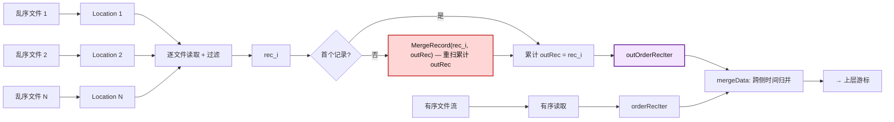
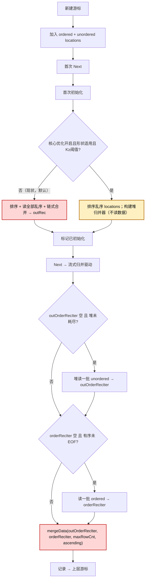
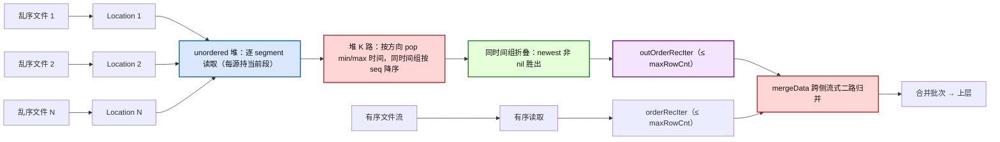
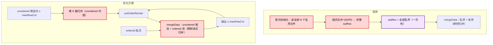
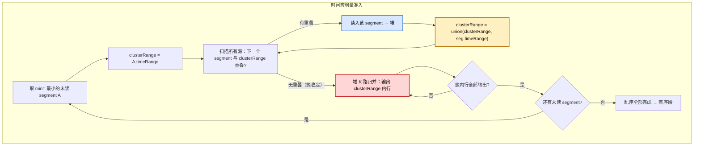

# tsmMergeCursor 乱序合并优化方案

> 本文档是乱序合并查询优化的唯一方案文件，整合问题分析、数据布局、核心算法、复杂度、正确性、
> 适用范围、备选取舍、风险与压测方案。方案经多轮修订：早期“watermark 延迟”与“两段式拼接”思路
> 因数据布局前提错误已被否决（见 §5.6），最终采用“堆式 K 路归并 unordered + 复用 mergeData 做跨侧
> 流式二路归并”。

---

## 目录

1. [背景与问题](#1-背景与问题)
2. [数据布局与不变式](#2-数据布局与不变式)
3. [设计目标与适用范围](#3-设计目标与适用范围)
4. [总体方案](#4-总体方案)
5. [核心算法：unordered 堆归并 + 跨侧流式二路归并](#5-核心算法unordered-堆归并--跨侧流式二路归并)
6. [辅助设计](#6-辅助设计)
7. [流程图](#7-流程图)
8. [复杂度分析](#8-复杂度分析)
9. [正确性验证策略](#9-正确性验证策略)
10. [查询路径覆盖矩阵](#10-查询路径覆盖矩阵)
11. [风险与缓解](#11-风险与缓解)
12. [未来演进](#12-未来演进)
13. [端到端压测方案](#13-端到端压测方案)

---

## 1. 背景与问题

openGemini 是云原生分布式时序数据库，采用 LSM 存储引擎。写入数据按时间戳分为**有序（ordered）**与
**乱序（out-of-order）**两类，分别落盘为不同的 TSSP 文件。本文按**同一 series** 粒度讨论查询合并：
查询时需要将该 series 命中的有序与乱序数据合并后按时间有序返回。

### 1.1 现状路径与瓶颈

非聚合查询的乱序合并发生在游标首次初始化阶段：把所有命中的乱序 location **一次性读空**，通过
**链式累计合并**逐步折叠成一个完整的乱序结果记录 `outRec`，再与有序数据做时间归并输出。问题有二：

1. **内存/GC 压力**：`outRec` 持有全部乱序行直到被上层消费完，乱序文件多时内存峰值高、GC 抖动明显。
   循环内每轮新建读取缓冲、合并中间结果逃逸到堆、`MergeRecord` 内部分配，进一步放大 GC 压力。
2. **总查询性能差**：链式合并“读一个记录，就与累计 `outRec` 合并一次”，每次合并重扫/重拷**累计**
   结果，复杂度 `O(N²·R)`（N 个乱序文件、每文件 R 行）。乱序文件多时查询明显变慢。

问题信号通常首先体现在查询 span 的乱序处理耗时异常偏高——大量时间花在乱序读取与链式合并，而非
有序读取或上层算子。`tagSetCursor` 首次堆初始化会触发多个 series 的首次初始化，使该开销集中爆发。

### 1.2 链式合并的 `O(N²R)` 来源

每次把第 k 个乱序记录并入累计 `outRec` 时，需扫描累计结果（约 `k·R` 行）与新记录（R 行）。k=1..N
求和，总工作量 `O(N²·R·F)`（F = 字段数）。累计结果自始至终持有全部乱序行。即便记录时间不相交走
批量分支，仍会把累计结果拷贝到新记录，存在累计拷贝放大。



### 1.3 核心收益场景

线上典型放大场景并非“timestamp 大量重复后去重行数很小”，而是：

- **字段值很大**：string 字段常见 KB 级。
- **乱序文件多**：命中的乱序 location 数 K 大。
- **乱序文件间 segment 时间范围高重叠**，但实际 timestamp 并不大量重复，去重后行数接近总乱序行数。
- **全局多 segment，单文件通常 1–2 个 segment**。

此场景下，链式合并频繁进入按时间相交的分支，反复重拷贝累计结果中的 KB 级 string，耗时与分配/GC
被显著放大。堆式归并让每个输出行只进入最终输出批次一次，避免累计重拷贝，对总耗时与分配量有直接
收益。

---

## 2. 数据布局与不变式

方案的正确性建立在同一 series 的文件级布局前提上。本节厘清这些前提的**精确边界**——这是本方案
多轮修订的核心，也是否定早期“两段式”思路的依据。

### 2.1 flush 切分语义

写路径在 flush 前按时间排序，flush 时按已落盘高水位 `flushTime`（即 `lastFlushTime`，该 series 已落盘
数据的全局最大时间）切分：

- `time > flushTime` → **ordered**
- `time <= flushTime` → **unordered**

`flushTime` 是该 series **已落盘数据的全局最大时间**（高水位），由 ordered 与 unordered 写入**共同**
抬升。因此：

- **单次 flush 内**：ordered（`> flushTime`）与 unordered（`<= flushTime`）在 `flushTime` 处严格不相交。
  这是逐次 flush 的局部性质。
- **跨多次 flush**：局部不相交**不蕴含**“所有 unordered 的时间都早于所有 ordered 的时间”。

### 2.2 跨 flush 的范围重叠（关键）

考虑典型近期乱序：先落盘 ordered 文件覆盖时间 `[130, 150]`（高水位抬到 150），随后到达一个迟到点
`140`。由于 `140 <= 150`，它进入 unordered 文件。于是 **ordered 文件范围 `[130, 150]` 包含 140**，
ordered 与 unordered 的文件级时间范围发生重叠。

这是**正常的近期乱序**（迟到点落在已写窗口内），并非异常。推论：

- “全部 unordered 严格早于全部 ordered”只在**迟到数据早于最老 ordered 数据**时成立——即回填式乱序。
- 近期乱序（迟到点落在已写窗口内）→ 文件级范围重叠，ordered 与 unordered 在时间上**交错**。
- 同一 timestamp 也可能跨侧出现：某 timestamp 的行在早期 flush（当时高水位更低）进入 ordered，另一行
  同 timestamp 在晚期 flush（高水位已抬过）进入 unordered。

### 2.3 文件级前提小结

| 关系 | 性质 | 处理要求 |
|---|---|---|
| ordered 文件之间 | 按 seq 全局有序，文件间无重叠、无重复 | 可视为已排好序的单调流，作为单个有序源 |
| unordered 文件之间 | 无全局顺序，可能交错、重叠、重复 | 必须做 K 路归并、去重与同 timestamp 覆盖 |
| unordered ↔ ordered | **可能交错/重叠**（近期乱序）或不相交（回填式） | 必须做跨侧时间归并，**不能**简单拼接 |

> **设计基线（重要）**：方案**不能假设**“unordered 一定比 ordered 旧”。ordered 与 unordered 必须经过
> 一个真正的跨侧时间归并才能输出正确顺序。早期“先吐完 unordered 再吐 ordered”的两段式思路正是基于
> 错误的 disjoint 假设，在近期乱序下会产生错序与跨侧重复，已否决（§5.6）。

### 2.4 同 timestamp 跨侧覆盖语义

同一 timestamp `t` 可能同时出现在 ordered 与 unordered 文件中。覆盖优先级由写入先后决定：

- ordered 副本：写入时高水位 `< t`，即较早写入。
- unordered 副本：写入时高水位 `≥ t`，即较晚写入。

可证：同一 timestamp 的 unordered 副本必然比 ordered 副本写入更晚（文件 seq 更高）。若 ordered 副本
写入更晚，则当时高水位已 `≥ t`，`t` 不可能进 ordered，矛盾。因此**同 timestamp 跨侧时 unordered 副本
胜出**（非 nil 列覆盖 ordered）。这与现状 `mergeData(newRec=unordered, oldRec=ordered)` 的语义一致。

---

## 3. 设计目标与适用范围

### 3.1 目标

1. **总查询性能**：乱序文件数 N 较大时，总耗时显著低于现状；随 N 增长，现状 ~`N²`、优化 ~`N·logN`，
   复现理论发散趋势。
2. **内存/GC 压力**：分配量显著降低（`O(M)` vs `O(N²R)`）；不预读全部 unordered，峰值 live 内存下降。
3. **不退化**：小 N 不退化（阈值路由回现状）；不支持形状回退现状，结果与耗时无差异。

### 3.2 适用范围

核心优化适用于**所有**非聚合、非 limit-cut、非 Prom 的升序/降序查询，**不依赖** ordered/unordered 是否
disjoint——因为跨侧由通用时间归并处理，能正确应对交错、重叠、同 timestamp 跨侧。这覆盖了近期乱序
（迟到点落在已写窗口内）这一最常见场景，也覆盖回填式 disjoint 场景。

### 3.3 成功指标

乱序文件较多时：总耗时下降、分配/GC 下降、峰值内存持平或下降；小 N 不退化；结果与现状逐行一致。

---

## 4. 总体方案

| 层 | 范围 | 说明 |
|---|---|---|
| **核心优化** | unordered 堆式 K 路归并 + 跨侧流式二路归并 | unordered 内部 `O(M·logK)` 替换链式 `O(N²R)`；跨侧复用 `mergeData`，正确处理交错/重叠 |
| **辅助优化** | 内存复用 + 观测指标 + 游标复用生命周期 | 降低分配/GC；可观测性；修复复用 bug |

核心优化通过 feature flag 控制（默认关），对升序/降序非聚合、非 limit-cut、非 Prom 查询生效。

---

## 5. 核心算法：unordered 堆归并 + 跨侧流式二路归并

### 5.1 核心思路

将合并拆成两层，各司其职：

- **unordered 内部**：用堆做 K 路归并，把无序、可能重叠/重复的 unordered 文件集合归并成一个**全局
  有序、同 timestamp 去重**的流，按 `maxRowCnt` 分批产出。复杂度 `O(M·logK)`，替换链式 `O(N²·R)`；
  每源只持当前 segment，不预读全部 unordered。
- **ordered ↔ unordered 跨侧**：复用现状已有的 `mergeData`，把 unordered 堆流与 ordered 流做**流式
  二路归并**。`mergeData` 本就是正确的流式二路归并器（`MergeRecordByMaxTimeOfOldRec` 三分支：整体
  在前/整体在后/重叠），能正确处理交错、重叠与同 timestamp 跨侧覆盖。

关键点：**两侧迭代器始终同时保有数据**，由 `mergeData` 跨侧归并；不存在“先吐完一侧再吐另一侧”的
阶段划分。这样跨侧归并分支始终生效，正确性对所有布局成立。

### 5.2 组件抽象

**unordered 堆归并器**：
- 持有 K 个乱序源（每个乱序 location 一个）和一个 K 路堆。
- 每源持有当前 segment 记录、行内游标、文件序列号（越大越新）、耗尽标志；仅持当前 1 个 segment，
  耗尽才读下一个 → 堆 live = `K × 当前段大小`。
- 堆键为各源当前行时间；升序取最小优先，降序取最大优先；同时间按文件序列号降序（最新者先出）。
- 同时间组折叠：弹出所有当前行时间相同的源，按 newest→oldest 折叠，每列取最新非 nil 值，等价于链式
  合并的行级 nil 覆盖语义，只输出一行。
- 每次产出不超过 `maxRowCnt` 行的批次；同时间组不被批次边界拆开。
- 中断回调：合并循环每轮检查查询是否中断；中断时丢弃半成品。

**跨侧流式二路归并（复用 `mergeData`）**：
- 维护两个迭代器：`outOrderRecIter`（由 unordered 堆按 `maxRowCnt` 喂入）与 `orderRecIter`（由有序
  读取按 `maxRowCnt` 喂入）。
- 每次 `Next`：若某侧迭代器空且未耗尽，则读一批补入；随后 `mergeData(outOrderRecIter, orderRecIter,
  maxRowCnt, ascending)` 产出最多 `maxRowCnt` 行。
- `mergeData` 在一侧时间整体早于另一侧时走批量分支（廉价），在重叠时走逐行双指针 + 列级 nil 合并，
  在同 timestamp 跨侧时按 §2.4 语义合并（unordered 胜出）。
- 升序/降序由 `mergeData` 的 `ascending` 参数处理，编排逻辑无需按方向分支。

### 5.3 正确性不变式

1. **ordered 全局有序**：ordered 文件按 seq 全局有序，文件间无重叠、无重复，可作为单调流喂入
   `orderRecIter`。
2. **unordered 内部 K 路归并**：unordered 文件之间可能乱序、重叠、重复。堆键必须是当前行时间；文件
   序列号只用于同 timestamp 覆盖优先级，不能作为归并顺序。堆产出的流全局有序且同 timestamp 去重。
3. **跨侧流式归并正确**：`mergeData` 是正确的流式二路归并——它不会在一侧未追上时提前吐出另一侧行
   （`outOrder.min > order.max` 时只吐 ordered、hold 住 unordered），因此不产生跨侧错序或重复。同
   timestamp 跨侧由两侧都在场时按 §2.4 合并。
4. **同 timestamp 完整合并**：输出 timestamp `t` 前，必须收齐所有产生 `t` 的行。unordered 内部的 `t`
   由堆在同时间组内收齐（不被批次/段拆开）；跨侧的 `t` 由 `mergeData` 在两侧都在场时收齐。这要求
   “同一 source 内同一 timestamp 不跨 segment 重复”作为文件前提，否则须继续推进该源后再输出。
5. **字段对齐**：同 timestamp 合并若按列下标读取，必须证明所有输入记录都按同一 schema 构建且字段
   顺序一致；否则必须按字段名归并。
6. **终止**：堆空且所有源耗尽、有序也读完时，两侧迭代器均空，`mergeData` 返回空，游标结束。无死循环。
7. **中断**：合并循环顶检查中断回调，中断时丢弃半成品。

> **与现状的等价性**：现状 = `链式合并(unordered内部) + mergeData(跨侧)`；本方案 =
> `堆归并(unordered内部) + mergeData(跨侧)`。两者唯一差异是无序内部合并算法，而堆的同 timestamp
> 去重语义（seq 降序 newest 胜出）与链式 `MergeRecord(newRec=高seq, oldRec=累计)` 等价，跨侧同
> timestamp 覆盖语义（unordered 胜过 ordered）两者一致（§2.4）。故喂入 `mergeData` 的 unordered 流
> 逐行相同，**本方案输出与现状在所有布局下逐行一致**。

### 5.4 小 N 阈值（防退化）

命中的乱序 location 数 K 低于阈值时回退现状。阈值保证开启 flag 不退化小 N 常见场景（原型交叉点约
N=100：N=10 优化更慢、N=100 持平、N=1000 快约 5×）。0 表示禁用阈值（测试用）。默认值需通过 §13.6
的对照压测按生产 workload 校准。

### 5.5 Feature flag 与查询形状适用范围

核心优化默认关，运行时可切换。适用形状：非聚合、非 limit-cut、非 Prom；升序与降序走同一编排，
仅 `mergeData` 的方向参数不同。其余形状回退现状。

### 5.6 备选方案与取舍

本方案经过多轮修订，以下是被否决或推迟的备选思路及理由（ migrate 自早期分析）：

| 备选 | 思路 | 取舍 |
|---|---|---|
| **watermark 延迟准入** | 用 ordered 批次的时间上界做 watermark，只准入 `≤ watermark` 的 unordered | **否决**：`flushTime` 是全局高水位，unordered 并非整体早于 ordered（§2.2）；watermark 无法正确界定，早期实现已移除 |
| **两段式拼接** | 先吐完 unordered、再吐 ordered（或反向） | **否决**：依赖“unordered 全部早于 ordered”的错误前提；近期乱序下错序 + 跨侧重复（§2.3） |
| **disjoint 准入门 + 回退** | 用 ChunkMeta 证明 `unorderedMax < orderedMin` 才启用两段式，否则回退 | **否决**：把正常的近期乱序当异常回退，优化在最常见场景失效；改为跨侧流式归并后无需此门 |
| **首包优先返回 ordered** | 先返回 ordered 数据降低首包延迟 | **否决**：ordered/unordered 时间交错，未合并 unordered 前不能输出 ordered（会错序） |
| **ordered 并入堆（统一 K+1 路）** | 把 ordered 作为额外源并入 K 路堆 | 可行但需在堆内重实现跨侧同 timestamp 覆盖、且失去 `mergeData` 的批量分支优化；**不采用**，改用复用 `mergeData` |
| **按 time/series/field/schema 预过滤 location** | 命中前用元数据剔除无关乱序文件 | 有效但独立，推迟为未来演进（§12.3） |
| **文件/block 级 min-max 跳过** | 用更细粒度时间索引跳过无关 segment | 独立优化，推迟为未来演进 |
| **乱序文件过多时后台分层/预合并** | 从源头降低 N | 长期 compaction 侧工作（§12.4） |

**最终选择**：unordered 堆归并（替换链式 `O(N²R)`）+ 复用 `mergeData` 跨侧流式归并（保证所有布局
正确）+ record 复用 + 指标保护。理由：只优化 unordered 路径、不改变 ordered 正常路径；跨侧逻辑复用
已验证代码，语义与现状严格一致；可用 flag 灰度、异常回退现状。

---

## 6. 辅助设计

### 6.1 内存复用

现状链式合并循环里每轮构造的读取缓冲可改为从环形池复用，降低分配。

**关键约束**：记录的 schema 合并向接收者 schema **追加**，因此池化的记录只能作为合并的只读参数，
**不能**作为接收者；合并中间结果仍用独立构造。游标复位时先释放迭代器对池记录的引用，再归还池。

### 6.2 观测指标

新增 span 计数（幂等创建）：

- **乱序 location 数**：命中的乱序 location 数（放大因子 K）。
- **链式合并次数**：现状路径的链式合并迭代次数。
- **优化路径命中次数 / 现状回退次数**：按小 N 阈值与查询形状统计优化路径实际生效比例。

### 6.3 游标复用生命周期

游标被复用给新 series 时，必须重置“已初始化”标志与堆归并器引用，使新 series 重新跑首次初始化。
否则：优化路径会把上一 series 残留的归并器源排进新 series 输出 → 跨 series 数据错乱；现状路径会跳过
首次初始化 → 新 series 乱序数据不读。

---

## 7. 流程图

### 7.1 初始化与流式归并迭代



- 现状分支：保留原全量读 + 链式合并。
- 优化分支：unordered 堆归并按 `maxRowCnt` 流式产出，与 ordered 批次同时喂入 `mergeData` 做跨侧归并；
  无阶段划分，升降序统一。

### 7.2 数据流



- 旧：读到 EOF，链式累计拷贝 `O(N²R)`，`outRec` = 全部乱序。
- 新：unordered 堆 K 路归并 `O(M·logK)`，每源只持当前段；与 ordered 流经 `mergeData` 流式跨侧归并，
  无全量缓冲。

### 7.3 现状 vs 优化方案对比



- 现状：首批前读完全部乱序、链式合并构造完整 `outRec`（`O(N²R)` + 全量内存）；跨侧 `mergeData` 不变。
- 优化：unordered 改堆式流式归并 `O(M·logK)`、不预读全部；**跨侧 `mergeData` 与现状完全相同**，故正
  确性等价、性能差异仅来自 unordered 内部合并算法。

---

## 8. 复杂度分析

### 8.1 链式 `O(N²R)` vs 堆式 `O(M·logK)`

- 链式：每次并入第 k 个记录重扫累计结果（~`k·R` 行），k=1..N 求和 = `O(N²·R·F)`。
- 堆式：每个 unordered 输出行处理一次（pop/push `O(logK)` + 列合并 `O(F)`），总计 `O(M·(logK+F))` =
  `O(N·R·(logN+F))`。每批次准入空闲源带来 `O(K·B)` 扫描（B = 批次数）；`maxRowCnt` 足够大时该项小
  于逐行堆成本，但小 `maxRowCnt` + 大 K 需纳入压测。
- 跨侧 `mergeData`：`O(M_total)`，disjoint 段走批量分支、重叠段走逐行；与现状相同，非本优化差异点。


纯复杂度比 `N/log₂N`：N=100 约 15×、N=1000 约 100×。原型实测因常数因子差距更小（N=100 基本持平、
N=1000 约 5×），但发散趋势一致。

### 8.2 现状两分支（相交 / 不相交）

现状合并按时间范围分两个分支：

| 分支 | 触发 | 实现 | 常数 |
|---|---|---|---|
| **不相交** | 新记录与累计结果时间不相交 | 整段批量拷贝 | 低 |
| **相交** | 时间相交 | 逐行双指针 + 列级 nil 合并 | 高（~2–3× 不相交） |

两者都是 `O(N²·R·F)`（累计重扫）。堆式 `O(N·R·(logN+F))` 无重扫，但常数更高（堆指针跳转 + 逐行列
合并，cache 局部性差）。相交度影响堆式的**常数**（同时间组越大 churn 越多）但不改大 O。

| 场景 | 现状分支 | 优化方案 unordered 内部 | crossover(N*) | N=1000 原型 |
|---|---|---|---|---|
| 不重叠 | 不相交 | `O(NR(logN+F))` | ~100 | ~5× 更快 |
| 全重叠 | 相交 | `O(NR(logN+F))`（常数↑） | >100 | 大 N 理论反超 |

> 注：上表 crossover 针对 **unordered 文件之间**的重叠度（影响堆常数），与 §2 的 ordered↔unordered
> 跨侧重叠无关——跨侧重叠由 `mergeData` 处理，不影响 unordered 内部堆的复杂度。

### 8.3 核心场景：大 string + 范围高重叠但数据不重复

见 §1.3。该场景下现状主放大点是每读一个乱序记录就与累计结果做相交合并，KB 级 string 被反复拷贝；
堆式让每个输出行只进最终批次一次，避免累计重拷贝。

峰值内存判断按“范围重叠但数据不重复”区分：

| 情况 | 现状 live | 优化 live | 判断 |
|---|---|---|---|
| 高范围重叠、数据不重复、单文件 1 segment | 完整 outRec（≈M）+ 合并 scratch | K 个当前段（≈M）+ 输出 batch | 持平或略低 |
| 高范围重叠、数据不重复、单文件 2 segment | 完整 outRec（≈M）+ scratch | 约 1/2 输入 + 输出 batch | 明显下降 |
| 高范围重叠、timestamp 大量重复（U << M） | 去重后 outRec 较小 | K 个当前段仍可能接近 M/S | 可能不占优，需回退 |

---

## 9. 正确性验证策略

### 9.1 差分测试

以现状路径为 oracle，对优化路径逐行比较 `(time, value, isNil)`。

- **固定 edge case**：仅有序、仅乱序、乱序间同时间高序列号覆盖、nil 列由旧源填补、小批流式、多有序
  文件。
- **大量随机用例**：多有序/乱序文件、含 nil 值、`maxRowCnt` 强制分批、升序与降序各一套。
- **跨侧交错/重叠用例（核心）**：ordered 与 unordered 时间范围重叠、迟到点落在已写窗口内、ordered 与
  unordered 时间交错（如 ordered=[130,150]、unordered=[140]）、同 timestamp 跨侧——验证 `mergeData`
  跨侧归并正确、无错序无重复。
- **多段用例**：多 segment 文件，覆盖逐段读取。
- **同 timestamp 完整性用例**：同 timestamp 横跨多个 unordered 文件、横跨 `maxRowCnt` 批次边界、同
  timestamp 跨侧；若文件格式允许同一源内重复 timestamp，还需覆盖同 timestamp 横跨同一源的 segment
  边界。
- **schema 对齐用例**：查询字段缺失、不同字段集合、字段过滤后 schema 变化时，验证优化输出与现状按
  字段名合并结果一致，或证明该路径所有输入记录均严格按同一 schema 构建。

### 9.2 覆盖场景清单

仅有序、仅乱序、乱序间同时间高 seq 覆盖、nil 列由旧源填补、同 timestamp 组不被批次/段拆散、跨侧
同 timestamp 由 `mergeData` 收齐、字段顺序与字段集合对齐、跨侧时间交错/重叠、迟到点落在已写窗口内、
小批流式、乱序跨多个有序文件、多段逐段读取、升序与降序。

---

## 10. 查询路径覆盖矩阵

| 路径 | 触发条件 | 乱序读取方式 | 覆盖? | 严重性 |
|---|---|---|---|---|
| TS 非聚合升序 | 默认 | unordered 堆归并 + `mergeData` 跨侧流式归并 | ✅ | — |
| 降序非聚合 | 降序 | 同上（`mergeData` 方向参数不同） | ✅ | — |
| limit-cut 非聚合 | limit-cut | 现状全量读 | ❌（§12.1） | 中 |
| Prom 查询 | Prom | 现状 | ❌（未分析） | 中 |
| 聚合 | 有聚合算子 | pre-agg meta | ❌ | 低 |
| fileCursor 聚合 | fileCursor + 可优化聚合 | 现状全量 drain | ❌（§12.2） | 高 |
| 列存 CS/hybrid | 列存 | 独立 reader | 不考虑 | — |
| 小 N | K < 阈值 | 现状 | 设计回退 | — |
| 近期乱序跨侧重叠 | ordered↔unordered 时间交错 | `mergeData` 跨侧归并 | ✅ | — |

---

## 11. 风险与缓解

### 11.1 同 timestamp 完整性

现状由逐行合并自然保证同 timestamp 去重与列级 nil 覆盖；本方案需**显式**保证：unordered 内部由堆在
同时间组收齐，跨侧由 `mergeData` 在两侧都在场时收齐。需确认同 timestamp 不会被批次边界、segment
边界或同一源后续读取拆成多行。上线前必须有差分测试覆盖（§9）。

### 11.2 schema 对齐

按列下标合并必须证明所有输入记录按同一 schema 构建且字段顺序一致。若查询字段过滤、schema 演进或
reader 返回子 schema 可能改变字段集合，必须改为按字段名归并。

### 11.3 全重叠退化

unordered 文件间全重叠（同时间组 = K）时堆常数升高、crossover 推后、内存收益消失。需 fallback 机制
（§12.5）。

### 11.4 单段不相交盲区

单段不相交 unordered 文件下堆持 K 段 = M（全部数据），峰值无收益。需时间簇增量准入（§12.6）。

### 11.5 游标复用

游标复用时必须重置初始化标志与堆归并器引用，否则跨 series 数据错乱（§6.3）。

### 11.6 文件内时间单调前提

堆归并逐 segment 读，依赖单个 location 内部按时间推进。memtable 落盘前按时间排序，segment timeRange
应按位置单调有序（“out-of-order”是文件间相对概念）。需用真实落盘文件 + 多段差分测试验证。

### 11.7 跨侧归并的早读开销

`mergeData` 要求两侧都有数据才能安全输出，故首包需读一个 ordered 批次与一个 unordered 批次（即便
最终输出主要来自一侧）。这是正确性必需，非性能回退：总 I/O 不变，仅 ordered 读取时机提前。disjoint
场景下 `mergeData` 走批量分支，开销可忽略。

---

## 12. 未来演进

### 12.1 limit-cut 支持

limit-cut 机制按 limit 取最早 `limit+offset` 行，其判定全程只来自 ChunkMeta 元数据，不依赖读数据，
也不裁剪 unordered 的数据读取。可兼容理由：limit 判定在首次初始化前算好；优化方案准入全部乱序，
limit 取最早行不会漏。但 limit-cut 要求按 limit 提前终止，需确认流式归并的早停边界。放开前需补差分
测试。

### 12.2 fileCursor 聚合路径

fileCursor 的“消费一次”模型（sid 在首个 ordered 文件处消费并删除）与堆式流式归并不同，需重构为
per-sid 流式 unordered 堆归并 + 跨侧归并。先做非 pre-agg 子路径，pre-agg（meta 成本低）后做。

### 12.3 location 预过滤

location 命中后，若 ChunkMeta 的列与查询 schema 无交集、或时间范围与查询不相交，则不加入 location，
从源头减少无效读取与 per-series×per-file 的 metadata 放大。风险：count(time)/aux/Prom 语义需验证。

### 12.4 后台分层/预合并

乱序文件过多的 shard/measurement 触发后台预合并/分层 compact，从源头降低 N。长期 compaction 侧工作。

### 12.5 全重叠 fallback

unordered 文件间全重叠时，优化无延迟收益且逐行列合并慢于现状向量化合并。fallback 触发条件应同时
考虑 N 与相交度（同时间组规模 g）：g 大时常数升高、crossover 推后、内存收益消失 → 回退现状。

### 12.6 时间簇增量准入

解决 §11.4 单段盲区：按时间重叠关系把乱序 segment 分成不相交簇，逐簇处理，使堆活跃源数从 K 降到
当前簇 C。

```
1. 取所有源中 minT 最小的 segment A，初始化 clusterRange = A.timeRange [t1, t2]
2. 扫描所有源的下一个未读 segment，若 timeRange 与 [t1, t2] 重叠：
   a. 读入该 segment，加入堆
   b. clusterRange = union(clusterRange, segment.timeRange) → 扩展 [t1, t2]
   c. 回到步骤 2
3. 无新 segment 重叠 → 簇稳定，堆 K 路归并输出 [t1, t2] 内行（≤ maxRowCnt/批）
4. 簇内行输出完 → 回到步骤 1，从下一个未读 segment 开始新簇
```



| 维度 | 当前流式 | 时间簇增量准入 |
|---|---|---|
| 活跃源数 | K（全部） | C（当前簇，C << K 当簇小时） |
| 单段不相交文件峰值 | K×R = M（无收益） | C×R（大降） |
| I/O 延迟 | 无 | 有（只读当前簇） |
| 堆操作 | O(logK) | O(logC) |
| 簇检测开销 | 无 | O(K²) flood-fill 或 O(K logK) 预排序 |
| 文件全重叠时 | K 活跃 | 退化成一簇 = K + 额外开销 |
| 代码复杂度 | 低 | 高 |

适用判断：分散不同时间点的乱序（多小簇，收益大）vs 集中同一时段的批量回填（一大簇，无收益）。前置：
先用真实数据验证乱序文件的时间簇分布。

### 12.7 其他

- 配置接入：核心优化开关接查询配置项。
- 合并器池化：源记录与输出批次进一步池化降分配。

---

## 13. 端到端压测方案

### 13.1 环境

单机 standalone，固定硬件。关键配置控制 N（乱序文件数）并冻结 compaction：

| 配置 | 取值 | 作用 |
|---|---|---|
| memtable 大小上限 | 小（1MB） | 每批次写入即 flush |
| write-cold-duration | 短（1s） | 加速 flush |
| max-unordered-file-number | 大（2000） | 抑制合并 |
| max-concurrent-compactions | 0 | 关闭 compaction |
| max-rows-per-segment | 可调 | 控制 R |

### 13.2 数据模型与写入

- **有序区**：S series × T 点，升序写入 `[t0, t0+T)`。
- **乱序区**：N 批次，每批次 R 行/series，每批次 flush = 1 乱序文件。
- **乱序相对有序的时间关系**（验证跨侧归并正确性，核心）：
  - **近期乱序（范围重叠/交错）**：乱序时间落在 ordered 窗口内（如 ordered=[130,150]、
    unordered=[140]）——核心正确性场景，验证 `mergeData` 跨侧归并无错序无重复。
  - **回填式（disjoint）**：乱序时间早于所有 ordered——验证 disjoint 下批量分支性能。
  - **同 timestamp 跨侧**：同一 timestamp 同时存在于 ordered 与 unordered——验证跨侧覆盖语义。
- **乱序文件间重叠度**：no-overlap / partial / full。full-overlap 拆两类：
  - **范围重叠但 timestamp 不重复**：segment timeRange 高重叠，但写不同时间点——大 string 核心收益场景。
  - **timestamp 大量重复**：验证同时间组常数与 fallback 条件。
- **大 field 场景**：KB 级 string（1KB/4KB/16KB），单文件 1–2 segment，全局多 segment。
- 变量：N∈{1,10,32,64,100,200,500,1000}、R∈{20,100,1000}、S∈{1,100,10000}、F∈{1,5,20}。

### 13.3 查询负载

- 主查询：非聚合升序/降序全范围 `SELECT * ...`。
- 回归：聚合、limit-cut、Prom。

### 13.4 指标

总耗时 p50/p95/p99、峰值堆（pprof + RSS）、GC、CPU profile、磁盘 I/O、span 计数。重点观察乱序处理
耗时、乱序 location 数、链式合并次数、优化路径命中/回退比例。flag on/off 对照。

### 13.5 预期

| 场景 | 预期 |
|---|---|
| N=1000, 近期乱序范围重叠, 升序/降序非聚合 | 总耗时 ↓ ~5×、分配/GC ↓、峰值堆 ↓（多段显著）；结果与 flag off 逐行一致 |
| N=1000, 回填式 disjoint | 同上（`mergeData` 走批量分支） |
| 大 string + 多 unordered + 范围高重叠但数据不重复 + 单文件 1–2 segment | 乱序耗时明显下降；分配/GC 明显下降；峰值堆持平或下降 |
| 同 timestamp 跨侧 | 结果与 flag off 完全一致（unordered 胜出） |
| N=100 | 持平 |
| N<阈值 | 走现状不退化 |
| timestamp 大量重复的 full-overlap | 收益不确定，记录同时间组常数与 fallback 依据 |
| 聚合/limit-cut/Prom | flag on 与 off 一致，继续走现状 |

### 13.6 小 N 阈值校准

阈值只按命中的 unordered location 数 K 决策，不能感知 field 大小、segment 数、重叠度或查询方向。因此
“最佳值”是生产 workload 加权后的保守阈值：小 K 不退化，核心大 string 场景尽早走优化。

#### 13.6.1 方法

不直接扫描阈值配置测结果，而是先强制现状/优化各跑完整矩阵，再离线推导阈值：

1. 现状 baseline：关闭优化。
2. 优化 baseline：开启优化，阈值置 0，强制所有非聚合 TS 查询走优化。
3. 每个 case 记录 K、首包延迟、总耗时、分配、峰值内存、GC、优化路径是否命中。
4. 离线模拟候选阈值 T：`K < T` 用现状结果，`K >= T` 用优化结果。
5. 用生产 K 分布和慢查询权重加权，选收益最大且小 K 不退化的 T。

#### 13.6.2 K 与候选阈值

| 类型 | 取值 |
|---|---|
| K 矩阵 | 0, 1, 2, 4, 8, 16, 24, 32, 48, 64, 96, 128, 192, 256, 512, 1024 |
| 候选阈值 | 0, 16, 32, 48, 64, 96, 128, 192, 256, disabled |

`0` 表示总是优化；`disabled` 表示总是现状。默认值优先从 `32/64/96/128` 中选，便于解释与灰度。

#### 13.6.3 场景矩阵

| 维度 | 取值 |
|---|---|
| field 类型 | int-only、small string、1KB string、4KB string、16KB string |
| field 数 | 1、5、20 |
| 每文件行数 R | 20、100、1000 |
| 单文件 segment 数 | 1、2、8 |
| unordered 范围关系 | no-overlap、partial-overlap、range full-overlap 但 timestamp 不重复、timestamp 大量重复 |
| **相对有序的时间关系** | 近期乱序范围重叠/交错、回填式 disjoint、相同 timestamp 跨侧 |
| 查询方向 | asc、desc |
| `maxRowCnt` | 100、1000、10000 |
| 查询范围 | 全范围、只命中部分 unordered |
| nil 情况 | 无 nil、稀疏 nil、同 timestamp 字段互补 |

核心场景需单独加权，不应被 int-only microbenchmark 稀释：

```text
大 string + K 大 + 范围高重叠但 timestamp 不大量重复 + 全局多 segment + 单文件 1-2 segment
```

#### 13.6.4 指标与判定

每个 case 至少记录：首包延迟 p50/p95/p99、总耗时 p50/p95/p99、`B/op`、`allocs/op`、peak heap/RSS、
GC 次数与 pause、乱序处理耗时、乱序 location 数、链式合并次数、优化命中/回退。

对每个 K 计算：

```text
first_packet_ratio = opt_first_packet_p95 / baseline_first_packet_p95
total_ratio        = opt_total_p95 / baseline_total_p95
alloc_ratio        = opt_alloc_bytes / baseline_alloc_bytes
peak_ratio         = opt_peak_heap / baseline_peak_heap
```

建议判定规则：

```text
opt_win:
  total_ratio <= 0.95
  且 first_packet_ratio <= 1.00
  且 peak_ratio <= 1.10

opt_not_regress:
  total_ratio <= 1.03
  且 first_packet_ratio <= 1.05
  且 peak_ratio <= 1.15
```

单个场景的 crossover：

```text
K_cross = 最小 K，使优化在该 K 及后续连续 2 个 K 点都满足 opt_not_regress
```

#### 13.6.5 生产加权与推荐值

上线前采集 3–7 天生产分布：乱序 location 数的 P50/P75/P90/P95/P99、乱序处理耗时按 K 的贡献占比、
查询方向/field 类型/返回行数/时间范围、慢查询中 K 与大 string 的相关性、优化命中/回退占比。

离线评分：

```text
score(T) =
  Σ workload_weight(case) * latency_p95(case, T)
  + regression_penalty(T)
  + memory_penalty(T)
```

推荐阈值选择：

1. 对 guardrail 场景取满足 `opt_not_regress` 的最大 `K_cross`。
2. 若该值会错过核心大 string 慢查询的大部分收益，用生产权重下的 `score(T)` 修正。
3. 向上取整到 `32/64/96/128` 之一。

报告输出格式：

| 场景 | K_cross | 结论 |
|---|---:|---|
| int-only, 1 segment | 96 | guardrail |
| int-only, 8 segments | 64 | guardrail |
| 1KB string, range overlap no duplicate | 32 | core |
| 4KB string, range overlap no duplicate | 16 | core |
| timestamp 大量重复 | 128+ | fallback/guardrail |
| desc 查询 | 与 asc 接近 | confirm |

示例结论：

```text
推荐阈值 = 64
原因：
- K < 64 的 int-only/small-field 场景优化无稳定收益或轻微退化；
- K >= 64 的核心大 string 场景优化 p95 总耗时下降 X%，乱序耗时下降 Y%，alloc 下降 Z%；
- 生产 K>=64 覆盖主要慢查询，占乱序耗时总量 A%；
- 近期乱序（范围重叠）现在由跨侧归并正确处理，不再回退。
```

#### 13.6.6 执行

microbenchmark：

```bash
go test ./engine -run '^$' -bench 'Benchmark.*(FirstPacket|Total|Peak)' -benchmem -count=10
benchstat baseline.txt opt.txt
```

真实文件压测必须额外覆盖 KB string 与跨侧交错/重叠布局，因为 mock benchmark 无法完整反映真实 string
拷贝、record 过滤、TSSP reader 行为与 `mergeData` 跨侧归并。
