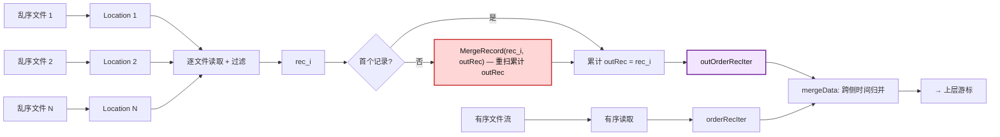
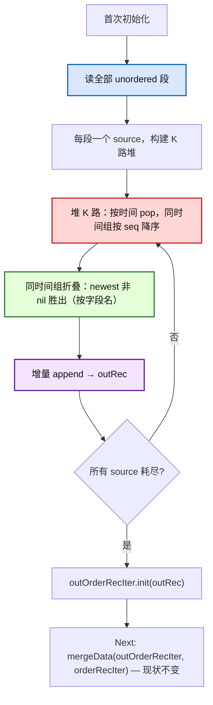
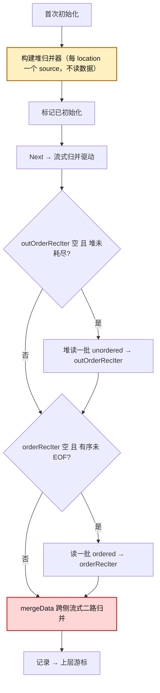

# tsmMergeCursor 乱序合并优化方案

> 本文档是乱序合并查询优化的唯一方案文件。采用**两步策略**：
>
> - **Step 1（近期、低风险）**：只替换 unordered 内部的合并算法——链式 `MergeRecord` → 堆式 K 路归并，
>   仍全量加载 unordered、下游 `mergeData` 不变。先吃掉 CPU 与 GC 两块大头。
> - **Step 2（进阶、deferred）**：在 Step 1 的堆基础上，把全量 drain 改为按 `maxRowCnt` 流式吐 + 与
>   ordered 跨侧流式归并，降峰值 live 内存。
>
> Step 1 是 Step 2 的严格子集（只取堆归并，不取流式），先把高风险的跨侧流式编排留给 Step 2。

---

## 目录

1. [背景与问题](#1-背景与问题)
2. [数据布局与不变式](#2-数据布局与不变式)
3. [两步策略总览](#3-两步策略总览)
4. [Step 1：堆式 K 路归并（全加载）](#4-step-1堆式-k-路归并全加载)
5. [Step 2：流式归并 + 跨侧 driver（进阶）](#5-step-2流式归并--跨侧-driver进阶)
6. [辅助设计](#6-辅助设计)
7. [流程图](#7-流程图)
8. [复杂度分析](#8-复杂度分析)
9. [正确性验证策略](#9-正确性验证策略)
10. [查询路径覆盖矩阵](#10-查询路径覆盖矩阵)
11. [风险与缓解](#11-风险与缓解)
12. [未来演进](#12-未来演进)
13. [端到端压测方案](#13-端到端压测方案)

---

## 1. 背景与问题

openGemini 是云原生分布式时序数据库，采用 LSM 存储引擎。写入数据按时间戳分为**有序（ordered）**与
**乱序（out-of-order）**两类，分别落盘为不同的 TSSP 文件。本文按**同一 series** 粒度讨论查询合并：
查询时需要将该 series 命中的有序与乱序数据合并后按时间有序返回。

### 1.1 现状路径与瓶颈

非聚合查询的乱序合并发生在游标首次初始化阶段：把所有命中的乱序 location **一次性读空**，通过
**链式累计合并**逐步折叠成完整乱序结果 `outRec`，再与有序数据做时间归并输出。问题：

1. **CPU 浪费**：链式合并“读一个记录，就与累计 `outRec` 合并一次”，每次重扫/重拷**累计**结果，复杂度
   `O(N²·R)`（N 个乱序文件、每文件 R 行）。
2. **GC 压力**：`O(N²R)` 不只是 CPU——它本质是一个**分配模式**（见 §4.4），每次合并新分配一个与累计
   `outRec` 等大的中间记录、旧记录沦为垃圾，GC 抖动严重。
3. **峰值内存**：`outRec` 持有全部乱序行直到被上层消费完。

问题信号通常首先体现在查询 span 的乱序处理耗时异常偏高。`tagSetCursor` 首次堆初始化会触发多个 series
的首次初始化，使该开销集中爆发。

### 1.2 链式合并的 `O(N²R)` 来源

每次把第 k 个乱序记录并入累计 `outRec` 时，需扫描累计结果（约 `k·R` 行）与新记录（R 行）。k=1..N 求和，
总工作量 `O(N²·R·F)`（F = 字段数）。累计结果自始至终持有全部乱序行。



### 1.3 核心收益场景

线上典型放大场景：字段值很大（KB 级 string）+ 乱序文件多 + 乱序文件间 segment 时间范围高重叠但 timestamp
不大量重复 + 全局多 segment、单文件 1–2 segment。此场景下链式合并频繁进入相交分支，反复重拷贝累计结果
中的 KB 级 string，耗时与分配/GC 被显著放大。

---

## 2. 数据布局与不变式

### 2.1 flush 切分语义

写路径在 flush 前按时间排序，flush 时按已落盘高水位 `flushTime`（`lastFlushTime`，该 series 已落盘数据
全局最大时间）切分：`time > flushTime → ordered`，`time <= flushTime → unordered`。`flushTime` 由 ordered
与 unordered 写入**共同抬升**。

- **单次 flush 内**：ordered 与 unordered 在 `flushTime` 处严格不相交（局部性质）。
- **跨多次 flush**：局部不相交**不蕴含**“所有 unordered 早于所有 ordered”。

### 2.2 跨 flush 的范围重叠

典型近期乱序：先落盘 ordered `[130, 150]`（高水位抬到 150），迟到点 `140` 到达，`140 <= 150` → 进入
unordered。ordered 范围 `[130, 150]` **包含 140**，两侧时间范围重叠。这是**正常的近期乱序**（迟到点落在
已写窗口内），并非异常。同一 timestamp 也可能跨侧出现（早期 flush 进 ordered、晚期 flush 进 unordered）。

> **对 Step 1 的影响**：Step 1 **不改动跨侧归并**（仍 `mergeData(完整 outRec, ordered)`，现状逻辑），
> 因此对 ordered/unordered 是否重叠**完全免疫**——重叠由现状 `mergeData` 处理，与今天一致。§2.2 的重叠
> 分析是 Step 2 跨侧流式归并的前提，Step 1 不涉及。

### 2.3 文件级前提

| 关系 | 性质 | 处理 |
|---|---|---|
| ordered 文件之间 | 按 seq 全局有序，无重叠无重复 | 单调流，喂 `orderRecIter` |
| unordered 文件之间 | 无全局顺序，可能交错/重叠/重复 | K 路归并去重（Step 1/2 的堆） |
| unordered ↔ ordered | 可能交错/重叠 | 现状 `mergeData` 跨侧归并（Step 1 不变；Step 2 流式） |

### 2.4 同 timestamp 覆盖语义

- **unordered 内部**：同 timestamp 跨多个 unordered 文件时，**文件 seq 越大 = 写入越晚 = 越新**，newest
  非 nil 胜出。现状链式合并：`outOfOrderLocations` 按 seq 升序排序（`LocationCursor.Less` 对非 ordered
  按 `seqI < seqJ`），故最后处理的段 = 最高 seq = `newRec` = 胜出。堆式以 seq 降序做同时间组 tie-break，
  语义等价。
- **跨侧**：同 timestamp 的 unordered 副本必然比 ordered 副本写入更晚（若 ordered 更晚，则当时高水位
  已 `≥ t`，`t` 不可能进 ordered，矛盾），故 unordered 胜出。与现状 `mergeData(newRec=unordered,
  oldRec=ordered)` 一致。

#### 2.4.1 compaction / seq 语义

后台乱序合并（mergeOutOfOrder）重写文件产生新 seq，需保证“seq 越大 = 越新”不被破坏：合并文件落盘前已按
newest-wins 折叠同 timestamp 行，故高 seq 正确代表“取代之”；乱序→有序提升同理。需用 compaction 后真实
文件差分验证（§9）；若 seq 倒挂，则同 timestamp 覆盖须改按行级写入版本号，或回退现状。

---

## 3. 两步策略总览

| 维度 | 现状 | Step 1（堆归并，全加载） | Step 2（+流式 +跨侧 driver） |
|---|---|---|---|
| unordered 内部合并 | 链式 `O(N²R)` | 堆 `O(M·logK)` ✅ | 同 Step 1 |
| 分配/GC | `O(N²R)` | `O(M)` ✅ | 同 Step 1 |
| 峰值 live 内存 | ~2M | ~M–2M（持平） | `O(K·段)` ✅ 下降 |
| 跨侧归并 | 现状 `mergeData` | **不变**（低风险） | 流式 `mergeData` + driver |
| 改动面 | — | `FirstTimeInit` 合并循环 | + `Next` 编排 + 跨侧 driver |
| 正确性新增风险 | — | 仅堆折叠语义（可差分） | + 状态机/跨段追平/disjoint 讨论 |

**拆分依据**：现状 `O(N²R)` 同时是 CPU 浪费和 GC 压力的根（同一分配模式，§4.4）。Step 1 以最低风险（只改
一个合并循环、跨侧不动）先吃掉 CPU 与 GC 两块大头；峰值内存的下降需要不全加载（流式），那是 Step 2 的
活，伴随跨侧 driver 等高风险复杂度。

**预期校准**：Step 1 **不降峰值内存**。若生产瓶颈是 GC 抖动/总耗时，Step 1 足够；若瓶颈是峰值内存 OOM，
才必须 Step 2。

两步共享同一堆折叠语义（seq 降序、按字段名、同时间组），Step 2 在 Step 1 的堆基础上加流式编排。

---

## 4. Step 1：堆式 K 路归并（全加载）

### 4.1 改什么 / 不改什么

**改**：`FirstTimeInit` 里 unordered 内部的合并算法——把“逐段读 + 链式 `MergeRecord(rec, outRec)`”换成
“读全部 unordered 段 + 堆 K 路归并成同一个 `outRec`”。

**不改**：
- 仍全量加载 unordered、仍构造完整 `outRec`。
- `Next` 里的 `mergeData(outOrderRecIter=outRec, orderRecIter)` **完全不动**——跨侧归并照旧用现状逻辑。

改动面 = 一个合并循环。下游零改动。

### 4.2 算法

1. 读全部命中的 unordered location 的全部 segment（每段一个 record），收集为堆的 source 集合。
2. K 路堆：以各 source 当前行时间为键（升序取最小、降序取最大）；同时间按文件 seq 降序（最新者先出）。
3. 同时间组折叠：弹出所有当前行时间相同的 source，按 newest→oldest 折叠，每列取最新非 nil 值，**按字段名
   对齐**（与 `mergeRecRow` 一致），只输出一行。
4. 折叠结果增量 append 到 `outRec`，直到所有 source 耗尽。
5. `outRec` 喂入 `outOrderRecIter`，下游 `mergeData` 照旧。

**关键粒度选择**：每个 **segment**（而非每个 location）作为一个堆 source，全部段同时活跃。这使得同
timestamp 跨段（无论同文件不同文件）的行天然分到同一组折叠，**无需跨段追平**（Step 2 用 location 粒度
source 才需要追平，§5.4）。

### 4.3 CPU 分析

- 现状链式：`O(N²·R·F)`（每次重扫累计 `outRec`）。
- 堆式：每个输出行 pop/push `O(logK)` + 列合并 `O(F)`，总计 `O(M·(logK+F))` = `O(N·R·(logN+F))`。无重扫。
- 跨侧 `mergeData`：`O(M_total)`，与现状相同，非本步差异点。


纯复杂度比 `N/log₂N`：N=100 约 15×、N=1000 约 100×。原型实测因常数因子差距更小（N=100 基本持平、
N=1000 约 5×），发散趋势一致。

### 4.4 GC 理论分析（关键）

现状 `O(N²R)` 不只是 CPU，本质是**分配模式**。看现状代码：

```
for 每段 rec:
    var mergeRecord record.Record          // 局部变量
    mergeRecord.MergeRecord(rec, outRec)   // 向 receiver 追加，分配 ~kR 的 ColVals
    outRec = &mergeRecord                  // 取地址 → 逃逸到堆；旧 outRec 变垃圾
```

每次迭代（除首段）新分配一个 `mergeRecord`，其 ColVals 与累计 `outRec` 等大（~kR），同时上一轮 `outRec`
（~(k-1)R）整体沦为垃圾。N 轮下来：

- 总分配量 ≈ R + 2R + … + NR = `O(N²·R)` 字节
- 总回收量 ≈ 同量

`dst` 读缓冲虽已池化（`unorderPool`），但不断增长的 `outRec`（receiver，schema 追加约束致无法池化）是垃圾
主力。**GC 压力与 CPU 同阶，都是 `O(N²R)`**——这是 `unorder_duration` 偏高同时 GC 抖动的根因。

堆式归并：
- `outRec` **只分配一次**，由堆 pop 出的行增量 append（ColVals 摊还扩容），最终 `O(M)`。
- 各输入段每段只读一次（`O(M)`），可边消费边释放。

**总分配 `O(N²R)` → `O(M)`**，与 CPU 同因子下降。这是结构性必然，非小修小补。

### 4.5 峰值 live 内存分析

- 现状峰值：最后一次 `MergeRecord` 期间，旧 `outRec`（~M）+ 新 `mergeRecord`（~M）+ rec 同时存活 ≈ **2M**。
- Step 1 峰值：全部段（M）+ `outRec`（增长到 M）。若段消费完即释放，任意时刻 `outRec + 剩余段 ≈ M`（守恒），
  峰值 **~M**；若不释放，~2M。

结论：**Step 1 峰值内存不高于现状（~2M），可做到 ~M**。不退化，但也不降峰值——降峰值是 Step 2 的目标。

### 4.6 正确性：与现状逐行等价

Step 1 选“每段一个 source、全部活跃”的粒度，**自然复刻**现状链式合并的逐行语义：

- **段内重复 timestamp**（一个段里两行同 `t`）：堆分两次 pop 该 source → 输出多行。现状 `MergeRecord` 对
  段内重复也保留多行（`appendRecs` 逐行 AppendRec）。一致。
- **跨段重复 timestamp**（两段各有 `t`）：堆把两 source 同组折叠 → 一行。现状链式 `MergeRecord(seg2,
  outRec 含 seg1 的 t)` → `mergeRecRow` 折叠 → 一行。一致。
- **同 timestamp 覆盖优先级**：堆按 seq 降序 newest 胜出；现状按 seq 升序处理、最后处理 = 最高 seq =
  `newRec` 胜出（§2.4）。一致。
- **跨侧**：`mergeData(完整 outRec, ordered)` 照旧，零改动。

故只要堆折叠语义（seq 降序、按字段名）与链式 `MergeRecord` 一致，**Step 1 产出的 `outRec` 与现状逐行
相同**，下游 `mergeData` 输出逐行相同。以现状为 oracle 的差分测试即可守卫。

### 4.7 不变式

1. **每段一个 source、全部活跃**：保证同 timestamp 跨段行天然同组折叠，无需跨段追平。
2. **堆键 = 当前行时间**；seq 只用于同 timestamp 覆盖优先级，不作归并顺序。
3. **同时间组完整收齐**：输出 `t` 前弹出所有当前行 == `t` 的 source；不被 `maxRowCnt` 批次边界拆开（Step 1
   全量 drain，无批次边界问题）。
4. **按字段名归并**：与 `mergeRecRow` 一致，对 schema 演进/字段过滤/子 schema 鲁棒。读路径按 `ctx.schema`
   构建 dst 解码（reader normalize），常见情况退化为按下标；运行时检测到无法按名归并则回退现状。
5. **终止**：所有 source 耗尽 → `outRec` 完成。无死循环。
6. **中断**：合并循环顶检查中断，丢弃半成品。

### 4.8 风险与边界

- **小 N 退化**：堆有 `logK` + 逐行 append 常数开销，小 N 可能慢于链式。保留小 N 阈值路由到现状。
- **堆折叠语义对齐**：必须差分覆盖段内重复、跨段重复、跨文件同 timestamp、nil 列互补、字段缺失。
- **全加载内存下限**：极大 unordered 集合下峰值不降（仍 ~M–2M）。OOM 风险需 Step 2。

---

## 5. Step 2：流式归并 + 跨侧 driver（进阶）

### 5.1 动机

Step 1 不降峰值内存。若生产瓶颈是峰值内存 OOM，需要不全加载：把 unordered 堆按 `maxRowCnt` 流式吐、与
ordered 经 `mergeData` 跨侧流式归并，使 live 数据从“全部 unordered（~M）”降到“K 个当前段 + 输出 batch”。

### 5.2 算法

- unordered 内部仍用 Step 1 的堆，但 source 粒度改为**每个 location**（段逐段读，不全加载），按 `maxRowCnt`
  分批产出。
- 跨侧：维护 `outOrderRecIter`（堆喂入）与 `orderRecIter`（有序读取），每次 `Next` 两侧按需补入一批，
  `mergeData` 流式二路归并产出 ≤ `maxRowCnt` 行。
- `mergeData` 的三分支（整体在前/在后/重叠）正确处理交错、重叠、同 timestamp 跨侧（§2.4）。

### 5.3 跨侧 driver 状态机

driver 必须显式处理两侧 EOF、补读失败、过滤后空批、以及 `mergeData` 返回空但两侧未 EOF 的推进，避免死循环
或提前单侧输出：

```
状态：uExh（unordered 堆耗尽）、oExh（ordered EOF）、两侧迭代器 hasRemain/空

Next():
  if 中断: return nil
  loop:
    if !outOrderRecIter.hasRemain() and not uExh:
        rec = 堆.nextBatch(maxRowCnt)        # 可能过滤/全 nil 返回 nil
        if rec != nil: outOrderRecIter.init(rec) else uExh = true
    if !orderRecIter.hasRemain() and not oExh:
        rec = readData(ordered)
        if rec != nil: orderRecIter.init(rec) else oExh = true
    if !outOrderRecIter.hasRemain() and !orderRecIter.hasRemain(): return nil
    out = mergeData(outOrderRecIter, orderRecIter, maxRowCnt, ascending)
    if out != nil and out.RowNums() > 0: return out
    # 兜底：out 空但某侧有 remain（仅 maxRowCnt<=0 退化情形）→ 回 loop 推进，绝不直接单侧吐出
```

不变式：`mergeData` 非空性（任侧有 remain 必产出非空）；无死循环（状态向 EOF 单调收敛）；**不提前单侧输出**
（硬约束，否则跨侧同 timestamp 丢失合并）；过滤后空批按“该段无有效行”处理不当作整侧 EOF；补读失败向上
透传。

### 5.4 正确性不变式（Step 2 新增）

Step 2 用 location 粒度 source（段逐段读），相比 Step 1 新增以下闭环：

1. **同一 source 跨段同 timestamp 追平**：写路径不按 (series, timestamp) 去重，重复 timestamp 可能被
   segment 边界拆开。现状链式按“每段一条链记录”跨段折叠、段内保留；Step 2 堆须精确匹配——源段尾输出 `t`
   后若下一段首行仍 `t`，必须把该源重新并入当前同时间组继续折叠（跨段追平），而非另起一组输出第二行。未
   实现或未通过差分测试 → 回退现状。
2. **跨侧流式归并正确**：`mergeData` 不在一侧未追上时提前吐另一侧行；同 timestamp 跨侧由两侧在场时按 §2.4
   合并。
3. **同 timestamp 完整合并**：跨段追平（上）+ 跨侧收齐（状态机）+ 不被 `maxRowCnt` 拆开。
4. **字段按名归并**：同 Step 1。
5. **终止/中断**：两侧 EOF → `mergeData` 返回空 → 结束；中断丢半成品。

> **与现状的等价性（条件性）**：在 (a) 堆同时间组覆盖语义等价、(b) 跨侧覆盖按 §2.4（含 compaction 后 seq
> 语义）、(c) 跨段追平已实现、(d) 字段按名归并 四条件全满足时，Step 2 输出与现状逐行一致。任一不满足/未
> 通过差分测试则回退现状。

### 5.5 灰度 guardrail（Step 2 上线必备）

已知退化场景（unordered 文件间全重叠/大同时间组、单段高 K、高重复 timestamp）下堆常数升高、crossover
推后、内存收益消失。Step 2 上线即须内置：kill switch（flag 一键关）、小 N 阈值、观测型 guardrail（per-cursor
记录 K、同时间组规模 g、g/K 超阈值回退）、分项回退计数。具体阈值校准见 §12.5。

### 5.6 备选方案与取舍

| 备选 | 思路 | 取舍 |
|---|---|---|
| **watermark 延迟准入** | 用 ordered 批次时间上界做 watermark，只准入 `≤ watermark` 的 unordered | **否决**：`flushTime` 是全局高水位，unordered 并非整体早于 ordered（§2.2）；watermark 无法正确界定 |
| **两段式拼接** | 先吐完 unordered、再吐 ordered（或反向） | **否决**：依赖“unordered 全部早于 ordered”的错误前提；近期乱序下错序 + 跨侧重复 |
| **disjoint 准入门 + 回退** | 用 ChunkMeta 证明 `unorderedMax < orderedMin` 才启用两段式 | **否决**：把正常的近期乱序当异常回退，最常见场景失效；改为跨侧流式归并后无需此门 |
| **首包优先返回 ordered** | 先返回 ordered 降首包 | **否决**：ordered/unordered 时间交错，未合并 unordered 前不能输出 ordered |
| **ordered 并入堆（统一 K+1 路）** | ordered 作为额外源并入堆 | 可行但需在堆内重实现跨侧同 timestamp 覆盖、失去 `mergeData` 批量分支优化；不采用 |

---

## 6. 辅助设计

### 6.1 内存复用

`FirstTimeInit` 循环里的读取缓冲从环形池复用（`unorderPool`，已具备）。**关键约束**：`mergeRecordSchema`
向 receiver schema 追加，故池化记录只能作合并的只读参数，不能作 receiver；合并中间结果独立构造。游标复位
先释放迭代器对池记录的引用再归还池。Step 2 的堆源 record 与输出 batch 可进一步池化。

### 6.2 观测指标

span 计数（幂等创建）：

- **乱序 location 数**：放大因子 K。
- **链式合并次数**：现状路径的链式合并迭代次数。
- **同时间组平均规模 g**：Step 2 guardrail 判定。
- **优化路径命中 / 回退计数（分项）**：小 N 阈值、查询形状、guardrail、差分失败分别计数。

### 6.3 游标复用生命周期

游标复用给新 series 时，必须重置“已初始化”标志与堆归并器引用，使新 series 重新跑首次初始化。否则：堆
归并器残留源排进新 series 输出 → 跨 series 数据错乱；或现状路径跳过首次初始化 → 新 series 乱序不读。

---

## 7. 流程图

### 7.1 Step 1：FirstTimeInit 合并循环替换



- 旧：逐段读 + 链式 `MergeRecord` 累计拷贝 `O(N²R)`，`outRec` = 全部乱序。
- 新：堆 K 路归并 `O(M·logK)`，每段一个 source；`outRec` 一次性增量构建。下游 `mergeData` 不变。

### 7.2 Step 2：流式 + 跨侧 driver



### 7.3 现状 vs Step 1 vs Step 2

```mermaid
flowchart TD
    subgraph OLD["现状"]
        OB["读全部 N 乱序段"] --> OC["链式合并 O(N²R) → 完整 outRec"]
        OC --> OD["outRec = 全部乱序（一次性，~2M 峰值）"]
        OD --> OE["mergeData：乱序 + 有序"]
    end
    subgraph S1["Step 1"]
        S1B["读全部乱序段"] --> S1C["堆 K 路归并 O(M·logK) → outRec"]
        S1C --> S1D["outRec（一次性，~M 峰值）"]
        S1D --> S1E["mergeData：乱序 + 有序（不变）"]
    end
    subgraph S2["Step 2"]
        S2B["unordered 堆批次 ≤ maxRowCnt"] --> S2C["堆 K 路归并"]
        S2C --> S2D["outOrderRecIter"]
        S2D --> S2E["mergeData：堆流 + ordered 流"]
        S2F["ordered 批次"] --> S2E
        S2E --> S2OUT["峰值 = K·段 + batch"]
    end
    OB:::hot
    OC:::hot
    OD:::mem
    S1C:::hot
    S2C:::hot
    S2E:::hot
    classDef hot fill:#ffd6d6,stroke:#c62828,stroke-width:2px,color:#111;
    classDef mem fill:#f3e5ff,stroke:#6a1b9a,stroke-width:2px,color:#111;
```



---

## 8. 复杂度分析

### 8.1 unordered 内部合并（Step 1/2 共享）

- 链式：`O(N²·R·F)`。
- 堆式：`O(M·(logK+F))` = `O(N·R·(logN+F))`。Step 2 另有每批准入空闲源的 `O(K·B)` 扫描（B = 批次数），
  `maxRowCnt` 足够大时可忽略，小 `maxRowCnt` + 大 K 需压测。

### 8.2 现状两分支（相交 / 不相交）

| 分支 | 触发 | 实现 | 常数 |
|---|---|---|---|
| **不相交** | 新记录与累计结果时间不相交 | 整段批量拷贝 | 低 |
| **相交** | 时间相交 | 逐行双指针 + 列级 nil 合并 | 高（~2–3× 不相交） |

两者都是 `O(N²·R·F)`（累计重扫）。堆式无重扫，但常数更高（堆指针跳转 + 逐行列合并，cache 局部性差）。
相交度影响堆式**常数**（同时间组越大 churn 越多）不改大 O。

| 场景 | 现状分支 | 堆式 | crossover(N*) | N=1000 原型 |
|---|---|---|---|---|
| 不重叠 | 不相交 | `O(NR(logN+F))` | ~100 | ~5× 更快 |
| 全重叠 | 相交 | `O(NR(logN+F))`（常数↑） | >100 | 大 N 理论反超 |

> 上表 crossover 针对 **unordered 文件之间**的重叠度（影响堆常数），与 §2 的 ordered↔unordered 跨侧重叠
> 无关——跨侧重叠由 `mergeData` 处理，不影响 unordered 内部堆复杂度。

### 8.3 分配/GC（Step 1 核心收益）

见 §4.4。现状 `O(N²R)` 分配 → 堆式 `O(M)` 分配，与 CPU 同因子下降。

### 8.4 峰值内存

| 场景 | 现状 | Step 1 | Step 2 |
|---|---|---|---|
| 高范围重叠、数据不重复、单文件 1 segment | ~2M | ~M–2M | K·段 + batch |
| 高范围重叠、单文件 2 segment | ~2M | ~M（段可释放） | 约 1/2 输入 + batch |
| 高范围重叠、timestamp 大量重复（U << M） | 去重后较小 | K 段仍可能 ≈ M/S | 同 Step 1，可能不占优 |

---

## 9. 正确性验证策略

以现状路径为 oracle，逐行比较 `(time, value, isNil)`。

### 9.1 Step 1 差分测试

- **固定 edge case**：仅有序、仅乱序、乱序间同时间高 seq 覆盖、nil 列由旧源填补、多有序文件。
- **大量随机用例**：多有序/乱序文件、含 nil、升序与降序各一套。
- **同 timestamp 完整性（准入门禁）**：
  - 段内重复 timestamp → 多行输出，与现状一致；
  - 跨段重复 timestamp（同文件相邻段边界两侧同 `t`）→ 同组折叠为一行，与现状一致（Step 1 每段一 source，
    天然同组，无需追平）；
  - 跨文件同 timestamp → 折叠为一行。
- **schema 对齐**：字段缺失、不同字段集合、字段过滤后子 schema、schema 演进（旧文件缺新字段）→ 按字段名
  归并与现状一致。
- **compaction 后用例**：经乱序合并 / 乱序→有序提升后的真实文件，验证 seq 仍代表 recency。不通过则回退。

### 9.2 Step 2 附加差分测试

- **跨侧交错/重叠**：ordered=[130,150]、unordered=[140]；同 timestamp 跨侧；迟到点落在已写窗口内。
- **跨段追平（Step 2 专属）**：location 粒度 source 下，同 timestamp 跨段必须追平折叠；不通过则回退现状。
- **driver 边界**：两侧 EOF、过滤后空批、补读失败、`maxRowCnt` 强制分批、中断。

### 9.3 覆盖场景清单

仅有序、仅乱序、乱序间同时间高 seq 覆盖、nil 列互补、段内重复 timestamp 多行、跨段重复 timestamp 折叠、
跨文件同 timestamp、跨侧同 timestamp、字段按名归齐、跨侧时间交错/重叠、compaction 后 seq 语义、小批流式
（Step 2）、乱序跨多个有序文件、多段逐段读取、升序与降序。

---

## 10. 查询路径覆盖矩阵

| 路径 | 触发条件 | 乱序读取方式 | Step 1 | Step 2 |
|---|---|---|---|---|
| TS 非聚合升序 | 默认 | 堆归并（全加载）/ 堆流式 + 跨侧 | ✅ | ✅ |
| 降序非聚合 | 降序 | 同上（方向参数不同） | ✅ | ✅ |
| limit-cut 非聚合 | limit-cut | 现状全量读 | ❌ | ❌（§12.1） |
| Prom 查询 | Prom | 现状 | ❌ | ❌ |
| 聚合 | 有聚合算子 | pre-agg meta | ❌ | ❌ |
| fileCursor 聚合 | fileCursor + 可优化聚合 | 现状全量 drain | ❌ | ❌（§12.2） |
| 列存 CS/hybrid | 列存 | 独立 reader | 不考虑 | 不考虑 |
| 小 N | K < 阈值 | 现状 | 设计回退 | 设计回退 |
| 近期乱序跨侧重叠 | ordered↔unordered 交错 | `mergeData` 跨侧归并 | ✅（不变） | ✅（流式） |

Step 1 与 Step 2 覆盖的查询形状相同（非聚合、非 limit-cut、非 Prom）；差异在内存模型（全加载 vs 流式）。

---

## 11. 风险与缓解

### 11.1 堆折叠语义对齐（Step 1/2 共享）

堆同时间组覆盖（seq 降序 newest 胜出、按字段名）必须与链式 `MergeRecord` 逐行等价。差分测试覆盖段内/
跨段/跨文件同 timestamp、nil 互补、字段缺失。不通过则回退现状。

### 11.2 schema 对齐（Step 1/2 共享）

按字段名归并，对 schema 演进/字段过滤/子 schema 鲁棒；运行时检测无法按名归并则回退现状。

### 11.3 跨段追平（Step 2 专属）

Step 2 的 location 粒度 source 下，同 timestamp 跨段必须追平（§5.4）。未实现/未通过差分 → 回退现状。Step 1
用每段一 source，天然无此问题。

### 11.4 跨侧 driver（Step 2 专属）

状态机须保证无死循环、不提前单侧输出（§5.3）。Step 1 不涉及（跨侧不变）。

### 11.5 全重叠退化（Step 2 guardrail）

unordered 文件间全重叠/大同时间组时堆常数升高、crossover 推后、内存收益消失。Step 2 由观测型 guardrail
（g/K 超阈值回退）守卫；Step 1 因全加载，峰值本就持平现状，无额外退化风险（仅常数可能劣化，由小 N 阈值
与差分采样守护）。

### 11.6 单段不相交盲区

单段不相交 unordered 文件下堆持 K 段 = M，峰值无收益（§8.4）。Step 1 持平现状；Step 2 由 guardrail 约束
不显著上升；根本解决需时间簇增量准入（§12.6）。

### 11.7 游标复用

重置初始化标志与堆归并器引用，否则跨 series 数据错乱（§6.3）。

### 11.8 文件内时间单调前提

堆逐 segment 读，依赖 location 内部按时间推进。memtable 落盘前按时间排序，segment timeRange 按 segPos
单调有序。需真实落盘文件 + 多段差分验证。

---

## 12. 未来演进

### 12.1 limit-cut 支持

limit-cut 判定全程只来自 ChunkMeta，不依赖读数据，也不裁剪 unordered 读取。可兼容：limit 判定在首次
初始化前算好，堆准入全部乱序，取最早行不漏。但需确认流式归并的早停边界（Step 2）。放开前补差分测试。

### 12.2 fileCursor 聚合路径

fileCursor 的“消费一次”模型与堆式归并不同，需重构为 per-sid 流式 unordered 堆归并 + 跨侧归并。先做非
pre-agg 子路径，pre-agg 后做。

### 12.3 location 预过滤

location 命中后，若 ChunkMeta 列与查询 schema 无交集或时间不交集，则不加入 location，从源头减少无效读取
与 per-series×per-file metadata 放大。风险：count(time)/aux/Prom 语义需验证。

### 12.4 后台分层/预合并

乱序文件过多的 shard/measurement 触发后台预合并/分层 compact，从源头降 N。

### 12.5 全重叠 fallback（Step 2 guardrail 阈值校准）

§5.5 guardrail 的阈值（g/K 比值、峰值比值）通过 §13.6 对照压测按生产 workload 校准；校准前用保守阈值
（如 g/K > 0.5 即回退）灰度。

### 12.6 时间簇增量准入

解决 §11.6 单段盲区：按时间重叠关系把乱序 segment 分成不相交簇，逐簇处理，使堆活跃源数从 K 降到当前簇 C。

```
1. 取所有源中 minT 最小的 segment A，初始化 clusterRange = A.timeRange [t1, t2]
2. 扫描所有源的下一个未读 segment，若 timeRange 与 [t1, t2] 重叠：
   a. 读入该 segment，加入堆
   b. clusterRange = union(clusterRange, segment.timeRange) → 扩展 [t1, t2]
   c. 回到步骤 2
3. 无新 segment 重叠 → 簇稳定，堆 K 路归并输出 [t1, t2] 内行（≤ maxRowCnt/批）
4. 簇内行输出完 → 回到步骤 1，从下一个未读 segment 开始新簇
```

| 维度 | 当前流式 | 时间簇增量准入 |
|---|---|---|
| 活跃源数 | K（全部） | C（当前簇，C << K 当簇小时） |
| 单段不相交文件峰值 | K×R = M（无收益） | C×R（大降） |
| I/O 延迟 | 无 | 有（只读当前簇） |
| 堆操作 | O(logK) | O(logC) |
| 簇检测开销 | 无 | O(K²) flood-fill 或 O(K logK) 预排序 |
| 文件全重叠时 | K 活跃 | 退化成一簇 = K + 额外开销 |

适用判断：分散不同时间点的乱序（多小簇，收益大）vs 集中同一时段的批量回填（一大簇，无收益）。

### 12.7 其他

- 配置接入：Step 1/2 开关接查询配置项。
- 合并器池化：Step 2 源 record 与输出 batch 进一步池化降分配。

---

## 13. 端到端压测方案

### 13.1 环境

单机 standalone，固定硬件。关键配置控制 N（乱序文件数）并冻结 compaction（性能矩阵）；compaction 后正确性
用例另起一套，放开乱序合并/compaction 跑出合并/提升后的文件再测：

| 配置 | 取值 | 作用 |
|---|---|---|
| memtable 大小上限 | 小（1MB） | 每批次写入即 flush |
| write-cold-duration | 短（1s） | 加速 flush |
| max-unordered-file-number | 大（2000） | 抑制合并（性能矩阵） |
| max-concurrent-compactions | 0 | 关闭 compaction（性能矩阵） |
| max-rows-per-segment | 可调 | 控制 R |

### 13.2 数据模型与写入

- **有序区**：S series × T 点，升序写入 `[t0, t0+T)`。
- **乱序区**：N 批次，每批次 R 行/series，每批次 flush = 1 乱序文件。
- **乱序相对有序的时间关系**：
  - **近期乱序（范围重叠/交错）**：乱序时间落在 ordered 窗口内（如 ordered=[130,150]、unordered=[140]）。
  - **回填式（disjoint）**：乱序时间早于所有 ordered。
  - **同 timestamp 跨侧**：同一 timestamp 同时存在于 ordered 与 unordered。
- **重复 timestamp 布局（准入门禁）**：构造同一 series 同 timestamp 多行（写路径不去重）：
  - **段内重复**：同 timestamp 多行落入同一 segment → 多行输出；
  - **跨段重复**：调 `max-rows-per-segment` 使同 timestamp 多行被 segment 边界拆开 → 折叠为一行。
- **乱序文件间重叠度**：no-overlap / partial / full。full-overlap 拆：范围重叠但 timestamp 不重复（大 string
  核心场景）/ timestamp 大量重复（fallback 验证）。
- **大 field 场景**：KB 级 string（1KB/4KB/16KB），单文件 1–2 segment，全局多 segment。
- 变量：N∈{1,10,32,64,100,200,500,1000}、R∈{20,100,1000}、S∈{1,100,10000}、F∈{1,5,20}。

### 13.3 查询负载

- 主查询：非聚合升序/降序全范围 `SELECT * ...`。
- 回归：聚合、limit-cut、Prom。

### 13.4 指标

总耗时 p50/p95/p99、峰值堆（pprof + RSS）、**分配量 B/op**、GC 次数与 pause、CPU profile、磁盘 I/O、span
计数。重点观察乱序处理耗时、乱序 location 数、同时间组规模 g、命中/回退比例。flag on/off 对照。

> Step 1 的核心观测是 **B/op 与 GC pause**（分配 `O(N²R)→O(M)` 的验证），而非峰值堆（持平）。

### 13.5 预期

| 场景 | Step 1 预期 | Step 2 预期 |
|---|---|---|
| N=1000, 近期乱序范围重叠, 升序/降序 | 总耗时 ↓ ~5×；B/op ↓ ~64×；GC ↓；峰值堆持平；结果一致 | 同 + 峰值堆 ↓（多段） |
| N=1000, 回填式 disjoint | 同上 | 同上 |
| 大 string + 多 unordered + 范围高重叠但数据不重复 + 单文件 1–2 segment | 乱序耗时 ↓；B/op/GC 明显 ↓；峰值堆持平 | + 峰值堆 ↓ |
| 段内/跨段重复 timestamp | 结果与 flag off 逐行一致 | 同 |
| 同 timestamp 跨侧 | 结果一致（unordered 胜出） | 同 |
| compaction 后文件 | 结果逐行一致；seq 语义保持 | 同 |
| N=100 | 持平 | 持平 |
| N<阈值 | 走现状不退化 | 同 |
| timestamp 大量重复 full-overlap | 常数可能劣化，小 N 阈值/差分守护 | guardrail 回退 |
| 聚合/limit-cut/Prom | flag on 与 off 一致，走现状 | 同 |

### 13.6 小 N 阈值校准

阈值只按命中 unordered location 数 K 决策，不能感知 field 大小、segment 数、重叠度或方向。“最佳值”是生产
workload 加权后的保守阈值：小 K 不退化，核心大 string 场景尽早走优化。

#### 13.6.1 方法

先强制现状/优化各跑完整矩阵，再离线推导阈值：

1. 现状 baseline：关闭优化。
2. 优化 baseline：开启优化，阈值置 0，强制所有非聚合 TS 查询走优化。
3. 每个 case 记录 K、首包延迟、总耗时、B/op、峰值内存、GC、优化路径是否命中。
4. 离线模拟候选阈值 T：`K < T` 用现状，`K >= T` 用优化。
5. 用生产 K 分布和慢查询权重加权，选收益最大且小 K 不退化的 T。

#### 13.6.2 K 与候选阈值

| 类型 | 取值 |
|---|---|
| K 矩阵 | 0, 1, 2, 4, 8, 16, 24, 32, 48, 64, 96, 128, 192, 256, 512, 1024 |
| 候选阈值 | 0, 16, 32, 48, 64, 96, 128, 192, 256, disabled |

`0` 表示总是优化；`disabled` 表示总是现状。默认值优先从 `32/64/96/128` 中选。

#### 13.6.3 场景矩阵

| 维度 | 取值 |
|---|---|
| field 类型 | int-only、small string、1KB string、4KB string、16KB string |
| field 数 | 1、5、20 |
| 每文件行数 R | 20、100、1000 |
| 单文件 segment 数 | 1、2、8 |
| unordered 范围关系 | no-overlap、partial-overlap、range full-overlap 但 timestamp 不重复、timestamp 大量重复 |
| 相对有序的时间关系 | 近期乱序范围重叠/交错、回填式 disjoint、相同 timestamp 跨侧 |
| 查询方向 | asc、desc |
| `maxRowCnt`（Step 2） | 100、1000、10000 |
| 查询范围 | 全范围、只命中部分 unordered |
| nil 情况 | 无 nil、稀疏 nil、同 timestamp 字段互补 |

核心场景单独加权，不被 int-only microbenchmark 稀释：

```text
大 string + K 大 + 范围高重叠但 timestamp 不大量重复 + 全局多 segment + 单文件 1-2 segment
```

#### 13.6.4 指标与判定

每个 case 记录：首包延迟 p50/p95/p99、总耗时 p50/p95/p99、`B/op`、`allocs/op`、peak heap/RSS、GC 次数与
pause、乱序处理耗时、乱序 location 数、同时间组规模 g、命中/回退。

对每个 K 计算：

```text
first_packet_ratio = opt_first_packet_p95 / baseline_first_packet_p95
total_ratio        = opt_total_p95 / baseline_total_p95
alloc_ratio        = opt_alloc_bytes / baseline_alloc_bytes
peak_ratio         = opt_peak_heap / baseline_peak_heap
```

判定规则：

```text
opt_win:
  total_ratio <= 0.95 且 first_packet_ratio <= 1.00 且 peak_ratio <= 1.10
opt_not_regress:
  total_ratio <= 1.03 且 first_packet_ratio <= 1.05 且 peak_ratio <= 1.15
K_cross = 最小 K，使优化在该 K 及后续连续 2 个 K 点都满足 opt_not_regress
```

> Step 1 的判定侧重 `alloc_ratio`（核心收益）；`peak_ratio` 预期 ~1.0（持平），不作为 Step 1 的收益指标，
> 但作为不退化 guardrail。

#### 13.6.5 生产加权与推荐值

上线前采集 3–7 天生产分布：乱序 location 数 P50/P75/P90/P95/P99、乱序处理耗时按 K 贡献占比、查询方向/
field 类型/返回行数/时间范围、慢查询中 K 与大 string 相关性、命中/回退占比。

离线评分：

```text
score(T) = Σ workload_weight(case) * latency_p95(case, T)
         + regression_penalty(T) + memory_penalty(T)
```

推荐阈值：对 guardrail 场景取满足 `opt_not_regress` 的最大 `K_cross`；若错过核心大 string 慢查询收益，用
`score(T)` 修正；向上取整到 `32/64/96/128` 之一。

报告输出格式：

| 场景 | K_cross | 结论 |
|---|---:|---|
| int-only, 1 segment | 96 | guardrail |
| int-only, 8 segments | 64 | guardrail |
| 1KB string, range overlap no duplicate | 32 | core |
| 4KB string, range overlap no duplicate | 16 | core |
| timestamp 大量重复 | 128+ | fallback/guardrail |
| desc 查询 | 与 asc 接近 | confirm |

示例结论：

```text
推荐阈值 = 64
原因：
- K < 64 的 int-only/small-field 场景优化无稳定收益或轻微退化；
- K >= 64 的核心大 string 场景 p95 总耗时 ↓ X%，乱序耗时 ↓ Y%，B/op ↓ Z%，GC pause ↓ W%；
- 生产 K>=64 覆盖主要慢查询，占乱序耗时总量 A%；
- Step 1 峰值堆持平（peak_ratio ~1.0），峰值内存收益留待 Step 2。
```

#### 13.6.6 执行

microbenchmark：

```bash
go test ./engine -run '^$' -bench 'Benchmark.*(FirstPacket|Total|Peak)' -benchmem -count=10
benchstat baseline.txt opt.txt
```

真实文件压测必须额外覆盖 KB string 与跨侧交错/重叠布局，因为 mock benchmark 无法完整反映真实 string 拷贝、
record 过滤、TSSP reader 行为与 `mergeData` 跨侧归并。
