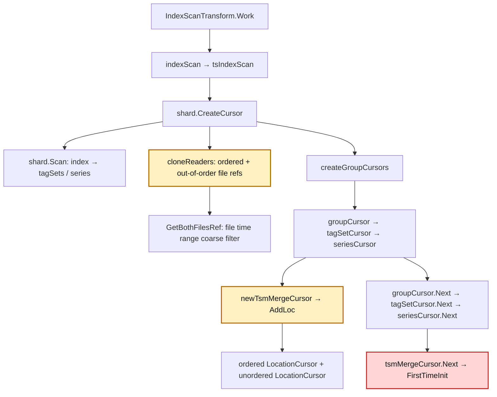
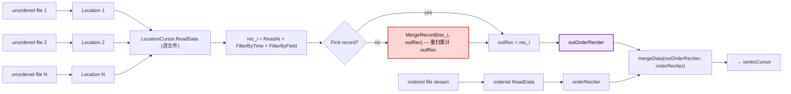
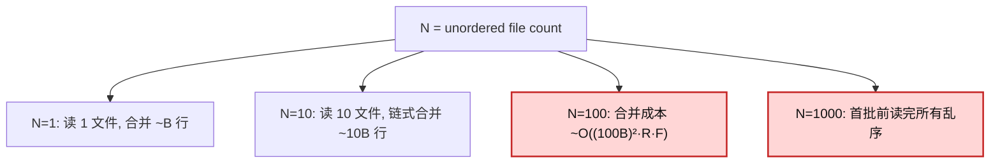
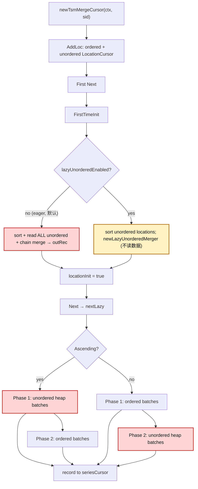
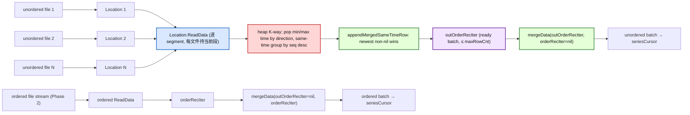
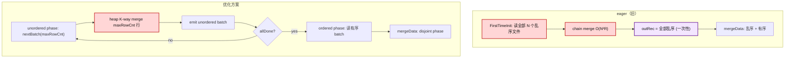
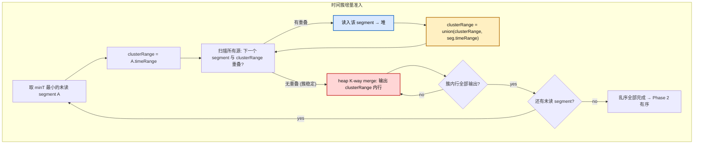
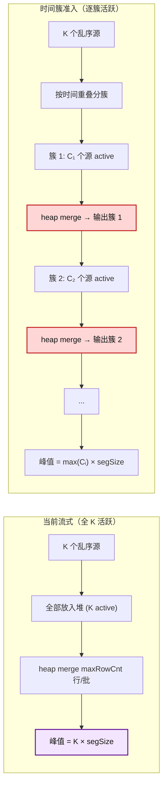

# tsmMergeCursor 乱序合并优化方案

> 本文档整合乱序合并优化的完整设计方案，包含问题分析、核心算法、复杂度对比、压测数据、正确性验证、
> 查询路径覆盖、未来演进及端到端压测方案。纯方案讨论，不含实现状态。

---

## 目录

1. [背景与目标](#1-背景与目标)
2. [问题根因](#2-问题根因)
3. [openGemini 数据布局](#3-opengemini-数据布局)
4. [总体方案](#4-总体方案)
5. [核心优化：堆式 K 路合并 + 流式分批](#5-核心优化堆式-k-路合并--流式分批)
6. [辅助优化](#6-辅助优化)
7. [流程图](#7-流程图)
8. [复杂度分析](#8-复杂度分析)
9. [性能压测数据](#9-性能压测数据)
10. [正确性验证](#10-正确性验证)
11. [查询路径覆盖矩阵](#11-查询路径覆盖矩阵)
12. [未来演进](#12-未来演进)
13. [端到端压测方案](#13-端到端压测方案)
    - [13.6 lazyUnorderedMergeMinLocations 阈值测试](#136-lazyunorderedmergeminlocations-阈值测试)
14. [关键前提与风险](#14-关键前提与风险)

---

## 1. 背景与目标

openGemini 是云原生分布式时序数据库，采用 LSM 存储引擎。写入数据按时间戳分为**有序（ordered）**和
**乱序（out-of-order）**两类，分别落盘为不同的 TSSP 文件。本文按**同一 series** 粒度讨论查询合并：
查询时需要将该 series 命中的有序与乱序数据合并后按时间有序返回。

优化针对两个核心问题：

1. **内存/GC 压力**：`tsmMergeCursor.FirstTimeInit` 在非聚合路径中把所有命中的乱序 location 读空，
   链式合并成一个完整 `outRec`。乱序文件多时 `outRec` 巨大，内存峰值高、GC 抖动。
2. **总查询性能差**：链式合并“读一个 record，与累计 outRec 合并一次”，每次 merge 重扫/重拷累计
   `outRec`，复杂度 `O(N²·R)`（N 个乱序文件、每文件 R 行）。乱序文件多时查询明显变慢。

最初的问题信号来自查询 span 中 `unorder_duration`（常量 `unorderDuration = "unorder_duration"`）异常偏高：
大量时间消耗在 `FirstTimeInit` 的 unordered 读取与链式合并阶段，而非 ordered 读取或上层算子。

**核心目标场景**：大 field（尤其 KB 级 string 字段）+ 多 unordered 文件 + unordered 文件间时间范围高重叠
但实际数据/timestamp 不大量重复 + 全局多 segment、单文件通常 1-2 segment。在该场景下，eager
`MergeRecord` 频繁进入 overlap 分支并反复重拷贝大 string 累计 `outRec`，`unorder_duration` 被显著放大；
lazy heap merge 的主要收益是避免链式累计重拷贝和降低分配/GC。

**成功指标**：乱序文件较多的场景下，总查询耗时下降、分配/GC 下降，峰值内存持平或下降；乱序文件少时不退化。

---

## 2. 问题根因

### 2.1 查询调用链



- `GetBothFilesRef`：文件数为 `ordered + unordered`，只做文件级时间粗过滤。
- `AddLoc`：对每个 series 遍历 unordered 文件做 `Location.Contains`（bloom + metaIndex + chunkMeta），
  放大因子 `S × N`（S 个 series、N 个乱序文件）。
- `FirstTimeInit`：读完全部命中 unordered 数据 + 链式合并，是性能瓶颈。

### 2.2 链式合并的 `O(N²R)` 来源



每次 `MergeRecord(rec_k, outRec)` 扫描累计 `outRec`（~k·R 行）+ 新 rec（R 行），k=1..N 求和得
`O(N²·R·F)`（F = 字段数）。`outRec` 持有全部乱序数据直到 `mergeData` 消耗完。

### 2.3 乱序文件数量放大



N 越大，链式合并的累计重扫越严重，内存峰值 = 全部乱序行。

---

## 3. 同一 series 的数据文件前提

### 3.1 文件间有序性与重叠关系

本方案的正确性以同一 series 的以下文件级前提为基础：

1. **ordered 文件之间全局有序**：ordered 文件按文件 seq 顺序即可得到该 series 的全局时间顺序；
   文件之间无时间重叠、无重复 timestamp。ordered 侧因此可视为一个已经排好序的单调流。
2. **unordered 与 ordered 之间无重叠**：同一 series 的 unordered 时间范围与 ordered 时间范围不重叠。
   在当前 TSStore flush 语义下，unordered 是更旧的一侧，ordered 是更新的一侧。
3. **unordered 文件之间无全局顺序**：同一 series 的 unordered 文件之间可能时间交错、重叠、重复；
   unordered 文件集合必须做归并、去重和同 timestamp 覆盖处理。

写路径 `mutable.tsMemTableImpl.WriteRows` → `appendFields` 追加行到 `WriteRec.rec`，跟踪
`lastAppendTime`/`firstAppendTime`/`timeAsd`。flush 前按时间排序；flush 时
`SplitRecordByTime(rec, flushTime)` 按已落盘有序最大时间 `flushTime`（来自 `mmsIdTime.Get(sid)`）切分：

- `time > flushTime` → **ordered**（更新）
- `time <= flushTime` → **unordered**（更旧）

二者在 `flushTime` 处严格不相交，**乱序是更旧的那段，有序是更新的那段**。首次 flush（无有序文件）
`flushTime = MinInt64`，全部 ordered。

### 3.2 对查询输出的影响

在上述前提下，升序查询 `[A, B]` 的输出顺序是：**先输出归并去重后的 unordered(旧)，再输出 ordered(新)**。
ordered 侧不需要参与 K 路堆合并；堆只负责把 unordered 文件集合归并成一个与 eager `MergeRecord`
语义等价的有序去重流。

降序查询：**有序(新) → 乱序(旧)**。

---

## 4. 总体方案

| 层 | 范围 | 说明 |
|---|---|---|
| **核心优化** | 堆式 K 路合并 + `maxRowCnt` 流式分批 | 替换链式 `O(N²R)` 为 `O(M·logK)`；乱序流式归并输出 |
| **辅助优化** | dst 内存复用 + 观测指标 + ReInit 修复 | 降低分配/GC 压力；增加可观测性；修复 cursor 复用 bug |

核心优化通过 feature flag 控制（默认关），对升序/降序非聚合、非 limit-cut、非 Prom 查询生效。

---

## 5. 核心优化：堆式 K 路合并 + 流式分批

### 5.1 核心思路

在 §3 的同一 series 文件前提下，ordered 侧已经是按 seq 排好的全局有序流，且与 unordered
不重叠。当前 TSStore flush 语义下 unordered 比 ordered **更旧**，所以两侧不需要交错合并或跨两侧延迟准入：

- 升序输出 = **归并去重后的 unordered(旧) → ordered(新)**。
- 降序输出 = **ordered(新) → 归并去重后的 unordered(旧)**。

基于此，优化方案为：**只对 unordered 文件集合做堆式 K 路归并，按 `maxRowCnt` 流式分批输出，
再按查询方向拼接 ordered/unordered 两个 disjoint phase**。合并复杂度 `O(M·logK)`（M = unordered
总行数，K = 命中的 unordered location 数），替换链式 `O(N²·R)`；输出按 `maxRowCnt` 分批，每批只
合并最多 `maxRowCnt` 个输出行（而非构造完整 unordered `outRec`），降低累计拷贝和分配峰值。

### 5.2 组件设计

**`lazyUnorderedMerger`**（`engine/unordered_lazy_merge.go`）：
- 持有 `sources []*unorderedSource`（每个乱序 location 一个）和 `heap lazyMergerHeap`（`container/heap`）。
- `unorderedSource`：`loc`（`immutable.Location`）、`seq`（文件序列号，越大越新）、`rec`（当前 segment
  的 record）、`pos`、`done`、`inHeap`。
- `nextBatch(maxRows)`：unordered-only 归并，按 `maxRows` cap 输出。
  每源只持当前 1 个 segment，耗尽才读下一个 → 堆 live = K × segmentSize。
- 堆序：随查询方向切换；升序按当前行时间最小优先，降序按当前行时间最大优先；同时间 `seq` 降序
  （最新者先 pop）。
- `appendMergedSameTimeRow`：同时间组按 newest→oldest 折叠，每列取最新非 nil 值，等价于 `mergeRecRow`
  折叠。所有输入 record 共享 `ctx.schema` 时可按列下标对齐；否则必须按字段名对齐。
- `isAborted` 回调：合并循环顶检查，abort 时 `return nil, nil`（丢弃半成品）。

**逐 segment lazy read**：
- `unorderedSource.readNext` 通过 `Location.ReadData` 读取下一个与查询时间范围重叠的 segment，
  应用 `FilterByTime`/`FilterByField`。
- `Location.HasNext()` 判断 source 是否耗尽；`Location.Sequence()` 提供同 timestamp 覆盖优先级；
  `LocationCursor.LocationAt(i)` 用于构建 source 列表。

**`nextLazy`**（`engine/tsm_merge_cursor.go`）两阶段：
- 升序：先 `lazyMerger.nextBatch(maxRowCnt)` 流式输出 unordered，再读 ordered。
- 降序：先读 ordered，ordered 耗尽后再 `lazyMerger.nextBatch(maxRowCnt)` 流式输出 unordered。
- ordered 与 unordered disjoint，不需要用 ordered.min/ordered.max 做跨两侧延迟准入。

### 5.3 正确性不变式

1. **ordered 全局有序**：同一 series 的 ordered 文件按 seq 顺序全局有序，文件间无重叠、无重复。
   ordered 侧可作为单调流在对应 phase 直接输出。
2. **unordered/ordered disjoint**：同一 series 的 unordered 与 ordered 不重叠。当前 TSStore 语义下
   unordered 旧、ordered 新，升序输出 = unordered → ordered，降序输出 = ordered → unordered。
   两种方向都只需要切换 phase 顺序，不需要跨两侧延迟准入。若未来存在 unordered/ordered 时间范围交错，
   则需要重新引入跨两侧的时间归并，不能固定两段式输出。
3. **unordered 文件间 K 路归并**：unordered 文件之间可能乱序、重叠、重复。heap key 必须是当前行
   时间；文件 seq 只用于同 timestamp 覆盖优先级，不能作为归并顺序。
4. **同 timestamp 完整合并**：输出 timestamp `t` 前，必须收齐所有可能产生 `t` 的 unordered row，
   按 newest→oldest 做列级 nil 合并，并只输出一行。若同一 source 可能在后续 segment/batch 继续
   产生 timestamp `t`，必须继续 admit/advance 该 source 后再输出；否则需要把“同一 source 内无重复
   timestamp 跨 segment”作为明确文件前提。
5. **字段对齐**：同 timestamp 合并若按列下标读取，必须证明所有输入 record 都按 `ctx.schema` 构建且
   字段顺序一致；否则必须像 `mergeRecRow(newRec, oldRec, ...)` 一样按字段名归并。
6. **终止**：堆空且所有源 `done` 时 `nextBatch` 返回 nil；`allDone()` 判定 unordered phase 完成；
   ordered 也读完返回 nil。无死循环。
7. **abort**：`nextBatch` 循环顶检查 `isAborted`，abort 时丢弃半成品返回 nil。

> **保护范围**：`lazyUnorderedEnabled()` 限制非聚合、非 limit-cut、非 Prom。其余查询形状保留 eager，
> 避免把上述前提之外的路径纳入灰度。

### 5.4 小 N 阈值（防退化）

`lazyUnorderedMergeMinLocations`（默认 64，`atomic.Int32`，可调）：命中的乱序 location 数低于阈值时
回退 eager。benchmark 显示交叉点约 N=100（N=10 惰性慢 2.1×，N=100 持平，N=1000 快 5.4×）。阈值保证
开启 flag **不退化**小 N 常见场景。0 表示禁用阈值（测试用）。默认值需通过 §13.6 的 eager/lazy
对照压测按生产 workload 校准。

### 5.5 Feature flag 与适用范围

`lazyUnorderedMergeEnabled`（`atomic.Bool`，默认关）：`SetLazyUnorderedMergeEnabled` 运行时切换。
`lazyUnorderedEnabled()` 限制：非聚合（`len(ops)==0`）、非 limit-cut、非 Prom；升序和降序都走同一
lazy unordered merger，只是 `nextLazy` 的 phase 顺序相反。其余形状回退 eager。

---

## 6. 辅助优化

### 6.1 dst 内存复用

非聚合 `FirstTimeInit` 循环里的 `dst := record.NewRecordBuilder(...)` 改为从 `unorderPool`（环形，
`unorderRecordNum = 2`）获取。

**关键约束**：`record.Record.mergeRecordSchema` 向 receiver 的 schema **追加**，因此池化的 record 只能
作为 `MergeRecord` 的 `newRec`/`oldRec` 参数（只读），**不能**作为 receiver。合并 scratch 仍用
`var mergeRecord record.Record`。`reset()` 先 `outOrderRecIter.reset()`（释放引用）再 `unorderPool.Put()`。

### 6.2 观测指标

新增 span 计数（`FirstTimeInit` 内 `CreateCounter` 幂等创建）：
- `unordered_location_count`：命中的乱序 location 数（放大因子 K）。
- `unordered_merge_count`：非聚合路径的链式合并次数。
- `lazy_unordered_overlap_fallback_count`：lazy 初始化前无法用 ChunkMeta 证明
  `unorderedMax < orderedMin`，本 cursor 回退 eager 的次数。

### 6.3 ReInit 生命周期修复

`ReInit`/`ReInitWithShard` 复用 cursor 给新 series 时，重置 `c.locationInit = false; c.lazyMerger = nil`，
使新 series 重新跑 `FirstTimeInit`。否则：
- 核心优化路径：`nextLazy` 会把上一个 series 残留的 stale `lazyMerger` 源排进新 series 输出 → 跨 series
  数据错乱。
- eager 路径：`locationInit` 残留导致 `FirstTimeInit` 被跳过，新 series 乱序数据不读。

---

## 7. 流程图

### 7.1 初始化与两阶段迭代



- eager 分支（默认）保留原 `FirstTimeInit` 全量读 + 链式合并。
- 核心优化分支：只对 unordered 文件集合做堆式归并并按 `maxRowCnt` 流式输出；ordered 侧已全局有序。
  升序 phase 顺序是 unordered → ordered；降序 phase 顺序是 ordered → unordered。

### 7.2 堆式 K 路合并数据流



- 旧：`ReadData` 读到 EOF，链式 `MergeRecord` 累计拷贝 `O(N²R)`，`outRec` = 全部乱序。
- 新：堆 K 路合并 unordered 文件集合，`O(M·logK)`；每源只持当前 segment；输出按 `maxRowCnt` 分批。

### 7.3 eager vs 优化方案对比



- eager 首批前读完全部乱序、链式合并构造完整 `outRec`（`O(N²R)` + 全量内存）。
- 优化方案按 `maxRowCnt` 流式堆合并 unordered。首批需要准入各 active source 的当前 segment，但只
  产出最多 `maxRowCnt` 个输出行；升序先输出 unordered phase，降序先输出 ordered phase。

---

## 8. 复杂度分析

### 8.1 链式 `O(N²R)` vs 堆式 `O(M·logK)`

链式：每次 `MergeRecord(rec_k, outRec)` 重扫累计 `outRec`（~k·R 行），k=1..N 求和 = `O(N²·R·F)`。
堆式：每个 unordered 输出行处理一次（pop/push `O(logK)` + 列合并 `O(F)`），总计
`O(M·(logK + F))` = `O(N·R·(logN + F))`。此外，按 batch admit idle source 会带来
`O(K·B)` 的扫描成本（B = 输出 batch 数）；通常 `maxRowCnt` 足够大时该项小于逐行 heap 成本，但
小 `maxRowCnt` + 大 K 场景需要纳入压测。

复杂度对比图（R=20，理论常数=1）：


纯复杂度比 `N/log₂N`：N=100 约 15×、N=1000 约 100×。实测因常数因子差距更小——N=100 基本持平、
N=1000 约 5.4×——但发散趋势一致。

### 8.2 eager 两分支（Overlap / NonOverlap）

eager `MergeRecord` 在 `MergeRecordLimitRows` 按时间范围分两个分支：

| 分支 | 触发 | 实现 | 常数 |
|---|---|---|---|
| **NonOverlap** | newRec 与 outRec 时间不相交 | `AppendColVal` 整段批量拷贝 | 低 |
| **Overlap** | 时间相交 | per-row 双指针 + `mergeRecRow` 列级 nil 合并 | 高（~2-3× NonOverlap） |

两者都是 `O(N²·R·F)`（累计重扫）。堆式 `O(N·R·(logN+F))` 无重扫，常数 `c_l > c_o > c_n`（堆指针跳转
+ per-row 列合并，cache 局部性差）。overlap 度影响堆式的**常数**（同时间组越大 churn 越多）但不改大 O。

| 场景 | eager 分支 | 优化方案 | crossover(N*) | N=1000 实测 |
|---|---|---|---|---|
| 不重叠（g≈1） | NonOverlap | `O(NR(logN+F))` | ~100 | 5.4× 更快 |
| 全重叠（g=K=N） | Overlap | `O(NR(logN+F))`（常数↑） | >100 | 大 N 理论反超 |

### 8.3 核心场景：大 string + 范围高重叠但数据不重复

本次优化的核心线上场景不是“timestamp 大量重复后去重行数很小”，而是：

- 字段值很大：string field 常见 KB 级。
- unordered 文件多：K（命中的 unordered location 数）大，通常接近文件数 N。
- unordered 文件之间 **segment 时间范围高重叠**，eager 容易进入 `MergeRecord` 的 overlap 分支。
- 实际数据/timestamp 并不大量重复，去重后行数 `U` 接近总 unordered 行数 `M`。
- 当前查询范围内全局有多个 segment，但单文件通常只有 1-2 个 segment。

该场景下，eager 的主要放大点是：每读一个 unordered record，就与累计 `outRec` 做 overlap merge，
累计 `outRec` 中的 KB 级 string 会被反复 `AppendColVal` 拷贝，导致 `unorder_duration` 和分配/GC
显著升高。lazy heap merge 每个输出行只进入最终输出批次一次，避免链式累计重拷贝，因此对总耗时和
分配量有直接收益。

峰值内存判断也要按“范围重叠但数据不重复”区分：

| 情况 | eager live | lazy live | 判断 |
|---|---|---|---|
| 高范围重叠、数据不重复、单文件 1 segment | 完整 unordered `outRec`（≈M）+ merge scratch | K 个当前 segment（≈M）+ 输出 batch | 持平或 lazy 略低 |
| 高范围重叠、数据不重复、单文件 2 segment | 完整 unordered `outRec`（≈M）+ merge scratch | 约 1/2 unordered 输入 + 输出 batch | lazy 下降明显 |
| 高范围重叠、timestamp 大量重复（U << M） | 去重后 `outRec` 较小 | K 个当前 segment 仍可能接近 M/S | lazy 可能内存不占优，需 fallback |

因此，本方案对“范围高重叠但数据不重复”的大 string 场景是核心收益场景；对“真实 timestamp 大量重复”
则需要用 same-time group 规模和估算内存判断是否回退 eager。

---

## 9. 性能压测数据

### 9.1 微基准（mock，无 I/O）

`engine/tsm_merge_cursor_bench_test.go`，mock 读（无 I/O，反映 CPU/分配）。数据布局为**真实布局**
（乱序旧、有序新，disjoint）。阈值置 0 以测量纯优化路径。

#### Total drain（drain 到完成 = 真实查询指标）

| N | Eager | 优化方案 | 加速比 | B/op |
|---|---|---|---|---|
| 10 | 20.5 µs | 42.6 µs | 慢（小 N → 阈值路由 eager） | 46 KB vs 25 KB |
| 100 | 574 µs | 613 µs | 持平 | 2.2 MB → 276 KB（8×） |
| 1000 | 44.0 ms | 8.14 ms | **5.4×** | 175 MB → 2.75 MB（**64×**） |

#### First packet（首包延迟）

| N | Eager 首包 | 优化方案首包 | 加速比 |
|---|---|---|---|
| 10 | 22.0 µs | 42.7 µs | 慢（小 N） |
| 100 | 599 µs | 392 µs | 1.5× |
| 1000 | 44.4 ms | **1.57 ms** | **28×** |

首包改善来自避免构造完整 unordered `outRec` 和链式累计拷贝。需要注意：首批仍可能准入每个 active
source 的当前 segment，因此“首包只合并 `maxRowCnt` 行”指最多产出 `maxRowCnt` 个输出行，不代表只读
`maxRowCnt` 行。

### 9.2 多段 vs 单段（峰值内存分析）

| 场景 | Eager | 优化方案 | 加速比 | B/op | maxHeapInuse |
|---|---|---|---|---|---|
| **MultiSeg** (N=100, S=10, R=20, M=20000) | 57.9 ms | 7.1 ms | **8×** | 175 MB → 3.1 MB（56×） | 24.0 MB → 14.5 MB（1.7×） |
| **SingleSeg** (N=100, R=200, M=20000) | 10.5 ms | 6.7 ms | 1.6× | 21.8 MB → 2.6 MB（8×） | 23.5 MB → 14.1 MB（1.7×） |

关键发现：
- **多段文件放大优化优势**：eager 随段数增长变差（N×S 次链式迭代），优化方案与段数无关（每行一次）。
  真实 TSSP 文件是多段的，所以这是实际场景。
- **峰值（maxHeapInuse）**：~1.7× 降低，但被运行时基线和分配量影响。优化路径的主要 live 数据约为
  `K × 当前 segment 行数 + 输出 batch`，不是 `maxRowCnt`。激进 GC 实验确认多段 live-peak（13.6 MB）
  < 单段（15.7 MB），源段效应存在但 M=20000 时数据峰值相对运行时基线太小。真实大 M（百万行）下
  峰值收益才显著。
- **单段不相交文件**：堆持 K 段 = M（全部数据），峰值无收益——这是当前方案的盲区，见 §12.5。

### 9.3 真实布局 vs 旧布局验证

| 布局 | N=1000 Eager | N=1000 优化方案 |
|---|---|---|
| 真实布局（ordered 新/unordered 旧） | 44.0 ms | 8.14 ms（5.4×） |
| 旧布局（ordered 旧/unordered 新） | 42.4 ms | 8.30 ms（5.1×） |

两种布局结果几乎一致 → **收益与布局无关**，来自堆合并算法 `O(M·logK)` vs 链式 `O(N²R)`。当前核心
路径不依赖跨两侧延迟准入：ordered/unordered 已经 disjoint，按查询方向输出两个 phase 即可。

---

## 10. 正确性验证

### 10.1 差分测试

以 eager 路径为 oracle，对优化路径逐行比较 `(time, value, isNil)`。

- **固定 edge case**：仅有序、仅乱序、乱序间同时间高 seq 覆盖、nil 列由旧源填补、disjoint 不重叠、
  小批流式、多有序文件。
- **3000 个随机用例**：1-3 有序文件、1-4 乱序文件、**disjoint 布局**（乱序时间 [1,20]、有序时间
  [21,40]，匹配 `SplitRecordByTime` 的 flush 边界）、含 nil 值、`maxRowCnt` 1-4 强制分批。
- **多段用例**：`mocTsspFileMultiSeg` + `NewChunkMetaWithSegs`，覆盖 segment 逐段读取。
- **same-time 完整性用例**：同 timestamp 横跨多个 unordered 文件、横跨 `maxRowCnt` batch 边界；
  若文件格式允许同一 source 内重复 timestamp，还必须覆盖同 timestamp 横跨同一 source 的 segment 边界。
- **schema 对齐用例**：查询字段缺失、不同字段集合、字段过滤后 record schema 变化时，验证 lazy 输出
  与 eager 按字段名合并结果一致，或证明该路径所有输入 record 均严格按 `ctx.schema` 构建。

差分测试覆盖**新增逻辑**（堆合并、同时间组、流式分批）；文件 I/O/过滤复用 eager 路径未改。

### 10.2 覆盖场景

- 仅有序、仅乱序（有序耗尽 fallback）
- 乱序间同时间高 seq 覆盖
- nil 列由旧源填补
- 同 timestamp group 不被 batch/segment 拆散
- 字段顺序与字段集合对齐
- disjoint 不重叠
- 小批 `maxRowCnt` 流式
- 乱序跨多个有序文件
- 多段文件 segment 逐段读取

---

## 11. 查询路径覆盖矩阵

| 路径 | 触发条件 | 乱序读取方式 | 覆盖? | 严重性 |
|---|---|---|---|---|
| TS 非聚合升序 | 默认 | 堆合并 + 流式分批 | ✅ | — |
| 降序非聚合 | `!Ascending` | 堆合并 + 流式分批 | ✅（§12.1） | — |
| limit-cut 非聚合 | `CanLimitCut` | eager 全量读 | ❌（§12.2） | 中 |
| Prom 查询 | `IsPromQuery` | eager（经 tsmMergeCursor） | ❌（未分析） | 中 |
| tsmMergeCursor 聚合 | `len(ops)>0` 且非 fileCursor | pre-agg meta | ❌ | 低 |
| **fileCursor 聚合** | `enableFileCursor`+`HasOptimizeAgg` | **eager 全量 drain** | ❌（§12.3） | 高 |
| 列存 CS/hybrid | `COLUMNSTORE` | 独立 reader | **不考虑** | — |
| 小 N | location 数 < 64 | eager | 设计回退 | — |

---

## 12. 已覆盖路径与未来演进

### 12.1 降序支持（已实现）

降序输出 = ordered(新) → unordered(旧)。由于同一 series 的 ordered 与 unordered 无交集，ordered
任一命中段的最小时间都在 unordered 最大时间之后，天然就是 unordered 侧的时间上界；因此
ordered/unordered 之间不需要跨两侧延迟准入。

当前代码已经按这个模型实现：

- `tsmMergeCursor.nextLazy` 按方向切 phase：升序先 `nextLazyUnorderedBatch()` 再 `nextLazyOrdered()`；
  降序先 `nextLazyOrdered()`，ordered 耗尽后再 `nextLazyUnorderedBatch()`。
- ordered locations 在 `FirstTimeInit` 中 `sort.Sort(c.locations)` 后，降序通过 `c.locations.Reverse()`
  重排；unordered locations 不依赖 location 顺序决定时间顺序，由 heap 按当前行时间归并。
- `lazyMergerHeap.Less` 已按 `ascending` 切换：升序 `ti < tj`，降序 `ti > tj`；同 timestamp 仍按
  `seq` 降序保证 newest wins。
- lazy unordered source 直接通过 `Location.ReadData` 逐 segment 读取；`ctx.Ascending=false` 时由
  `Location`/reader 处理 segment 与 record 方向。
- `TestLazyUnorderedMergeDifferential` 的固定用例和 3000 个随机 disjoint 用例同时覆盖 asc/desc，并以
  eager 为 oracle。

后续只需保持降序差分测试和真实多 segment 文件测试，不应再把降序列为未来工作。

### 12.2 limit-cut 支持

limit-cut 机制（`CanLimitCut`）：`itrsInitWithLimit` + `topNLinkedList` 按 `limitFirstTime` 砍 series。
`limitFirstTime` 全程只来自 ChunkMeta 元数据，不依赖读数据。limit-cut 不裁剪 unordered 的数据读取。

可兼容理由：`limitFirstTime` 在 `AddLoc`（`FirstTimeInit` 之前）算好；优化方案的 `nextBatch` 准入全部
乱序，`limitCursor` 取最早 `limit+offset` 行不会漏。放开前需补差分测试。

详见 `limit_cut_cursor_analysis.md`。

### 12.3 fileCursor 聚合路径

`enableFileCursor=true`（默认）且 `HasOptimizeAgg()` 时走 `fileLoopCursor`，不经 `tsmMergeCursor`。
`fileLoopCursor.initMergeIters` eager drain 全部乱序文件到 `mergeRecIters`。

fileCursor 的“消费一次”模型（sid 在首个 ordered 文件处消费并删除）与堆式流式合并不同。需重构为
per-sid 流式 unordered heap 合并。先做 `readData`（非 pre-agg）子路径，`readPreAggData`（meta 成本低）
后做。

### 12.4 schema/field 预过滤

`AddLocations` 在 `Contains` 命中后，若 ChunkMeta 的列与查询 schema 无交集则不加入 location。风险：
count(time)/aux/Prom 语义需验证。

### 12.5 时间簇增量准入

当前方案的盲区：**单段不相交文件**——堆持 K 段 = M（全部数据），峰值无收益。时间簇增量准入解决此
盲区：按时间重叠关系把乱序 segment 分成不相交簇，逐簇处理。

#### 设计：区间并集 flood-fill

```
1. 取所有源中 minT 最小的 segment A，初始化 clusterRange = A.timeRange [t1, t2]
2. 扫描所有源的下一个未读 segment，若 timeRange 与 [t1, t2] 重叠：
   a. 读入该 segment，加入堆
   b. clusterRange = union(clusterRange, segment.timeRange) → 扩展 [t1, t2]
   c. 回到步骤 2
3. 无新 segment 重叠 → 簇稳定，heap K-way merge 输出 [t1, t2] 内的行（≤ maxRowCnt/批）
4. 簇内所有行输出完 → 回到步骤 1，从下一个未读 segment 开始新簇
```

#### 流程图



#### 当前流式 vs 时间簇对比



#### 对比

| 维度 | 当前流式 | 时间簇增量准入 |
|---|---|---|
| 活跃源数 | K（全部） | C（当前簇，C << K 当簇小时） |
| 单段不相交文件峰值 | K×R = M（无收益） | C×R（大降） |
| I/O 延迟 | 无 | 有（只读当前簇） |
| 堆操作 | O(logK) | O(logC) |
| 簇检测开销 | 无 | O(K²) flood-fill 或 O(K logK) 预排序 |
| 文件全重叠时 | K 活跃 | 退化成一簇 = K + 额外开销 |
| 代码复杂度 | 低 | 高 |

#### 适用判断

| 乱序写入模式 | 簇结构 | 收益 |
|---|---|---|
| 分散不同时间点（IoT 补传） | 多小簇 | 峰值大降 + I/O 延迟 |
| 集中同一时段（批量回填） | 一个大簇 | 无收益 + 额外开销 |

前置：先用真实数据验证乱序文件的时间簇分布。

### 12.6 全重叠 fallback

所有乱序与有序同时间时，优化方案无延迟收益，且 per-row `AppendColVal` 合并慢于 eager 向量化
`MergeRecord`。fallback 触发条件应同时考虑 N 与 overlap 度（同时间组规模 g）：g 大时常数升高、
crossover 推后、内存收益消失 → 回退 eager。

### 12.7 后台分层合并

乱序文件过多的 shard/measurement 触发后台预合并/分层 compact，从源头降低 N。长期 compaction 侧工作。

### 12.8 其他

- **config 接入**：`lazyUnorderedMergeEnabled` 接 `Query` 配置项。
- **merger 池化**：源 record 与输出 batch 进一步池化降分配。

---

## 13. 端到端压测方案

### 13.1 环境

单机 `ts-server`（standalone），固定硬件。关键配置控制 N（乱序文件数）并冻结 compaction：

| 配置 | 取值 | 作用 |
|---|---|---|
| `shard-mutable-size-limit` | 小（1MB） | 每批次写入即 flush |
| `write-cold-duration` | 短（1s） | 加速 flush |
| `max-unordered-file-number` | 大（2000） | 抑制合并 |
| `max-concurrent-compactions` | 0 | 关闭 compaction |
| `max-rows-per-segment` | 可调 | 控制 R |

### 13.2 数据模型与写入

- **有序区**：S series × T 点，升序写入 `[t0, t0+T)`。
- **乱序区**：N 批次，每批次 R 行/series，时间戳早于有序区，每批次 flush = 1 乱序文件。
- **重叠度**：no-overlap / partial / full（三组数据集）。full-overlap 需拆成两类：
  - **范围重叠但 timestamp 不重复**：segment timeRange 高重叠，但每个文件写同一时间窗口内不同时间点
    （例如按 offset/interleave 分布）；
    这是大 string 核心收益场景。
  - **timestamp 大量重复**：同一 timestamp 在大量 unordered 文件中重复，用于验证 same-time group 常数和
    fallback 条件。
- **大 field 场景**：增加 KB 级 string 字段（例如 1KB/4KB/16KB），单文件 1-2 segment，同时全局有多
  segment，用于复现 `unorder_duration` 偏高问题。
- 变量：N∈{1,10,32,64,100,200,500,1000}、R∈{20,100,1000}、S∈{1,100,10000}、F∈{1,5,20}。

### 13.3 查询负载

- 主查询：非聚合升序/降序全范围 `SELECT * ...`。
- 回归：聚合、limit-cut、Prom。

### 13.4 指标

总耗时 p50/p95/p99、峰值堆（pprof + RSS）、GC、CPU profile、磁盘 I/O、span 计数。重点观察
`unorder_duration`、`unordered_location_count`、`unordered_merge_count`。flag on/off 对照。

### 13.5 预期

| 场景 | 预期 |
|---|---|
| N=1000, no-overlap, 升序/降序非聚合 | 总耗时 ↓ ~5×、峰值堆 ↓（多段显著） |
| 大 string + 多 unordered + 范围高重叠但数据不重复 + 单文件 1-2 segment | `unorder_duration` 明显下降；分配/GC 明显下降；峰值堆持平或下降 |
| N=100 | 持平 |
| N<64 | 走 eager 不退化 |
| timestamp 大量重复的 full-overlap | 收益不确定，记录 same-time group 常数和 fallback 依据 |
| 聚合/limit-cut/Prom | flag on 与 off 一致，继续走 eager |

### 13.6 `lazyUnorderedMergeMinLocations` 阈值测试

`lazyUnorderedMergeMinLocations` 只按命中的 unordered location 数 K 决策，不能感知 field 大小、segment
数、重叠度或查询方向。因此“最佳值”不是单点真理，而是生产 workload 加权后的保守阈值：小 K 不退化，
核心大 string 场景尽早走 lazy。

#### 13.6.1 测试方法

不要直接扫描 threshold 配置测结果，而是先强制 eager/lazy 各跑完整矩阵，再离线推导 threshold：

1. eager baseline：关闭 `lazyUnorderedMergeEnabled`。
2. lazy baseline：开启 `lazyUnorderedMergeEnabled`，并设置 `lazyUnorderedMergeMinLocations=0`，强制所有
   非聚合 TS 查询走 lazy。
3. 对每个 case 记录 K、首包延迟、总耗时、分配、峰值内存和 GC。
4. 离线模拟任意候选阈值 T：
   - `K < T` 使用 eager baseline 结果。
   - `K >= T` 使用 lazy baseline 结果。
5. 用生产 K 分布和慢查询权重加权，选择收益最大且小 K 不退化的 T。

这种方法可以避免每换一个 threshold 都重跑全量数据，也能清晰看到每个 K 的 eager/lazy crossover。

#### 13.6.2 K 与候选阈值

K 取值覆盖小 N、拐点区和大 N：

| 类型 | 取值 |
|---|---|
| K 矩阵 | 0, 1, 2, 4, 8, 16, 24, 32, 48, 64, 96, 128, 192, 256, 512, 1024 |
| 候选 threshold | 0, 16, 32, 48, 64, 96, 128, 192, 256, disabled |

`0` 表示 flag on 后总是 lazy；`disabled` 表示总是 eager。最终默认值优先从 `32/64/96/128` 中选择，
便于解释和灰度。

#### 13.6.3 场景矩阵

阈值测试必须覆盖 guardrail 场景和核心收益场景：

| 维度 | 取值 |
|---|---|
| field 类型 | int-only、small string、1KB string、4KB string、16KB string |
| field 数 | 1、5、20 |
| 每文件行数 R | 20、100、1000 |
| 单文件 segment 数 | 1、2、8 |
| unordered 范围关系 | no-overlap、partial-overlap、range full-overlap 但 timestamp 不重复、timestamp 大量重复 |
| 查询方向 | asc、desc |
| `maxRowCnt` | 100、1000、10000 |
| 查询范围 | 全范围、只命中部分 unordered |
| nil 情况 | 无 nil、稀疏 nil、同 timestamp 字段互补 |

核心场景需要单独加权，不应被 int-only microbenchmark 稀释：

```text
大 string + K 大 + 范围高重叠但 timestamp 不大量重复 + 全局多 segment + 单文件 1-2 segment
```

#### 13.6.4 指标与判定

每个 case 至少记录：

- 首包延迟 p50/p95/p99
- 总耗时 p50/p95/p99
- `B/op`、`allocs/op`
- peak heap / RSS
- GC 次数与 pause
- `unorder_duration`
- `unordered_location_count`
- `unordered_merge_count`
- `lazy_unordered_overlap_fallback_count`

对每个 K 计算：

```text
first_packet_ratio = lazy_first_packet_p95 / eager_first_packet_p95
total_ratio        = lazy_total_p95 / eager_total_p95
alloc_ratio        = lazy_alloc_bytes / eager_alloc_bytes
peak_ratio         = lazy_peak_heap / eager_peak_heap
```

建议判定规则：

```text
lazy_win:
  total_ratio <= 0.95
  且 first_packet_ratio <= 1.00
  且 peak_ratio <= 1.10

lazy_not_regress:
  total_ratio <= 1.03
  且 first_packet_ratio <= 1.05
  且 peak_ratio <= 1.15
```

单个场景的 crossover：

```text
K_cross = 最小 K，使 lazy 在该 K 及后续连续 2 个 K 点都满足 lazy_not_regress
```

#### 13.6.5 生产加权与推荐值

上线前需要采集 3-7 天生产分布：

- `unordered_location_count` 的 P50/P75/P90/P95/P99
- `unorder_duration` 按 K 的贡献占比
- 查询方向、field 类型、field 数、返回行数、时间范围
- 慢查询中 K 与大 string 的相关性

离线评分：

```text
score(T) =
  Σ workload_weight(case) * latency_p95(case, T)
  + regression_penalty(T)
  + memory_penalty(T)
```

推荐阈值选择：

1. 对 guardrail 场景取满足 `lazy_not_regress` 的最大 `K_cross`。
2. 若该值会错过核心大 string 慢查询的大部分收益，用生产权重下的 `score(T)` 修正。
3. 向上取整到 `32/64/96/128` 中的一个值。

报告输出格式：

| 场景 | K_cross | 结论 |
|---|---:|---|
| int-only, 1 segment | 96 | guardrail |
| int-only, 8 segments | 64 | guardrail |
| 1KB string, range overlap no duplicate | 32 | core |
| 4KB string, range overlap no duplicate | 16 | core |
| timestamp 大量重复 | 128+ | fallback/guardrail |
| desc 查询 | 与 asc 接近 | confirm |

示例结论格式：

```text
推荐 lazyUnorderedMergeMinLocations = 64
原因：
- K < 64 的 int-only/small-field 场景 lazy 无稳定收益或轻微退化；
- K >= 64 的核心大 string 场景 lazy p95 总耗时下降 X%，unorder_duration 下降 Y%，alloc 下降 Z%；
- 生产 K>=64 覆盖主要慢查询，占 unorder_duration 总量 A%。
```

#### 13.6.6 执行命令

microbenchmark：

```bash
go test ./engine -run '^$' -bench 'Benchmark.*(FirstPacket|Total|Peak)' -benchmem -count=10
```

对比：

```bash
benchstat eager.txt lazy.txt
```

真实文件压测必须额外覆盖 KB string，因为 mock benchmark 无法完整反映真实 string copy、record 过滤和
TSSP reader 行为。

---

## 14. 关键前提与风险

### 14.1 文件前提必须可验证

本方案不是通用替换，必须在同一 series 粒度满足 §3 的文件前提：

- ordered 文件按 seq 全局有序，文件间无重叠、无重复。
- unordered 与 ordered 不重叠；当前 TSStore 语义下 unordered 更旧。
- unordered 文件之间可能重叠、重复，因此必须由 heap path 完整归并去重。

堆合并逐 segment 读，还依赖单个 location 内部按时间推进。openGemini 的
memtable 落盘前按时间排序，segment timeRange 应按 segPos 单调有序（“out-of-order”是文件间相对概念）。
需用真实落盘文件 + 多段差分测试验证。

### 14.2 disjoint 布局前提

核心优化正确性依赖乱序旧、有序新、disjoint（`SplitRecordByTime` 保证）。若乱序与有序时间重叠
（非正常场景），固定两段式 phase 顺序会错；升序/降序都需要重新退化为跨两侧时间归并。
`lazyUnorderedEnabled()` 限制非聚合、非 limit-cut、非 Prom。

已实现的降级策略放在 lazy 初始化前：

1. 扫描当前 cursor 命中的 ordered/unordered `Location.GetChunkMeta().MinMaxTime()`，不读取数据。
2. 计算 `orderedMin = min(ordered.minTime)` 与 `unorderedMax = max(unordered.maxTime)`。
3. 仅当 ordered 或 unordered 为空，或严格满足 `unorderedMax < orderedMin` 时启用 lazy。
4. 若 metadata 缺失，或 `unorderedMax >= orderedMin`，本 cursor 不创建 `lazyUnorderedMerger`，直接落回
   eager `FirstTimeInit`，并计数 `lazy_unordered_overlap_fallback_count`。

`unorderedMax >= orderedMin` 同时覆盖三类异常：真实时间重叠、相同 timestamp 边界、unordered 比 ordered
更新。相同 timestamp 也必须回退，因为 lazy 的固定 phase 拼接无法做跨侧去重/列级覆盖；eager 的
`mergeData`/`MergeRecordByMaxTimeOfOldRec` 能在这些异常下继续做通用时间归并。

该检查是保守判断：ChunkMeta 是粗粒度范围，查询过滤后实际数据可能已经 disjoint；这种 false positive 只会
损失本 cursor 的性能收益，不会改变结果。降序不需要额外逻辑，仍然使用同一组 locations 和同一条
`unorderedMax < orderedMin` 前提，只是 `nextLazy` 的 ordered/unordered 输出顺序相反。

### 14.3 ReInit 复用

cursor 复用时必须重置 `locationInit`/`lazyMerger`，否则跨 series 数据错乱。

### 14.4 全重叠退化

全重叠（同时间组 = K）时优化方案常数升高、crossover 推后、内存收益消失。需 fallback 机制（§12.6）。

### 14.5 same timestamp 完整性

旧 eager 路径由 `MergeRecord(newRec, oldRec)` 自然保证同 timestamp 去重和列级 nil 覆盖；heap path 必须
显式保证输出 timestamp `t` 前已经收齐所有 unordered candidate。尤其要确认同 timestamp 不会被
`maxRowCnt` batch 边界、segment 边界或同一 source 的后续读取拆成多行输出。上线前必须有差分测试覆盖。

### 14.6 schema 对齐风险

`appendMergedSameTimeRow` 若按列下标合并，必须证明所有输入 record 都按 `ctx.schema` 构建且字段顺序一致。
如果查询字段过滤、schema 演进或 reader 返回子 schema 可能改变字段集合，则必须改为按字段名归并，否则
同 timestamp 覆盖会把错误字段合在一起。
