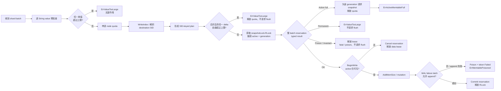
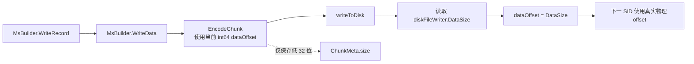
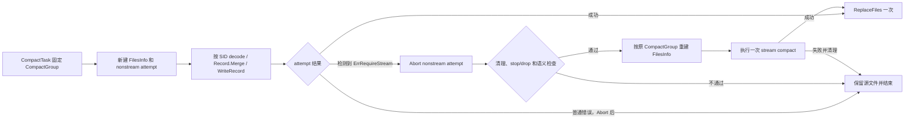
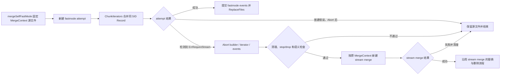
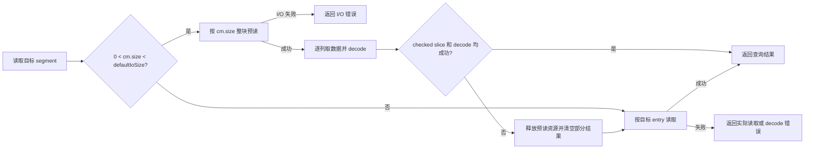

# TSStore uint32 溢出修复第一步设计

> 关联文档:
> - `uint32-offset-overflow-panic-analysis-tsstore.md`
> - `uint32-offset-overflow-fix-codex-dialogue.md`
> - `uint32-offset-overflow-fix-step1-delivery-order.md`（第一步开发交付、依赖顺序与发布门禁）
> - `uint32-offset-overflow-fix-phase2-design.md`（第二步:部署与运行治理，待按本文件的受控回绕和兼容性决策重写；当前内容不作为第一步实现依据）
>
> 开发阶段:本文件定义第一步的安全修复与验证，不实现运行时灰度开关、按租户/节点放量和开关式回滚能力。部署与运行治理拆到第二步设计；一旦产生 `ChunkMeta.size` 回绕文件，不支持回滚到不能识别该文件的旧版本。
>
> 目标:在不改变 TSSP 线格式、不引入同 SID 按 chunk bytes 拆文件的前提下，阻止本次实际改造路径中的 TSStore String field `ColVal.Offset` 和 TSSP `Segment.size` 回绕，确保所有 writer 使用真实 int64 物理位置；允许 `ChunkMeta.size` 受控回绕，并使查询、compact、merge 不再把它当作真实 chunk 长度。stream merge unordered 聚合是明确未覆盖项，在独立优化完成前不纳入本步骤的全局安全承诺。

---

## 一、范围与前提

**主线：阻止本次实际改造路径中的 TSStore 持久化 String field `ColVal.Offset` 在跨 record、segment 累积时回绕。**

**配套：在本次已覆盖路径中只允许 `ChunkMeta.size` 受控回绕；任何真实物理 offset 和 `Segment.size` 都不得随之回绕或错位。**

### 1. 修复范围

**仅覆盖 TSStore（ts）的写入、落盘、compact、merge 和读取链路。**

- 包含 memtable append、snapshot/flush、非流式 compact/merge、stream compact、stream merge 和查询读取。
- ColumnStore（cs）、colstore compact、detached primary key/data/index 等路径不在本方案范围内。

### 2. 保护对象与允许的例外

**本次新增或修改的 mutation、编码和写出路径必须保证 `ColVal.Offset`、TSSP string block offset/length 和 `Segment.size` 可表示；只有 `ChunkMeta.size` 可以保存真实长度的低 32 位。**

- `tsMemTableImpl.WriteRows` 只把 `row.Fields` 传给 `appendFields` / `AppendFieldsToRecord`；tag 通过 series key / `tagSets` 参与 series 定位和过滤，不作为持久化 `Record.ColVals` 数据列。
- 查询侧的 aux tag 不属于 TSStore 落盘、snapshot、compact 或 merge 路径，不纳入本方案主线。
- 单个 String field 值在 memtable mutation 前校验；单值不可表示时拒写。
- 同一 series 在一个 TSSP 文件中只对应一个 `ChunkMeta`，本次不改变该组织方式，也不按 chunk bytes 把同一 SID 拆成多个文件。

stream merge unordered 聚合当前仍可能突破 `ColVal.Offset` 边界，本次只登记、不修改其读取和 merge 流程。因此，“只有 `ChunkMeta.size` 允许回绕”是本次已覆盖路径的输出不变量，不是对该已知未覆盖流程的完成声明。

受控回绕的定义:

```text
actualChunkDataSize > MaxUint32
cm.size = uint32(actualChunkDataSize)
```

受控回绕必须同时满足:

- `ChunkMeta.offset` 是真实 int64 chunk 起点。
- 每个 `Segment.offset` 是真实 int64 segment 起点。
- 每个 `Segment.size` 都可由 uint32 表示；snapshot 和 stream compact 依赖既有写入与 segment 上限，本次仍修改的其他 writer 在窄化前 checked cast。
- writer 的列内、chunk 内和跨 chunk cursor 始终按真实 int64 delta 推进。
- `uint32(actualChunkDataSize) == cm.size`，且 writer 根据自身真实 cursor 校验 chunk、列和 segment 范围一致。

### 3. 单 segment 边界

**当前配置下，单个合法 segment 和 stream compact 临时对象不会达到 uint32 边界；snapshot 沿用该既有约束，不新增 Segment 错误链。**

- `util.DefaultMaxRowsPerSegment4TsStore` 为 1000，当前 `max-rows-per-segment` 保持 1000。
- HTTP 行协议完整单行受 `max-line-size` 限制：代码默认值为 1MiB，仓库示例配置为 64KiB。
- `continueMerge` 仅在当前 `c.col.Len < maxRowsPerSegment` 时跨输入合并；追加下一个最多 1000 行的源 segment 后，`splitColumn` 立即按 1000 行切分。因此输出 segment 最多 1000 行，临时 `c.col` 严格少于 2000 行。
- 本次不增加 rows + bytes 切分或 bytes 达阈值时提前 `writeSegment` 的流程；snapshot 和 stream compact 保持现有 segment 编码。

上述结论以 `max-rows-per-segment=1000`、`max-line-size<=1MiB` 且数据经过行协议限制为前提。未来提高上限或引入绕过该限制的写入入口时必须重新评估；本次不为 snapshot 增加配置组合校验或错误上抛。

### 4. Stream 路径处理原则

**stream compact 保持现有合并流程；stream merge 本次修复 `WriteOriginal` 截断复制，unordered 聚合风险留给独立优化。**

- stream compact 整体保持现状，不修改 rows 条件、writer cursor、meta 写出或错误处理。
- stream merge 读取 unordered 时只有 `maxTime` 时间边界，极端情况下可能聚合出超过 4GiB 的 String `ColVal`；这是本次明确保留的已知风险。
- 本次不修改 `ReadTimes` / `Read`、`readUnordered`、`MergeHelper` 或 `columnWriter`，也不增加 `rowsLimit`；该问题在独立的乱序合并优化中处理。
- `WriteOriginal` 不再使用可能回绕的 `meta.size` 控制复制长度，而是基于完整 ChunkMeta 计算 raw entries 覆盖的 int64 局部候选范围。

### 5. 格式与兼容性选择

**保持现有 uint32 线格式，不把 `ColVal.Offset` 改成 uint64；接受受控回绕文件不支持旧版本回滚。**

- `ColVal.Offset`、TSSP string block offset/length、`Segment.size` 和 `ChunkMeta.size` 继续使用现有字段类型。
- `ChunkMeta.size` 在新版中只表示真实 chunk 长度的低 32 位，不再作为独立的物理范围依据。
- 新版产生的非回绕文件继续保持旧格式兼容性；产生第一个受控回绕文件后，旧版本不能安全查询、compact、merge 或接管对应 shard。
- 本次不为保留旧版本回滚而引入同 SID 文件切分。部署、备份恢复和节点接管必须遵守最低可读版本约束。

---

## 二、核心策略

### 0. 两个数据大小维度

| 维度 | 对应字段 | 含义 | 本方案定位 |
|------|----------|------|------------|
| 单列变长数据大小 | `ColVal.Offset` | String field 单列的 `ColVal.Val` 字节大小 | 主保护对象；本次已覆盖路径在 mutation 前预算或 bounded append，禁止回绕 |
| 单 series、单文件 chunk 数据大小 | `ChunkMeta.size` | 一个 `ChunkMeta` 描述的完整 chunk data 真实大小的低 32 位 | 允许受控回绕；运行时需要完整 ChunkMeta 计算 entry-covered 候选范围 |

在当前 TSStore TSSP 组织下，同一 series 在一个 TSSP 文件内只对应一个 `ChunkMeta`，不会拆分成多个 `ChunkMeta`。这两个维度不能相互替代：即使 chunk 物理布局可信，decode 后的 String field 仍必须单独校验 `ColVal.Offset`。

### 1. 已覆盖路径的 `ColVal.Offset` 不变量

本次覆盖的跨 record / segment 累积路径，在追加 String field 到目标 `ColVal` 前必须保证:

```text
len(dst.Val) + appendBytes <= MaxVarColValBytes
```

- `MaxVarColValBytes` 默认 256MiB，可配置到 512MiB。
- 测试阈值支持 1KiB / 64KiB 等小值，用于验证 flush、入口级 stream 重试和 fail-closed。
- stream compact 依赖既有 rows 与 `max-line-size` 前提，不新增 bytes 驱动的切分。
- stream merge unordered 时间范围读取是已知未覆盖项，由独立优化增加 `rowsLimit`。

### 2. `ChunkMeta.size` 受控回绕

本方案不引入 `MaxChunkDataBytes`，也不阻止单 series、单文件的真实 chunk data 超过 4GiB。输出规则为:

```text
actualChunkDataSize = actualChunkEnd - actualChunkStart // int64
cm.size = uint32(actualChunkDataSize)
```

`actualChunkDataSize > MaxUint32` 本身不是错误。只有下列情况才是错误:

- `uint32(actualChunkDataSize) != cm.size`。
- writer 生成的 chunk、列或 segment 真实物理 offset 与自身 int64 cursor 不一致。
- 单个 `Segment.size` 无法用 uint32 表示。
- checked add、文件范围或结构解析失败。

### 3. Writer 真实 cursor

writer cursor 统一使用真实物理位置，不依赖 `ChunkMeta.size`:

```text
actualDelta := int64(encodedEnd - encodedStart)
cursor += actualDelta
```

- snapshot 的列内和 segment offset 沿用现有流程；既有行数、行大小和 `ColVal` 上限保证单 segment 可表示。
- `MsBuilder` 在成功写入后使用 `diskFileWriter.DataSize()` 作为下一 chunk 起点；不能使用 `chunkMeta.size`，也不能把包含首个文件头的 `len(encodeChunk)` 无条件当作 chunk 长度。
- stream compact 已使用 `writer.DataSize()` 维护真实位置，本次不修改；其他仍需改造的 stream writer 使用真实 int64 cursor，并在写入 uint32 窄字段前 checked cast。

### 4. Nonstream 降级采用入口级全量重跑

nonstream 和 stream 是两个完整 attempt。执行过程中不能局部切换 iterator 或 builder；允许把 `ErrRequireStream` 抛回 compact/merge 任务入口，销毁整个 nonstream attempt，再复用原始 TSSP 文件集合从头强制执行一次 stream。


可复用的是原始 TSSP 文件集合及其任务属性，不是已经消费过的 `FilesInfo.compIts`、`FileIterator`、`ChunkIterator`、builder 或临时 TSSP reader。stream attempt 必须重新创建全部运行时状态，且最多重试一次。

---

## 三、模块风险总览

| 模块 | 风险点 | 处理原则 |
|------|--------|----------|
| 写入 / memtable | String field `ColVal` 跨批次增长；并发 batch 可能对同一 series / field 超额预留；reservation 可能跨 active rotate | 在当前 active generation 内按 `(versioned measurement, destination SID, field name)` 记账，整 shard batch 原子 reservation；active 容量不足时返回 `ErrActiveMemtableFull`，并只为该 generation 请求后台 snapshot |
| WAL | 现有行协议限制下 payload 不会达到 uint32 边界 | 本次不修改 WAL payload 格式或增加长度比较 |
| snapshot / flush | `MsBuilder.WriteData` 使用回绕后的 `cm.size` 推进下一 SID offset | 写盘成功后直接用 `diskFileWriter.DataSize()` 更新 int64 `dataOffset`；其他 snapshot 流程不变 |
| 非流式 compact / merge | 整 chunk 读取依赖 `cm.size`；Record.Merge 无界累积；执行中已产生临时输出 | 用完整 ChunkMeta 计算 entry-covered range size；可重试错误抛到入口，清理整个 attempt 后强制 stream 重跑一次 |
| stream compact | 现有 rows/line-size 约束保证单 segment 可表示，cursor 不依赖 `cm.size` | 允许 `cm.size` 受控回绕；保持现状，仅做回归验证 |
| stream merge | unordered 读取只有时间边界；`WriteOriginal` 使用回绕 size 会截断 | unordered 风险转入独立优化；`WriteOriginal` 使用 entry-covered int64 候选范围 |
| 查询 | 回绕后的 `cm.size` 可能小于 `defaultIoSize`，触发截断预读 | 保留小 chunk 整块预读；仅在取 segment 或 decode 失败时清理结果，并按目标 entry 重读一次 |

---

## 四、共享能力

### 1. String field 预算 API

新增或收敛到一组 checked / bounded 能力:

- `isStringField`
- `VarBytes`
- `VarBytesRange`
- `CanAppendVarBytes`
- `TryAppendColVal`
- `TryAppendString`
- `TryAppendStringNull`
- `ValidateCol`
- `ValidateRecord`
- `CheckedUint32Size`
- checked range / slice accessor

错误语义:

- `ErrValueTooLarge`:请求自身永久不可被空 active 接受，不请求 flush；`Reason` 至少区分单个 String value、最终 SID-keyed delta 和单 batch catalog cardinality。单值可在 index 前零副作用拒绝；跨 row / value 的永久判定只能在 SID 解析后完成，允许已经留下幂等 index / SID 元数据。
- `ErrActiveMemtableFull`:请求自身合法，但当前 active generation 暂时不能接纳；`Reason` 至少区分 `VarBytesCapacity` 和 `CatalogIDSpace`。本次不写业务数据，在返回前只为该 generation 请求后台 snapshot。该错误可被调用方机器识别为“未来可能重试”，但本次不把它加入全局自动重试错误集合。metadata 的 5% 是 benchmark 发布门禁，不是运行时第三种容量状态；实际内存由同一 `MutableQuotaLease` / node quota 计费。
- `ErrMemtablePoisoned`:active 上已经发生 mutation / WAL / ledger invariant 错误；携带 generation 和首个 cause，读写均不可继续，属于 non-retryable shard health 错误。generation mismatch、非法 token transition、重复 compact key 等 reservation invariant 不直接作为 transient error 暴露；先 poison，再统一通过该 health error / internal fatal 上报。
- `ErrCorruptWAL`:WAL 损坏不是“正常截断尾”。只有每个 partition 最新文件末尾的物理 incomplete record 可按最后完整 boundary 截断；旧文件、非尾部 framing / decode 损坏必须返回该 non-retryable error，使 replay / shard open fail-closed，不能映射成 `io.EOF` 后继续。本步骤不借此修改既有 WAL payload格式。
- `ErrRequireStream`:nonstream 的整 chunk / 整 record 路径无法安全表示，但逐 segment stream 路径仍可处理；允许入口级 stream 重试一次。
- `ErrCorruptColumn`:内存列的 offset/length 不可信，不能继续 mutation 或编码。
- `ErrCorruptTSSP`:局部 meta、checked arithmetic 或文件范围不合法，不允许 stream retry。
- `ErrSegmentTooLarge`:单个 segment 无法用 uint32 表示，不允许写入窄化 size。

### 2. Chunk entry 覆盖范围

新增 `ChunkEntryRange(cm, fileDataStart, fileDataEnd)`，只基于当前完整 ChunkMeta 计算 raw entries 覆盖的局部候选范围:

```text
rangeStart = cm.offset
rangeEnd   = max(checkedAdd(entry.offset, int64(entry.size)))
rangeSize  = rangeEnd - rangeStart
```

- 遍历当前 ChunkMeta 的全部 field / time segment entry，不读取其他 ChunkMeta。
- 校验 checked add、`entry.offset >= rangeStart`、`rangeEnd <= fileDataEnd` 和 `rangeStart >= fileDataStart`。
- 要求 `uint32(rangeSize) == cm.size`。
- 仅校验当前 ChunkMeta 的局部算术和文件边界，不跨 ChunkMeta 推导或修正 raw absolute offset。
- 该范围用于 nonstream 能力判断和 `WriteOriginal` int64 复制。

### 3. Compact / merge attempt 清理

原始 TSSP 文件集合与单次 attempt 的运行时资源分离。源文件在最终提交前保持不变；iterator、builder、临时 reader、临时文件和 events 只属于当前 attempt。

新增 `MsBuilder.Abort`，不新增结构体字段；当前 `.init` 路径和已完成的临时文件可由现有 `fd`、`Files` 获得:

```go
func (b *MsBuilder) Abort() error {
    current := b.currentTmpPath() // 关闭 fd 前保存当前 .init 路径。

    var errs []error
    errs = append(errs, b.closeCurrentWriterAndFD()...)       // 先停止所有后续写入。
    errs = append(errs, removeTmpAndSidecars(current)...)     // 删除当前未完成文件及其临时索引。
    for _, f := range b.Files {
        errs = append(errs, removeTmpTSSPAndSidecars(f)...)   // 删除已经切出的全部临时 TSSP。
    }
    if len(errs) != 0 {
        return errors.Join(errs...) // 清理不完整时保留源文件并禁止 stream retry。
    }

    b.resetAttemptState() // 仅在资源全部清理后释放内存引用，保证 Abort 幂等。
    return nil
}
```

events、统计等 attempt 副作用在失败时执行 interrupt/reset。只有 `Abort` 全部成功后才能向入口返回 `ErrRequireStream`；其他清理错误直接 fail-closed。最终成功前不得执行 `ReplaceFiles`。

---

## 五、模块设计

### 1. 写入与 memtable

#### 目标、粒度与不变量

同一 series 的同一 String field 在 active memtable 中跨 batch 累积。限制对象、并发记账和 flush 单位必须分开定义：

| 层次 | 粒度与语义 |
|------|------------|
| 产品限制对象 | 当前 active generation 内，单个 `(versioned measurement, destination SID, canonical field name)` 对应的 String `ColVal.Val` |
| delta 统计 | 同一 shard batch 内，相同 key 的全部 String value bytes checked-add 后汇总；null / empty value不增加bytes，最终delta为0的key不得进入ledger plan |
| reservation 原子边界 | 整个 shard batch；所有 key 全部预留成功或全部不修改，不能逐 measurement / series 提交 |
| 并发所有者 | 当前 active `MemTable` 自己的 var-bytes ledger；不是 shard 常驻的总字节计数，也不是单 series 独立事务 |
| mutation 锁 | 继续由各 `WriteChunk.Mu` 串行化目标 series 的实际 append |
| flush / rotate 单位 | 整个 shard active memtable；任一 key 容量不足都只请求换出该 active generation |

这里的 destination SID 是 `tsMemTableImpl.WriteRows` 实际用于查找 `WriteChunk` 的最终 `row.PrimaryId`；不能假设它在所有模式下都等于 `SeriesId`。field 使用 canonical field name，不使用可能随 schema 扩展或排序变化的列下标。

delta plan 与实际 mutation 必须消费同一个、只构建一次的 `EligibleRows` view：入口先过滤 `StreamOnly` 等不进入 TSStore memtable 的 row，后续 preflight、`WriteIndex`、final plan、mutation 和成功统计不得各自重复过滤；既有 WAL payload 格式不在这里重定义，但 WAL append 只能发生在该 mutation 成功之后。每个 eligible row 在 `WriteIndex` 后必须得到非零 `PrimaryId`，否则在 reservation 前返回 index / identity 错误，禁止沿用当前 `PrimaryId == 0` 静默跳过行为。

对任意 key `k`，ledger 必须始终满足：

```text
accountedBytes[k] = committedBytes[k] + outstandingReservationBytes[k]
accountedBytes[k] <= MaxVarColValBytes
```

reservation 成功时增加 `accountedBytes`；正常 mutation 和 WAL 完成后的 commit 只改变 token 状态，不再次增加计数。只有 mutation 开始前的 cancel 才能扣回 reservation。这样在途 batch 释放 reservation 锁后，后续并发 batch 仍能观察到其占用。

#### SID 解析与两级预算

最终 SID 只有在 `WriteIndex` 完成后才可用，因此预算分为两级：

1. 在 index 前只做逐 String value 的长度、字段合法性、name bytes和请求自身 catalog cardinality的算术预检查。任一单值超过 `MaxVarColValBytes`，或单 batch唯一 measurement / `(measurement, field)` 数量超过 compact-ID 可表示空间时，分别返回带 value / catalog-cardinality reason的 `ErrValueTooLarge`，不申请 quota、不创建索引、不请求 flush。禁止按 canonical series key跨 row聚合 String delta后做永久拒绝：field index可能把同一 series key的不同 row映射到不同`PrimaryId`，这种预聚合会产生假阳性。
2. 申请 `MutableQuotaLease`，额度覆盖 row data 和“每个 String value 都落入不同最终 key”时的 ledger metadata 上界；随后同步完成 `WriteIndex` / SID 解析，任何失败都释放 lease。
3. 使用最终 destination SID 形成 `(measurement, SID, field)` plan；field index 可能拆分或合并输入 identity，必须以最终映射重新 checked-add 聚合。合并后的任一 delta 自身超过上限时返回 `ErrValueTooLarge`，释放 quota 且不请求 flush；不得让 ledger 把它误判成 `ErrActiveMemtableFull`。
4. final plan 自身合法后，取得 `snapshotLock.RLock`，捕获当前 active 和 generation，再执行 final reservation。

`BuildFinalVarBytesPlan(EligibleRows)` 必须保证每个 eligible String field occurrence 恰好计数一次，并输出按最终 `(measurement, PrimaryId, canonical field name)` 唯一且`delta > 0`的item；null / empty value对应的零delta项在catalog解析前删除，不能借零字节写制造usage slot或owned name。compact ID解析后再次按`VarColKey` checked-add归一化；传入两遍check / apply的`plan.items`不得含重复key，否则两个重复item可能各自基于同一current通过第一遍、再在第二遍合计越界。空String plan只跳过ledger reserve，不能跳过后续atomic `BeginWrite`。

这意味着 active 容量不足时可能已经留下幂等的 index / SID 项。第一步明确接受该元数据副作用，并把“零副作用”限定为：无 memtable data mutation、无 WAL、无行计数变化，且 node quota 在返回前净释放。若要求 index 也完全不变化，必须另行设计 staged/transactional index 或 provisional series-key reservation；不能把现有 `WriteIndex` 简单移入 reservation 锁。

#### Active-local striped ledger

逻辑 key 仍是 `(measurement, SID, field)`；持久 ledger 使用 active 生命周期内无碰撞的 `measurementID` / `fieldID` 压缩 key。ID 由 canonical name 映射产生，不能只保存可能碰撞的 hash。measurement name在active内全局保存一次，field name在每个measurement内保存一次，usage map使用紧凑key：

```go
type VarColKey struct {
    MeasurementID uint32
    FieldID       uint32
    SID           uint64 // destination row.PrimaryId
}

type varBytesStripe struct {
    mu    sync.Mutex
    usage map[VarColKey]uint64 // committed + outstanding reservation
}

type memTableWriteState struct {
    // active epoch 是准入真相源；该字段供 snapshot / pool 状态审计。
    state atomic.Uint32 // Active / Frozen / Poisoned
}

// immutable；每次 rotate 或 poison 都创建新对象并原子替换指针。
type activeEpochState struct {
    generation uint64
    table      *MemTable
    state      uint32 // Active / Poisoned
    firstErr   error  // Poisoned 时的首个 cause
}

type VarBytesLedger struct {
    // 固定 2 的幂次个 stripe；初始建议 64，最终值由基准测试确认。
    stripes [64]varBytesStripe

    // active-local、无碰撞的 canonical name -> compact ID 映射。
    catalogMu      sync.RWMutex
    measurementIDs map[string]uint32
    fieldIDs       map[uint32]map[string]uint32
    nextMeasurementID uint64            // 1..MaxUint32；MaxUint32+1 表示 exhausted
    nextFieldID       map[uint32]uint64 // 每个 measurement 独立，语义同上
}

type MemTable struct {
    // ... existing fields ...
    generation uint64 // snapshotLock 保护；对象复用时也必须变化
    writeState memTableWriteState
    varBytes   VarBytesLedger
}

type BatchVarBytesReservation struct {
    table      *MemTable
    generation uint64
    epoch      *activeEpochState // 不可变身份；防 rotate / pool reuse ABA
    deltas     []VarColDelta
    stripeIDs  []uint16 // 去重并升序
    metadataBytesAdded int64 // 本次成功发布并转交 active 的 catalog / usage 元数据
    state      ReservationState
}
```

compact ID `0` 永远非法，合法范围为 `[1, math.MaxUint32]`。counter 使用能表示 `MaxUint32+1` 的内部类型 / exhausted bit，分配 `n` 个 provisional ID 前必须 checked 计算剩余空间；严禁先转成 uint32 再递增。ID 在同一 active 内只增不减、不复用：当前 active 的 catalog 空间不足时返回 `ErrActiveMemtableFull{Reason: CatalogIDSpace}` 并请求该 generation flush；fresh empty active 的 counter 必须从 1 开始，若单 batch 唯一实体数本身超过可用空间则返回永久的 `ErrValueTooLarge{Reason: CatalogCardinality}`，若 empty/reset 后 counter 不是 1 则视为 invariant、poison而不是循环 flush。

`WriteIndex` 后先形成仍携带 canonical name 的 raw SID plan；compact ID 的解析与发布属于 ledger 内部协议，不能由调用方先查 map、后凭裸 ID 调用。具体锁序为 `catalogMu -> reservation stripes`：

- 常见路径在 `catalogMu.RLock` 下解析全部已有 ID，并保持该读锁直到 stripe 两遍 check / apply 结束，防止 ID 映射在 plan 使用期间变化。
- 发现新 measurement / field 时释放读锁并取得 `catalogMu.Lock`，重新检查后只在 transaction-local slice 中 checked 分配 provisional ID 和 next-counter；检查阶段不得先插入共享 catalog 再 delete，因为 Go map 的 bucket / rehash 内存不会随 delete 可靠回收。保持写锁进入 stripe 两遍检查，只有全部 key 通过后才在同一写锁内发布 catalog mapping、counter 和 usage；失败时只丢弃 local slice，共享 map 和 backing capacity 均不变化。
- catalog 对 canonical name 的生命周期负责：成功 slow path 使用 active-owned clone / arena，不允许 map key 暗中延长请求 buffer 或未计费全局 intern backing 的生命周期。预检查 quota 上界与 token actual charge 都按“固定 map / header charge + checked `alignUp(len(name), allocatorQuantum)`”计费；measurement name 按唯一 measurement，field name 按唯一 `(measurement, field)` 实体计费。transaction-local name 在 plan 失败时释放，只有成功发布的 owned bytes 转交 active。
- 成功 reservation 后再 cancel 将 usage 扣回 0，但保留已经发布的 usage slot 和 catalog ID，并把两者的 metadata charge 保持到 active reset。Go map 删除 key不等于归还 bucket 内存；保留零值 slot 既避免把仍占用的高水位内存错误返还 quota，也避免 ID / charge 所有权转移和 ABA。active-full 的失败 reservation 不发布这些实体。

因此，其他 writer 要么完全看不到 transaction-local ID，要么只能在其 reservation 已成功后看到稳定 ID；失败 plan 不留下部分 usage、可见 catalog 项或共享 map 容量增长。ledger、catalog 和 token 的持久内存必须计入 mutable memory accounting，不能成为绕过 `nodeMutableLimit` 的高基数内存来源。

reservation 算法：

```go
func (s *shard) Reserve(expectedEpoch *activeEpochState, rawPlan *RawVarBytesPlan) (*BatchVarBytesReservation, error) {
    if err := validateActiveEpoch(s.activeEpoch.Load(), expectedEpoch); err != nil {
        return nil, err
    }
    t := expectedEpoch.table
    l := &t.varBytes
    // 在 catalog 读锁或写锁下解析 compact ID；新 ID 仅存在 txn-local，不先写共享 map。
    plan, catalogTxn, err := l.resolveIDsWithoutPublish(rawPlan)
    if err != nil { // CatalogIDSpace / CatalogCardinality / checked-allocation invariant
        return nil, err
    }
    defer catalogTxn.finishAfterReserve()

    // resolve 同时按最终 compact key checked-add；输出必须 key-unique。
    if !plan.normalizedUniqueAndPositive() {
        return nil, ErrReservationPlanInvalid
    }

    // hash、stripe 去重和排序在 stripe 锁外、catalog 锁内完成。
    lockStripesAscending(plan.stripeIDs)
    defer unlockStripesDescending(plan.stripeIDs)

    // 调用方虽持有 snapshotLock.RLock，仍在提交前显式校验 token 归属。
    if err := validateActiveEpoch(s.activeEpoch.Load(), expectedEpoch); err != nil {
        return nil, err
    }

    // 第一遍只检查，任何失败都不能修改任一 key。
    for _, item := range plan.items {
        // 正常入口已在 SID plan 阶段检查；这里是防止旁路调用误触发 flush 的防御校验。
        if item.delta > MaxVarColValBytes {
            return nil, ErrValueTooLarge
        }
        current := stripe(item).usage[item.key]
        if current > MaxVarColValBytes {
            return nil, ErrReservationInvariant // 释放内部锁后 poison，绝不能请求 flush。
        }
        if item.delta > MaxVarColValBytes-current {
            return nil, ErrActiveMemtableFull
        }
    }

    // 第二遍统一写 usage，并在仍持有 catalog 写锁时一次发布新 ID/counter。
    // 只有这个成功分支允许共享 map 扩容。
    for _, item := range plan.items {
        stripe(item).usage[item.key] += item.delta
    }
    catalogTxn.commit()
    return newReservation(t, expectedEpoch, plan, catalogTxn.metadataBytesAdded()), nil
}
```

`validateActiveEpoch` 先处理 `nil` / identity mismatch，再**无条件**要求 current state 为 `Active`；current 为 Poisoned 时必须返回携 generation / `firstErr` 的 `ErrMemtablePoisoned`。不能只在 `current != expected` 分支检查状态：否则 writer 在 poison 后捕获到新的 Poisoned pointer 时，二者 identity 相等，反而会被错误准入。Reserve 在进入 catalog 前做一次快速检查，并在持有全部目标 stripe、提交 usage 前再次检查；两次检查之间发生 poison 时，第二次检查拒绝且 ledger 零修改，第二次检查之后发生 poison 时则由随后的 `BeginWrite` 决定 cancel 或 accepted。

同一 batch 涉及的 distinct stripes 必须按编号升序加锁、逆序释放。重叠 batch 至少共享一个相关 stripe，因此不能同时基于旧值通过；hash collision 只造成保守串行，不影响正确性。禁止采用逐 key CAS、失败后 rollback 的方案，因为其他 batch 会观察到临时的部分 reservation，产生伪满和无效 flush。

token 状态机：

```text
New -> Reserved -> Mutating -> Committed
          |             |
          v             v
       Cancelled       Failed
```

- `CancelBeforeMutation` 只允许从 `Reserved` 进入 `Cancelled`，按相同 stripe 顺序扣回全部 delta；减到 0 的 usage slot 保留到 active reset，其 metadata charge 不返还。
- `BeginWrite` 将 token 置为 `Mutating` 后不得普通 cancel。当前 writer 的 mutation / WAL 异常都可能对应部分 append，token 进入 `Failed`，同时 poison active 并 fail-closed，不能减账后继续接收新写入。
- `Commit` 只把 token 从 `Mutating` 改为 `Committed`；ledger 已在 reserve 时包含这些 bytes。
- double commit、double cancel、跨 table 或跨 generation 使用 token 均返回内部状态错误；生产写入口不允许绕过 ledger 直接调用 TSStore `MTable.WriteRows`。WAL replay 也必须经过同一 plan / reservation 路径。

#### Atomic write admission 与 poison 并发

reservation 只解决 String bytes 竞争，不能承担全类型写准入。每个 active `MemTable` 必须有统一的 `BeginWrite` 线性化点；numeric-only fast path、String writer、WAL replay 和内部 TSStore 写均不得绕过。因为本方案保留 `snapshotLock.RLock` 覆盖完整写周期，该读锁本身就是 in-flight / drain 机制，不再增加第二把共享 RWMutex 或单独的 inFlight cacheline：

```go
func (s *shard) BeginWrite(expectedEpoch *activeEpochState, r *BatchVarBytesReservation) error {
    // 调用方从本函数之前直到 FinishWrite 之后始终持有 shard.snapshotLock.RLock。
    currentEpoch := s.activeEpoch.Load() // numeric-only 正常路径唯一新增的 atomic load
    if err := validateActiveEpoch(currentEpoch, expectedEpoch); err != nil {
        return err
    }
    if r != nil {
        if transitionErr := r.beginMutating(expectedEpoch); transitionErr != nil {
            s.PoisonEpoch(expectedEpoch, transitionErr)
            return s.memtableHealthError(expectedEpoch, transitionErr)
        }
    }
    return nil
}

func (s *shard) PoisonEpoch(expectedEpoch *activeEpochState, writeErr error) {
    if expectedEpoch == nil || expectedEpoch.state != MemTableActive {
        return
    }
    poisoned := &activeEpochState{
        generation: expectedEpoch.generation,
        table:      expectedEpoch.table,
        state:      MemTablePoisoned,
        firstErr:   writeErr,
    }
    // 只允许毒化精确绑定的 epoch；迟到的 async callback 绝不能毒化复用后的 table / 新 generation。
    if s.activeEpoch.CompareAndSwap(expectedEpoch, poisoned) {
        expectedEpoch.table.writeState.state.Store(MemTablePoisoned) // 审计镜像；准入 / query 以 epoch 指针为准。
    }
}

func (s *shard) FinishWrite(expectedEpoch *activeEpochState, r *BatchVarBytesReservation, writeErr error) error {
    // 必须在释放所有 WriteChunk.Mu 后调用，并且恰好调用一次。
    if writeErr != nil {
        transitionErr := r.failIfPresent() // Mutating -> Failed；不得扣回 accounted bytes。
        cause := errors.Join(writeErr, transitionErr)
        s.PoisonEpoch(expectedEpoch, cause)
        return s.memtableHealthError(expectedEpoch, cause) // 始终是 non-retryable ErrMemtablePoisoned。
    }
    if transitionErr := r.commitIfPresent(); transitionErr != nil {
        // WAL 可能已经 durable；不能返回 nil、回滚或允许调用方重试。
        s.PoisonEpoch(expectedEpoch, transitionErr)
        return s.memtableHealthError(expectedEpoch, transitionErr)
    }
    return nil
}
```

`memtableHealthError` 重新读取 current epoch：若已由 peer poison，返回 current 的 generation / first cause，并把本 writer 的 local cause作为诊断附加信息；若本次 CAS胜出则返回本次 first cause。它绝不能因为 CAS输给同一generation的peer而退回裸error或nil。

`activeEpochState` 不可变且对象地址不复用；Go atomic 操作顺序一致，`BeginWrite` 的 pointer load 与 `PoisonEpoch(expectedEpoch)` 的 exact-pointer CAS 给出唯一先后关系，并把 generation、table、health 和 first cause 作为一个原子可见状态发布。mutation helper、FinishWrite与WAL generation / async callback都必须携带同一expected pointer，禁止只凭可能被pool复用的`*MemTable`或裸generation毒化当前active：

- epoch pointer load 排在 Poisoned CAS 之后的 writer 被拒绝。String writer 保持 `Reserved`，随后 cancel reservation 和 data lease；numeric-only writer同样无法绕过。
- epoch pointer load 排在 Poisoned CAS 之前的 writer被定义为 accepted in-flight，即使真正 mutation 时全局状态已变为 Poisoned，也继续完成 bounded mutation。非 WAL 故障导致 peer poison 时，它仍可进入 WAL append gate；自身 WAL 和 token commit 均成功才返回成功，避免 durable record 被误报失败后诱发重复写。若 peer poison 源自 WAL failure，则下述 WAL latch 会拒绝尚未跨过 append gate 的 writer。
- 所有 accepted writer 始终持有外层 `snapshotLock.RLock`，所以 snapshot 写锁天然等待它们 drain；无需额外 `inFlight` 计数。Poisoned active 拒绝后续准入，保留 memtable、全部相关 WAL 和 quota，进入不可发布的故障状态，等待受控重启 / WAL replay。

CAS 胜出的 immutable epoch 保留首个 poison cause。若 mutation helper 在持有 `WriteChunk.Mu` 时发现已发生部分 append，必须在释放该 chunk 锁前执行 non-blocking epoch CAS；禁止等错误一路返回到 shard 后才标记。mutation、WAL、token transition 等失败对调用方一律返回 non-retryable `ErrMemtablePoisoned`，其 cause 保留原始错误和 transition error；不能把可能诱发重试的裸 I/O error 直接向上返回。`MemTable.Reset` 只允许在 snapshot 写锁下、对象不再可达时执行；取得该写锁本身证明旧 writer 已 drain。reset / rotate 在发布新 active 前创建全新的 Active epoch 对象和递增 generation，防止旧 reservation 在 pool reuse 后生效。

Poison 必须同时关闭读可见性。query acquisition必须把epoch、table refs和drain registration原子绑定：在同一个`snapshotLock.RLock`临界区内依次检查query admission仍open、读取并验证current Active epoch、选择且`Ref` active / snapshot tables、创建`MemtableHealthToken{capturedEpoch, refs}`并登记到shard query-drain registry，最后在解锁前重新验证admission仍open且epoch仍是同一Active pointer；任一步失败都按逆序unregister / UnRef并返回health或unavailable。锁序固定为`snapshotLock -> queryRegistry`，禁止registry反向获取snapshotLock。正常rotate只换epoch且依赖table ref保护旧view，不关闭query admission或取消健康旧query。

token 随 `MemDataReader -> idKeyCursor -> KeyCursor / cross-shard cursor` 逐层传递；不能只在 `CreateCursor` 返回前检查一次，因为 lazy cursor 会在后续 `Next` 才 materialize memtable，并分批向上游交付 Record。每次 lazy / non-lazy materialize 之前和之后、每次 Record 对外 emit 前都要执行同一校验：

1. current 为任意 generation 的 Poisoned 时，丢弃尚未 emit 的当前 Record，返回携该 epoch首因的 `ErrMemtablePoisoned`并 cancel本 shard及上层剩余 cursor；不得只跳过 poisoned active后继续返回旧数据。已经 emit且在 poison前完成最终校验的 Record线性化在故障之前，无法也无需撤回。
2. current 与 captured 是同一健康指针时继续；current 是更高 generation 的健康 Active epoch时，说明正常 rotate 已 drain旧 writer，cursor 持有的旧 table ref仍按既有 point-in-time语义可读，不能误报 Poison。
3. nil、generation倒退、同 generation不同健康 table等未知转换一律丢弃当前 Record并走 bounded内部重试或 unavailable。跨 shard cursor任一 health token失败都要取消其余 shard cursor，不能拼出看似完整的部分结果。

受控恢复的顺序是：取得snapshot写锁并关闭query admission，短持query-registry锁标记closing并复制待取消token，释放registry锁后再cancel /等待其terminal unregister / UnRef完成，丢弃poisoned active并完成WAL恢复，最后安装新健康epoch并重新开放admission。禁止持有registry锁等待，否则terminal unregister会死锁；cancel只能发布context / atomic信号，不能同步获取其他shard锁、执行callback或I/O，避免cross-shard recovery互等。等待期间继续持有snapshot写锁以阻止新acquisition。新epoch绝不能在旧query尚未登记的窗口发布；上述acquisition RLock保证恢复写锁要么先关闭admission、要么看到已登记token。普通health校验只做atomic pointer load / compare及错误慢路径，不获取ledger、chunk或snapshot锁；token terminal / cancel必须恰好unregister一次。

#### 写入、锁与 WAL generation

第一步保留现有 `snapshotLock` generation barrier，不引入可跨锁存活的 active write token。锁顺序固定为：

```text
snapshotLock.RLock（覆盖以下完整写周期）
  -> [String reserve] catalogMu -> reservation stripes -> 全部释放
  -> BeginWrite：一次 atomic epoch pointer load / token state transition
  -> WriteChunk.Mu / mutation -> 释放
  -> WAL partition writeMu -> failure latch check -> append
  -> FinishWrite：token commit；或失败慢路径 Poison / token failed
  -> snapshotLock.RUnlock
```

任何路径都不得形成 `stripe -> catalogMu` 或任意内部锁 `-> snapshotLock` 的反向锁序。一般的 `FinishWrite` 在所有 `WriteChunk.Mu` 释放后执行；唯一例外是 mutation 已部分追加时，允许且要求在释放 chunk 锁前只做 non-blocking poison / health CAS，禁止在 chunk 锁内记录日志、等待 quota或执行其他锁 / I/O。catalog / stripe 内同样禁止 quota 等待、index I/O、value copy、mutation 或 WAL。WAL failure callback 在既有 partition `writeMu` 内只能发布 atomic failure latch 和 non-blocking epoch poison，不得反向获取上述锁。`snapshotLock.RLock` 继续覆盖 final reservation、准入、`AddMemSize(active)`、mutation、WAL 和 `FinishWrite`，从而保证 reservation、目标 active 和 WAL generation 不会在中途被 rotate 拆开。

WAL append 还需要第二个、仅针对 durability 的线性化点。`WAL` 持有 `atomic.Pointer[WALFailure]` first-failure latch，且每个 WAL generation 绑定 expected active epoch：

- live writer 在选定 partition 后，复用现有 `LogWriter.writeMu`；触碰文件前在该锁内读取 failure latch。非 nil 时不再 append，直接让 `FinishWrite` 把已 mutation 的 token 标为 Failed并返回 `ErrMemtablePoisoned`。
- `File.Write` 必须同时检查 error 和 `n == len(record)`。write / short-write / synchronous sync / file-switch 任一失败时，在释放该 partition `writeMu` 前先 non-blocking poison 绑定 epoch，再 CAS 发布 WAL first failure。该 partition 从此禁止继续 append，保证不完整 record 只能位于其最新文件尾部；全局 latch 也阻止尚未跨过 gate 的其他 partition writer。
- 另一 partition 已在 latch CAS 前通过检查的 append 属于 WAL-accepted in-flight，可完成完整 record并成功返回；CAS 后才检查的 append 必须失败。这样不会新增全局写 mutex，也不会让 peer record接在半条 record 后面。后台 sync error 也必须发布同一 latch并触发绑定 epoch 的 poison，禁止继续忽略 goroutine error。
- replay 只能把“最新 partition 文件末尾的 incomplete record”作为可丢弃 tail；必须记录最后一个完整 record boundary，必要时截断。旧文件或非尾部 decode / framing 损坏一律 `ErrCorruptWAL` fail-closed，不能借 `io.EOF` 静默跳过后续 record。failure latch 只在关闭 shard、重建 WAL 实例并完成目录恢复后清空。



quota、index 和 raw SID plan 均在获取 `snapshotLock.RLock` 前完成，compact ID 解析属于锁内 final reservation。所有可预期失败都必须前移到 `BeginWrite` 前：`WriteIndex` 不得再把错误闭包延迟到 mutation 之后；range 模式的 `ShardKeyIndex.CreateIndex` 及 schema / field-type 校验不得留在逐 row append 循环中。`AddRowCountsBySid`、batch row count 和成功指标只能在 WAL append、token commit及 `FinishWrite` 全部成功后更新；commit invariant导致 poison时不得留下成功统计。

`MutableQuotaLease` 必须显式闭合 split ownership，不能让`PartiallyTransferred`成为悬空终态：

```text
Acquired
  -> ClosedReleasedAll                    // reserve前/失败：全部归还
  -> SplitMetadataTransferred             // actual metadata已归active；未用metadata上界已归还；data仍由lease持有
       -> ClosedTransferredAll             // BeginWrite成功：data也归active
       -> ClosedMetadataRetained           // BeginWrite前cancel/失败：只归还data remainder，metadata留在active
```

metadata 不依赖无法稳定观测的 Go allocator 实际字节数，而使用经基准校准、偏保守且版本化的 `MeasurementCatalogCharge`、`FieldCatalogCharge` 和 `UsageEntryCharge` 常量，再为每个 active-owned canonical name checked 加上按 allocator quantum 对齐的 backing bytes；pre-index plan 以唯一 name / key 数量和 name 长度计算最坏上界，reservation token 按实际新增实体及 owned bytes 返回确定性 charge。`TransferMetadata(actual)`、`ReleaseRemainder()`、`TransferData()`和`ReleaseAll()`都必须checked且只成功一次；double close / transfer返回quota invariant、不得再次修改node或active计数，并按其发生阶段进入internal fatal / poison。常量或name ownership变更必须与内存基准和配置兼容性评审处于同一PR。

Reserve / admission 的错误必须显式分流，不能把“任意 reservation 失败”统一转换为 active-full：

| typed result | 动作 |
|--------------|------|
| `ErrActiveMemtableFull` | `Reason` 必须可机读；`VarBytesCapacity` 或 `CatalogIDSpace` 都先释放 catalog / stripes，在仍持有 `snapshotLock.RLock` 时登记捕获 generation 的 level request，随后释放 RLock 和全部 lease |
| `ErrValueTooLarge` | 防御性永久错误；释放全部 lease，不登记 flush；允许之前的幂等 index / SID 元数据 |
| `ErrMemtablePoisoned` | 不登记 flush；释放未转交 lease并返回携 generation / first cause 的 shard fatal health；若已有 reservation，先 cancel |
| generation / token / normalized-plan invariant | 不登记 flush；释放内部锁后 poison active，释放未转交 lease并返回 internal fatal，不把 raw invariant 包装成 transient retry |
| ledger checked arithmetic / invariant error | 释放内部锁后 poison active，释放未转交 lease并返回 corrupt / internal error；不得登记可重试 ticket |
| success | 按 token 返回的确定性 charge 把新增 catalog / usage metadata 转交 active，释放 metadata 上界的多余额度，data 部分保持在 lease 中并进入 `BeginWrite` |

`BeginWrite` 被拒绝或此前发生其他错误时 cancel 全部 delta并释放 data lease，已发布 usage / catalog charge 保留到 active reset。`BeginWrite` 成功后把 data lease 转交 active；此后的错误不能通过 cancel 或 quota release 假装回滚实际可能已经追加的 bytes。

#### Live write 与 WAL replay mode

共同的 preflight、SID plan、reservation、atomic admission 和 bounded mutation 必须显式携带 `WriteMode`，不能通过 `binaryRows == nil` 猜测：

| 模式 | mutation 成功后的 durable 动作 | active-full |
|------|-------------------------------|-------------|
| `WriteModeLive` | append 当前 WAL generation，成功后 commit token | 登记当前 generation 的 level request并向调用方返回 `ErrActiveMemtableFull`；本层不 rotate / retry |
| `WriteModeReplay` | 源 WAL record 已是 durable input，禁止再次 `WAL.Write`；成功后只 commit token并推进 replay cursor | 在当前 record mutation 前停止 replay；不得走 live 异步 ticket、不得中途发布 snapshot、不得推进 cursor或删除任何源 WAL |

replay 的 final plan 仍可能因多个历史 record 在同一 active 中累计而返回 `ErrActiveMemtableFull`。在没有 crash-safe replay checkpoint 前，“中途 rotate 后重试当前 record”并不安全：若已回放前缀被发布到 TSSP、源 WAL 为防丢仍保留，此时崩溃会从头重放并重复已发布前缀。因此本方案把 `D5R WAL replay checkpoint / idempotence` 设为 D5 的发布前置，而不在 memtable 层伪造一次安全重试。

`D5R` 必须二选一并单独完成设计评审：

1. 证明相同 WAL file + record offset 的重复 replay 对索引、memtable、TSSP 发布和查询结果严格幂等，并用 crash injection 覆盖；或者
2. 提供 durable replay transaction：以 `(partition, WAL file identity, record offset)` 标识 next cursor，把中间 snapshot 的 prepare / publish / rollback 与 cursor commit 绑定；恢复时能识别并清理未提交输出，只有 durable commit 覆盖的前缀才可跳过或回收源 WAL。

在 `D5R` 完成前，replay active-full、permanent-too-large、open / index、mutation 或 flush 相关错误都必须使 shard open / async replay fail-closed：丢弃未发布的内存 active、保持 shard unavailable、保留完整源 WAL 文件集合，不调用最终 `ForceFlush` 或 `WAL.Remove`。正常 replay 全部成功时仍沿用现有“最终 ForceFlush 成功后再 Remove 源 WAL”的提交点。并行 replay 必须先按 shard 关闭或串行化 reservation-sensitive replay；不能让多个 partition consumer各自 rotate 同一 active。

#### 竞态闭环

| 竞态 | 串行化点 | 结果 |
|------|----------|------|
| 两个 batch 同时增加同一 `(measurement, SID, field)` | 相同 key 必然落到同一 stripe；先完成者的 outstanding bytes 已进入 authoritative usage | 后完成者基于包含在途 reservation 的值判断，不能双双越过上限 |
| `{A,B}` 与 `{B,C}` 等部分重叠 batch | 各自一次性按升序取得所涉及的全部 distinct stripes | 两遍 check / apply 全成全败，不暴露只预留 A 或只预留 C 的中间状态，也不形成环形等待 |
| 完全不相交的 series-field key | 不同 stripe 可并行；hash collision 只增加串行度 | 正确性不依赖调度顺序，同时保留 disjoint-series 扩展性 |
| 首次出现 measurement / field 与并发 plan | `catalogMu` 写锁下 provisional 分配，且写锁保持到 reservation 成败确定 | 失败 ID 对其他 writer 不可见；成功 ID 在 active 内不复用，无 catalog ABA |
| reservation 后、mutation 前失败 | token 按同一 stripe 顺序扣回全部 delta | 下一 batch 立即可使用释放的容量，不遗留部分 counter |
| reservation 与 active rotate 并发 | writer 的 `snapshotLock.RLock` 覆盖 reservation、mutation 和 WAL；rotate 必须取得写锁 | token、mutation 和 WAL 始终属于同一 active generation |
| admitted writer 的 mutation / token transition 失败 | SC atomic CAS 线性化 Poison；失败 token 不 cancel | poison 后拒绝新准入；既有 accepted in-flight 由外层 RLock drain，错误统一表现为 non-retryable health，active 禁止 rotate 和发布 |
| writer A WAL short-write、writer B 已 memtable-admitted | A 仍持 partition `writeMu` 时 poison并 CAS WAL latch；B 的 WAL gate load 决定先后 | B 未跨 gate则失败且不能 append；已在其他 partition 跨 gate则只可完成完整 record，同 partition 的 incomplete tail 后无后继 record |

#### Generation-aware forceFlush 与 snapshot ticket

forceFlush 请求必须绑定触发它的 active generation，不能使用无归属的 bool：

```go
type shard struct {
    // snapshotLock 保护 activeTbl、snapshotTbl 和 activeGeneration。
    activeGeneration uint64

    // immutable epoch pointer；write admission、query health 和 poison 的单一真相源。
    activeEpoch atomic.Pointer[activeEpochState]

    // 0 表示无请求；非 0 表示请求换出对应 generation。
    forceFlushGeneration atomic.Uint64
}
```

generation `0` 只作 `forceFlushGeneration` 的“无请求”哨兵，绝不能属于 active：shard 首个 active 从 generation `1` 开始。每次 rotate 在调用 `WAL.Switch` 前先 checked 计算 `nextGeneration = current + 1`；溢出或得到 0 时 poison current epoch并进入 fatal / unavailable，保持 request 与 WAL，不得先 Switch 后才发现无法发布新 generation。

- `requestForceFlush(generation)` 在调用方仍持有 `snapshotLock.RLock` 时只允许`0 -> generation` CAS或同值幂等；遇到不同非零值是状态invariant，不能覆盖。成功rotate后以`CompareAndSwap(expectedGeneration, 0)`清除，禁止无条件Store抹掉其他generation请求。
- `shouldSnapshot` 在同一个 `RLock` 临界区内检查条件、捕获 expected Active epoch pointer，并登记 `prepareSnapshot`；不能把判断与登记拆开。Poisoned epoch 不再生成新 ticket，而是通过 shard health / fatal error 暴露。
- `writeSnapshot(expectedEpoch, cause)` 获取写锁后重新检查 active 非 nil、非空、`activeEpoch.Load() == expectedEpoch` 且状态仍为 Active、`snapshotTbl == nil` 和对应触发条件仍成立。成功取得写锁已经证明所有 accepted writer 的外层 RLock 均已释放。Poisoned 或 stale ticket 均不得执行 `WAL.Switch`、rotate、finalize 或 publish，也不得清除请求和 WAL；Poisoned 必须返回或记录可观测的 fatal error，不能静默当作成功。
- 这里的“非空”使用统一`GetMemSize` / active ownership语义：row data、非零accounted usage、catalog / usage slot / owned-name metadata任一存在都算非空。reservation后在mutation前cancel可能留下已计费的metadata-only active，forceFlush必须允许无TSSP数据的no-op flush后rotate / reset来回收它；不能因“没有row”拒绝换代并让`CatalogIDSpace`请求永久搁置。
- 检查通过且 `nextGeneration` 已 checked 后，调用 `WAL.Switch(expectedEpoch)`：它在 WAL generation fence 内阻止新 append，drain 所有 partition pending sync，在各 partition 锁内确认 failure latch仍为 nil后才封口。Switch 成功返回后、仍持 snapshot 写锁且尚未修改 active / snapshot 前，调用方必须再次确认 `activeEpoch.Load() == expectedEpoch`、state 为 Active且 WAL latch 为 nil；然后预建 next table / epoch，执行 `WAL.BindEpoch(nextEpoch) -> snapshotTbl = old active -> activeTbl = next table -> activeEpoch.Store(nextEpoch)`，最后才清除被成功换出 generation 的请求。写锁保证 bind 与 epoch publish 之间没有 writer / query取得混合状态。
- `WAL.Switch` 是多 partition 操作，整体 error 可能伴随部分 partition 已 close / reset `fileNames`；pending async sync 在 precheck、Switch 或 post-check 间发布 failure / poison也属于 unknown-partial transition。因此 Switch error或任一 post-check 失败都不可在进程内重试：仍在 snapshot 写锁内 poison expected epoch，保持 `activeTbl`、`snapshotTbl == nil`、forceFlush request 和磁盘上的全部 WAL 文件，不安装新 active、不 publish / finalize、不调用 `RemoveWalFiles`。第一步沿用 process fail-stop，触发 fatal 后依赖重启时目录扫描重建所有 partition 的 WAL 集；若上层可能 recover panic，则必须先把 shard 标为 unavailable并关闭，绝不能释放锁后继续服务。禁止对同一内存 `LogWriter.fileNames` 直接重试 `Switch`。
- `forceFlushGeneration` 是 level-triggered 状态而非一次性事件。`snapshotTbl != nil` 时保持请求；现有 `Snapshot` ticker 在旧 snapshot 清空后继续轮询，并须在一个 ticker 周期内为仍匹配的 current generation 重新登记 ticket。stale ticket 只撤销自己的 scheduled 状态，不消费 level request；测试必须证明没有后续写入时请求也不会搁置。
- `MemTable.Reset` / pool reuse 必须只在 snapshot 写锁证明旧 writer 已 drain 后清空 ledger、catalog、write-state 镜像和旧 generation，并为新 active 安装全新的 immutable Active epoch；旧 token 不得在对象复用后重新变为有效。

写请求只提交异步请求，不等待 snapshot、不执行 rotate 或内部重试。`ErrActiveMemtableFull` 也不直接加入 coordinator 的通用自动重试集合；调用方重试策略由后续治理定义。

#### 失败语义

| 失败位置 | Reservation / quota | 业务副作用 |
|----------|---------------------|------------|
| index 前发现单个 String value 永久超限 | 尚未申请 reservation / quota | 无 index、memtable、WAL、行计数或 flush 请求 |
| index 前发现单 batch catalog cardinality不可表示 | 尚未申请 reservation / quota | `ErrValueTooLarge{CatalogCardinality}`；无 index、memtable、WAL、行计数或 flush请求 |
| SID 收敛后发现最终 delta 永久超限 | 尚未 final reserve；释放 quota | 允许幂等 index / SID 元数据；无 memtable data、WAL、行计数或 flush 请求 |
| node quota / WriteIndex 失败 | 尚未 final reserve；释放已申请 quota | WriteIndex 可能按其既有语义留下部分幂等元数据，错误直接返回 |
| final reserve 判断 active 已满 | ledger 两遍检查阶段零修改；释放 quota | 允许已有 index / SID 项、指标和 generation-scoped forceFlush；无 data mutation、WAL 或行计数 |
| final reserve 返回 Poisoned | ledger 不修改；释放未转交 lease，不请求 flush | 返回 `ErrMemtablePoisoned` fatal health；已有 index / SID 仍按幂等元数据处理 |
| final reserve 发现 ledger arithmetic / invariant 错误 | 释放内部锁后 poison active；释放未转交 lease，不请求 flush | 禁止后续准入、rotate 和发布，不得伪装成容量不足 |
| reserve 成功、mutation 前失败 | `CancelBeforeMutation` 扣回全部 delta并释放 data lease；已发布 usage / catalog 的 metadata charge 保留在 active | 无 data mutation、WAL 或行计数；允许值为 0 的 active-local usage slot 和 catalog 元数据存在 |
| mutation 已开始后失败 | 不 cancel；poison active / shard | 禁止后续写入、rotate 和发布，不能假装 batch 零副作用 |
| WAL append / sync 失败 | partition `writeMu` 内 poison并发布 first-failure latch；reservation 保持 accounted，token Failed | 返回 `ErrMemtablePoisoned`；不允许同 partition 在不完整 tail 后追加，也不允许尚未跨 gate 的其他 writer继续 WAL、读写或发布 active |
| `WAL.Switch` 部分或整体失败 | snapshot 写锁内 poison；保留 active、request 与磁盘 WAL，进入 process fail-stop | 不换表、不发布 / finalize、不删除 WAL；重启只能从目录扫描恢复完整 partition 集 |

#### 写性能影响与控制

| 成本 | 影响 | 控制措施 |
|------|------|----------|
| delta 构建 | 每批增加一次 String field 扫描、checked-add、hash 和聚合，复杂度为 `O(string field occurrences + unique keys)` | 复用 `mstWriteCtx` 的 plan map / slice；只累计 `len(StrValue)`，不复制 value；超大容器不放回 pool |
| reservation 竞争 | 同一 MemTable 全局 mutex 会让不相交 series 串行，并放大 snapshot writer 等待 | 固定 striped ledger；只锁 batch 涉及的 distinct stripes，并按统一顺序获取 |
| 全类型写准入 | 每个 batch 增加一次 SC atomic epoch-pointer load；Poison 极少分配 immutable Poisoned epoch并执行 CAS | generation、table、health、first cause 一次发布；不增加第二把共享 RWMutex或 inFlight 写热点，现有 snapshot RLock 负责 drain |
| WAL durability gate | 每个 live batch 在既有 partition `writeMu` 内增加一次 failure-latch atomic load；失败慢路径 CAS latch并 poison | 不新增全局 append mutex；与 baseline 一起纳入 numeric / String throughput、latency 和 alloc 门禁，单独记录 WAL gate wait / failure-latch 指标 |
| memtable query health | 每个cursor acquisition增加一次短query-registry登记，每次materialize / emit前后增加atomic epoch load；不进入写路径 | acquisition遵守`snapshotLock -> queryRegistry`，steady-state校验不取锁；单列query门禁，避免用写基准掩盖读退化 |
| catalog 解析 | 常见 String batch 多一次读锁和 compact ID 查表；首次字段进入写锁慢路径并发布 active-owned name | canonical name 只解析一次；name clone / arena bytes 显式计费，写锁只覆盖 checked ID 分配、owned-name 发布和短暂的两遍 ledger 操作；记录 slow-path 次数和等待时间 |
| 大 batch | 可能同时覆盖多数 stripes，短时间退化为 shard 级串行 | 所有聚合和排序在锁外完成；锁内只做两遍 map check/update，不执行 append 或 I/O |
| 热 SID | 同 key 写仍会竞争同一 stripe | 该路径原本还受 `WriteChunk.Mu` 串行；单独报告，不用热点结果掩盖 disjoint-series 扩展性 |
| ledger 内存 | 与 active 中成功 reservation 过的不同 String series-field key 数量线性相关；pre-mutation cancel 的零值 slot 保留到 reset | 使用 compact numeric key；measurement name全局一次、field name每measurement一次；active-full不增长共享map；metadata全量计入mutable quota，5%仅作为发布门禁而非运行时并发cap，单独监控zero slots |
| snapshotLock | final reserve 增加一个短临界段 | 保持现有 mutation + WAL 的 RLock 覆盖范围；index 和 quota 位于锁外；记录 snapshot 写锁等待时间 |
| active-full 拒绝 | quota 和 index 工作可能浪费 | quota 返回前净释放；分别统计 permanent-too-large 与 active-full；若拒绝率持续升高，由容量配置和 flush 延迟治理处理 |

无 String field 的 batch 必须走 reservation fast path：不创建 plan map、不获取 catalog / reservation stripe、不得新增 heap allocation；memtable准入只增加`BeginWrite`的一次atomic epoch-pointer load。Live模式的WAL durability协议另在既有partition `writeMu`内增加一次failure-latch load，必须在numeric-only基准中单独体现，不能把它藏在“零 reservation开销”表述里。常见String batch的临时plan使用池化内存，但应设置回池容量上限，防止一次超大batch长期保留大bucket和输入字符串引用。

发布前按下述 versioned manifest 在同一基线环境交替运行 10 轮 benchmark，并用固定统计工具比较：

| 场景 | 性能门禁 |
|------|----------|
| 无 String field | throughput 下降不超过 2%，p99 增幅不超过 5%，0 额外 heap allocation |
| 代表性 String workload | throughput 下降不超过 5%，p99 增幅不超过 10% |
| 高并发、互不重叠 series | throughput 下降不超过 10% |
| 并发 snapshot | snapshot writer lock wait p99 增幅不超过 10% |
| memtable-heavy query | throughput 下降不超过 2%，p99 增幅不超过 5%；健康 rotate 不增加业务 error |
| ledger 内存 | 预热 catalog、至少 100K live keys 时 usage-map core 实测不超过 48 B / live key；catalog 与 usage 总 metadata 在代表性基数模型下不超过 active memtable 上限的 5% |

`engine/mutable/testdata/var_bytes_reservation_bench_v1.yaml` 作为 versioned benchmark manifest 和唯一判定口径；代码、manifest 或 charge 常量任一变化都生成新的 manifest version，不能覆盖历史结果。v1 至少固定：

| 项目 | v1 固定值 / 口径 |
|------|-----------------|
| 对比制品 | `baseline_sha` 为首个 D5 行为提交的父基线，`candidate_sha` 为待发布 commit；两者使用相同 Go toolchain、build tags、配置文件和 race / debug 开关状态 |
| 环境 | 同一台独占主机，记录 CPU model / microcode、NUMA、内存、OS、Go version；固定 `GOMAXPROCS=16`，CPU governor / affinity 不变，禁止把不同主机结果混合 |
| 运行 | 每个 SHA 交替执行 10 轮；每场景 warmup 30s、measure 120s；原始 samples、manifest hash、二进制 hash写入结果 artifact |
| numeric-only | 1 measurement、100K 均匀 SID、4 numeric fields、100 rows / batch；并发 1 和 16；live 模式包含 WAL failure-latch 正常路径成本 |
| representative String | 1 measurement、100K 均匀 SID、4 numeric + 2 String fields；String 长度 32 / 256 / 4096 bytes 按 80% / 19% / 1%；100 rows / batch、并发 16 |
| hot / disjoint / overlap | 单 hot SID；16 writer 各自独占 SID range；以及 20% key overlap，均为 64-byte String、100 rows / batch |
| batch width / limit | 1 / 100 / 1K / 10K unique final keys；低测试上限下 near-limit success、active-full reject、permanent-too-large 各自独立统计 |
| snapshot | 每 100ms 请求一次 snapshot；writer wait 从调用 `snapshotLock.Lock` 前一刻到成功取得写锁，不能混入 flush I/O |
| write latency | 从 shard `WriteRows` 入口到返回；success、permanent、active-full 和 poisoned 分开直方图，不用快速失败稀释成功 p99 |
| query health | memtable-only、memtable+TSSP、lazy / non-lazy及 4-shard merge；每次返回 1 / 100 / 1K Record，另以 100ms rotate验证健康 successor不产生 Poison error |
| memory | 强制 GC 后，以预分配空 active 为基线；usage core 场景先预热 catalog再新增 100K key，分子只取 heap live delta；total 场景分别使用“10 measurement × 10 field × 高 SID”和“100K measurement-field × 1 SID”，每种都覆盖短名与协议允许的最大长度 name，包含 active-owned name backing、catalog / usage map capacity 和 zero slots |

统计使用固定版本 `benchstat`、双侧 `alpha=0.05`。吞吐 / 延迟门禁以 candidate 相对 baseline 的 95% confidence interval 最坏端为准；样本不显著但区间跨越门禁时追加到 20 轮，仍不收敛则门禁失败而非按点估计放行。`0 extra allocation` 使用 `testing.AllocsPerRun` 和 `allocs/op` 双重验证。记录 rows/s、batches/s、query records/s、p50/p95/p99、allocs/op、B/op、plan 构建时间、catalog slow-path、stripe wait/hold、stripes touched、WAL gate wait / latch load、query health checks / cancel、snapshot writer wait 和分开的 usage / catalog / zero-slot keys 与 bytes。

任一门禁未通过，先优化 plan 复用、compact key、stripe 数或 admission 路径；不能以“功能正确”为由豁免 D5 性能门禁，也不能临时修改 manifest 来使候选版本通过。

#### 验收点

- `current=60`、两个并发 batch 各 `delta=30`、limit=100 时只能一个 reservation 成功；另一个返回 `ErrActiveMemtableFull`。
- 一个 batch 同时覆盖多个 key，任一 key 超限时所有 ledger counter 均保持不变。
- 覆盖同 key、不同 key、hash collision、跨多个 stripe 和相反输入顺序，验证无 overcommit、无死锁、无部分 reservation。
- fake counter 从 `math.MaxUint32-1` 开始覆盖最后两个 compact ID、下一次 exhaustion、并发 provisional allocation 与 reset：ID 0 / wrap / reuse 永不出现；current active exhaustion 返回带 `CatalogIDSpace` reason 的 active-full，fresh empty counter 异常走 poison，单 batch 自身不可表示时返回 permanent catalog-cardinality reason。
- reservation 后、`BeginWrite` 前由另一 writer poison active，验证 atomic admission 拒绝准入、全部 delta 被 cancel、data lease 被释放；值为 0 的 usage slot 与 catalog metadata 保留且继续计入 active mem size。
- quota lease覆盖`ClosedReleasedAll`、`ClosedTransferredAll`和`ClosedMetadataRetained`三个终态；split后cancel只释放data remainder且metadata ownership / charge保持。对每个终态注入double close / transfer，验证quota计数不二次变化且invariant可观测。
- numeric-only writer 在 poison 后同样被拒绝；epoch load 排在 poison CAS 前的 String / numeric writer继续完成自身 mutation，并在 WAL latch 仍健康且自身完整 append / token commit 成功时正常返回；snapshot 写锁必须等待这些 writer 释放外层 RLock。
- admitted writer 的 mutation / WAL / token transition 失败时 active 被 poison，失败 reservation 不被错误扣回，并统一返回保留原始 cause 的 non-retryable `ErrMemtablePoisoned`；WAL 已 durable 后的 commit invariant 也不得返回 nil或允许重试。
- 并发注入 writer A 的 WAL short-write 与 writer B 已通过 `BeginWrite`：A 必须在 partition `writeMu` 内 poison并 latch；B 若尚未跨 WAL gate则不得 append或返回成功，若在其他 partition 已跨 gate则只允许完成一个可独立 replay 的完整 record。同 partition 的半条 tail 后绝不能出现 B record；replay 只容忍最新文件的 incomplete tail，非尾部损坏 fail-closed。
- poison 通过 immutable epoch pointer一次发布 generation / table / health / first cause；Reserve / BeginWrite 即使捕获到 identity 相等的 Poisoned pointer 也必须拒绝。health token贯穿 MemDataReader、lazy / non-lazy cursor和cross-shard cursor；每次 materialize及emit前后先拒绝任意 generation的 Poisoned current，再允许健康的 higher-generation rotate让已持 ref的 point-in-time read正常完成。partial mutation failpoint下，尚未emit的 Record必须丢弃并cancel剩余cursor，不能读取 poisoned active或拼出部分结果。
- query acquisition在同一`snapshotLock.RLock`内完成admission检查、epoch capture、table Ref、registry登记和解锁前复检。分别卡在capture / Ref / register之间触发poison与受控恢复，验证query要么已进入drain集合并被cancel，要么回滚refs后失败；绝不能在恢复出higher-generation健康epoch后把未登记旧view当正常rotate放行。
- schema 增列或排序后仍按 canonical field name 计账；WAL replay 与正常写使用同一 ledger 路径。
- `StreamOnly` 与其他非 mutation row 只在构建 `EligibleRows` 时过滤一次；plan 与实际 append 的 row / field occurrence 集完全一致。`PrimaryId == 0` 在 reserve 前报错；重复 raw item 经 compact key 归一化后不会绕过第一遍上限检查。
- 高基数null / empty String batch不生成零delta plan item，不增长usage / catalog / owned-name metadata；numeric或zero-delta空plan仍经过统一`BeginWrite`准入。
- active-full 返回 `ErrActiveMemtableFull`：允许幂等 index / SID 项存在，但 memtable data、WAL 和行计数不变，quota 返回前净释放。
- batch 自身永久超限返回 `ErrValueTooLarge` 且不请求 flush：index 前可判定时不申请 quota、不创建 index；只在 SID 收敛后可判定时允许幂等 index / SID 元数据，但释放 quota 且不修改 memtable data、WAL 或行计数。
- 使用最大长度 measurement / field name 和高基数 cancel / active-full workload，验证失败 plan 不扩容共享 catalog，成功发布只持有 active-owned name，quota charge 包含对齐后的 backing bytes，reset 后 ownership 与 charge 一并释放。
- rotate 等待旧 generation 的 RLock writer 完成；新 active 使用新 generation 和空 ledger；pool reuse 不保留旧 usage 或 token 状态。
- 首个 active 的 generation 为 1，generation 1 的 active-full 能形成非零 request并触发 snapshot；fake generation 置于 `math.MaxUint64` 时，下一次 rotate 在 `WAL.Switch` 前 fatal / poison，request 与 WAL 保留且从不发布 generation 0。
- stale snapshot ticket、旧 snapshot 完成和新 active 请求并发时，只能清除被成功换出 generation 的 forceFlush 请求。
- reservation成功后cancel形成metadata-only active时，generation-scoped forceFlush仍能完成WAL fence与无数据rotate，不生成空TSSP，并在旧table reset时释放catalog / zero-slot / owned-name charge。
- 多 partition `WAL.Switch` 注入“一部分成功、一部分失败”，验证 shard 在写锁内 poison / fail-stop，active 与请求保留，不换表、不发布、不删除任何 WAL；重启目录扫描包含成功和失败 partition 的全部文件，且同一进程不重试 partial switch。
- 将 async sync failure 卡在 snapshot precheck 与 Switch commit之间，验证 Switch drain / post-check捕获 latch或 epoch poison并走同一 fail-stop；成功 rotate则验证 WAL epoch binding 先切到 next epoch、active pointer随后在同一写锁发布，解锁后首个 writer不可能写入旧 WAL generation。
- 性能基准覆盖上述场景并通过全部门禁。

### 2. Snapshot / flush writer offset

#### 风险点

- `MsBuilder.WriteData` 使用 `b.dataOffset += int64(chunkMeta.size)` 推进下一 SID；`cm.size` 回绕后会把后续 `ChunkMeta.offset` 写小。
- 首个 `encodeChunk` 包含 TSSP header，不能直接把 `len(encodeChunk)` 当作 chunk data 长度。

#### 写出流程



#### 字段与关键伪代码

本节不新增字段，复用现有 int64 cursor：

```go
type MsBuilder struct {
    // ... existing fields ...

    dataOffset int64
    // 已有字段：下一 chunk 的真实文件起点；不得由 ChunkMeta.size 推进。
}

func (b *MsBuilder) WriteData(id uint64, data *record.Record) error {
    // 首个 chunk 仍按现有逻辑把 dataOffset 初始化到 TSSP header 之后。
    b.encodeChunk, err = b.EncodeChunkDataImp.EncodeChunk(
        b.chunkBuilder, id, b.dataOffset, data, b.encodeChunk, b.timeSorted,
    )
    if err != nil {
        return err // 沿用现有错误返回。
    }

    if err = b.writeToDisk(int64(data.RowNums())); err != nil {
        return err // 只有实际写入成功后才能推进 cursor。
    }

    // DataSize 是包含首个文件头在内的真实 int64 文件位置。
    // cm.size 即使回绕，也不再影响下一 SID 的绝对 offset。
    b.dataOffset = b.diskFileWriter.DataSize()

    // ... existing trailer / id-time updates ...
    return nil
}
```

#### 补充说明

- 写入侧已保证 String `ColVal.Val` 和 offset 可表示；现有 rows/segment 上限保证单个 `Segment.size` 可表示。
- `ChunkMeta.size` 继续保存真实 chunk size 的低 32 位，只作为线格式元数据，不再参与 writer cursor 推进。
- `DataSize()` 在 `writeToDisk` 成功后读取，可同时覆盖首个文件头和普通 chunk。
- `WriteRecordForFlush`、`FlushChunks`、finalize、rename、WAL 清理及错误处理均沿用现状。

#### 验收点

- 使用 fake writer DataSize 构造首个 chunk 结束位置为 `2^32 + N`，验证下一 SID 的 `ChunkMeta.offset == 2^32 + N`。
- 验证 `cm.size` 仍等于真实 chunk size 的低 32 位，但不影响下一 SID、下一列和 segment 的 absolute offset。
- 普通未回绕文件的 offset、文件内容和现有 snapshot 流程保持不变。

### 3. 非流式 compact / merge fastmode

两条路径只共享错误和 attempt 生命周期，不共享执行入口。

#### 共性约束

- `ChunkIterator` 使用 `ChunkEntryRange` 读取完整 chunk；`MsBuilder` 输出 cursor 由第 2 节统一处理，本节不重复处理 writer offset。
- 合法 chunk range 超过 nonstream 整块读取能力，或 `decodeRecord` / `Record.Merge` 在 mutation 前判断完整 Record 的 String bytes 超限，而逐 segment stream 仍可处理时，返回 `ErrRequireStream`。
- `ErrRequireStream` 仅表示“当前模式不适用”。corrupt meta/range、单 segment 不可表示、I/O、stop/drop/cancel 均直接返回原错误。
- 任一失败 attempt 都先清理 iterator、builder、临时文件和 events；只有清理全部成功后，才能把 `ErrRequireStream` 返回入口。
- stream retry 必须复用相同源文件集合并新建全部运行时对象；成功前不替换或删除源文件。
- 控制流直接调用一次 stream，不使用循环，因此不新增 `forceStream` 或 retry 状态字段。

#### 共性伪代码

不修改现有 `Record.Merge` 签名，新增无副作用的预算检查，仅在 nonstream/fastmode 调用:

```go
func (dst *Record) CanMergeVarBytes(src *Record, limit uint64) bool {
    // 按排序后的 schema 做双指针扫描，不调用 PadRecord，也不修改任一 Record。
    for each effective String field in dst and src {
        dstBytes := varBytes(dst, field) // 目标缺列时为 0；补 null 不增加 Val bytes。
        srcBytes := varBytes(src, field)
        if sum, ok := checkedAdd(dstBytes, srcBytes); !ok || sum > limit {
            return false // mutation 前拒绝，避免任何 uint32 offset 先发生回绕。
        }
    }
    return true
}

func (c *ChunkIterators) mergeRecord(dst, src *Record) error {
    if !dst.CanMergeVarBytes(src, MaxVarColValBytes) {
        return ErrRequireStream // 由 compact 或 merge-self 各自的入口处理。
    }
    dst.Merge(src) // 预算通过后复用现有 Merge 实现和语义。
    return nil
}
```

#### 3.1 非流式 compact

##### 流程



##### 入口伪代码

```go
func (t *CompactTask) executePlan(group *CompactGroup) error {
    first := newFilesInfo(group) // 第一次 attempt 独占自己的 FileIterator。
    if !NonStreamingCompaction(first) {
        return runStreamCompact(first) // 原本已选择 stream，不属于降级重跑。
    }

    err := runNonstreamCompact(first) // 返回 ErrRequireStream 前必须已完成 Abort。
    if !errors.Is(err, ErrRequireStream) {
        return err // 成功或普通错误均不进入重跑。
    }
    if correctTimeDisorder() || stoppedOrDropping(group) {
        return err // stream 语义不等价或任务已停止时 fail-closed。
    }

    retry := newFilesInfo(group) // 不复用已消费的 FilesInfo、iterator 或 builder。
    return runStreamCompact(retry) // 代码中只有这一次调用，不形成 retry loop。
}
```

##### 补充说明

- `CompactGroup` 是重跑期间唯一的源文件计划；level compact 和 full compact 使用同一规则。
- nonstream 可能已经切出多个临时 TSSP，均由当前 builder 的 `Abort` 删除。
- stream attempt 使用原 `toLevel`、order 和源文件集合；最终成功时执行一次 `ReplaceFiles`。
- `CorrectTimeDisorder` 未证明 stream 语义等价前不允许重跑。

##### 验收点

- 已生成多个临时文件后触发 `ErrRequireStream`，所有临时输出均被删除。
- retry 重新创建 `FilesInfo`，从第一个 SID 开始执行一次 stream compact。
- `Abort`、stop/drop 检查或 stream attempt 失败时保留全部源文件。
- nonstream 或 stream 成功路径都只执行一次 `ReplaceFiles`。

#### 3.2 merge-self fastmode

##### 流程



##### 入口伪代码

```go
func (mt *mergeTool) mergeSelfFastMode(ctx *MergeContext) error {
    source, release := refExactFiles(ctx) // 固定本批 unordered 源文件引用，重跑前不得改名或替换。
    defer release()

    err := runMergeSelfFastAttempt(ctx, source) // ErrRequireStream 表示 fast attempt 已完整 Abort。
    if !errors.Is(err, ErrRequireStream) {
        return err // 成功或普通错误均不进入 stream merge。
    }
    if stoppedOrDropping(ctx) || ctx.ToLevel() == config.TSSPToParquetLevel() {
        return err // parquet level 依赖 fastmode events，当前不做非等价降级。
    }

    retryCtx := rebuildMergeContext(ctx, source) // 重建 reader、performer 和临时 writer 状态。
    return mt.mergeSelfStreamMode(retryCtx)      // 直接执行一次，不回到 fastmode 判定。
}
```

##### 补充说明

- fastmode 的 `MsBuilder`、`ChunkIterators` 和 events 必须一起 Abort；不能只调用 `MsBuilder.Reset`。
- stream retry 继续使用本批源文件及原 `ToLevel`，但沿用 `mergeSelfStreamMode` 自身的替换和 unordered 文件删除顺序。
- `mergeSelfStreamMode` 调整为返回 error，供入口判断最终结果；内部不再只记录日志后吞掉错误。
- stream merge unordered 的极端 ColVal 风险仍按第 5 节处理，不因本次 fastmode 降级扩大安全承诺。

##### 验收点

- fastmode 在已写入 `.init` 后触发 `ErrRequireStream`，builder、iterator、events 和临时文件均完成清理。
- stream retry 使用同一批源文件，只执行一次；失败时不替换或删除任何源文件。
- parquet 目标 level、corrupt、I/O、stop/drop/cancel 不触发 stream retry。
- fastmode 成功与 stream retry 成功分别沿用各自现有提交顺序，不共用错误的替换逻辑。

### 4. Stream compact

#### 结论

stream compact 保持现状，不修改 `stream_compact.go`。

#### 依据

- chunk 和 segment 的物理位置已经由 `writer.DataSize()` 维护，不依赖 `cm.size` 推进 cursor。
- `writeMetaToDisk` 现有 `cm.size = uint32(writer.DataSize() - cm.offset)` 符合受控回绕定义。
- 既有 `max-rows-per-segment`、`max-line-size` 和 `splitColumn` 约束保证单个 segment 可表示，无需新增 checked cast 或错误链。
- 查询、nonstream 和 `WriteOriginal` 对回绕 `cm.size` 的读取保护由其他章节完成。

#### 保持不变

- 不修改 `continueMerge`、`splitColumn`、`lastSeg`、`tmpCol` 或 `writeSegment`。
- 不增加 bytes 驱动的 segment 切分、提前落盘或 stream compact 专用错误。
- 不修改临时文件、events、提交和恢复流程。

#### 验收点

- 现有 stream compact 单元测试全部通过，输出布局和 segment 切分时机不变。
- 构造受控回绕 chunk，验证下一 chunk offset 继续使用 `writer.DataSize()` 的真实位置。
- 新版查询、nonstream 和 `WriteOriginal` 能读取该输出，不依赖回绕后的 `cm.size` 获取完整 chunk。

### 5. Stream merge / out-of-order merge

#### 问题一：unordered 读取只有时间边界，本次不修改

- `ReadTimes(maxTime)` / `Read(maxTime)` 不限制行数或 String bytes；`lastSeries && lastSeg` 还可能读取该 series 剩余的全部 unordered 数据。
- 极端密度下，单次构造的 unordered `ColVal` 可能超过 4GiB 并导致 offset 回绕。
- 本次仅登记风险，不修改读取、merge、`columnWriter` 或时序语义；独立优化通过 `rowsLimit` 限制单次读取行数。

#### 问题二：`WriteOriginal` 截断复制

根因是 `WriteOriginal` 把可能回绕的 `cm.size` 当作真实 chunk 长度，导致复制内容被截断。

改为使用 `ChunkEntryRange` 得到 int64 真实范围并按该范围复制；目标 offset 和下一 chunk 起点使用 writer 的真实位置，输出 `cm.size` 保存真实长度的低 32 位。范围不合法时返回 `ErrCorruptTSSP`。

#### 验收点

- 受控回绕文件按 int64 真实范围完整复制，不因 `cm.size` 回绕丢失尾部。
- entry-covered range 不合法时不进入 fast-copy。
- unordered 读取流程保持现状，本次不新增 rowsLimit 测试预期。

### 6. 查询路径

根因是查询把回绕后的 `cm.size` 当作完整 chunk 长度进行小块预读，后续可能无法从截断窗口中取得目标 segment。

回绕是极少数场景，正常查询不预扫完整 ChunkMeta。`0 < cm.size < defaultIoSize` 时先沿用整块预读；只有从预读窗口取目标 segment 失败或 decode 失败，才清理本次部分结果并按目标 entry 重读一次。`cm.size == 0` 或 `cm.size >= defaultIoSize` 直接按 entry 读取。



伪代码如下；不新增持久状态字段或跨层错误类型:

```go
func (r *tsspFileReader) readSegmentRecord(...) (*record.Record, error) {
    if cm.size == 0 || cm.size >= defaultIoSize {
        // 大 chunk 和 size 恰好回绕为 0 时，不尝试整块预读。
        return r.readSegmentRecordByEntry(cm, segment, dst, decs)
    }

    chunk, release, err := r.readPreload(cm.offset, cm.size)
    if err != nil {
        // 普通 I/O 错误不属于 size 回绕，不通过重读掩盖。
        return nil, err
    }

    rec, err := r.decodeSegmentFromPreload(cm, segment, chunk, dst, decs)
    release() // fallback 前必须释放 cache page / buffer 引用。
    if err == nil {
        return rec, nil
    }

    dst.Reuse() // 丢弃前几列已经写入的结果，避免重读后混入旧数据。
    return r.readSegmentRecordByEntry(cm, segment, dst, decs) // 只降级一次。
}
```

- `decodeSegmentFromPreload` 在处理每个请求 entry 时做 checked slice；窗口不足返回内部失败，不允许 `columnData` 越界 panic。该检查随正常逐列 decode 进行，不增加一次完整 entry 遍历。
- `readSegmentRecordByEntry` 只使用本次请求 field / time entry 的 int64 offset 和 uint32 size，并校验 checked add 与 trailer data range；不调用 `ChunkEntryRange`。
- fast attempt 的错误不立即记录为最终查询错误；fallback 仍失败时，返回并记录按 entry 读取产生的实际错误。

#### 验收点

- 正常小 chunk 只执行一次整块预读，不预扫完整 ChunkMeta，也不触发按 entry 重读。
- 受控回绕文件先走小块预读；目标 entry 不在窗口内或 decode 失败时，清空部分结果后按 entry 重读成功。
- fallback 仍失败时只返回一次实际错误，不循环重试，也不返回部分 Record。
- `cm.size == 0` 或 `cm.size >= defaultIoSize` 时直接按 entry 读取。

### 7. 其他依赖点核查

| 位置 / 流程 | 处理 |
|-------------|------|
| `tsspFileReader.ReadData` 的 `validate(cm.offset, cm.size)` | 只校验本次候选预读，不作为整个 chunk 真实范围的证明 |
| `cm.size < defaultIoSize` | 先保留整块预读；checked slice 或 decode 失败后按目标 entry 重读一次，不预扫完整 ChunkMeta |
| `ChunkIterator.readRecord` | 使用完整 ChunkMeta 的 entry-covered range size 决定是否返回 `ErrRequireStream` |
| `mergePerformer.WriteOriginal` | 使用 `ChunkEntryRange` 的 int64 候选 range，不使用 `meta.size` 控制复制 |
| stream compact / unordered SegmentReader | stream compact 保持按 entry 读取；共享 reader 统一执行 checked add、trailer data range 和 checked slice 校验 |
| first/last/min/max 预聚合读取 | 按目标 entry 读取并执行局部 range 校验；decode 错误 fail-closed |
| `ChunkMeta` codec | 线格式不变；`size` 按真实长度低 32 位解释 |
| `MetaIndex.size` | 不是 `ChunkMeta.size`，保持现状 |
| snapshot writer | `MsBuilder.WriteData` 使用 `diskFileWriter.DataSize()` 推进下一 SID；segment 编码沿用既有边界 |
| 本次仍修改的 stream writer | cursor 使用真实 int64 delta；写入 `Segment.size` 前 checked cast；stream compact 除外 |

---

## 六、测试策略

### 写入 / snapshot

- 任一单个 String value 超过 `MaxVarColValBytes` 时，在 quota 和 `WriteIndex` 前返回 `ErrValueTooLarge`；不得创建索引、修改 memtable / WAL / 行计数或请求 flush。另测 field index 把同一 series key 拆到多个 `PrimaryId` 时不得被 pre-index 聚合假拒绝；最终 SID plan 发生合并且 delta 超限时仍返回 `ErrValueTooLarge` 且不请求 flush，只允许幂等 index / SID 元数据。
- field index 场景令 `row.PrimaryId != row.SeriesId`，验证最终 ledger 使用 destination `PrimaryId`；schema 增列、列重排和同名字段仍按 canonical field name 计账。
- 混入 `StreamOnly` row 并覆盖 `PrimaryId == 0`、重复 raw plan item：验证 `EligibleRows` 只过滤一次，delta occurrence 与实际 mutation 完全一致，零 SID 在 reserve 前失败，compact plan key 唯一且重复项 checked-add 后再判上限。
- `current=60`、两个并发 batch 各 `delta=30`、limit=100 时只能一个成功；另一个返回 `ErrActiveMemtableFull`，最终 accounted bytes 不超过 100。
- 并发执行重叠 batch `{A,B}` 与 `{B,C}`，以及同 key、不同 key、hash collision、跨 stripe 和相反输入顺序场景；验证 reservation 全成全败、无部分 counter、无 overcommit 和无死锁。
- fake compact-ID counter 从 `MaxUint32-1` 覆盖最后 ID、exhaustion、并发 provisional allocation与 reset；验证 ID 0 / wrap / reuse 不出现，current exhaustion 是带 `CatalogIDSpace` reason 的 active-full，fresh empty counter异常 poison，single-batch cardinality永久错误不 flush。最大长度 canonical name 测试同时核对 active-owned backing和 quota charge。
- current active 放不下合法 batch 时，允许 `WriteIndex` 已留下幂等 index / SID 元数据；但 memtable data、WAL 和行计数不变，`nodeMutableLimit` quota 在返回 `ErrActiveMemtableFull` 前净释放。
- reservation 后、`BeginWrite` 前让另一 writer poison active，验证 atomic pointer load / CAS 线性化：token 完整 cancel、data lease 释放、usage 回到 0 且容量可被下一 batch 使用；零值 slot 和 catalog metadata 保留并继续计入 active mem size。另从 poison 后才捕获 expected pointer，验证 Reserve / BeginWrite 在 current 与 expected identity 相等时仍因 state 非 Active 而拒绝。
- 对quota lease依次覆盖全量失败、metadata split后cancel、全部转交三条路径，验证终态分别为`ClosedReleasedAll`、`ClosedMetadataRetained`、`ClosedTransferredAll`；每个终态重复调用release / transfer都不二次改计数，并产生可审计invariant。
- 分别让 numeric / String writer 在 Poison CAS 前后竞争准入：CAS 后的新 writer全部拒绝；CAS 前 memtable-accepted 的 writer完成 bounded mutation，但只有 WAL gate、完整 append和 token commit均成功才正常返回；snapshot 写锁等待全部 accepted writer 的 RLock drain。
- admitted writer 的 mutation、WAL 或 token transition 注入错误时，验证失败 token 不执行假回滚，统一返回保留原始 cause 的 `ErrMemtablePoisoned` 而非 nil / retryable裸错误，active / shard及后续新写、rotate、finalize和发布均 fail-closed。
- writer A 在 WAL 写出半条 record后失败、writer B 已通过 `BeginWrite`：验证 A 在 partition锁内 poison / latch，B 未跨 gate则不 append、不成功；B 已在其他 partition跨 gate时只能留下完整可 replay record，同 partition incomplete tail后没有后继 record。恢复仅截断最新文件物理 tail；旧文件 / 非尾部 corruption返回 `ErrCorruptWAL` 并阻断 shard open。
- 在某个 `WriteChunk` 部分 append 后注入错误并并发查询，覆盖 eager / lazy、memtable-only / mixed及cross-shard cursor：在 materialize前、Values后和emit前分别 poison，验证任意 generation的 current Poisoned都使尚未emit Record丢弃、剩余cursor取消并返回其 health error，不能从 poisoned active继续读或拼出部分结果。另让各类 query跨越正常 rotate，验证已持旧 table ref的 point-in-time read不被误报；恢复新 epoch前旧 query必须全部 cancel / drain。
- 在query acquisition的epoch capture、table Ref和registry register之间逐点暂停并触发poison / recovery，验证同一snapshot RLock使恢复无法越过未登记窗口；失败rollback与正常terminal均只UnRef / unregister一次，恢复关闭admission并drain后才安装新epoch。
- WAL replay、普通写和内部 TSStore 写入口必须经过同一 plan / reservation / admission 路径；Replay mode 不得二次 append WAL。`D5R` 完成前，回放遇到 active-full 必须中止 shard open、丢弃未发布 active并保留全部源 WAL，不得中途 rotate / publish / retry；`D5R` 必须以 crash injection 证明幂等 replay或 durable cursor / output transaction 后才可放开重试。
- 并发写验证 `forceFlushGeneration` 对同 generation 幂等且返回错误前可见；写协程不等待 snapshot、不 rotate、不内部重试。
- 验证首个 active generation=1 的 request可表示；fake generation=`MaxUint64` 时在 `WAL.Switch` 前 poison / unavailable，保留 request / WAL且不发布 generation 0。
- 已有 `snapshotTbl` 时保留当前 active generation 的 flush 请求；容量未释放前，后续超限写继续返回 `ErrActiveMemtableFull`。
- `writeSnapshot` 取得写锁（由此证明 accepted writer 已 drain）后重新检查 `snapshotTbl`、active generation、active 非空、状态为 Active 和触发条件；stale / poisoned ticket 不得 `WAL.Switch`、rotate、finalize、publish，也不得清除请求或 WAL。
- `snapshotTbl` 占用期间触发 active-full 后不再写入，验证 level-triggered 请求在旧 snapshot 清空后的一个 ticker 周期内仍会被重新登记和执行，不依赖后续写请求唤醒。
- failpoint 卡在 mutation 与 WAL 之间时，验证 `WAL.Switch` 等待旧 generation writer 释放 `snapshotLock.RLock`；成功换表后新 active 使用空 ledger，pool reuse 不保留旧 token、usage 或 poisoned 状态。
- 多 partition `WAL.Switch` 注入部分成功 / 部分失败，验证 snapshot 写锁内 poison并 process fail-stop，active、forceFlush request 与磁盘 WAL 全部保留，不安装新 active、不 publish / finalize、不删除文件、不在同一进程重试；重启目录扫描必须找回所有 partition 文件。
- async sync failure卡在 snapshot precheck与 Switch commit间，验证 WAL generation fence drain及Switch后 epoch / latch复检阻止换表；成功路径验证 `BindEpoch(next)` 与 new active pointer在同一写锁内发布，首个新 writer不可能落入旧 WAL generation。
- 运行包含 WAL latch正常路径的 numeric-only、hot key、并发 disjoint SID、overlapping multi-key、大 batch、near-limit、最大长度 name和并发 snapshot基准，验证本章性能门禁及 ledger内存门禁。

### Writer 与 chunk entry range

- 使用 fake writer DataSize 或稀疏文件构造 `actualChunkDataSize = 2^32 + 100`，避免测试分配 4GiB 内存。
- 验证 `cm.size == 100`，下一 SID、下一列和全部 segment offset 均使用真实 int64 位置。
- 在本次仍修改的 stream writer 构造单 segment actual delta 超过 uint32，验证 checked cast 返回错误且不写 meta；stream compact 不增加该分支。
- 使用完整 ChunkMeta 计算超过 4GiB 的 entry-covered range，验证 `rangeSize` 使用 int64 且低 32 位等于 `cm.size`。
- 构造 checked add、segment offset 和 trailer data range 非法场景，验证 `ChunkEntryRange` 返回错误。

### Nonstream 入口级 stream 重跑

#### Compact

- nonstream 已完成多个临时文件后触发 `ErrRequireStream`，验证当前 `.init`、已完成临时文件、reader 和 iterator 全部清理。
- 基于原 `CompactGroup` 重建 `FilesInfo`，从第一个 SID 开始执行一次 stream compact。
- `CorrectTimeDisorder`、corrupt、I/O、stop/drop/cancel 和 `Abort` 失败均不触发 stream；源文件保持不变。

#### Merge-self fastmode

- fastmode 写入 `.init` 后触发 `ErrRequireStream`，验证 `MsBuilder`、`ChunkIterators`、events 和临时文件全部清理。
- 基于原 `MergeContext` 和源文件集合执行一次 `mergeSelfStreamMode`；失败后不再重试。
- parquet 目标 level、corrupt、I/O、stop/drop/cancel 和 `Abort` 失败均不触发 stream；不替换或删除 unordered 源文件。

#### 共性检查

- `decodeRecord` 跨 segment append 和 `Record.Merge` bytes 预算超限时不发生 uint32 回绕，也不输出 bounded record。
- nonstream/fastmode 与 stream retry 任一路径成功时只提交一次；所有失败路径保留源文件。

### Query / stream / `WriteOriginal`

- 构造 `cm.size < defaultIoSize` 的受控回绕 chunk，验证先整块预读，checked slice 失败后按目标 entry 重读成功。
- 让预读先成功 decode 部分列、再在后续列失败，验证 fallback 前清空部分 Record，最终结果无重复或残留。
- 正常小 chunk 保持单次整块读取且不预扫完整 ChunkMeta；fallback 仍 decode 失败时返回实际错误且不再次重试。
- 对修复后 writer 的受控回绕 chunk，`WriteOriginal` 按 `ChunkEntryRange` 的 int64 范围完整复制，目标 segment offset 和下一 chunk offset 正确。
- stream compact 保持现有 rows 切分时机；受控回绕输出可被新版查询、stream 和 `WriteOriginal` 读取。
- unordered 读取、merge、`columnWriter` 回归结果保持不变，本次不增加 rowsLimit 预期。

### 兼容性

- 既有非回绕 TSSP 可被新二进制读取。
- 新二进制产生的非回绕 TSSP 保持旧格式可读性。
- 新二进制产生的受控回绕 TSSP 只保证修复后版本可读；旧版本查询、compact、merge 和回滚明确不支持。

---

## 七、改动清单

### 共享 record 与错误能力

- `lib/record/column.go`:checked accessor、String field bytes 预算和 bounded append。
- `lib/record/record.go` / `record_check.go`:`Record.Merge` mutation 前预算、`ValidateCol` / `ValidateRecord`。
- `lib/errno`:统一 `ErrValueTooLarge`、`ErrActiveMemtableFull`、`ErrMemtablePoisoned`、`ErrCorruptWAL`、`ErrRequireStream`、`ErrCorruptColumn`、`ErrCorruptTSSP`、`ErrSegmentTooLarge`；永久请求过大、当前 active 暂满和 generation fatal health 使用不同的可机读错误码 / reason。

### 写入 / snapshot

- `engine/mutable/table.go` / `engine/mutable/ts_table.go`:为每个 active MemTable 增加 compact-key striped var-bytes ledger 和 batch reservation token；以 destination `row.PrimaryId`、versioned measurement 和 canonical field name 聚合 delta，并统一 normal write、WAL replay 与内部写入口。
- `engine/shard.go`:完成 index / SID 解析后，在现有 `snapshotLock.RLock` generation barrier 内执行 final reservation、atomic admission、bounded mutation 和 WAL；实现 token cancel / commit / poison、shard health / query epoch 校验、quota lease 转移，并只在 WAL、token commit和 `FinishWrite` 全成功后更新行计数 / success stats。
- `engine/shard.go` / `engine/ts_storage.go`:以 `activeGeneration`、`forceFlushGeneration` 和 snapshot ticket 替代无归属 bool；保持 `tsstoreImpl.writeSnapshot` 为唯一 rotate 入口，写锁内重检后执行 `WAL.Switch`，只清除成功换出的 generation 请求。
- `engine/log_writer.go` / `engine/wal.go` / `engine/shard.go`:实现 short-write 检查、partition 尾部隔离、WAL first-failure latch、epoch binding、Switch sync drain / post-check和 `ErrCorruptWAL` 尾部恢复；显式区分 Live / Replay mode，Replay 不二次写 WAL且错误时保留完整源文件。`D5R` 另行实现并验证 replay 幂等证明或 durable cursor / snapshot-output transaction，完成前阻断 G5。
- `engine/mutable/*_test.go` / 写入 benchmark:补齐 reservation 竞态、SID / schema、cancel / poison、WAL replay、rotate / stale ticket 测试，以及 numeric fast path、disjoint SID、hot key、大 batch和并发 snapshot 性能门禁。
- `engine/immutable/msbuilder.go`:`WriteData` 在写盘成功后以 `diskFileWriter.DataSize()` 更新 int64 `dataOffset`；新增仅供 immutable attempt 使用的幂等 `Abort`，snapshot finalize、rename、WAL 和错误处理流程保持不变。

### Chunk entry range 与查询

- `engine/immutable/tssp_file_meta.go` / `chunk_meta_codec.go`:基于当前完整 ChunkMeta 计算 `ChunkEntryRange`，执行 checked arithmetic 和文件 data range 校验。
- `engine/immutable/tssp_file.go`:保留小 chunk 整块预读；从预读窗口取 segment 或 decode 失败时清理部分结果，并按目标 entry checked read 一次。
- `engine/immutable/file_iterator.go`:EOF 与错误分离，禁止把初始化错误当空文件。

### Compact / merge

- `engine/immutable/chunk_iterators.go`:entry-covered range size、Record bytes 预算和 typed `ErrRequireStream`。
- `engine/immutable/task.go` / `ts_mms_tables.go` / `compact.go`:`CompactTask` 固定原 `CompactGroup`；nonstream 清理成功后重建 `FilesInfo` 并执行一次 stream compact。
- `engine/immutable/merge_tool.go` / `merge_self.go`:`mergeSelfFastMode` 清理 builder、iterator 和 events 后，基于原 `MergeContext` 执行一次 `mergeSelfStreamMode`；stream 方法返回最终 error。
- `engine/immutable/merge_performer.go`:`WriteOriginal` 使用 `ChunkEntryRange` 返回的 int64 候选范围。
- `engine/immutable/stream_downsample.go`:`Segment.size` checked cast和 `ChunkMeta.size` 受控回绕输出。

---

> `uint32-offset-overflow-fix-phase2-design.md` 需要按本文的 chunk entry range、入口级 stream 重跑和受控回绕兼容性重新设计；在完成修订前，其旧的 next-offset/raw-entry 推导和开关式回滚内容不作为实现依据。第二步治理不提供已经产生受控回绕文件后的旧版本回滚。
