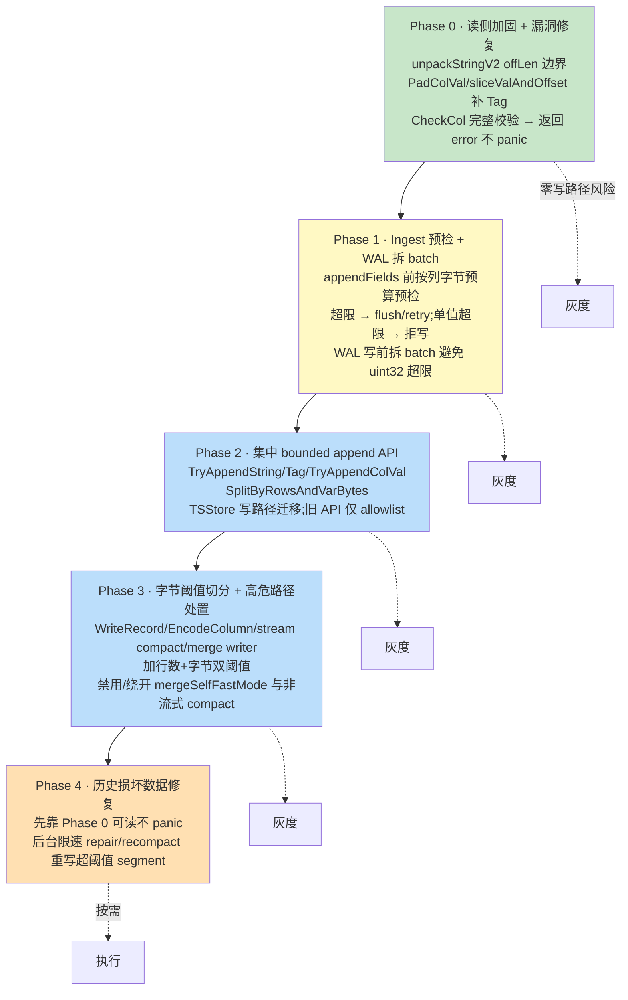
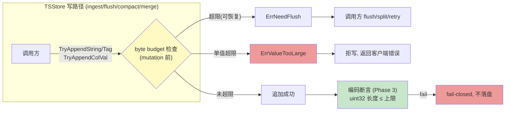
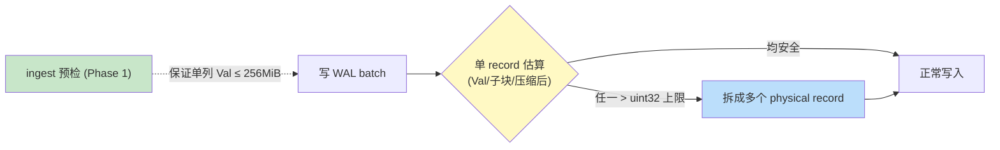

# `ColVal.Offset` uint32 溢出修复方案设计(低风险优先 · 兼容历史数据)

> 关联文档:
> - `uint32-offset-overflow-panic-analysis-tsstore.md`(问题与 panic 点分析)
> - `uint32-offset-overflow-fix-codex-dialogue.md`(与 Codex 三轮讨论记录,本方案据此修订)
>
> 目标:消除 TSStore 下 String/Tag 列 `len(ColVal.Val) > 4GB` 引发的数组越界 panic,**不破坏历史生产数据文件的可读性**,按风险从低到高分阶段推进。
>
> **本版相对初版的关键修订(经 Codex 评审)**:主线从「内存 `Offset` 升 uint64」改为「**保持 uint32 全域,用 bounded append 闸口 + 字节阈值切分 + 流式 merge/compact + ingest 预检**建立『单 ColVal.Val 不超阈值』不变量」。uint64 类型变更降为 **future non-goal**。

---

## 一、问题与约束

`lib/record/column.go:32` 的 `ColVal.Offset` 为 `[]uint32`。所有写路径用 `uint32(len(cv.Val))` 记录偏移。当某 String/Tag 列在内存中累积的 `Val` 跨过 4GB,offset 回绕成小值,后续切片越界 panic。涉及 snapshot(`commitSnapshot`)、compact(`Compact`)、merge(`mergeOutOfOrder`)。

**约束**:已有大量生产实例与历史数据文件;需灰度、可回滚;不改任何线格式。

---

## 二、关键事实(决定兼容性策略)

经代码核实,`uint32` 边界**远不止 `ColVal.Offset` 一处**。任何方案都必须同时守住下表所有边界:

| 载体 / 边界 | 代码位置 | 宽度 | 是否会溢出 |
|------------|----------|:--:|:--:|
| 内存 `ColVal.Offset` | `lib/record/column.go:32` | uint32 | 是(根因) |
| TSSP string segment offset(`packStringV1/V2`) | `lib/encoding/encoding.go:423-521` | uint32 | 否(切分后 < 阈值) |
| TSSP `Segment.size`(编码后 segment block) | `engine/immutable/tssp_file_meta.go:64,78`;写 `column_builder.go:292`、`stream_compact.go:1204` | uint32 | 否(segment < 阈值) |
| WAL `Record.Marshal` 子块大小 | `lib/record/record_codec.go:34` | uint32 | 是(须拆 batch) |
| WAL `ColVal.Marshal` 的 `Val`(`AppendBytes`) | `lib/record/column_codec.go:25` → `lib/codec/binary_encoder.go:218` | uint32 | 是(须拆 batch) |
| WAL physical record header `uint32(len(compData))` | `engine/wal.go:52,232` | uint32 | 是(须拆 batch) |
| executor `ColumnImpl.offset` | `engine/executor/column.gen.go:120,412` | uint32 | 否(查询侧 chunk 受限) |
| chunk codec `AppendUint32Slice(c.offset)` | `engine/executor/chunk_codec.gen.go:238` | uint32 | 否 |
| shelf WAL `Bytes2Uint32Slice`/`Uint32Slice2byte` | `engine/shelf/wal_codec.go:151,239` | uint32 | 否 |
| protobuf `Column.Offset` | `lib/util/lifted/influx/query/proto/internal.pb.go:1656` | uint32 | 否(wire) |
| unsafe 转换 `Bytes2Uint32Slice`/`Uint32Slice2byte` | `lib/util/util.go:246` | uint32 | 否 |

**关键判断**:
1. **TSSP 落盘前已切成小 segment**。正常 workload 下单 segment ~8MB;但 TSStore segment 切分是**按行数(`DefaultMaxRowsPerSegment4TsStore = 1000`)而非字节**,大 string 下单 segment 仍可能逼近 4GB。须给切分**加字节上界**。
2. **WAL 是唯一「整列 uint32 落盘」载体**,且有多处 uint32 长度(offset、`Val`、子块大小、physical record header)。须在写入前**拆 batch**,保证每个 uint32 长度字段 < 上限。
3. **`ColVal` 是共享核心类型**,波及 executor / shelf / protobuf / 多种 WAL。这决定了「改类型」的爆炸半径(见 §三)。
4. **`unpackStringV2` 存在独立读侧越界漏洞**(`lib/encoding/encoding.go:503-518`:`offLen` 是元素个数却只查 `len(src) < offLen`,漏 `*4`),与 4GB 问题独立,**Phase 0 必先修**。

### 兼容性矩阵(目标:线格式全不变)

| 读 / 写 | 旧二进制 | 新二进制 |
|---------|:--:|:--:|
| 旧 TSSP 文件(V1/V2 uint32) | ✅ | ✅ |
| 新 TSSP 文件(仍 V1/V2 uint32) | ✅ | ✅ |
| 旧 WAL(uint32) | ✅ | ✅ |
| 新 WAL(uint32,拆 batch) | ✅ | ✅ |

> TSSP 与 WAL 线格式都不变 → **双向兼容**,可灰度、可回滚。

---

## 三、路线抉择:A vs B

| 路线 | 做法 | 风险评估 |
|------|------|----------|
| **A. 内存 `Offset` 升 uint64**(初版主线) | 改 `ColVal.Offset` 类型;TSSP/WAL 线格式不变,边界窄化 uint32 | `ColVal` 是共享类型,改它制造「双 offset 宽度世界」;`uint32(len(buf))`、WAL 长度、TSSP `Segment.size`、executor、protobuf、unsafe、generated code 等 uint32 边界**编译器捕获不到**,漏一处即截断/panic/静默破坏。回滚须证明所有新旧节点交界无 uint64 内存态被窄化写入旧格式——证明脆弱。 |
| **B. 保持 uint32 + bounded 不变量**(本版主线) | 不改类型;用 bounded append 闸口 + 字节阈值切分 + 流式 merge/compact + ingest 预检,保证「单内存 `ColVal.Val` ≤ 阈值」 | 须找齐所有「把列累加进同一 ColVal」的入口并改为字节阈值;但入口数远少于 A 要证明的 uint32 边界数,且可用「bounded API + CI analyzer + 断言 + fuzz」闭环。 |

**结论**:**采路线 B**。A 降为 **future non-goal**(仅当产品明确要支持「单内存 `ColVal.Val > 4GB`」才有意义,但这与 B 核心不变量冲突,且带来巨大内存/GC/查询风险)。

> 详见 `uint32-offset-overflow-fix-codex-dialogue.md` Round 2/3。

---

## 四、核心不变量与四层保证

**不变量**:

> TSStore 写入 / flush / compact / merge 全过程中,任何 String/Tag 列的 `ColVal.Val` 长度不得超过 `MaxVarColValBytes`(默认 **256MiB**,可配至 512MiB);且所有变长列追加必须经过 bounded append 闸口。

阈值远小于 4GB,给所有 uint32 边界(offset、`Val`、`Segment.size`、WAL 各长度字段)留足余量,且避免 4GB+ 连续内存的 OOM/GC/编码双缓冲风险。

**完整性不靠编译器(A 的弱点),靠四层闭环**:

| 层 | 机制 | 作用 |
|----|------|------|
| 1. 集中 bounded API | `lib/record` 提供 `TryAppendString/Tag`、`TryAppendColVal`、`SplitByRowsAndVarBytes`,超限返回 `ErrNeedFlush`/`ErrValueTooLarge` | 把「构造大 ColVal」收敛到少数入口 |
| 2. CI analyzer(自定义 `go vet`) | 禁止非 allowlist 代码写 `cv.Val=append(...)`、`cv.Offset=append(...)`、`uint32(len(x.Val))`、未带 budget 的 `AppendColVal`/`AppendFieldsToRecord`、writer 路径只按行数的 `Split` | 静态闸口,防绕过 |
| 3. 编码断言(fail-closed) | TSSP/WAL/record codec 写盘前断言所有 uint32 长度字段 ≤ 上限,违例返回 error | 兜底,绝不让 corrupt 数据落盘 |
| 4. fuzz + 回归 | malformed offset block fuzz、大列端到端 | 动态验证 |

> `ColVal.Val`/`Offset` 是 exported 字段,Go 编译器无法禁止绕过——这正是需要第 2/3 层的原因。

---

## 五、分阶段计划

| 阶段 | 不变量 | 可独立发布 |
|------|--------|:--:|
| Phase 0 读侧加固 | 解码坏 string/tag block 只返回 error,不 panic | ✅ |
| Phase 1 ingest 预检 + WAL 拆 batch | ingest 后 memtable 内任意 String/Tag `ColVal.Val ≤ MaxVarColValBytes` | ✅ |
| Phase 2 集中 bounded API | 所有 String/Tag 追加先做 byte budget 判断(mutation 前) | ✅ |
| Phase 3 字节阈值切分 + 高危路径处置 | flush/compact/merge 输出任意 String/Tag segment/block < 阈值 | ✅ |
| Phase 4 历史修复 | repair 后历史 TSSP 满足新 segment byte cap | ✅(按需) |

---

## 六、各阶段详细设计

### Phase 0 · 读侧加固 + 漏洞修复(最先发,零写路径风险)

**目的**:历史生产中可能已有 corrupt string segment(回绕 offset 落盘);当前读/compact/merge 它们会 panic。先让读路径 fail-safe;同时修两个独立漏洞。

**改动点**:
- **修 `unpackStringV2` 边界**(`lib/encoding/encoding.go:503-518`):`offLen` 为元素个数,须按 `len(src) < offLen*util.Uint32SizeBytes` 校验;校验 offset 单调非递减、`offset[i]+length[i] <= len(in)`;违例返回 `errCorruptStringColumn`。
- **补 Tag 一致性**:`PadColVal`(`lib/record/column.go:172`)、`sliceValAndOffset`(`column.go:336`)目前只判 `Field_Type_String`,改为 `isStringLike`(String + Tag)统一处理,避免 Tag 列 padding/切片逻辑错乱。
- **`CheckCol`/`CheckRecord`**(`lib/record/record_check.go:98`):对 String/Tag 做完整 offset 单调性、边界、长度校验;**新增 `Validate*() error` 而非全局把 panic 改 error**(现有调用点如 `compact.go:203` 无 error 传播路径),先替换 reader/compact/merge 的可恢复路径。
- **`BytesUnsafe`/`StringValue*`**:切片前校验 `start <= end && end <= len(cv.Val)`;违例返回 error,不 panic。**不可用「坏 offset 当 nil」替代**(会导致查询静默错)。

**静态闸口**:decoder fuzz 覆盖 malformed offset block;string/tag decoder 禁止直接 panic。

### Phase 1 · Ingest 预检 + WAL 拆 batch(止血)

**目的**:杜绝新 corrupt 数据进 memtable/WAL;把「静默回绕 → 随机 panic」转为「mutation 前显式失败」。

**改动点**:
- **ingest 预检**(在 mutation 前):`engine/mutable/ts_table.go:346` `appendFields` 进入 `record.AppendFieldsToRecord`(`ts_table.go:380`)前,按列计算「当前 `Val` 长度 + 本次 string/tag 增量」,超 `MaxVarColValBytes` → 触发 flush/换 memtable/retry;**单值超限 → 直接拒写**(见 §七)。底层追加点 `column.go:143`、`column_string.go:51,143` 仍保留,但被预检兜住。
- **WAL 拆 batch**:`Record.Marshal` 子块大小(`record_codec.go:34`)、`ColVal.Marshal` 的 `Val`(`column_codec.go:25` → `binary_encoder.go:218`)、physical record header(`engine/wal.go:52,232`)均为 uint32;写 WAL 前估算单 record 压缩前/后大小,超限**拆成多个 WAL physical record**。flush 只清 memtable,不能缩小当前 WAL binary——拆 batch 是必要补充。

**静态闸口**:TSStore ingest 路径禁止直接调未预检的 `AppendFieldsToRecord`。

### Phase 2 · 集中 bounded append API(不变量闸口)

**目的**:把所有 String/Tag 列追加收敛到带 budget 的入口,使「单 ColVal.Val ≤ 阈值」可静态校验。

**改动点**:
- `lib/record` 新增 bounded API:
  - `TryAppendString(v string) error` / `TryAppendTag` / `TryAppendStringNull()`
  - `TryAppendColVal(src *ColVal, typ, start, end int) error`
  - `SplitByRowsAndVarBytes(dst []ColVal, maxRows int, maxVarBytes int, refType int) []ColVal`(行数 + 变长列字节双阈值切分)
  - 超限返回 `ErrNeedFlush`(可恢复,触发 flush/retry)或 `ErrValueTooLarge`(不可恢复,拒写)。
- 迁移 TSStore 写路径的 `AppendColVal`、`AppendString`、`appendStringCol`、sort/merge 中的变长列追加至 bounded API。
- 旧无错误 append API 保留,但仅限 numeric / 小对象 / 测试 / allowlist 使用。
- **不让 `lib/record` 直接触发 flush**:收到 `ErrNeedFlush` 由 `engine/mutable`、`MsBuilder`、stream compact、merge writer 负责 flush/split/retry。

**静态闸口**:CI analyzer allowlist——仅 bounded append 文件可写 `Val/Offset` 与做 offset 窄化。

### Phase 3 · 字节阈值切分 + 高危路径处置

**目的**:保证 flush/compact/merge 输出的任意 String/Tag segment/block < 阈值;处置会构造 4GB+ 单 ColVal 的高危路径。

**改动点(加行数 + 字节双阈值)**:
- `MsBuilder.WriteRecord`(`engine/immutable/msbuilder.go:1151,1170`,现按行拆)→ 用 `SplitByRowsAndVarBytes`。
- `ColumnBuilder.EncodeColumn`(`column_builder.go:353`,现按 `segRowsLimit`)→ 加字节阈值。
- stream compact 追加点(`stream_compact.go:765,1429`)、`continueMerge`(`stream_compact.go:1440`,现只看 `Len<maxRows`)、`splitColumn`(`stream_compact.go:1033`,现按 `maxRows`)→ 追加前估字节,达阈值先 `writeSegment`;注意 `splitColumn` 现期望只切 2 段会 panic(`stream_compact.go:1037`),须改「追加前判断」而非事后多段切。
- merge writer `columnWriter.write`(`merge_performer.go:433,446`,结果累进 `cw.remain`)→ `cw.remain` 按字节 flush。
- merge 时间窗口(`unordered_reader.go:394,522`、`merge_performer.go:93` 现可能 `MaxInt64`)→ 须 byte-bounded,合并结果超阈值时分段写。

**高危路径处置**:
- **`mergeSelfFastMode`**(`merge_tool.go:217` → `merge_self.go:48,69,72`):整 record sort/write,不符合 bounded 不变量。**先禁用/绕开**(string/tag 大列场景不走 fast mode),或改造为已具 byte split 的流式。
- **非流式 compact**(`chunk_iterators.go:149` `Merge` + `compact.go:215` `WriteRecord`):整列 merge 到单 record。**先禁用/绕开**大 string/tag 路径,统一走流式 compact;或改成增量产出 bounded record。

**静态闸口**:writer 路径禁止只按行数的 `Split`,必须走 rows+bytes splitter;CI analyzer 强制。

### Phase 4 · 历史损坏数据修复(按需)

**目的**:Phase 0 让读路径不 crash,但损坏的历史 segment 仍是坏数据。

**做法**:
- 诊断:遍历 TSSP,对 string segment 跑 `unpackString` 校验(复用 Phase 0),输出 corrupt / 超阈值 segment 清单。
- 修复:低优先级 background repair/recompact 重写超阈值 segment;**限速、可中断、可回滚**(会放大 IO)。优先级低,仅对确认异常的文件执行。
- **不默认「跳过坏行继续 compact」**(静默丢数据);repair 须审计记录丢弃量。
- 历史文件可能合法但超大,repair/compact/query 仍可能内存压力 → 查询侧也加 chunk byte cap,大列处理走流式。

---

## 七、单值超阈值策略

- **明确拒绝写入**:不截断、不拆分、不落 WAL;错误发生在 memtable/WAL mutation 前。
- `MaxVarColValBytes` 默认 **256MiB**,可配至 512MiB,不建议更高。
- 返回非重试型客户端错误:`string/tag value too large: size=X limit=Y`。
- batch 写入若无 per-row error 语义,拒绝整个 batch,避免部分成功造成语义混乱。

---

## 八、WAL 策略

采 **W1(严格版)**:保持 WAL 旧格式(uint32),强制每个 WAL physical record、每个 `Record.Marshal` 子块、每个 `ColVal.Val` 与 offset 都 < uint32 上限;超限**拆 batch 或拒写**。

- W2(WAL 升 uint64 + 版本标志)**近期不做**:仅加版本位不够,还须版本化物理 header、`AppendBytes` 长度、record/column codec;会破坏滚动升级与回滚。
- WAL 是短时日志,Phase 1 的 ingest 预检 + 拆 batch 已足够保证其 < 4GB。

---

## 九、测试策略

1. **读侧 / fuzz**:`unpackStringV2` malformed(`offLen=0`、offset 区不足、非单调、超 value 区)均不 panic;Tag 与 String 在 `PadColVal`/`sliceValAndOffset`/`Split` 行为一致。
2. **ingest 预检**:列接近阈值再写小 string/tag 触发 flush/retry,最终无超限 `ColVal`;单值超限返回客户端错误且 memtable/WAL 无副作用。
3. **WAL 拆分**:大 batch 拆成多个安全 WAL physical record;回放一致。
4. **切分**:行数少但 string bytes 超阈值,能按字节拆 segment;stream compact 多小 segment 合并超阈值时提前 `writeSegment`;merge normal path 合并超阈值时 `columnWriter` 分段写。
5. **高危路径**:`mergeSelfFastMode`/非流式 compact 大 string/tag 列不走 fast mode 或已具 byte split;非流式 compact 不整列 merge 到单 `ColVal`。
6. **编码断言**:超 uint32 或超阈值的 string/tag block 写盘前失败。
7. **CI analyzer golden**:TSStore 写路径中直接 `cv.Val=append(...)`、`uint32(len(cv.Val))`、未 bounded 的 `AppendColVal`/`AppendFieldsToRecord`、只按行数的 `Split` 必须报错。
8. **兼容性**:旧二进制生成的 TSSP/WAL 由新二进制读一致;新二进制生成的(仍 uint32)由旧二进制读一致(回滚可行性);含 corrupt offset 的旧文件新二进制读不 panic。
9. **回归**:全量现有 `lib/record` 与 `engine/immutable` 测试套件通过。

---

## 十、灰度与回滚

- **顺序**:Phase 0 → 1 → 2 → 3 → 4,每阶段独立灰度。Phase 2/3 依赖 Phase 1 已部署(ingest 预检保证 memtable bounded)。
- **灰度**:按节点灰度;线格式不变,集群可同时存在新旧二进制。
- **回滚**:任一阶段回滚至上一阶段二进制,**无需数据迁移**(线格式未变)。新二进制写出的文件仍为 uint32,旧二进制可读。
- **监控**:ingest 预检触发次数、WAL 拆 batch 次数、Phase 0 corrupt 检测次数、Phase 4 修复丢弃行数,均接入告警。

---

## 十一、改动清单(按文件)

### Phase 0
- `lib/encoding/encoding.go`(`unpackStringV2` 边界校验)
- `lib/record/column.go`(`PadColVal`/`sliceValAndOffset` 补 Tag;`BytesUnsafe` 边界;新增 `isStringLike`)
- `lib/record/column_string.go`(`StringValue*` 边界校验)
- `lib/record/record_check.go`(新增 `Validate*() error`,String/Tag 完整校验)

### Phase 1
- `engine/mutable/ts_table.go`(`appendFields` 前预检)
- `lib/record/record_group.go`(`AppendFieldsToRecord` 调用方处理预检结果)
- `engine/wal.go` / `lib/record/record_codec.go` / `lib/record/column_codec.go` / `lib/codec/binary_encoder.go`(WAL 拆 batch + uint32 长度断言)

### Phase 2
- `lib/record/column.go` / `column_string.go`(新增 `TryAppendString/Tag/Null`、`TryAppendColVal`、`SplitByRowsAndVarBytes`)
- 迁移 TSStore 写路径:`engine/mutable/*`、`engine/immutable/stream_compact.go`、`merge_performer.go`、`record_sort.go`、`meger.go`
- CI analyzer(新建,`tools/` 或 `.ci/`)

### Phase 3
- `engine/immutable/msbuilder.go`(`WriteRecord` 双阈值切分)
- `engine/immutable/column_builder.go`(`EncodeColumn` 字节阈值)
- `engine/immutable/stream_compact.go`(追加点估字节、`splitColumn` 改前置判断)
- `engine/immutable/merge_performer.go`(`cw.remain` 字节 flush)
- `engine/immutable/unordered_reader.go`(byte-bounded 时间窗口)
- `engine/immutable/merge_tool.go` / `merge_self.go`(禁用/改造 `mergeSelfFastMode`)
- `engine/immutable/chunk_iterators.go` / `compact.go`(非流式 compact 大列路径处置)
- 编码断言:`lib/encoding/encoding.go`(`packStringV1/V2`)、`tssp_file_meta.go`(`Segment.size`)、WAL 各 uint32 长度字段

### Phase 4
- 诊断/修复工具(新建,复用 Phase 0 校验)

---

## 十二、决策摘要

- **主线 = 路线 B**:保持 `uint32` 全域,用 bounded append 闸口 + 字节阈值切分 + 流式 merge/compact + ingest 预检,建立「单内存 `ColVal.Val ≤ 256MiB`」不变量。
- **A(uint64 类型变更)= future non-goal**:B 落地后不再必做;`uint64` 仅用于内部长度计算与边界判断,不改 `ColVal.Offset` 类型。
- **兼容性**:TSSP/WAL 线格式全不变 → 历史数据可读、可灰度、可回滚。
- **完整性保证**:不靠编译器(A 的弱点),靠「bounded API + CI analyzer + 编码断言 + fuzz」四层闭环。
- **阈值 256MiB**(可配 512MiB):远小于 4GB,给所有 uint32 边界留余量,同时避免 4GB+ 连续内存的 OOM/双缓冲风险。
- **先读侧加固 + ingest 止血**:立即降低线上 crash 与数据腐败风险,再从容做 bounded API 与切分改造。
- **高危路径(`mergeSelfFastMode`、非流式 compact)先禁用/绕开**,统一走流式,避免构造 4GB+ 单 ColVal。
- **单值超限直接拒写**,不截断/不拆分/不落 WAL。
