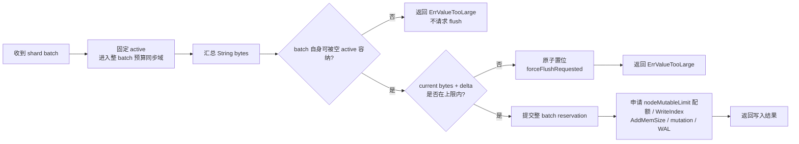
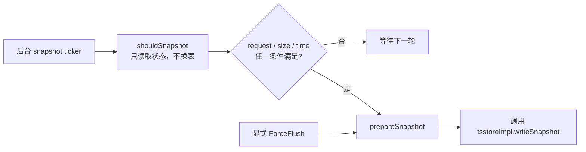
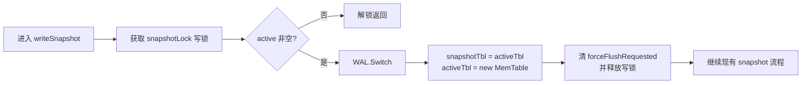
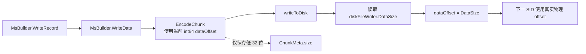
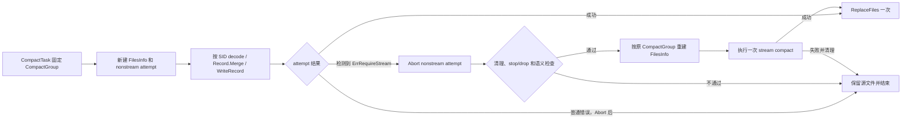
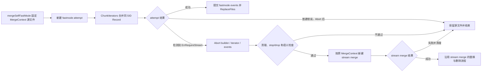
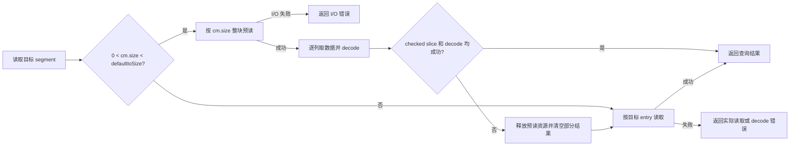

# TSStore uint32 溢出修复第一步设计

> 关联文档:
> - `uint32-offset-overflow-panic-analysis-tsstore.md`
> - `uint32-offset-overflow-fix-codex-dialogue.md`
> - `uint32-offset-overflow-fix-phase2-design.md`（第二步:部署与运行治理，待按本文件的受控回绕和兼容性决策重写；当前内容不作为第一步实现依据）
>
> 开发阶段:本文件定义第一步的安全修复与验证，不实现运行时灰度开关、按租户/节点放量和开关式回滚能力。部署与运行治理拆到第二步设计；一旦产生 `ChunkMeta.size` 回绕文件，不支持回滚到不能识别该文件的旧版本。
>
> 目标:在不改变 TSSP 线格式、不引入同 SID 按 chunk bytes 拆文件的前提下，阻止本次实际改造路径中的 TSStore String field `ColVal.Offset` 和 TSSP `Segment.size` 回绕，确保所有 writer 使用真实 int64 物理位置；允许 `ChunkMeta.size` 受控回绕，并使查询、compact、merge 不再把它当作真实 chunk 长度。stream merge unordered 聚合是明确未覆盖项，在独立优化完成前不纳入本步骤的全局安全承诺。

---

## 一、范围与前提

**主线：阻止本次实际改造路径中的 TSStore 持久化 String field `ColVal.Offset` 在跨 record、segment 累积时回绕。**

**配套：在本次已覆盖路径中只允许 `ChunkMeta.size` 受控回绕；任何真实物理 offset 和 `Segment.size` 都不得随之回绕或错位。**

### 1. 修复范围

**仅覆盖 TSStore（ts）的写入、落盘、compact、merge 和读取链路。**

- 包含 memtable append、snapshot/flush、非流式 compact/merge、stream compact、stream merge 和查询读取。
- ColumnStore（cs）、colstore compact、detached primary key/data/index 等路径不在本方案范围内。

### 2. 保护对象与允许的例外

**本次新增或修改的 mutation、编码和写出路径必须保证 `ColVal.Offset`、TSSP string block offset/length 和 `Segment.size` 可表示；只有 `ChunkMeta.size` 可以保存真实长度的低 32 位。**

- `tsMemTableImpl.WriteRows` 只把 `row.Fields` 传给 `appendFields` / `AppendFieldsToRecord`；tag 通过 series key / `tagSets` 参与 series 定位和过滤，不作为持久化 `Record.ColVals` 数据列。
- 查询侧的 aux tag 不属于 TSStore 落盘、snapshot、compact 或 merge 路径，不纳入本方案主线。
- 单个 String field 值在 memtable mutation 前校验；单值不可表示时拒写。
- 同一 series 在一个 TSSP 文件中只对应一个 `ChunkMeta`，本次不改变该组织方式，也不按 chunk bytes 把同一 SID 拆成多个文件。

stream merge unordered 聚合当前仍可能突破 `ColVal.Offset` 边界，本次只登记、不修改其读取和 merge 流程。因此，“只有 `ChunkMeta.size` 允许回绕”是本次已覆盖路径的输出不变量，不是对该已知未覆盖流程的完成声明。

受控回绕的定义:

```text
actualChunkDataSize > MaxUint32
cm.size = uint32(actualChunkDataSize)
```

受控回绕必须同时满足:

- `ChunkMeta.offset` 是真实 int64 chunk 起点。
- 每个 `Segment.offset` 是真实 int64 segment 起点。
- 每个 `Segment.size` 都可由 uint32 表示；snapshot 和 stream compact 依赖既有写入与 segment 上限，本次仍修改的其他 writer 在窄化前 checked cast。
- writer 的列内、chunk 内和跨 chunk cursor 始终按真实 int64 delta 推进。
- `uint32(actualChunkDataSize) == cm.size`，且 writer 根据自身真实 cursor 校验 chunk、列和 segment 范围一致。

### 3. 单 segment 边界

**当前配置下，单个合法 segment 和 stream compact 临时对象不会达到 uint32 边界；snapshot 沿用该既有约束，不新增 Segment 错误链。**

- `util.DefaultMaxRowsPerSegment4TsStore` 为 1000，当前 `max-rows-per-segment` 保持 1000。
- HTTP 行协议完整单行受 `max-line-size` 限制：代码默认值为 1MiB，仓库示例配置为 64KiB。
- `continueMerge` 仅在当前 `c.col.Len < maxRowsPerSegment` 时跨输入合并；追加下一个最多 1000 行的源 segment 后，`splitColumn` 立即按 1000 行切分。因此输出 segment 最多 1000 行，临时 `c.col` 严格少于 2000 行。
- 本次不增加 rows + bytes 切分或 bytes 达阈值时提前 `writeSegment` 的流程；snapshot 和 stream compact 保持现有 segment 编码。

上述结论以 `max-rows-per-segment=1000`、`max-line-size<=1MiB` 且数据经过行协议限制为前提。未来提高上限或引入绕过该限制的写入入口时必须重新评估；本次不为 snapshot 增加配置组合校验或错误上抛。

### 4. Stream 路径处理原则

**stream compact 保持现有合并流程；stream merge 本次修复 `WriteOriginal` 截断复制，unordered 聚合风险留给独立优化。**

- stream compact 整体保持现状，不修改 rows 条件、writer cursor、meta 写出或错误处理。
- stream merge 读取 unordered 时只有 `maxTime` 时间边界，极端情况下可能聚合出超过 4GiB 的 String `ColVal`；这是本次明确保留的已知风险。
- 本次不修改 `ReadTimes` / `Read`、`readUnordered`、`MergeHelper` 或 `columnWriter`，也不增加 `rowsLimit`；该问题在独立的乱序合并优化中处理。
- `WriteOriginal` 不再使用可能回绕的 `meta.size` 控制复制长度，而是基于完整 ChunkMeta 计算 raw entries 覆盖的 int64 局部候选范围。

### 5. 格式与兼容性选择

**保持现有 uint32 线格式，不把 `ColVal.Offset` 改成 uint64；接受受控回绕文件不支持旧版本回滚。**

- `ColVal.Offset`、TSSP string block offset/length、`Segment.size` 和 `ChunkMeta.size` 继续使用现有字段类型。
- `ChunkMeta.size` 在新版中只表示真实 chunk 长度的低 32 位，不再作为独立的物理范围依据。
- 新版产生的非回绕文件继续保持旧格式兼容性；产生第一个受控回绕文件后，旧版本不能安全查询、compact、merge 或接管对应 shard。
- 本次不为保留旧版本回滚而引入同 SID 文件切分。部署、备份恢复和节点接管必须遵守最低可读版本约束。

---

## 二、核心策略

### 0. 两个数据大小维度

| 维度 | 对应字段 | 含义 | 本方案定位 |
|------|----------|------|------------|
| 单列变长数据大小 | `ColVal.Offset` | String field 单列的 `ColVal.Val` 字节大小 | 主保护对象；本次已覆盖路径在 mutation 前预算或 bounded append，禁止回绕 |
| 单 series、单文件 chunk 数据大小 | `ChunkMeta.size` | 一个 `ChunkMeta` 描述的完整 chunk data 真实大小的低 32 位 | 允许受控回绕；运行时需要完整 ChunkMeta 计算 entry-covered 候选范围 |

在当前 TSStore TSSP 组织下，同一 series 在一个 TSSP 文件内只对应一个 `ChunkMeta`，不会拆分成多个 `ChunkMeta`。这两个维度不能相互替代：即使 chunk 物理布局可信，decode 后的 String field 仍必须单独校验 `ColVal.Offset`。

### 1. 已覆盖路径的 `ColVal.Offset` 不变量

本次覆盖的跨 record / segment 累积路径，在追加 String field 到目标 `ColVal` 前必须保证:

```text
len(dst.Val) + appendBytes <= MaxVarColValBytes
```

- `MaxVarColValBytes` 默认 256MiB，可配置到 512MiB。
- 测试阈值支持 1KiB / 64KiB 等小值，用于验证 flush、入口级 stream 重试和 fail-closed。
- stream compact 依赖既有 rows 与 `max-line-size` 前提，不新增 bytes 驱动的切分。
- stream merge unordered 时间范围读取是已知未覆盖项，由独立优化增加 `rowsLimit`。

### 2. `ChunkMeta.size` 受控回绕

本方案不引入 `MaxChunkDataBytes`，也不阻止单 series、单文件的真实 chunk data 超过 4GiB。输出规则为:

```text
actualChunkDataSize = actualChunkEnd - actualChunkStart // int64
cm.size = uint32(actualChunkDataSize)
```

`actualChunkDataSize > MaxUint32` 本身不是错误。只有下列情况才是错误:

- `uint32(actualChunkDataSize) != cm.size`。
- writer 生成的 chunk、列或 segment 真实物理 offset 与自身 int64 cursor 不一致。
- 单个 `Segment.size` 无法用 uint32 表示。
- checked add、文件范围或结构解析失败。

### 3. Writer 真实 cursor

writer cursor 统一使用真实物理位置，不依赖 `ChunkMeta.size`:

```text
actualDelta := int64(encodedEnd - encodedStart)
cursor += actualDelta
```

- snapshot 的列内和 segment offset 沿用现有流程；既有行数、行大小和 `ColVal` 上限保证单 segment 可表示。
- `MsBuilder` 在成功写入后使用 `diskFileWriter.DataSize()` 作为下一 chunk 起点；不能使用 `chunkMeta.size`，也不能把包含首个文件头的 `len(encodeChunk)` 无条件当作 chunk 长度。
- stream compact 已使用 `writer.DataSize()` 维护真实位置，本次不修改；其他仍需改造的 stream writer 使用真实 int64 cursor，并在写入 uint32 窄字段前 checked cast。

### 4. Nonstream 降级采用入口级全量重跑

nonstream 和 stream 是两个完整 attempt。执行过程中不能局部切换 iterator 或 builder；允许把 `ErrRequireStream` 抛回 compact/merge 任务入口，销毁整个 nonstream attempt，再复用原始 TSSP 文件集合从头强制执行一次 stream。


可复用的是原始 TSSP 文件集合及其任务属性，不是已经消费过的 `FilesInfo.compIts`、`FileIterator`、`ChunkIterator`、builder 或临时 TSSP reader。stream attempt 必须重新创建全部运行时状态，且最多重试一次。

---

## 三、模块风险总览

| 模块 | 风险点 | 处理原则 |
|------|--------|----------|
| 写入 / memtable | String field `ColVal` 跨批次增长，append 前无 bytes 预算 | 整 batch mutation 前预算；active memtable 放不下时返回 `ErrValueTooLarge`，并为该 active 请求后台 forceFlush / snapshot |
| WAL | 现有行协议限制下 payload 不会达到 uint32 边界 | 本次不修改 WAL payload 格式或增加长度比较 |
| snapshot / flush | `MsBuilder.WriteData` 使用回绕后的 `cm.size` 推进下一 SID offset | 写盘成功后直接用 `diskFileWriter.DataSize()` 更新 int64 `dataOffset`；其他 snapshot 流程不变 |
| 非流式 compact / merge | 整 chunk 读取依赖 `cm.size`；Record.Merge 无界累积；执行中已产生临时输出 | 用完整 ChunkMeta 计算 entry-covered range size；可重试错误抛到入口，清理整个 attempt 后强制 stream 重跑一次 |
| stream compact | 现有 rows/line-size 约束保证单 segment 可表示，cursor 不依赖 `cm.size` | 允许 `cm.size` 受控回绕；保持现状，仅做回归验证 |
| stream merge | unordered 读取只有时间边界；`WriteOriginal` 使用回绕 size 会截断 | unordered 风险转入独立优化；`WriteOriginal` 使用 entry-covered int64 候选范围 |
| 查询 | 回绕后的 `cm.size` 可能小于 `defaultIoSize`，触发截断预读 | 保留小 chunk 整块预读；仅在取 segment 或 decode 失败时清理结果，并按目标 entry 重读一次 |

---

## 四、共享能力

### 1. String field 预算 API

新增或收敛到一组 checked / bounded 能力:

- `isStringField`
- `VarBytes`
- `VarBytesRange`
- `CanAppendVarBytes`
- `TryAppendColVal`
- `TryAppendString`
- `TryAppendStringNull`
- `ValidateCol`
- `ValidateRecord`
- `CheckedUint32Size`
- checked range / slice accessor

错误语义:

- `ErrValueTooLarge`:单值或不可拆的单次追加超过产品上限，或者当前 active memtable 无法容纳本次合法追加；两种情况都拒绝本次写入。后一种情况在返回前为当前 active 设置 shard 级 forceFlush 请求标记，由后台 snapshot 释放容量。错误码保持一致，但日志和指标应区分“请求自身过大”与“active memtable 已满并已请求 flush”。
- `ErrRequireStream`:nonstream 的整 chunk / 整 record 路径无法安全表示，但逐 segment stream 路径仍可处理；允许入口级 stream 重试一次。
- `ErrCorruptColumn`:内存列的 offset/length 不可信，不能继续 mutation 或编码。
- `ErrCorruptTSSP`:局部 meta、checked arithmetic 或文件范围不合法，不允许 stream retry。
- `ErrSegmentTooLarge`:单个 segment 无法用 uint32 表示，不允许写入窄化 size。

### 2. Chunk entry 覆盖范围

新增 `ChunkEntryRange(cm, fileDataStart, fileDataEnd)`，只基于当前完整 ChunkMeta 计算 raw entries 覆盖的局部候选范围:

```text
rangeStart = cm.offset
rangeEnd   = max(checkedAdd(entry.offset, int64(entry.size)))
rangeSize  = rangeEnd - rangeStart
```

- 遍历当前 ChunkMeta 的全部 field / time segment entry，不读取其他 ChunkMeta。
- 校验 checked add、`entry.offset >= rangeStart`、`rangeEnd <= fileDataEnd` 和 `rangeStart >= fileDataStart`。
- 要求 `uint32(rangeSize) == cm.size`。
- 仅校验当前 ChunkMeta 的局部算术和文件边界，不跨 ChunkMeta 推导或修正 raw absolute offset。
- 该范围用于 nonstream 能力判断和 `WriteOriginal` int64 复制。

### 3. Compact / merge attempt 清理

原始 TSSP 文件集合与单次 attempt 的运行时资源分离。源文件在最终提交前保持不变；iterator、builder、临时 reader、临时文件和 events 只属于当前 attempt。

新增 `MsBuilder.Abort`，不新增结构体字段；当前 `.init` 路径和已完成的临时文件可由现有 `fd`、`Files` 获得:

```go
func (b *MsBuilder) Abort() error {
    current := b.currentTmpPath() // 关闭 fd 前保存当前 .init 路径。

    var errs []error
    errs = append(errs, b.closeCurrentWriterAndFD()...)       // 先停止所有后续写入。
    errs = append(errs, removeTmpAndSidecars(current)...)     // 删除当前未完成文件及其临时索引。
    for _, f := range b.Files {
        errs = append(errs, removeTmpTSSPAndSidecars(f)...)   // 删除已经切出的全部临时 TSSP。
    }
    if len(errs) != 0 {
        return errors.Join(errs...) // 清理不完整时保留源文件并禁止 stream retry。
    }

    b.resetAttemptState() // 仅在资源全部清理后释放内存引用，保证 Abort 幂等。
    return nil
}
```

events、统计等 attempt 副作用在失败时执行 interrupt/reset。只有 `Abort` 全部成功后才能向入口返回 `ErrRequireStream`；其他清理错误直接 fail-closed。最终成功前不得执行 `ReplaceFiles`。

---

## 五、模块设计

### 1. 写入与 memtable

#### 风险点

- 同一 series 的 String field `ColVal` 会跨多次写入持续增长。
- append 过程中不能出现部分列已 mutation、后续列失败的半写状态。
- 多个并发写可能同时观察到 active memtable 放不下，并重复请求 forceFlush。

#### 写入与后台 snapshot 流程

##### 写请求



`forceFlushRequested` 由后台 snapshot ticker 异步读取，写请求不等待 snapshot。

##### snapshot 调度



##### 唯一换表入口：`tsstoreImpl.writeSnapshot`



#### 新增字段与关键伪代码

```go
type shard struct {
    // ... existing fields ...

    forceFlush bool
    // 已有字段：同步 ForceFlush 正在执行；后台 shouldSnapshot 会避让它。

    forceFlushRequested uint32
    // 新增字段：原子读写；0 表示无请求，1 表示请求后台 snapshot。
    // 不能复用 forceFlush，也不能通过 forceChan 触发同步 ForceFlush。
    // 只由 requestForceFlush 置位，只由 writeSnapshot 成功换表时清零。
}

func (s *shard) requestForceFlush() {
    // 调用方持有 snapshotLock.RLock，预算时观察到的 active 尚未被换出。
    // 原子 Store 非阻塞；同一 active 上的多个失败请求自然合并。
    atomic.StoreUint32(&s.forceFlushRequested, 1)
}

func (s *shard) forceFlushPending() bool {
    // 只读取异步请求状态，不代表同步 ForceFlush 正在执行。
    return atomic.LoadUint32(&s.forceFlushRequested) != 0
}

func (s *shard) shouldSnapshot() bool {
    s.snapshotLock.RLock()
    defer s.snapshotLock.RUnlock()

    // 这里只决定是否调度，不切换 activeTbl / snapshotTbl，也不清请求。
    if s.activeTbl == nil || s.snapshotTbl != nil || s.forceFlushing() {
        return false
    }
    return s.forceFlushPending() ||
        s.activeTbl.NeedFlush() ||
        s.storage.timeToSnapshot(s)
}

func (storage *tsstoreImpl) writeSnapshot(s *shard) {
    // activeTbl / snapshotTbl 只允许在此入口完成 rotate。
    s.snapshotLock.Lock()

    if s.activeTbl == nil {
        s.snapshotLock.Unlock()
        return
    }

    walFiles, err := s.wal.Switch()
    if err != nil {
        s.snapshotLock.Unlock()
        panic("wal switch failed") // 沿用现有行为，本方案不改错误链。
    }

    s.snapshotTbl = s.activeTbl
    s.activeTbl = s.memTablePool.Get(s.engineType)

    // 只在成功换表时清请求；新 active 的 writer 只能在解锁后重新置位。
    atomic.StoreUint32(&s.forceFlushRequested, 0)
    s.snapshotLock.Unlock()

    // 后续 index flush、commitSnapshot 和 WAL 清理沿用现有流程。
    // ... existing snapshot flow using walFiles ...
}
```

#### 补充说明

- 预算按 measurement / series / field 汇总整个 shard batch，只计 bytes，不复制数据。
- “请求自身过大”和“当前 active 剩余容量不足”统一返回 `ErrValueTooLarge`；只有后者请求后台 snapshot。
- `snapshotLock.RLock` 只固定 active；整 batch 的检查、预留和 mutation 仍需 memtable 级 reservation / 同步域，避免并发写穿透预算。
- 预算和 forceFlush 决策先于 `nodeMutableLimit` 内存配额申请、索引、行计数、WAL 及 data mutation；不得在 `snapshotLock` 或预算锁内等待内存配额或执行阻塞 I/O。
- `requestForceFlush` 只置位，`shouldSnapshot` 只判断；二者都不能切换 `activeTbl` / `snapshotTbl`。所有触发条件统一由 `tsstoreImpl.writeSnapshot` 完成 rotate。
- 写请求不调用同步 `ForceFlush`，不等待、rotate 或自动重试；snapshot 的既有错误处理保持不变。

#### 验收点

- 低阈值下，active memtable 放不下合法 batch 时，在 mutation 前设置 `forceFlushRequested` 并返回 `ErrValueTooLarge`；本次 batch 保持零写入：不修改 memtable，不写 WAL，不更新索引或行计数，也不占用或泄漏 `nodeMutableLimit` 内存配额。
- batch 自身在空 memtable 中也不可容纳时直接返回 `ErrValueTooLarge`，不设置无效的 forceFlush 请求。
- 并发写重复触发超限时只形成一个幂等的后台 forceFlush 请求；返回前请求状态可见，写协程不等待 snapshot、不执行 rotate 或内部重试。
- 所有 snapshot 触发方式都只通过 `tsstoreImpl.writeSnapshot` rotate，并在 active 成功换出后清除请求。

### 2. Snapshot / flush writer offset

#### 风险点

- `MsBuilder.WriteData` 使用 `b.dataOffset += int64(chunkMeta.size)` 推进下一 SID；`cm.size` 回绕后会把后续 `ChunkMeta.offset` 写小。
- 首个 `encodeChunk` 包含 TSSP header，不能直接把 `len(encodeChunk)` 当作 chunk data 长度。

#### 写出流程



#### 字段与关键伪代码

本节不新增字段，复用现有 int64 cursor：

```go
type MsBuilder struct {
    // ... existing fields ...

    dataOffset int64
    // 已有字段：下一 chunk 的真实文件起点；不得由 ChunkMeta.size 推进。
}

func (b *MsBuilder) WriteData(id uint64, data *record.Record) error {
    // 首个 chunk 仍按现有逻辑把 dataOffset 初始化到 TSSP header 之后。
    b.encodeChunk, err = b.EncodeChunkDataImp.EncodeChunk(
        b.chunkBuilder, id, b.dataOffset, data, b.encodeChunk, b.timeSorted,
    )
    if err != nil {
        return err // 沿用现有错误返回。
    }

    if err = b.writeToDisk(int64(data.RowNums())); err != nil {
        return err // 只有实际写入成功后才能推进 cursor。
    }

    // DataSize 是包含首个文件头在内的真实 int64 文件位置。
    // cm.size 即使回绕，也不再影响下一 SID 的绝对 offset。
    b.dataOffset = b.diskFileWriter.DataSize()

    // ... existing trailer / id-time updates ...
    return nil
}
```

#### 补充说明

- 写入侧已保证 String `ColVal.Val` 和 offset 可表示；现有 rows/segment 上限保证单个 `Segment.size` 可表示。
- `ChunkMeta.size` 继续保存真实 chunk size 的低 32 位，只作为线格式元数据，不再参与 writer cursor 推进。
- `DataSize()` 在 `writeToDisk` 成功后读取，可同时覆盖首个文件头和普通 chunk。
- `WriteRecordForFlush`、`FlushChunks`、finalize、rename、WAL 清理及错误处理均沿用现状。

#### 验收点

- 使用 fake writer DataSize 构造首个 chunk 结束位置为 `2^32 + N`，验证下一 SID 的 `ChunkMeta.offset == 2^32 + N`。
- 验证 `cm.size` 仍等于真实 chunk size 的低 32 位，但不影响下一 SID、下一列和 segment 的 absolute offset。
- 普通未回绕文件的 offset、文件内容和现有 snapshot 流程保持不变。

### 3. 非流式 compact / merge fastmode

两条路径只共享错误和 attempt 生命周期，不共享执行入口。

#### 共性约束

- `ChunkIterator` 使用 `ChunkEntryRange` 读取完整 chunk；`MsBuilder` 输出 cursor 由第 2 节统一处理，本节不重复处理 writer offset。
- 合法 chunk range 超过 nonstream 整块读取能力，或 `decodeRecord` / `Record.Merge` 在 mutation 前判断完整 Record 的 String bytes 超限，而逐 segment stream 仍可处理时，返回 `ErrRequireStream`。
- `ErrRequireStream` 仅表示“当前模式不适用”。corrupt meta/range、单 segment 不可表示、I/O、stop/drop/cancel 均直接返回原错误。
- 任一失败 attempt 都先清理 iterator、builder、临时文件和 events；只有清理全部成功后，才能把 `ErrRequireStream` 返回入口。
- stream retry 必须复用相同源文件集合并新建全部运行时对象；成功前不替换或删除源文件。
- 控制流直接调用一次 stream，不使用循环，因此不新增 `forceStream` 或 retry 状态字段。

#### 共性伪代码

不修改现有 `Record.Merge` 签名，新增无副作用的预算检查，仅在 nonstream/fastmode 调用:

```go
func (dst *Record) CanMergeVarBytes(src *Record, limit uint64) bool {
    // 按排序后的 schema 做双指针扫描，不调用 PadRecord，也不修改任一 Record。
    for each effective String field in dst and src {
        dstBytes := varBytes(dst, field) // 目标缺列时为 0；补 null 不增加 Val bytes。
        srcBytes := varBytes(src, field)
        if sum, ok := checkedAdd(dstBytes, srcBytes); !ok || sum > limit {
            return false // mutation 前拒绝，避免任何 uint32 offset 先发生回绕。
        }
    }
    return true
}

func (c *ChunkIterators) mergeRecord(dst, src *Record) error {
    if !dst.CanMergeVarBytes(src, MaxVarColValBytes) {
        return ErrRequireStream // 由 compact 或 merge-self 各自的入口处理。
    }
    dst.Merge(src) // 预算通过后复用现有 Merge 实现和语义。
    return nil
}
```

#### 3.1 非流式 compact

##### 流程



##### 入口伪代码

```go
func (t *CompactTask) executePlan(group *CompactGroup) error {
    first := newFilesInfo(group) // 第一次 attempt 独占自己的 FileIterator。
    if !NonStreamingCompaction(first) {
        return runStreamCompact(first) // 原本已选择 stream，不属于降级重跑。
    }

    err := runNonstreamCompact(first) // 返回 ErrRequireStream 前必须已完成 Abort。
    if !errors.Is(err, ErrRequireStream) {
        return err // 成功或普通错误均不进入重跑。
    }
    if correctTimeDisorder() || stoppedOrDropping(group) {
        return err // stream 语义不等价或任务已停止时 fail-closed。
    }

    retry := newFilesInfo(group) // 不复用已消费的 FilesInfo、iterator 或 builder。
    return runStreamCompact(retry) // 代码中只有这一次调用，不形成 retry loop。
}
```

##### 补充说明

- `CompactGroup` 是重跑期间唯一的源文件计划；level compact 和 full compact 使用同一规则。
- nonstream 可能已经切出多个临时 TSSP，均由当前 builder 的 `Abort` 删除。
- stream attempt 使用原 `toLevel`、order 和源文件集合；最终成功时执行一次 `ReplaceFiles`。
- `CorrectTimeDisorder` 未证明 stream 语义等价前不允许重跑。

##### 验收点

- 已生成多个临时文件后触发 `ErrRequireStream`，所有临时输出均被删除。
- retry 重新创建 `FilesInfo`，从第一个 SID 开始执行一次 stream compact。
- `Abort`、stop/drop 检查或 stream attempt 失败时保留全部源文件。
- nonstream 或 stream 成功路径都只执行一次 `ReplaceFiles`。

#### 3.2 merge-self fastmode

##### 流程



##### 入口伪代码

```go
func (mt *mergeTool) mergeSelfFastMode(ctx *MergeContext) error {
    source, release := refExactFiles(ctx) // 固定本批 unordered 源文件引用，重跑前不得改名或替换。
    defer release()

    err := runMergeSelfFastAttempt(ctx, source) // ErrRequireStream 表示 fast attempt 已完整 Abort。
    if !errors.Is(err, ErrRequireStream) {
        return err // 成功或普通错误均不进入 stream merge。
    }
    if stoppedOrDropping(ctx) || ctx.ToLevel() == config.TSSPToParquetLevel() {
        return err // parquet level 依赖 fastmode events，当前不做非等价降级。
    }

    retryCtx := rebuildMergeContext(ctx, source) // 重建 reader、performer 和临时 writer 状态。
    return mt.mergeSelfStreamMode(retryCtx)      // 直接执行一次，不回到 fastmode 判定。
}
```

##### 补充说明

- fastmode 的 `MsBuilder`、`ChunkIterators` 和 events 必须一起 Abort；不能只调用 `MsBuilder.Reset`。
- stream retry 继续使用本批源文件及原 `ToLevel`，但沿用 `mergeSelfStreamMode` 自身的替换和 unordered 文件删除顺序。
- `mergeSelfStreamMode` 调整为返回 error，供入口判断最终结果；内部不再只记录日志后吞掉错误。
- stream merge unordered 的极端 ColVal 风险仍按第 5 节处理，不因本次 fastmode 降级扩大安全承诺。

##### 验收点

- fastmode 在已写入 `.init` 后触发 `ErrRequireStream`，builder、iterator、events 和临时文件均完成清理。
- stream retry 使用同一批源文件，只执行一次；失败时不替换或删除任何源文件。
- parquet 目标 level、corrupt、I/O、stop/drop/cancel 不触发 stream retry。
- fastmode 成功与 stream retry 成功分别沿用各自现有提交顺序，不共用错误的替换逻辑。

### 4. Stream compact

#### 结论

stream compact 保持现状，不修改 `stream_compact.go`。

#### 依据

- chunk 和 segment 的物理位置已经由 `writer.DataSize()` 维护，不依赖 `cm.size` 推进 cursor。
- `writeMetaToDisk` 现有 `cm.size = uint32(writer.DataSize() - cm.offset)` 符合受控回绕定义。
- 既有 `max-rows-per-segment`、`max-line-size` 和 `splitColumn` 约束保证单个 segment 可表示，无需新增 checked cast 或错误链。
- 查询、nonstream 和 `WriteOriginal` 对回绕 `cm.size` 的读取保护由其他章节完成。

#### 保持不变

- 不修改 `continueMerge`、`splitColumn`、`lastSeg`、`tmpCol` 或 `writeSegment`。
- 不增加 bytes 驱动的 segment 切分、提前落盘或 stream compact 专用错误。
- 不修改临时文件、events、提交和恢复流程。

#### 验收点

- 现有 stream compact 单元测试全部通过，输出布局和 segment 切分时机不变。
- 构造受控回绕 chunk，验证下一 chunk offset 继续使用 `writer.DataSize()` 的真实位置。
- 新版查询、nonstream 和 `WriteOriginal` 能读取该输出，不依赖回绕后的 `cm.size` 获取完整 chunk。

### 5. Stream merge / out-of-order merge

#### 问题一：unordered 读取只有时间边界，本次不修改

- `ReadTimes(maxTime)` / `Read(maxTime)` 不限制行数或 String bytes；`lastSeries && lastSeg` 还可能读取该 series 剩余的全部 unordered 数据。
- 极端密度下，单次构造的 unordered `ColVal` 可能超过 4GiB 并导致 offset 回绕。
- 本次仅登记风险，不修改读取、merge、`columnWriter` 或时序语义；独立优化通过 `rowsLimit` 限制单次读取行数。

#### 问题二：`WriteOriginal` 截断复制

根因是 `WriteOriginal` 把可能回绕的 `cm.size` 当作真实 chunk 长度，导致复制内容被截断。

改为使用 `ChunkEntryRange` 得到 int64 真实范围并按该范围复制；目标 offset 和下一 chunk 起点使用 writer 的真实位置，输出 `cm.size` 保存真实长度的低 32 位。范围不合法时返回 `ErrCorruptTSSP`。

#### 验收点

- 受控回绕文件按 int64 真实范围完整复制，不因 `cm.size` 回绕丢失尾部。
- entry-covered range 不合法时不进入 fast-copy。
- unordered 读取流程保持现状，本次不新增 rowsLimit 测试预期。

### 6. 查询路径

根因是查询把回绕后的 `cm.size` 当作完整 chunk 长度进行小块预读，后续可能无法从截断窗口中取得目标 segment。

回绕是极少数场景，正常查询不预扫完整 ChunkMeta。`0 < cm.size < defaultIoSize` 时先沿用整块预读；只有从预读窗口取目标 segment 失败或 decode 失败，才清理本次部分结果并按目标 entry 重读一次。`cm.size == 0` 或 `cm.size >= defaultIoSize` 直接按 entry 读取。



伪代码如下；不新增持久状态字段或跨层错误类型:

```go
func (r *tsspFileReader) readSegmentRecord(...) (*record.Record, error) {
    if cm.size == 0 || cm.size >= defaultIoSize {
        // 大 chunk 和 size 恰好回绕为 0 时，不尝试整块预读。
        return r.readSegmentRecordByEntry(cm, segment, dst, decs)
    }

    chunk, release, err := r.readPreload(cm.offset, cm.size)
    if err != nil {
        // 普通 I/O 错误不属于 size 回绕，不通过重读掩盖。
        return nil, err
    }

    rec, err := r.decodeSegmentFromPreload(cm, segment, chunk, dst, decs)
    release() // fallback 前必须释放 cache page / buffer 引用。
    if err == nil {
        return rec, nil
    }

    dst.Reuse() // 丢弃前几列已经写入的结果，避免重读后混入旧数据。
    return r.readSegmentRecordByEntry(cm, segment, dst, decs) // 只降级一次。
}
```

- `decodeSegmentFromPreload` 在处理每个请求 entry 时做 checked slice；窗口不足返回内部失败，不允许 `columnData` 越界 panic。该检查随正常逐列 decode 进行，不增加一次完整 entry 遍历。
- `readSegmentRecordByEntry` 只使用本次请求 field / time entry 的 int64 offset 和 uint32 size，并校验 checked add 与 trailer data range；不调用 `ChunkEntryRange`。
- fast attempt 的错误不立即记录为最终查询错误；fallback 仍失败时，返回并记录按 entry 读取产生的实际错误。

#### 验收点

- 正常小 chunk 只执行一次整块预读，不预扫完整 ChunkMeta，也不触发按 entry 重读。
- 受控回绕文件先走小块预读；目标 entry 不在窗口内或 decode 失败时，清空部分结果后按 entry 重读成功。
- fallback 仍失败时只返回一次实际错误，不循环重试，也不返回部分 Record。
- `cm.size == 0` 或 `cm.size >= defaultIoSize` 时直接按 entry 读取。

### 7. 其他依赖点核查

| 位置 / 流程 | 处理 |
|-------------|------|
| `tsspFileReader.ReadData` 的 `validate(cm.offset, cm.size)` | 只校验本次候选预读，不作为整个 chunk 真实范围的证明 |
| `cm.size < defaultIoSize` | 先保留整块预读；checked slice 或 decode 失败后按目标 entry 重读一次，不预扫完整 ChunkMeta |
| `ChunkIterator.readRecord` | 使用完整 ChunkMeta 的 entry-covered range size 决定是否返回 `ErrRequireStream` |
| `mergePerformer.WriteOriginal` | 使用 `ChunkEntryRange` 的 int64 候选 range，不使用 `meta.size` 控制复制 |
| stream compact / unordered SegmentReader | stream compact 保持按 entry 读取；共享 reader 统一执行 checked add、trailer data range 和 checked slice 校验 |
| first/last/min/max 预聚合读取 | 按目标 entry 读取并执行局部 range 校验；decode 错误 fail-closed |
| `ChunkMeta` codec | 线格式不变；`size` 按真实长度低 32 位解释 |
| `MetaIndex.size` | 不是 `ChunkMeta.size`，保持现状 |
| snapshot writer | `MsBuilder.WriteData` 使用 `diskFileWriter.DataSize()` 推进下一 SID；segment 编码沿用既有边界 |
| 本次仍修改的 stream writer | cursor 使用真实 int64 delta；写入 `Segment.size` 前 checked cast；stream compact 除外 |

---

## 六、第一步开发交付与依赖顺序

### 阶段一：attempt 清理与安全读取

- 修正 iterator 初始化错误被当作空文件的问题。
- 为 nonstream `MsBuilder` 增加幂等 `Abort`；stream compact attempt 沿用现有临时文件清理。
- 增加 checked range / slice，先保证错误不会转化为 panic 或部分发布。

### 阶段二：chunk entry range 与读取闭环

- 实现完整 ChunkMeta 的 `ChunkEntryRange` 候选范围计算，不扫描其他 ChunkMeta。
- 查询保留小 chunk 整块预读；取 segment 或 decode 失败时清理部分结果，再按目标 entry 重读一次。
- nonstream 使用 entry-covered range size 决定入口级 stream 重跑；`WriteOriginal` 使用 int64 entry-covered range 复制。

### 阶段三：writer 真实 cursor 与受控回绕

- `MsBuilder.WriteData` 在写盘成功后使用 `diskFileWriter.DataSize()` 更新 `dataOffset`，不再使用 `cm.size` 推进下一 SID。
- 需要改造的 stream downsample / merge writer 使用真实 int64 cursor，避免先窄化后推进。
- 上述改造路径写入 `Segment.size` 前 checked cast；`ChunkMeta.size` 保存 actual size 低 32 位。stream compact 保持现状。
- 分别在 `CompactTask` 和 `mergeSelfFastMode` 处理 `ErrRequireStream`，完整清理后基于原计划强制 stream 重跑一次。

阶段二和阶段三必须处于同一发布边界：查询预读失败降级、nonstream 入口级 stream 重跑和 `WriteOriginal` int64 复制尚未上线时，不得单独上线可能产生受控回绕文件的 writer。

### 阶段四：memtable 预算和后台 forceFlush 请求

- 整 shard batch mutation 前完成 String bytes 预算。
- active memtable 放不下合法 batch 时，原子置位 `forceFlushRequested`，再返回 `ErrValueTooLarge`；写请求不等待、rotate 或内部重试。
- 后台 snapshot loop 只负责调度，`tsstoreImpl.writeSnapshot` 是唯一 active/snapshot rotate 入口，并在成功换表时清除请求；其余流程沿用现状。

### 本次明确不做

- 不按 chunk bytes 拆分同 SID 文件。
- 不禁止 `ChunkMeta.size` 受控回绕。
- 不支持产生受控回绕文件后的旧版本回滚。
- 不改造 snapshot 的全链路错误上抛、prepare/publish、durable manifest、WAL 生命周期或崩溃恢复；这些流程沿用现状。
- 不在 nonstream 内部局部切换 stream；只允许入口级清理后全量重跑一次。
- 不实现多个 bounded record 输出协议。
- 不修改 stream compact 的合并、writer cursor、meta 写出或错误处理流程。
- 不修改 stream merge unordered 的读取流程或增加 `rowsLimit`。

---

## 七、测试策略

### 写入 / snapshot

- 低 `MaxVarColValBytes` 下，active memtable 放不下合法 batch 时，在 mutation 前设置 `forceFlushRequested` 并返回 `ErrValueTooLarge`；验证多 series / field batch 被原子拒绝：memtable、WAL、索引和行计数均不变化，`nodeMutableLimit` 内存配额不被占用或泄漏。
- batch 自身超过空 memtable 可容纳上限时返回 `ErrValueTooLarge`，且不设置 forceFlush 请求。
- 并发写验证 forceFlush 请求幂等且返回错误前可见；写协程不等待 snapshot、不 rotate、不内部重试，只有 `tsstoreImpl.writeSnapshot` 成功换表时才清除请求。
- 已有 `snapshotTbl` 时保留当前 active 的 forceFlush 请求；容量未释放前，后续超限写继续返回 `ErrValueTooLarge`。
- 验证后台扫描周期到达前不会发生同步 flush；时间触发或显式 ForceFlush 先 rotate 时不会遗留 stale request 再 flush 新的空 active，旧 snapshot 完成也不会清掉新 active 的请求。

### Writer 与 chunk entry range

- 使用 fake writer DataSize 或稀疏文件构造 `actualChunkDataSize = 2^32 + 100`，避免测试分配 4GiB 内存。
- 验证 `cm.size == 100`，下一 SID、下一列和全部 segment offset 均使用真实 int64 位置。
- 在本次仍修改的 stream writer 构造单 segment actual delta 超过 uint32，验证 checked cast 返回错误且不写 meta；stream compact 不增加该分支。
- 使用完整 ChunkMeta 计算超过 4GiB 的 entry-covered range，验证 `rangeSize` 使用 int64 且低 32 位等于 `cm.size`。
- 构造 checked add、segment offset 和 trailer data range 非法场景，验证 `ChunkEntryRange` 返回错误。

### Nonstream 入口级 stream 重跑

#### Compact

- nonstream 已完成多个临时文件后触发 `ErrRequireStream`，验证当前 `.init`、已完成临时文件、reader 和 iterator 全部清理。
- 基于原 `CompactGroup` 重建 `FilesInfo`，从第一个 SID 开始执行一次 stream compact。
- `CorrectTimeDisorder`、corrupt、I/O、stop/drop/cancel 和 `Abort` 失败均不触发 stream；源文件保持不变。

#### Merge-self fastmode

- fastmode 写入 `.init` 后触发 `ErrRequireStream`，验证 `MsBuilder`、`ChunkIterators`、events 和临时文件全部清理。
- 基于原 `MergeContext` 和源文件集合执行一次 `mergeSelfStreamMode`；失败后不再重试。
- parquet 目标 level、corrupt、I/O、stop/drop/cancel 和 `Abort` 失败均不触发 stream；不替换或删除 unordered 源文件。

#### 共性检查

- `decodeRecord` 跨 segment append 和 `Record.Merge` bytes 预算超限时不发生 uint32 回绕，也不输出 bounded record。
- nonstream/fastmode 与 stream retry 任一路径成功时只提交一次；所有失败路径保留源文件。

### Query / stream / `WriteOriginal`

- 构造 `cm.size < defaultIoSize` 的受控回绕 chunk，验证先整块预读，checked slice 失败后按目标 entry 重读成功。
- 让预读先成功 decode 部分列、再在后续列失败，验证 fallback 前清空部分 Record，最终结果无重复或残留。
- 正常小 chunk 保持单次整块读取且不预扫完整 ChunkMeta；fallback 仍 decode 失败时返回实际错误且不再次重试。
- 对修复后 writer 的受控回绕 chunk，`WriteOriginal` 按 `ChunkEntryRange` 的 int64 范围完整复制，目标 segment offset 和下一 chunk offset 正确。
- stream compact 保持现有 rows 切分时机；受控回绕输出可被新版查询、stream 和 `WriteOriginal` 读取。
- unordered 读取、merge、`columnWriter` 回归结果保持不变，本次不增加 rowsLimit 预期。

### 兼容性

- 既有非回绕 TSSP 可被新二进制读取。
- 新二进制产生的非回绕 TSSP 保持旧格式可读性。
- 新二进制产生的受控回绕 TSSP 只保证修复后版本可读；旧版本查询、compact、merge 和回滚明确不支持。

---

## 八、改动清单

### 共享 record 与错误能力

- `lib/record/column.go`:checked accessor、String field bytes 预算和 bounded append。
- `lib/record/record.go` / `record_check.go`:`Record.Merge` mutation 前预算、`ValidateCol` / `ValidateRecord`。
- `lib/errno`:统一 `ErrValueTooLarge`、`ErrRequireStream`、`ErrCorruptColumn`、`ErrCorruptTSSP`、`ErrSegmentTooLarge`；memtable 容量不足复用 `ErrValueTooLarge`，不新增专用错误。

### 写入 / snapshot

- `engine/mutable/ts_table.go`:整 shard batch mutation 前完成 String bytes 预算。
- `engine/shard.go` / `engine/ts_storage.go`:增加与同步 ForceFlush in-progress 状态分离的原子 `forceFlushRequested`，接入 `shouldSnapshot`；保持 `tsstoreImpl.writeSnapshot` 为唯一 rotate 入口，并在成功换表时清除请求。
- `engine/immutable/msbuilder.go`:`WriteData` 在写盘成功后以 `diskFileWriter.DataSize()` 更新 int64 `dataOffset`；新增仅供 immutable attempt 使用的幂等 `Abort`，snapshot finalize、rename、WAL 和错误处理流程保持不变。

### Chunk entry range 与查询

- `engine/immutable/tssp_file_meta.go` / `chunk_meta_codec.go`:基于当前完整 ChunkMeta 计算 `ChunkEntryRange`，执行 checked arithmetic 和文件 data range 校验。
- `engine/immutable/tssp_file.go`:保留小 chunk 整块预读；从预读窗口取 segment 或 decode 失败时清理部分结果，并按目标 entry checked read 一次。
- `engine/immutable/file_iterator.go`:EOF 与错误分离，禁止把初始化错误当空文件。

### Compact / merge

- `engine/immutable/chunk_iterators.go`:entry-covered range size、Record bytes 预算和 typed `ErrRequireStream`。
- `engine/immutable/task.go` / `ts_mms_tables.go` / `compact.go`:`CompactTask` 固定原 `CompactGroup`；nonstream 清理成功后重建 `FilesInfo` 并执行一次 stream compact。
- `engine/immutable/merge_tool.go` / `merge_self.go`:`mergeSelfFastMode` 清理 builder、iterator 和 events 后，基于原 `MergeContext` 执行一次 `mergeSelfStreamMode`；stream 方法返回最终 error。
- `engine/immutable/merge_performer.go`:`WriteOriginal` 使用 `ChunkEntryRange` 返回的 int64 候选范围。
- `engine/immutable/stream_downsample.go`:`Segment.size` checked cast和 `ChunkMeta.size` 受控回绕输出。

---

> `uint32-offset-overflow-fix-phase2-design.md` 需要按本文的 chunk entry range、入口级 stream 重跑和受控回绕兼容性重新设计；在完成修订前，其旧的 next-offset/raw-entry 推导和开关式回滚内容不作为实现依据。第二步治理不提供已经产生受控回绕文件后的旧版本回滚。
