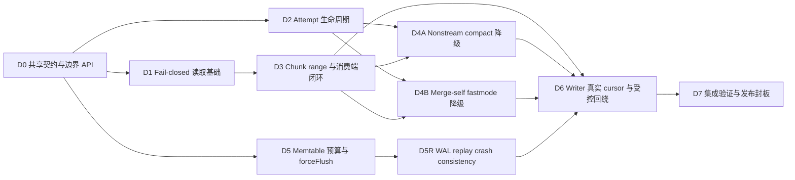

# TSStore uint32 溢出修复第一步开发交付与依赖顺序

> 主设计：[`uint32-offset-overflow-fix-design.md`](uint32-offset-overflow-fix-design.md)
>
> 文档定位：本文只定义第一步的开发拆分、依赖关系、合并条件和发布门禁，不重复主设计中的模块实现、测试用例和文件改动清单。

交付单元 `D0`～`D7` 同时作为设计、PR、测试和审计的追踪标识。编号表示依赖顺序，不表示各单元可以独立发布。

---

## 一、交付规则

所有交付必须遵守以下规则：

- 消费者能力先于或同版于生产者能力。任何可能产生受控回绕文件的 writer，不得先于查询、compact、merge 和 `WriteOriginal` 的兼容能力发布。
- 下层只负责校验并返回 typed error；attempt 负责资源清理；任务入口负责决定是否重跑；最终成功分支负责文件替换。
- 每个交付单元必须可独立评审、编译和测试，新增行为与对应测试必须在同一合并单元中完成。
- 清理失败、数据损坏、I/O、stop/drop/cancel 均 fail-closed，不得通过 stream retry 掩盖。
- 所有新增或修改的 uint32 窄化点必须显式分类：checked cast，或明确标注的 `ChunkMeta.size` 受控回绕。
- 合并完成不等于可以发布。未通过本文发布门禁的中间制品不得进入可能写入生产数据的环境。

## 二、交付不变量

后续代码、测试和审计统一引用以下不变量：

| 编号 | 不变量 |
|------|--------|
| `INV-01` | String bytes 在当前 active generation 内按 `(versioned measurement, destination SID, canonical field name)` 记账，整个 shard batch 必须在 mutation 前原子 reservation；请求自身永久过大时不得请求 flush，index 前可判定时零副作用，仅在 SID 收敛后才可判定时允许幂等 index / SID 元数据；当前 active 暂满同样只允许该元数据副作用，不得修改 memtable data、WAL 和行计数，且 data quota 必须按契约释放 |
| `INV-02` | 物理位置、entry range 和 writer cursor 使用真实 int64 值；`ChunkMeta.size` 不得用于推进 cursor 或证明完整 chunk 范围 |
| `INV-03` | `Segment.size` 在窄化前必须验证可表示；只有 `ChunkMeta.size` 允许保存真实长度的低 32 位 |
| `INV-04` | 非法 offset、size、checked add、slice 或 decode 只能返回错误，不得 panic、越界或返回部分 Record |
| `INV-05` | iterator、reader、builder、临时文件和 events 只属于单次 attempt，不得泄漏到下一次执行 |
| `INV-06` | 只有 `ErrRequireStream` 可以触发入口级 stream 重跑；必须先完整清理、重建全部状态，并且最多重跑一次 |
| `INV-07` | 源文件只在最终 attempt 成功后替换一次；任一失败或清理不完整都必须保留源文件 |
| `INV-08` | forceFlush 是绑定 active generation 的 level-triggered 状态；写请求不等待、不 rotate、不内部重试，snapshot ticket 携 expected immutable Active epoch pointer并在写锁下重新验证身份、active 非空、`snapshotTbl == nil` 和触发条件，只有成功换出对应 generation 才能清除请求，暂时不可调度的请求必须由 ticker 恢复；多 partition `WAL.Switch` 任一失败都按 unknown-partial transition fail-stop，不得换表、发布、清请求、删 WAL 或在同一进程重试 |
| `INV-09` | stream merge unordered 聚合仍是已知未覆盖项，不得将本次局部修复表述为全链路安全 |

涉及长度和位置时，命名必须表达真实语义，至少区分：

- `actualChunkDataSize`：真实 int64 chunk 长度。
- `entryRangeSize`：当前 ChunkMeta entries 覆盖的 int64 候选长度。
- `segmentSize`：经过 checked cast、可以写入线格式的 uint32 长度。
- `preloadSize`：查询预读提示，不代表完整 chunk 长度。

## 三、代码职责边界

| 层级 | 负责 | 不负责 |
|------|------|--------|
| `lib/record` | String bytes 统计、请求内 delta checked-add、bounded append、Record/ColVal 校验 | SID 解析、active ledger、flush、文件清理、stream 选择和任务重跑 |
| active `MemTable` | generation-local striped var-bytes ledger、compact key catalog、batch reservation token、Active / Poisoned 审计镜像、pool reuse 时清空状态 | 索引创建、node quota、WAL、rotate 和调用方重试 |
| immutable meta / reader | checked arithmetic、entry range、局部文件范围和 decode 校验 | compact/merge 重跑和源文件替换 |
| 单次 attempt | 创建、关闭和清理 iterator、reader、builder、临时文件及 events | 创建第二次 attempt 或决定是否降级 |
| compact / merge 任务入口 | 识别 `ErrRequireStream`、检查清理结果、重建状态、最多重跑一次 | 复用已消费对象或在执行中局部切换 stream |
| shard / tsstore | quota 与 index / destination SID 编排；immutable `activeEpoch` 指针原子发布 generation / table / health / first cause；在 `snapshotLock.RLock` 内完成整 batch reservation、mutation 和 WAL；generation-scoped forceFlush 请求及唯一 active/snapshot rotate | 让 record 层直接触发 flush，或让 reservation token 跨 generation 存活 |
| writer | 维护真实 int64 cursor、窄字段校验和受控回绕输出 | 使用 `ChunkMeta.size` 反推真实物理位置 |

共享能力应放在最接近其语义所有者的位置，不新增无明确所有权的通用工具层。

## 四、依赖关系



`D1`、`D2` 和 `D5` 在 `D0` 完成后可以并行开发；`D5R` 必须建立在 D5 的 reservation / admission 契约上。

`D4A` 和 `D4B` 使用相同错误与清理契约，但 compact 和 merge 的资源生命周期、重建方式及提交顺序不同，必须分别实现和评审。

`D6` 是本次 producer 放行点。它可以提前开发，但不得在 `D3`、`D4A`、`D4B`、`D5` 和 `D5R` 未完成时进入可发布制品。

## 五、交付单元

### D0：共享契约与边界 API

关联不变量：`INV-01`、`INV-03`、`INV-04`。

交付内容：

- 收敛 `ErrValueTooLarge`、`ErrActiveMemtableFull`、`ErrMemtablePoisoned`、`ErrCorruptWAL`、`ErrRequireStream`、`ErrCorruptColumn`、`ErrCorruptTSSP` 和 `ErrSegmentTooLarge` 的语义；前三者分别表示“请求自身永久过大”“请求合法但当前 active generation 暂满”和“该 generation 已发生不可继续的 mutation / WAL / invariant 故障”，不得仅靠日志文本区分。前两类还必须有可机读 reason：permanent 至少覆盖 value / final delta / catalog cardinality，active-full 至少覆盖 var-bytes / catalog ID space；Poisoned 携 generation / first cause且 non-retryable。metadata 5% 是 benchmark发布门禁，不是运行时 active-full reason；实际字节统一纳入 quota。`ErrCorruptWAL` 表示旧文件或非尾部 framing / decode 损坏并阻断 shard open；只有最新 partition 文件的物理 incomplete tail 可按最后完整 boundary截断，且不改变既有WAL payload格式。
- 提供 `VarBytes`、`VarBytesRange`、`CanAppendVarBytes`、bounded append、`ValidateCol`、`ValidateRecord`、checked add/range/slice 和 `CheckedUint32Size`。
- `Record.Merge`、跨 segment decode 等累积路径在 mutation 前完成 String bytes 预算。
- 明确普通 checked cast 与 `ChunkMeta.size` 低 32 位写出是两类不同操作。

完成条件：

- helper 只负责计算或校验，不包含 I/O、flush、retry 或全局状态。
- 精确等于上限、超过上限、算术溢出和非法 offset/length 均有边界测试。
- typed error 可通过 `errors.Is` 判断，不使用错误文本控制流程。
- 本单元不改变 TSSP 线格式，也不引入 producer 行为。

### D1：Fail-closed 读取基础

关联不变量：`INV-04`。

交付内容：

- iterator 初始化严格区分 EOF、空文件和实际错误。
- 为本次涉及的 reader/decode 路径补齐 checked add、文件 data range 和 checked slice。
- decode 失败时清除部分结果，不把损坏数据解释为空值、空文件或正常 EOF。

完成条件：

- malformed meta、截断 buffer、非法 entry 均返回 typed error，不发生 panic。
- I/O 错误保持原错误语义，不被转换成预读 fallback 或 stream retry。
- 本单元不修改 writer 输出、任务重跑和文件替换逻辑。

### D2：Attempt 生命周期与幂等清理

关联不变量：`INV-05`、`INV-07`。

交付内容：

- 为 immutable nonstream `MsBuilder` 增加幂等 `Abort`。
- 明确 `.init`、已完成临时 TSSP、sidecar、reader、iterator、events 和统计副作用的所有者及清理顺序。
- 清理失败必须返回清理错误，不得以仍可被识别为 `ErrRequireStream` 的形式继续向入口传播。

完成条件：

- 未开始写入、已写入 `.init`、已切出多个临时文件和重复调用 `Abort` 均有测试。
- `Abort` 失败时源文件保持不变，调用方不得创建 stream attempt。
- failure path 使用 `Abort`，不能用只清空内存状态的 `Reset` 代替资源清理。
- 最终提交前不得执行源文件替换、删除或重命名。

### D3：Chunk range 与消费端闭环

关联不变量：`INV-02`、`INV-04`。

交付内容：

- 实现 `ChunkEntryRange`，只根据当前完整 ChunkMeta 和文件 data range 计算 int64 entry-covered 候选范围。
- 查询保留小 chunk 预读；取 segment 或 decode 失败时释放资源、清空部分结果，再按目标 entry 重读一次。
- `WriteOriginal` 使用 `ChunkEntryRange` 的 int64 范围复制，不使用 `cm.size` 控制完整复制长度。
- 共享 reader 对目标 entry 执行 checked add、文件范围和 checked slice 校验。

查询 fallback 不调用 `ChunkEntryRange`，也不为正常查询增加完整 ChunkMeta 扫描；二者归入同一交付单元，是因为它们共同构成 producer 发布前的消费端兼容门禁，而不是因为存在直接调用关系。

完成条件：

- 使用 fake writer 或稀疏文件覆盖 `2^32 + N` 范围，不分配连续 4GiB 内存。
- 验证 `uint32(entryRangeSize) == cm.size`、checked add 和文件 data range。
- 正常小 chunk 仍只预读一次。
- 预读 I/O 错误直接返回；只有窗口不足或 decode 失败才按 entry fallback，且最多一次。
- fallback 前不存在部分 Record；`WriteOriginal` 不发生尾部截断。

### D4A：Nonstream compact 入口级降级

关联不变量：`INV-05`、`INV-06`、`INV-07`。

交付内容：

- nonstream attempt 只负责执行和清理，不在内部切换 iterator 或 builder。
- 完整 chunk 或完整 Record 无法安全整块处理、但逐 segment stream 仍可处理时，返回 `ErrRequireStream`。
- `CompactTask` 固定原 `CompactGroup`，在 Abort 成功后重建 `FilesInfo`，从头执行一次 stream compact。

完成条件：

- `ErrRequireStream` 的产生、attempt 清理和入口消费形成完整调用闭环。
- `CorrectTimeDisorder`、corrupt、I/O、stop/drop/cancel 和 Abort 失败均不触发 stream。
- 不复用第一次 attempt 的 iterator、reader、builder、临时文件或已消费状态。
- nonstream 或 stream 任一路径成功时只执行一次 `ReplaceFiles`；全部失败时源文件不变。

### D4B：Merge-self fastmode 入口级降级

关联不变量：`INV-05`、`INV-06`、`INV-07`、`INV-09`。

交付内容：

- fastmode attempt 将 builder、iterator 和 events 作为一个清理单元。
- `mergeSelfFastMode` 固定本批源文件引用；只有完整 Abort 后，才能基于原 `MergeContext` 新建一次 stream merge。
- `mergeSelfStreamMode` 返回最终 error，不再只记录日志后吞掉失败。

完成条件：

- parquet 目标 level、corrupt、I/O、stop/drop/cancel 和 Abort 失败均不触发 stream。
- stream retry 失败时不替换 ordered 文件，也不删除 unordered 文件。
- fastmode 与 stream mode 保留各自提交顺序，不抽取错误的通用提交逻辑。
- 本单元不扩大对 stream merge unordered 聚合的安全承诺。

凡已经能够产生 `ErrRequireStream` 的调用链，其入口消费和清理必须处于同一可测试合并单元；禁止先合并错误生产者、再由后续 PR 补充重跑逻辑。

### D5：Memtable 预算与后台 forceFlush

关联不变量：`INV-01`、`INV-08`。

交付内容：

- 请求进入 shard 后只做逐 String value的长度、字段合法性、name bytes和请求自身catalog cardinality的算术预检查；单值超过上限或single-batch唯一measurement / `(measurement, field)`数超过compact-ID空间时，返回带对应reason的`ErrValueTooLarge`，不得申请quota、创建index或请求flush。禁止按canonical series key跨row聚合String delta后永久拒绝，因为field index可能把同一series key拆到多个`PrimaryId`。
- 入口只构建一次 mutation-eligible row view，统一过滤 `StreamOnly` 等非 TSStore mutation row；preflight、WriteIndex、final plan、实际 append 和成功统计必须消费同一集合。每个 eligible row 在 WriteIndex 后必须有非零 `PrimaryId`，否则在 reservation 前失败，不得静默跳过。
- quota 和 `WriteIndex` 成功后，以最终 `row.PrimaryId` 作为 destination SID，形成 `(versioned measurement, destination SID, canonical field name)` plan；field index 对输入 identity 的拆分或合并都必须按最终 key 重新 checked-add 聚合。不得把 `SeriesId`、pre-index series key 或列下标假定为稳定记账身份。
- SID-keyed plan 合并后的任一 delta 自身超过上限时仍返回永久的 `ErrValueTooLarge`，释放 quota 且不请求 flush；ledger 必须在读取 current usage 前先做防御性 self-delta 检查，不能误报 `ErrActiveMemtableFull`。
- compact ID解析前删除null / empty产生的零delta key，避免零字节请求发布usage slot / owned name；解析后必须再次按最终`VarColKey` checked-add归一化，两遍reservation的`plan.items`必须key-unique且delta>0，重复item不能分别基于同一current通过第一遍。
- active `MemTable` 持有 generation-local striped ledger，usage 定义为 `committed bytes + outstanding reservation bytes`。compact numeric key、固定 stripe、升序加锁和两遍 check/apply 保证整个 shard batch 全部 reservation 成功或全部不修改。
- compact ID 解析必须由 ledger 在 `catalogMu` 下完成，不能让调用方先查 map、后凭裸 ID reserve。ID 0 非法，合法范围 `[1, MaxUint32]`；counter 必须能表示 exhausted，按 batch checked 分配且 active 内不复用，禁止 uint32 wrap。常见路径持有 catalog 读锁直到两遍 ledger 操作结束；新 ID / counter 只在写锁保护的 transaction-local slice 中准备，全部 key 通过后才与 usage 一次发布，失败路径不得通过“共享 map 先 insert 再 delete”造成未计费的 bucket 扩容。current active ID exhaustion 返回带 `CatalogIDSpace` reason 的 active-full；fresh empty counter 异常走 poison，单 batch 自身不可表示走 permanent catalog-cardinality。成功实体保持到 active reset。完整锁序为 `snapshotLock.RLock -> catalogMu -> reservation stripes -> WriteChunk.Mu`；catalog / stripe 锁内不得执行 quota、index I/O、value copy、mutation 或 WAL。
- 使用显式`MutableQuotaLease`覆盖row data与最坏ledger metadata，并闭合split ownership：`Acquired -> ClosedReleasedAll`，或`Acquired -> SplitMetadataTransferred -> ClosedTransferredAll / ClosedMetadataRetained`。catalog成功发布的canonical name由active-owned clone / arena持有；metadata charge为版本化固定charge加每个唯一name的aligned backing bytes。reservation成功时只转交actual metadata并归还多余上界；`BeginWrite`前cancel只释放data remainder、进入`ClosedMetadataRetained`，usage扣回0但已发布slot / catalog / owned name及charge保持；准入后data转交、进入`ClosedTransferredAll`且不得假回滚。各close / transfer只成功一次，double操作不得二次修改quota并走internal fatal / poison。
- 无String field的batch必须走零reservation开销fast path：不创建plan map、不获取catalog / stripe lock、不新增heap allocation；memtable准入只增加共用`BeginWrite`的一次atomic `activeEpoch` pointer load。Live模式还会在既有partition `writeMu`内增加一次WAL failure-latch load，必须在numeric-only门禁中显式计量。String plan可池化但须限制回池容量；ledger / catalog metadata必须纳入active memtable内存预算。
- reservation token 至少区分 `Reserved`、`Mutating`、`Committed`、`Cancelled` 和 `Failed`：`BeginWrite` 前失败必须 cancel 全部 delta；准入后不得回滚可能已经追加的 bytes。mutation / WAL error使 token Failed并 poison；fail / commit transition 自身也必须返回 error，WAL 可能已 durable 后的 commit invariant同样 poison。所有这些失败统一返回保留原始 cause 的 non-retryable `ErrMemtablePoisoned`，不得返回 nil、裸 retryable I/O error或允许回滚。
- shard 使用不可变 `activeEpochState{generation, table, state, firstCause}`；每次 rotate / poison 创建新对象并 CAS / Store 原子指针，地址不复用。所有 numeric / String、正常写、WAL replay 和内部写在 mutation 前都以一次 pointer load 验证 expected epoch，并且在 identity 相等后仍无条件要求 current state 为 Active；捕获到 Poisoned pointer 也必须返回携 first cause 的 `ErrMemtablePoisoned`，不能因 identity 相等而准入。对 String token执行 `Reserved -> Mutating`；Poison CAS 后 load 的 writer拒绝并 cancel，CAS 前 load 的 writer视为 memtable-accepted并继续 bounded mutation。它只有在 WAL failure latch 仍健康、完整 append和 token commit 均成功时才可正常返回。
- Poisoned epoch同时就是shard-wide unavailable health。query acquisition必须在同一`snapshotLock.RLock`内完成query-admission检查、Active epoch capture /验证、active / snapshot Ref、health token登记到drain registry和解锁前复检，锁序为`snapshotLock -> queryRegistry`，失败逆序rollback。token随`MemDataReader -> idKeyCursor -> KeyCursor / cross-shard cursor`传播；eager / lazy每次materialize前后及Record emit前复检，任意generation Poisoned都丢弃未emit Record并cancel剩余cursor；higher-generation健康rotate只允许已注册且持ref的旧view。受控恢复在snapshot写锁内关闭admission，短持registry锁标closing /复制tokens后释放该锁，再cancel / wait / UnRef；禁止持registry锁等待，drain完成后才安装健康epoch并重开admission。mutation部分追加时non-blocking epoch CAS仍须在释放`WriteChunk.Mu`前发生。
- 保留现有 generation barrier；`snapshotLock.RLock` 必须覆盖 final reservation、`BeginWrite`、active mem size 更新、mutation、WAL 和 `FinishWrite`，它同时承担 accepted writer 的 drain，因此不新增第二把共享 RWMutex 或 inFlight 计数。内部顺序为 String reserve 的 `catalogMu -> stripes`（全部释放）后执行 atomic 准入，再执行 `WriteChunk.Mu`；禁止 `stripe -> catalogMu` 或任意内部锁反向获取 `snapshotLock`。partial mutation 失败时只允许在对应 `WriteChunk.Mu` 内执行 non-blocking epoch CAS，不得在该锁内记录日志、获取新锁或执行 I/O。
- live WAL 增加 first-failure atomic latch，但不新增全局 append mutex：每个 writer 在既有 partition `LogWriter.writeMu` 内、触碰文件前检查 latch；`File.Write` 必须检查 error 与 short write。write / sync / file-switch 任一失败都在释放 partition 锁前 non-blocking poison绑定 epoch并发布 latch，同 partition 此后不得在 incomplete tail 后追加，尚未跨 gate 的其他 writer也失败；其他 partition 在 latch 前已跨 gate的 writer只可完成完整 record。后台 sync error不得忽略。replay 只容忍最新文件的 incomplete tail并按最后完整 boundary 截断，旧文件或非尾部 framing / decode 损坏必须 fail-closed。
- 当前active容量不足时返回带可机读reason的`ErrActiveMemtableFull`，并在仍持有`snapshotLock.RLock`时只为捕获generation执行`0 -> generation` CAS或同值幂等forceFlush；不同非零值是invariant且不得覆盖。成功rotate只以CAS(expected,0)清除。写请求不等待snapshot、不执行rotate，也不在本层自动重试。
- Reserve / BeginWrite 必须按 typed result 分流：只有 `ErrActiveMemtableFull` 登记 generation request；`ErrValueTooLarge` 释放 lease且不 flush；`ErrMemtablePoisoned` 返回携 first cause 的 fatal health；ledger arithmetic、generation / token / plan invariant 在释放 catalog / stripe 后 poison active并走 internal fatal。后两类均不得被包装成 retryable active-full，所有分支释放尚未转交的 lease。
- `AddRowCountsBySid`、batch row count和success metrics只能在 WAL append、token commit及 `FinishWrite`全部成功后更新；commit invariant即使发生在 durable WAL之后也必须poison且不得留下成功统计。
- generation 0 仅作“无 forceFlush request”哨兵；首个 active 从 1 开始。rotate 在 `WAL.Switch` 前 checked 计算 nonzero next generation，溢出时 poison / unavailable并保持 request 与 WAL。`shouldSnapshot` 必须在同一读锁临界区内检查并登记带 expected Active epoch pointer 的 ticket；`tsstoreImpl.writeSnapshot` 是唯一 rotate 入口，取得写锁后重检 active / epoch / `snapshotTbl` / condition，再调用带 expected epoch 的 `WAL.Switch`。Switch 必须在 WAL generation fence 内阻止新 append、drain pending sync并检查 latch；成功返回后、换表前再次确认 expected epoch仍 Active且 latch nil，随后在同一 snapshot 写锁内执行 `WAL.BindEpoch(next) -> snapshotTbl=old -> activeTbl=next -> activeEpoch.Store(next)`，最后才清除成功换出的请求。Switch error、async sync在 precheck与commit间 poison / latch、或 post-check失败都按 unknown-partial transition poison并 process fail-stop：保持 active、request、`snapshotTbl == nil` 和磁盘 WAL，不换表、不发布 / finalize、不删除 WAL，也不在同一进程重试已部分 reset `fileNames` 的 Switch；重启通过目录扫描恢复全部 partition。若 panic 可被 recover，必须先关闭 shard并保持 unavailable。
- forceFlush 是 level-triggered generation 状态：已有 `snapshotTbl` 或 stale ticket 不得消费请求；旧 snapshot 清空后，现有 ticker 必须在一个周期内为 current generation 重新登记，且不依赖新写入唤醒。
- snapshot“active非空”必须包含row data、accounted usage以及已计费catalog / zero-slot / owned-name metadata；pre-mutation cancel留下的metadata-only active也可执行无TSSP数据的no-op flush后rotate / reset，不能让CatalogIDSpace请求因“无row”永久搁置。
- 新 active 安装新的 generation 和空 ledger；`MemTable.Reset` / pool reuse 必须清空 usage、catalog、poisoned 状态和 token 关联，旧 token 永远不能对复用对象生效。

完成条件：

- 请求自身永久超限时返回 `ErrValueTooLarge` 且 forceFlush 无副作用：单值在 index 前判定时 quota、index、memtable data、WAL 和行计数均无副作用；最终 SID 聚合后才可判定时允许幂等 index / SID 元数据，但必须释放 quota且不修改 memtable data、WAL 或行计数。field-index split 场景不得因 pre-index 聚合产生假阳性。
- active 暂满时返回 `ErrActiveMemtableFull`：允许幂等 index / SID 项已经存在，但 memtable data、WAL 和行计数不变，quota 在返回前净释放；该错误保持可机读且不进入第一步的全局自动重试集合。
- 注入 Reserve 的 permanent、poisoned、checked arithmetic 和 generation / token / plan invariant error，验证只有 active-full 产生 snapshot ticket；Poisoned 统一返回 `ErrMemtablePoisoned`，raw invariant 走 internal fatal，均释放未转交 lease且不被误报为可重试容量不足。
- `current=60`、两个并发 batch 各 `delta=30`、limit=100 时只能一个成功；multi-key batch 任一 key 超限时所有 ledger counter 均不变化。测试同时覆盖同 key、不同 key、hash collision、跨 stripe 及相反输入顺序，证明无 overcommit、死锁或部分 reservation。
- reservation 后、`BeginWrite` 前由另一 writer poison 时，atomic admission 拒绝准入并 cancel 全部 delta、把 usage 扣回 0、释放 data lease；零值 usage slot 与 catalog metadata 仍计入 active mem size并保持到 reset。
- quota lease三个闭合终态均有测试；split后cancel必须进入`ClosedMetadataRetained`而非全退，double close / transfer不二次修改node / active计数并暴露invariant。
- numeric / String writer 在 poison pointer load / CAS 前后竞争准入时，CAS 后的新 writer全部拒绝；CAS 前 memtable-accepted 的 writer完成 bounded mutation，但只有 WAL latch 健康、完整 append和 token commit成功才可返回成功。失败 token 不扣回 usage或释放已转交 quota，所有失败以保留各自 cause 的 non-retryable Poisoned health 返回；snapshot 写锁等待其外层 RLock drain，后续新写和 publish fail-closed。
- 注入 writer A WAL short-write与 writer B 已 memtable-admitted：A 在 partition `writeMu` 内 poison / latch；B 未跨 WAL gate时不得 append或返回成功，已在其他 partition 跨 gate时只允许完成一个完整可 replay record；同 partition incomplete tail 后无后继 record。另覆盖 WAL 已成功但 token commit invariant，验证返回 Poisoned health而非 nil / retryable error。
- partial append与并发 query failpoint覆盖 eager / lazy、materialize前后、emit前及cross-shard merge：poison后未emit Record被丢弃、剩余cursor取消并返回 unavailable；健康 rotate期间已持旧 table ref的 query不被误报。受控重启前poisoned shard不对外提供读写，恢复 epoch安装前旧 query已全部 cancel / drain。
- 在query acquisition的capture / Ref / registry登记各点暂停并并发poison / recovery，验证RLock原子绑定：query要么已登记并被drain，要么rollback并失败，绝不能跨恢复后把未登记旧view按健康higher-generation rotate放行；terminal / cancel只unregister / UnRef一次。
- schema 增列或排序后仍按 canonical field name 记账；WAL replay 和正常写使用同一 ledger / admission 路径，但 durable / retry 语义由 D5R 分模；destination SID 明确覆盖 `row.PrimaryId != SeriesId` 的模式。
- `StreamOnly` 混合 batch、零 `PrimaryId` 和重复 raw plan item 测试证明 eligible set 与 mutation 完全一致、零 SID 预先失败、compact plan key 唯一且合并后再执行上限判断。
- 高基数null / empty String batch不生成零delta item、不发布usage / catalog / owned name；空plan仍经过统一`BeginWrite`。
- fake compact-ID counter 从 `MaxUint32-1` 覆盖最后 ID、exhaustion、并发 provisional allocation与 reset，证明 0 / wrap / reuse 不出现；最大长度 measurement / field name 与高基数 cancel场景证明 active-owned backing按长度计费、失败不扩容共享 map且 reset释放 ownership / charge。
- reservation成功后在mutation前cancel，构造仅有catalog / zero-slot / owned-name charge的metadata-only active；forceFlush必须no-op flush并rotate / reset、不生成空TSSP，且请求和charge均不搁置。
- rotate 的写锁等待旧 generation 的全部读锁 writer完成；stale ticket、已有 `snapshotTbl`、显式 ForceFlush、旧 snapshot 完成和新 active 再次请求并发时，不执行错误的 `WAL.Switch`，也不清除新 generation 的请求。另验证 poisoned active 永不进入 rotate / publish，已有 snapshot 清空后 level request 在一个 ticker 周期内自行恢复调度，以及多 partition Switch 部分成功时不换表、不发布、不删除文件并由重启目录扫描找回完整 WAL 集。
- 首个 active generation 1 的 active-full request 可表示并被执行；fake `MaxUint64` generation 的 rotate 在 `WAL.Switch` 前 poison / unavailable，保留 request / WAL且从不发布 generation 0。
- 性能门禁以主设计的 versioned `var_bytes_reservation_bench_v1.yaml` 为唯一口径：固定 baseline / candidate SHA、同机环境、`GOMAXPROCS=16`、数据分布、并发、warmup / measure、交替 10 轮和 benchstat `alpha=0.05`；置信区间跨越门禁时扩到 20 轮，仍不收敛即失败。原始 samples、manifest / binary hash必须作为 G5 artifact。
- 达到以下门禁：无 String workload（包含 WAL latch正常路径）throughput 下降不超过 2%、p99 增幅不超过 5% 且 0 额外 heap allocation；代表性 String workload throughput 下降不超过 5%、p99 增幅不超过 10%；高并发 disjoint SID throughput 下降不超过 10%；snapshot writer lock wait p99 增幅不超过 10%；memtable-heavy eager / lazy / cross-shard query throughput下降不超过2%、p99增幅不超过5%且健康rotate不产生业务error；预热 catalog且新增100K keys时usage-map core不超过48 B / live key，manifest的短名 / 最大长度名、低-name/高-SID与高-name/低-SID模型下active-owned name + catalog + usage + zero-slot总metadata不超过active memtable上限的5%。
- artifact 分开记录 success / permanent / active-full / poisoned 写延迟、throughput、allocs/op、B/op、plan、catalog slow-path、stripe wait/hold、stripes touched、WAL gate wait / latch load、从 `snapshotLock.Lock` 调用到取得锁的 wait，以及 owned-name / usage / catalog / zero-slot keys 与 heap bytes；不得用快速失败或 catalog 摊薄场景美化结果。

### D5R：WAL replay crash consistency

关联不变量：`INV-01`、`INV-07`、`INV-08`。

这是 D5 的发布前置，不是可延期的优化项。共同写入口必须显式携带 Live / Replay mode：Replay 复用 eligible rows、SID plan、reservation、atomic admission 和 bounded mutation，但源 WAL record 已是 durable input，禁止二次 `WAL.Write`。

在本单元完成前，replay 遇到 active-full、permanent-too-large、index、mutation 或 flush 错误时必须在当前 record mutation 前停止（若错误发生更晚则整体失败），使 shard open / async replay fail-closed；不得走 live 异步 ticket、中途 snapshot、cursor 前移或源 WAL 删除。丢弃未发布的内存 active，保持 shard unavailable 和完整源 WAL 集合。

交付内容必须在以下方案中明确选择一个，不得用“保留 WAL 后 rotate / retry”替代 crash consistency：

1. 证明 `(partition, WAL file identity, record offset)` 的重复 replay 对索引、memtable、TSSP 发布和查询结果严格幂等；或者
2. 实现 durable replay transaction，将 next cursor 与中间 snapshot 的 prepare / publish / rollback 绑定，恢复时可识别并清理未提交输出，只有 durable commit 覆盖的前缀才可跳过或回收源 WAL。

完成条件：

- active-full 时当前 record 不 mutation、不推进 cursor；选定协议完成安全 rotate 后只重试该 record，空 active 再失败按 permanent / invariant 处理。
- crash injection 覆盖中间 snapshot prepare 前后、文件 publish 前后、cursor commit 前后和源 WAL remove 前后；任何重启结果都不能丢失或重复已确认数据。
- Replay mode 不二次 append WAL；正常 replay 全部成功时，仍以最终 `ForceFlush` 成功作为既有源 WAL remove 的前置。
- parallel replay 在同一 shard 上必须关闭或由单一 orchestrator 串行化 reservation-sensitive rotate；多个 partition consumer 不能各自切换 active generation。
- open、async replay、cancel 和错误路径都证明 shard 不会在未完成 replay 时对外提供读写，且所有源 WAL 保留到协议定义的 durable commit。

### D6：Writer 真实 cursor 与受控回绕

关联不变量：`INV-02`、`INV-03`。

这是本次 producer 放行点，必须在 `D3`、`D4A`、`D4B`、`D5` 和 `D5R` 完成后进入发布候选版本。

交付内容：

- `MsBuilder.WriteData` 只在写盘成功后用 `diskFileWriter.DataSize()` 更新真实 int64 `dataOffset`。
- 本次修改的 stream downsample / merge writer 使用真实 int64 delta 推进 cursor。
- `Segment.size` 使用 checked cast；`ChunkMeta.size` 保存真实 chunk 长度低 32 位。
- stream compact 实现保持不变，只增加 cursor 和受控回绕回归验证。

完成条件：

- 下一 SID、下一列和每个 segment offset 均不依赖回绕后的 `cm.size`。
- 首个 TSSP header 被 `DataSize()` 正确计入，不使用 `len(encodeChunk)` 猜测位置。
- 单 segment 不可表示时，在 meta 写出前返回 `ErrSegmentTooLarge`。
- 普通非回绕文件的字节布局和既有行为保持不变。
- 不允许脱离 `D3`、`D4A`、`D4B`、`D5`、`D5R` 单独 cherry-pick 或发布本单元。

### D7：集成验证与发布封板

关联不变量：`INV-01`～`INV-09`。

本单元不推迟各交付单元自身的测试，只负责跨模块集成和发布资格确认。

完成条件：

- 主设计“测试策略”中的写入、snapshot、writer、query、compact、merge、stream 和兼容性测试全部通过。
- 使用小阈值完成业务路径测试，使用 fake writer 或稀疏文件完成跨 `2^32` 物理位置测试。
- failure injection 证明 Abort、I/O、decode、stop/drop/cancel 等失败不产生部分发布。
- 每个不变量均能追踪到生产代码入口和自动化测试。
- stream compact 的实现与切分时机保持不变。
- stream merge unordered 风险继续作为未闭环项出现在发布说明中。
- 测试证据绑定同一 commit SHA 和最终制品信息，不使用其他分支或历史制品的结果替代。

## 六、发布门禁

| 门禁 | 通过标准 | 不通过时处理 |
|------|----------|--------------|
| `G1` 基础契约 | `D0` 的 checked/bounded API、错误语义和所有窄化例外均有测试 | 禁止上层接入 |
| `G2` Fail-closed 与清理 | `D1`、`D2` 证明无 panic、无部分结果、Abort 幂等且清理失败禁止重跑 | 返回原错误或清理错误，不进入 fallback |
| `G3` 消费者就绪 | `D3` 证明查询、reader 和 `WriteOriginal` 可处理受控回绕，非法 range fail-closed | 禁止发布 `D6` |
| `G4` 重跑闭环 | `D4A`、`D4B` 证明只有 `ErrRequireStream` 最多触发一次完整重跑，源文件保持不变 | 禁止发布 `D6` |
| `G5` 写入、恢复与性能 | `D5` 证明 destination SID、striped ledger、batch reservation、atomic admission、poison、generation barrier / forceFlush 和性能门禁；`D5R` 证明 Replay 不二次写 WAL且 active-full 的 crash consistency / 源 WAL 所有权闭环 | 禁止发布第一步制品 |
| `G6` Producer 正确性 | `D6` 证明真实 cursor、checked cast 和受控回绕输出正确 | 制品不得进入可写环境 |
| `G7` 发布封板 | `D7` 验收矩阵闭合，证据绑定同一 commit 和制品 | 不签发第一步版本 |

消费者能力可以先于 producer 发布，但不得晚于 producer。本文只定义代码制品约束，不据此授权混部、逐节点放量或运行时启用；相关部署顺序由第二步设计负责。

## 七、审计证据

每个 PR 至少记录：

```text
关联交付单元：
关联不变量：
新增或修改的入口：
错误产生层 / 清理层 / 处理层：
资源与状态副作用：
最终提交点：
自动化测试及结果：
静态使用点审计：
兼容性影响：
明确未覆盖项：
```

代码审计必须覆盖：

- 所有 `cm.size` 使用点：只允许线格式写出、低 32 位一致性校验和查询预读提示。
- 所有新增或修改的 `uint32(...)`：必须是 checked cast 或明确的 `ChunkMeta.size` 受控回绕。
- 所有 `offset + size` 和 slice：必须经过 checked add、文件范围和 checked slice。
- 所有 `ErrRequireStream` 产生点和消费点：corrupt、I/O、cancel 等错误不得触发降级。
- 所有 attempt 清理、`Reset`、rename、replace 和 delete：必须验证资源所有权及最终提交时机。
- 所有 String mutation：请求内 delta 必须 checked-add；最终 key 必须使用 versioned measurement、destination `row.PrimaryId` 和 canonical field name；mutation 前必须持有覆盖整 batch 的 reservation 或由 bounded append 保护。
- 所有 reservation ledger、compact ID catalog 与 token 状态转换：验证 transaction-local ID 只在成功分支发布且 active 内不复用、失败不增长共享 map、两遍 check/apply 无部分提交、`catalogMu -> stripe` 全局锁序、`BeginWrite` 前 cancel、准入后 Failed / poison、generation / pool reuse 隔离，以及 usage 始终表示 committed 与 outstanding 之和。
- 所有 active write-admission 路径：numeric / String、正常写、WAL replay 和内部写必须共用 immutable epoch pointer load；审计 identity 相等时仍无条件检查 Active 状态，以及 Poison CAS 前后 accepted / rejected 语义、first-cause 与失败 token，禁止重新引入第二把共享 RWMutex 或 inFlight 写热点。
- 所有memtable query acquisition / cursor层：审计同一snapshot RLock内的admission、epoch、table Ref、registry登记和复检原子绑定，以及恢复关闭admission后cancel / drain / UnRef再装新epoch的顺序；health token须贯穿reader / idKeyCursor / KeyCursor / cross-shard cursor，每次lazy / eager materialize及Record emit前后校验。任意generation Poisoned都丢弃未emit结果并传播health，只有已注册持ref的健康higher-generation旧view可继续。
- 所有 `snapshotLock` 相关路径：验证 final reservation、BeginWrite、mutation、WAL 和 FinishWrite 均在同一 `RLock` generation barrier 内，写锁作为 accepted writer drain 证明，且不存在任意内部锁反向获取 `snapshotLock`。
- 所有 forceFlush 请求必须携带非零 expected generation，snapshot ticket 必须携带 expected Active epoch pointer；审计首 generation=1和 checked next-generation。写锁下重新检查 active、`snapshotTbl`、epoch pointer 身份、generation、Active 状态、非空和触发条件，只有成功换出对应 generation 才能清除其请求；同时验证 level request 在暂时不可调度后恢复。
- 所有 WAL append / replay：检查 short write、partition `writeMu` 内 failure latch、后台 sync error、同 partition incomplete tail 后无后继 record；只有最新文件物理 tail可截断，其他损坏必须返回 `ErrCorruptWAL` 并阻断 shard open。token transition error统一进入 Poisoned health。
- 所有 `WAL.Switch` error：审计 generation fence、pending sync drain、成功后的 epoch / latch post-check与 `BindEpoch(next)` 顺序；多 partition partial success或并发 async-sync failure必须仍在 snapshot 写锁内 poison / fail-stop，未修改 active / snapshot归属、未清除 request、未删除目录 WAL且未在同一进程重试，恢复从目录重建完整文件集。
- 所有 `ErrValueTooLarge` / `ErrActiveMemtableFull` 返回点：验证永久失败与当前 generation 暂满可机读区分；永久失败不得请求 flush，只有 SID 收敛后才发现时才允许幂等 index / SID 元数据；active-full 同样只允许该元数据副作用且 quota 净释放。
- 所有 Reserve / BeginWrite error switch：验证 poison、corrupt 和 generation / token / plan invariant 不会落入 active-full 分支，不会生成 snapshot ticket，且未转交 quota 全部释放；上层只能看到 `ErrMemtablePoisoned` health 或明确 internal fatal，不能把 state-change 名称当 transient retry。
- 所有 Replay mode 路径：不得二次 `WAL.Write`；记录 identity / cursor、intermediate output、source WAL 的 prepare / commit / rollback 所有权可追踪，active-full 和 crash 不得推进未提交 cursor、重复发布或提前删除源 WAL。
- D5 性能证据：必须绑定 versioned manifest，记录 baseline / candidate SHA、同机交替至少10轮原始samples、统计置信区间、吞吐与分场景延迟、allocs/op、B/op、stripe争用、WAL latch、lazy / cross-shard query health、snapshot writer wait以及短名 / 最大长度名下的owned-name / ledger分项内存；任一门禁不通过不得豁免。

主设计测试策略与交付单元的追踪关系如下：

| 测试组 | 主要交付单元 | 主要不变量 |
|--------|--------------|------------|
| 写入 / snapshot / WAL replay | `D5`、`D5R`、`D6` | `INV-01`、`INV-02`、`INV-07`、`INV-08` |
| Writer 与 chunk entry range | `D0`、`D3`、`D6` | `INV-02`、`INV-03`、`INV-04` |
| Nonstream 入口级 stream 重跑 | `D2`、`D4A`、`D4B` | `INV-05`、`INV-06`、`INV-07` |
| Query / stream / `WriteOriginal` | `D1`、`D3`、`D6` | `INV-02`、`INV-04`、`INV-09` |
| 兼容性 | `D3`、`D6`、`D7` | `INV-02`、`INV-03` |

## 八、合并、发布与回滚规则

开发和合并顺序：

1. 先完成 `D0`。
2. `D1`、`D2`、`D5` 可以并行。
3. `D1` 完成后交付 `D3`。
4. `D2`、`D3` 完成后，分别交付 `D4A` 和 `D4B`；D5 完成后交付 `D5R`。
5. `D3`、`D4A`、`D4B`、`D5`、`D5R` 完成并通过对应门禁后，才允许 `D6` 进入发布候选版本。
6. 最后执行 `D7`，封板同一 commit 的发布制品。

中间提交必须保持主干可编译、可测试，但中间制品不一定具备发布资格。若主干会自动生成制品，发布系统必须阻止未通过 `G7` 的制品流出。

回滚分为三类：

| 场景 | 允许 | 禁止 |
|------|------|------|
| 开发阶段、制品尚未进入可写环境 | 按依赖逆序 revert | 保留依赖方而撤销其基础契约 |
| compact / merge attempt 失败 | Abort 当前 attempt、保留源文件；仅 `ErrRequireStream` 可重建并重跑一次 | 局部切换 stream、清理不完整后继续、循环重试 |
| 含 `D6` 的制品已进入可能写数据的环境 | 保持最低可读版本，使用兼容制品前向修复 | 回滚到不能识别受控回绕文件的旧版本 |

第一步不提供持久化能力标记或文件盘点机制。因此，含 `D6` 的制品一旦进入可能写数据的环境，默认按“可能已经产生受控回绕文件”处理，不能仅凭人工判断回滚到旧读者。

## 九、范围护栏与残余风险

| 不做项 | 本次处理与残余风险 |
|--------|--------------------|
| 按 chunk bytes 拆分同 SID 文件 | 保持现有文件组织，通过真实 cursor 和 `ChunkMeta.size` 受控回绕处理 |
| 禁止 `ChunkMeta.size` 回绕 | 只禁止将其作为真实物理长度或 cursor；仍存在最低可读版本约束 |
| 受控回绕后的旧版本回滚 | 第一阶段明确不支持，由第二步部署和最低可读版本治理承接 |
| snapshot 全链路错误上抛、通用 durable manifest 与完整 WAL 生命周期改造 | 除 D5 的 generation ticket / poisoned active 和 D5R 为 replay active-full 选定的最小幂等证明或 durable transaction 外保持既有行为；D5R 不得被泛化为未评审的通用恢复框架，本次 `MsBuilder.Abort` 只用于 immutable attempt |
| nonstream 执行中的局部 stream 切换 | 只允许任务入口完整清理后从头重跑一次 |
| 多个 bounded Record 输出协议 | nonstream 无法安全处理时返回 `ErrRequireStream` |
| stream compact 流程改造 | 保持实现不变；只执行 cursor、输出兼容性和切分时机回归验证 |
| stream merge unordered 的 `rowsLimit` 或读取流程改造 | 继续作为独立已知风险，不纳入本步骤全局安全承诺 |

所有残余风险必须在发布记录中关联后续跟踪项和责任角色；设计文档只记录角色和责任边界，不绑定具体人员。
