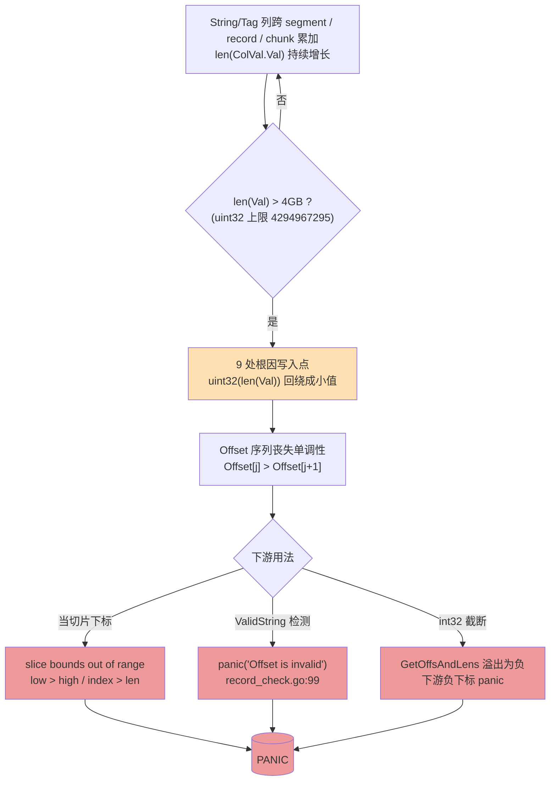
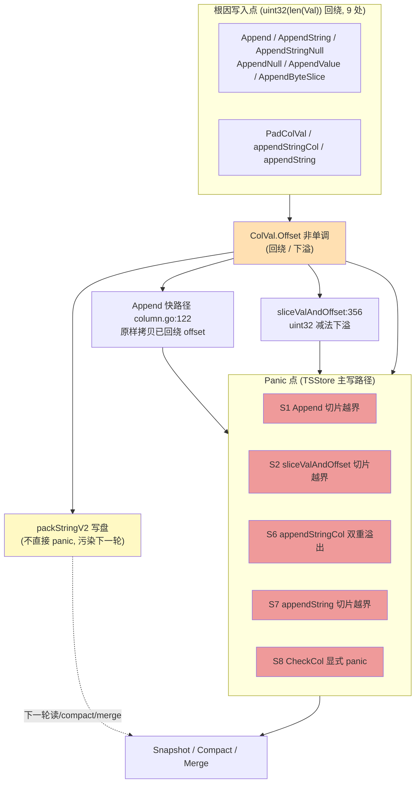
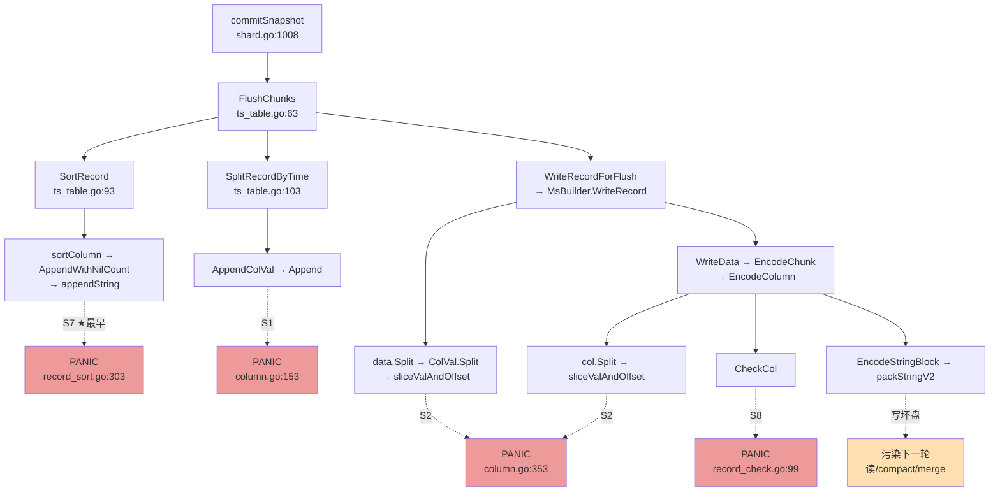
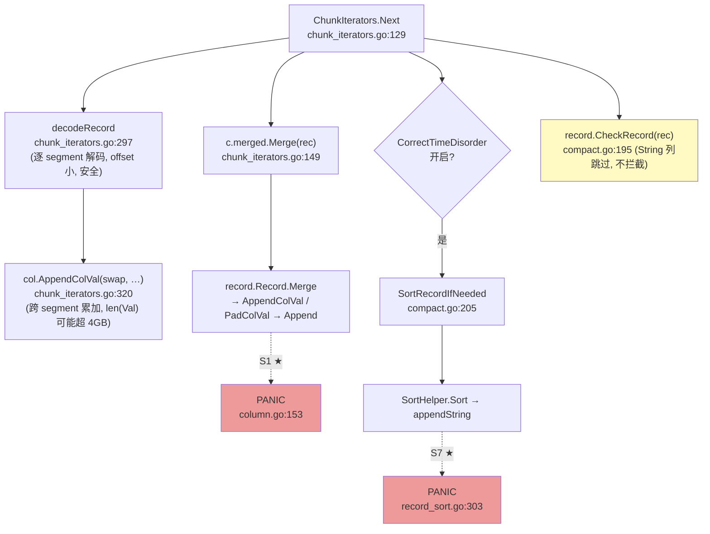
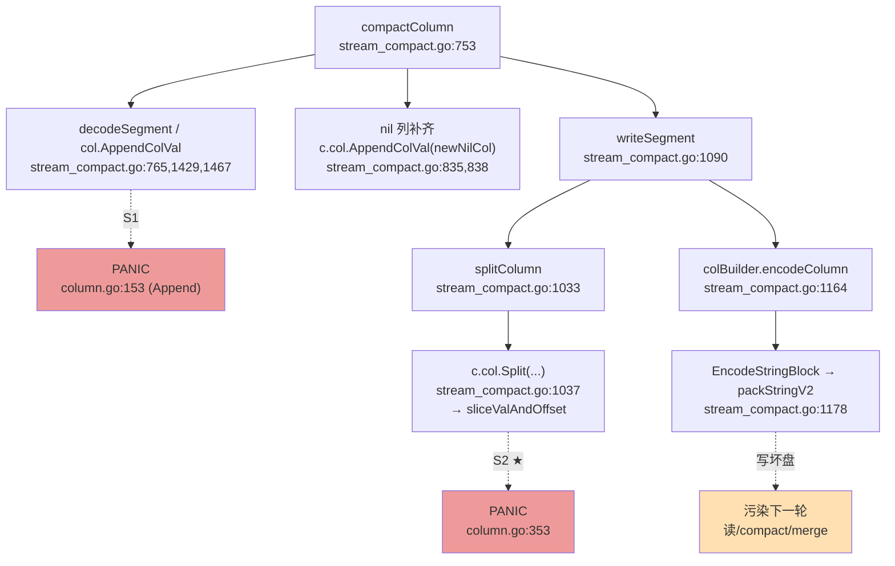
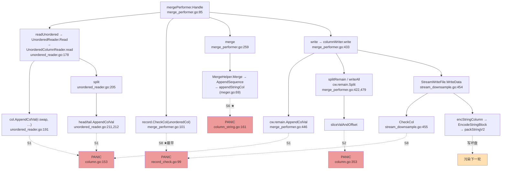
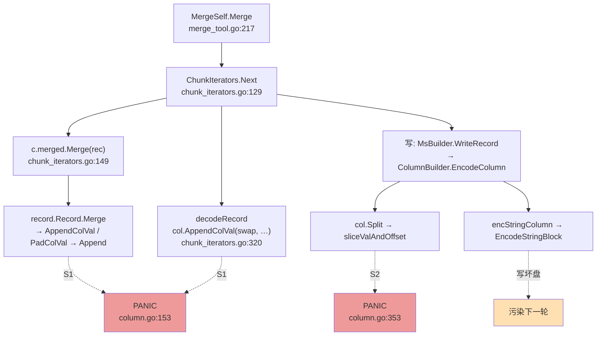
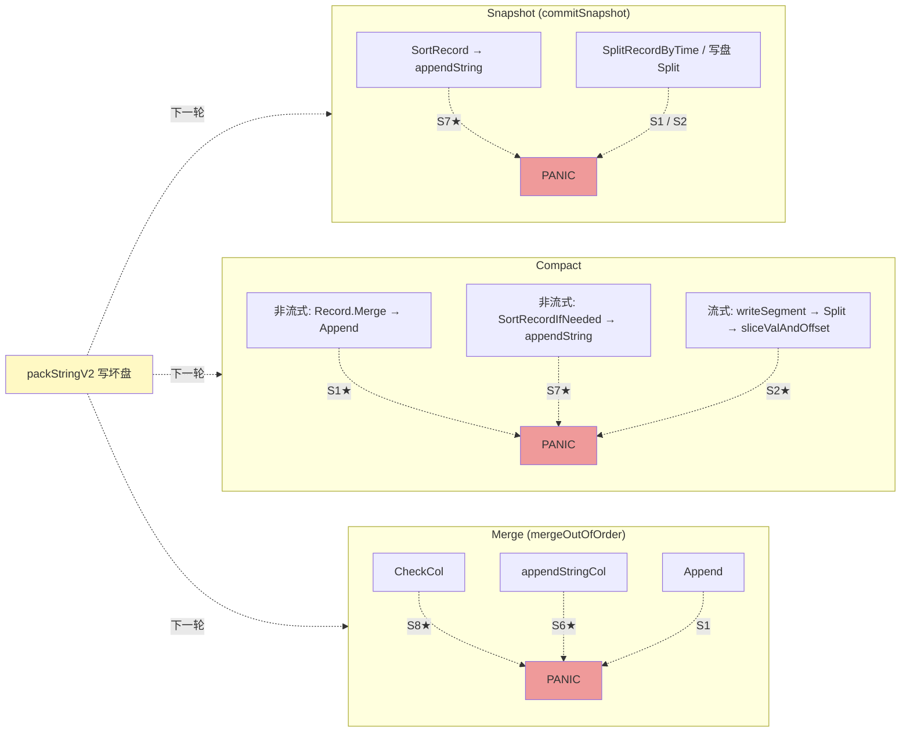

# TSStore 场景下 `ColVal.Offset`(uint32)大 String 溢出 Panic 分析

> 范围:仅分析 TSStore(row-store)引擎。已排除所有 ColumnStore 场景(attached/detached 写入、`pk_fetcher`/`BytesUnsafe` 主键取值、布隆/全文/IP tokenizer 索引构建、`colstore_compact.go` 等)。
>
> 分析对象:`lib/record/column.go` 中 `ColVal.Offset` 为 `[]uint32`,当某 String/Tag 列在内存中累积的 `Val` 总长度超过 `uint32` 上限(4 294 967 295,4GB)时,offset 回绕导致数组越界 panic。覆盖三个流程:
> - **Snapshot**:`shard.commitSnapshot`
> - **Compact**:`shard.Compact`
> - **Merge**:`MmsTables.mergeOutofOrder`

---

## 一、根因机制

`lib/record/column.go:32` 定义:

```go
type ColVal struct {
    Val    []byte
    Offset []uint32   // ← 容量上限 4GB
    ...
}
```

所有写路径都用 `uint32(len(cv.Val))` 记录每行 string 在 `Val` 中的起始偏移。当某个 String/Tag 列在内存中累积的 `Val` 跨过 4GB:

1. `uint32(len(cv.Val))` **回绕成一个小值**,写入 `Offset`,使 `Offset` 序列丧失单调性;
2. 之后这些回绕的 offset 被当作切片下标去切 `cv.Val`,触发:
   - `runtime error: slice bounds out of range`(`low > high` 或 `index > len`);
   - `record_check.go:99` 的显式 `panic("Offset is invalid")`(`ValidString` 检测到 `Offset[j] > Offset[j+1]`)。
3. `int32(len(cv.Val))` / `int32(cv.Offset[i])` 在 `GetOffsAndLens` 中溢出为负数,下游用负数当下标再 panic。

**关键前提**:单个 segment 从磁盘解码回来时 offset 都是小值,本身安全。Panic 全部发生在「把多个 segment / record / chunk 的 String 数据**累加进同一个 ColVal**,使 `len(cv.Val)` 跨过 4GB」的场景。

`CheckRecord`(`record_check.go:27`)对 String/Tag 列 `continue` 跳过长度校验(`record_check.go:54-56`),只校验列长一致性和 schema 顺序,因此溢出能悄无声息地通过校验。

### 溢出 → Panic 演进图



> 注:单个 segment 从磁盘解码回来时 offset 都是小值,本身安全;回绕只发生在「累加进同一 ColVal 使 `len(Val)` 跨过 4GB」之后。

---

## 二、TSStore 三流程共享的 panic 点

以下位于 `lib/record` 基础层,三个流程(TSStore)均会经过。

| 编号 | 位置 | 函数 | 触发表达式 | 触发原因 |
|------|------|------|-----------|----------|
| **S1** | `lib/record/column.go:153` / `:151` | `ColVal.Append`(String/Tag 慢路径) | `value[offsets[start]:offsets[end]]` / `value[offsets[start]:]` | 源 `Offset` 回绕非单调 ⇒ `start > end` 或越界 |
| **S2** | `lib/record/column.go:353` | `ColVal.sliceValAndOffset`(String 分支) | `srcCol.Val[offsetStart:endOffset]`,`offsetStart=Offset[start]`,`endOffset=int(Offset[end])` | 回绕 ⇒ `offsetStart > endOffset` 或越界 |
| **S3** | `lib/record/column.go:356` | `sliceValAndOffset` | `cv.Offset[index] = srcCol.Offset[pos] - offsetStart` | uint32 减法下溢,把巨大 corrupt offset 传播给切出来的 segment,后续再 panic |
| **S6** | `lib/record/column_string.go:161` | `appendStringCol` | `src.Val[vs:ve]`,`ve = uint32(len(src.Val))` | **双重溢出**:`uint32(len(src.Val))` 本身回绕,叠加 offset 回绕 ⇒ `vs > ve` |
| **S7** | `lib/record/record_sort.go:303` / `:301` | `appendString`(排序路径) | `src.Val[src.Offset[start]:src.Offset[end]]` | 回绕非单调 ⇒ `start > end` |
| **S8** | `lib/record/record_check.go:99` | `CheckCol` → `ValidString` | `panic("Offset is invalid")` | `column.go:289` 检测到 `Offset[j] > Offset[j+1]` 返回 false |
| **S5*** | `lib/record/column_string.go:137/132, 185/181, 201/197, 71/69` | `StringValue` / `StringValueSafe` / `StringValueUnsafe` / `StringValues` | `cv.Val[start:end]` / `cv.Val[off:offs[i+1]]` | 回绕非单调 ⇒ `start > end`(经 downsample/区间更新路径触达,见下) |
| **S9*** | `lib/record/column.go:48` / `:55` | `GetOffsAndLens` | `int32(cv.Offset[i])`、`int32(len(cv.Val)) - offsets[start-1]` | int32 溢出为负,下游用负数当下标 panic |

> **S5\* / S9\*** 在 TSStore 三流程的**主写路径**上不直接出现(S5 是查询/unnest 路径;S9 的 tokenizer 触发点属 CS detached 索引构建,已排除)。但它们可经 compact 的 downsample / 区间记录更新路径(`record.go:1446` `stringUpdateFunction`、`record.go:1469` `recStringAppendFunction` → `TransIntervalRec2Rec`/`UpdateIntervalRecRow`)与 string pre-agg 构建(`mergeStringPreAgg`)间接触达,故列出。

### 根因写入点(产生回绕 offset 的源头,共 9 处)

```
column.go:143       Append(String/Tag)        offset := uint32(len(cv.Val))
column.go:179       PadColVal                  uint32(offset), offset=len(cv.Val)
column.go:439       AppendByteSlice            uint32(len(cv.Val))
column.go:625       AppendNull(isString)       uint32(len(cv.Val))
column.go:632       AppendValue(isString)      uint32(len(cv.Val)-len(v))
column_string.go:30 AppendString               uint32(index), index=len(cv.Val)
column_string.go:51 AppendStringNull           uint32(len(cv.Val))
column_string.go:143 appendStringCol           uint32(len(cv.Val)) + :155 uint32(len(src.Val))
record_sort.go:292  appendString               uint32(len(cv.Val))
```

另:`column.go:122` 的 `Append` **快路径** `cv.Offset = append(cv.Offset, offsets...)` 会原样拷贝源端已回绕的 offset,静默传播污染,随后在 `Split`/`Append` 处 panic。

### 编码层(写盘,不直接 panic,但产生坏数据,下一轮读/合并时 panic)

- `lib/encoding/encoding.go:471/485/489` `packStringV2`:`uint32(len(in))` 回绕、`offset[i+1]-offset[i]` 与 `uint32(len(in))-offset[last]` 下溢 ⇒ 写入巨大 per-string length;
- `lib/encoding/encoding.go:424/427` `packStringV1`:`uint32(len(in))`、`uint32(len(offset)*4)` 回绕;
- `engine/immutable/column_builder.go:282`(TSStore 流式 compact)/ `stream_compact.go:1178` `EncodeStringBlock(segCol.Val, segCol.Offset, …)` 把回绕 offset 传入。

### 根因写入点 → 传播 → Panic 点 → 三流程



---

## 三、Snapshot 流程(`shard.commitSnapshot`)

### 调用链

入口:`engine/shard.go:1008 commitSnapshot` → `snapshot.MTable.FlushChunks`(TSStore 实现为 `engine/mutable/ts_table.go:63 tsMemTableImpl.FlushChunks`)。



### 说明

- TSStore snapshot 在 flush 前**先排序**(`SortRecord`),因此**最早 panic 点**通常是排序路径的 `appendString`(`record_sort.go:303` / S7)——前提是该 series 的某 String/Tag 列 `Val` 已超 4GB。
- 若排序未触发 panic(如该列无重复时间戳去重、未跨回绕边界),则后续 `SplitRecordByTime`(`AppendColVal`→`Append`,S1)或写盘 `Split`/`EncodeColumn`(`sliceValAndOffset`,S2)会 panic。
- `WriteData` 第一行 `record.CheckCol`(`stream_downsample.go:455`)对 String 列会触发 S8(`ValidString` 检测非单调)。

---

## 四、Compact 流程(`shard.Compact`)

### 调用链

入口:`engine/shard.go:688 Compact` → `immTables.LevelCompact/FullCompact`(`engine/immutable/compact.go:120,418`)→ scheduler → `engine/immutable/task.go:33 NewCompactTask` → `compactToLevel`(`task.go:94`)→ `ts_mms_tables.go` 分派。

TSStore 有两条 compact 路径:

#### (1) 非流式 compact(`compact.go:175 compact` + `chunk_iterators.go`)



`compact.go:195` 先 `record.CheckRecord(rec)`(对 String 列跳过长度校验,不拦截);`compact.go:205` 在 `CorrectTimeDisorder` 时 `SortRecordIfNeeded`。

#### (2) 流式 compact(`stream_compact.go:905 StreamIterators.compact`)



### 说明

- 非流式 compact 最早 panic:`Record.Merge`→`Append`(`column.go:153`,S1)或 `SortRecordIfNeeded`→`appendString`(`record_sort.go:303`,S7)。
- 流式 compact 最早 panic:`writeSegment`→`splitColumn`→`ColVal.Split`→`sliceValAndOffset`(`column.go:353`,S2)。
- compact **会把回绕的 offset 经 `packStringV2` 写盘**(S2 之后的 `encodeColumn`),污染新生成的 TSSP 文件,导致**下一轮 compact / 读 / merge 时 panic**。
- 经 downsample / 区间记录更新路径(`TransIntervalRec2Rec`、`UpdateIntervalRecRow`)可间接触达 S5(`StringValue*`)。

---

## 五、Merge 流程(`MmsTables.mergeOutofOrder`)

### 调用链

入口:`engine/immutable/merge_out_of_order.go:60 mergeOutOfOrder` → `execMergeContext` → `mergeTool.merge` / `mergeSelf`。

TSStore 有三条 merge 路径:

#### Path A — 普通乱序合并(`merge_tool.go:77 execute`)



#### Path B — mergeSelf fast(`merge_tool.go:217`)



#### Path C — mergeSelf stream(`merge_tool.go:262`)

同 Path A。

### 说明

- Merge 流程最早 panic 点:`CheckCol`(累积的 unordered col 进入 `Handle` 即触发 S8,`merge_performer.go:101`)或 `appendStringCol`(S6,合并 combiner 核心,`meger.go:69`)或 `Append`(S1)。
- `Append` 快路径(`column.go:122`)原样拷贝源端已回绕 offset,使污染在 `cw.remain`、merged col 间静默传播,随后在 `Split`/`Append` 处 panic(S1/S2)。
- 写盘 `WriteData`→`CheckCol`(S8)与 `EncodeStringBlock`(编码层)同样会写坏数据。

---

## 六、三流程 panic 点汇总(TSStore)

### 三流程最早 Panic 点总览



### panic 点 × 流程 矩阵

| panic 点 | 位置 | snapshot | compact | merge | 触发场景 |
|----------|------|:--:|:--:|:--:|------|
| **S1** `Append` | `column.go:153/151` | ✅ | ✅ | ✅ | 所有 `AppendColVal` / `Record.Merge` / `AppendRec` 累加 String |
| **S2** `sliceValAndOffset` | `column.go:353` | ✅ | ✅ | ✅ | 所有 `ColVal.Split` / `SplitColBySize` |
| **S3** `sliceValAndOffset` 下溢 | `column.go:356` | ✅ | ✅ | ✅ | 传播坏 offset,间接触发 S1/S2 |
| **S6** `appendStringCol` | `column_string.go:161` | ✅ | ✅ | ✅ | merge 合并器、排序合并;双重溢出 |
| **S7** `appendString` | `record_sort.go:303` | ✅ | ✅ | — | 排序路径(`SortRecord` / `SortRecordIfNeeded`) |
| **S8** `CheckCol` | `record_check.go:99` | ✅ | ✅ | ✅ | 显式 panic,`ValidString` 检测 `Offset` 非单调 |
| **S5\*** `StringValue*` | `column_string.go` | (查询期) | ✅(downsample) | (查询期) | 经 `TransIntervalRec2Rec`/`UpdateIntervalRecRow` 间接触达 |
| **S9\*** `GetOffsAndLens` | `column.go:48/55` | — | ✅(string pre-agg) | — | int32 溢出为负下游下标 panic(CS tokenizer 已排除) |
| 编码层 | `encoding.go:471/485/489` | 写坏盘 | 写坏盘 | 写坏盘 | 不直接 panic,污染下一轮读/compact/merge |

### 各流程最早 panic 点(TSStore)

| 流程 | 最早 panic 位置 |
|------|----------------|
| Snapshot | `SortRecord` → `appendString`(`record_sort.go:303`,S7);否则 `SplitRecordByTime`/写盘 `Split` → S1/S2 |
| Compact(非流式) | `Record.Merge` → `Append`(`column.go:153`,S1)或 `SortRecordIfNeeded` → `appendString`(S7) |
| Compact(流式) | `writeSegment` → `splitColumn` → `Split` → `sliceValAndOffset`(`column.go:353`,S2) |
| Merge | `CheckCol`(`record_check.go:99`,S8)或 `appendStringCol`(`column_string.go:161`,S6)或 `Append`(S1) |

---

## 七、修复方向建议(仅供参考,未改动代码)

根因是 `Offset []uint32` 容量不足(4GB)。彻底修复需将其升级为 `[]uint64`(或 `[]int64`),并同步改动:

1. **9 处写入点**:把 `uint32(len(cv.Val))` 全部改为 `uint64(len(cv.Val))`;
2. **磁盘编码格式**:`packStringV1/V2`(`encoding.go:423-521`)、`EncodeStringBlock/DecodeStringBlock`、`unpackString` 的 offset/length 字段宽度;
3. **切片下标类型**:`sliceValAndOffset`、`Append`、`appendStringCol`、`appendString`、`BytesUnsafe`、`StringValue*` 中 `offsetStart/endOffset/vs/ve/start/end` 的类型;
4. **`GetOffsAndLens`**:去掉 `int32` 截断,改用 `int64`;
5. **`calcColumnOffset`**(`column.go:469/471`):`int(cv.Offset[start])` 改 `int64`;
6. **chunk meta / `record_codec`**:与 offset 相关的序列化字段。

**过渡性缓解**(不改格式):在 `Append` / `appendStringCol` / `sliceValAndOffset` / `PadColVal` 等写入处,对 `len(cv.Val) > math.MaxUint32` 做显式 `panic`(带可定位日志)或强制切分,避免静默回绕后产生更难定位的下游 panic;并在 `ValidString` / `CheckCol` 之外,补充一个对 `len(cv.Val)` 的前置长度断言,使失败早于切片越界。

---

## 附:关键文件清单

- `lib/record/column.go`(`ColVal` 定义、`Append`、`sliceValAndOffset`、`BytesUnsafe`、`calcColumnOffset`、`GetOffsAndLens`、`PadColVal`、`ValidString`)
- `lib/record/column_string.go`(`AppendString`、`StringValue*`、`appendStringCol`)
- `lib/record/record_sort.go`(`appendString` 排序路径)
- `lib/record/record.go`(`Record.Merge`、`AppendRec`、`SliceFromRecord`)
- `lib/record/record_check.go`(`CheckCol` / `CheckRecord`)
- `lib/encoding/encoding.go`(`packStringV1/V2`、`EncodeStringBlock/DecodeStringBlock`)
- `engine/immutable/compact.go`(`compact`)
- `engine/immutable/stream_compact.go`(`StreamIterators.compact`、`compactColumn`、`writeSegment`、`splitColumn`、`encodeColumn`)
- `engine/immutable/chunk_iterators.go`(`ChunkIterators.Next`、`decodeRecord`)
- `engine/immutable/merge_out_of_order.go`(`mergeOutOfOrder`)
- `engine/immutable/merge_tool.go`(`execute`、`mergeSelf`)
- `engine/immutable/merge_performer.go`(`mergePerformer.Handle`、`columnWriter`)
- `engine/immutable/unordered_reader.go`(`UnorderedColumnReader.read`/`split`)
- `engine/immutable/stream_downsample.go`(`StreamWriteFile.WriteData` → `CheckCol`)
- `engine/immutable/column_builder.go`(`EncodeColumn` / `EncodeStringBlock`)
- `engine/mutable/ts_table.go`(`tsMemTableImpl.FlushChunks`)
- `engine/shard.go`(`commitSnapshot`、`Compact`)
